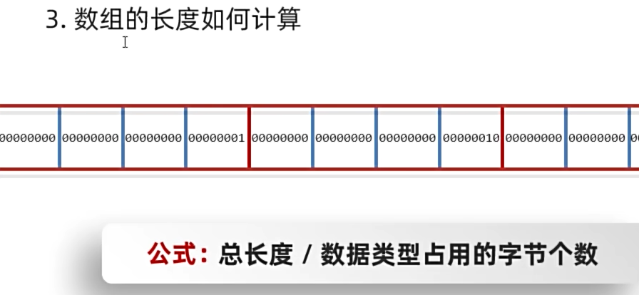

# 程序结构介绍
## 示例说明
新建main.c并输入

程序结构：

+ 预处理指令：如 `#include` 和 `#define`。
+ 主函数：每个 C 程序都至少有一个 `main()` 函数。
+ 变量声明：声明程序中使用的变量。
+ 函数定义：定义程序中使用的函数。

```c
#include <stdio.h>
 
int main()
{
   /* 我的第一个 C 程序 */
   printf("Hello, World! \n");
   
   return 0;
}
```

## 编译和执行
gcc是一个工具执行编译，让电脑可以看懂c语言

```powershell
g++ main.c -o main
```


# 基础语法
## 认识令牌（源代码的最小语法单位）
在 C 语言中，令牌（Token）是程序的基本组成单位，编译器通过对源代码进行词法分析，将代码分解成一个个的令牌。C 语言的令牌主要包括以下几种类型：

+ 关键字（Keywords）
+ 标识符（Identifiers）
+ 常量（Constants）
+ 字符串字面量（String Literals）
+ 运算符（Operators）
+ 分隔符（Separators）


## 分隔符
+ 逗号（,）：用于分隔变量声明或函数参数。
+ 分号（;）：用于结束语句。
+ 括号：
    - 圆括号（`()`）用于分组表达式、函数调用。
    - 花括号（`{}`）用于定义代码块。
    - 方括号（`[]`）用于数组下标。

## 注释
### 单行注释
```c
//
```

### 多行注释
```c
/* 单行注释 */
/* 
 多行注释
 多行注释
 多行注释
 */

```

## 标识符
标识符是程序中变量、函数、数组等的名字。标识符由字母（大写或小写）、数字和下划线组成，但第一个字符必须是字母或下划线，不能是数字。


## 常量
常量是固定值，在程序执行期间不会改变。

```c
const int MAX = 100;  // 整型常量
const float PI = 3.14;  // 浮点型常量
const char NEWLINE = '\n';  // 字符常量
```


## 字符串字面量
字符串是双引号包括起来的字符序列

字符串会默认在最后添加"\0"

```c
char greeting[] = "Hello, World!";
```


## 运输符号
运算符用于执行各种操作，如算术运算、逻辑运算、比较运算等。

C 语言中的运算符种类繁多，常见的包括：

+ 算术运算符：`+`, `-`, `*`, `/`, `%`
+ 关系运算符：`==`, `!=`, `>`, `<`, `>=`, `<=`
+ 逻辑运算符：`&&`, `||`, `!`
+ 位运算符：`&`, `|`, `^`, `~`, `<<`, `>>`
+ 赋值运算符：`=`, `+=`, `-=`, `*=`, `/=`, `%=`
+ 其他运算符：`sizeof`, `?:`, `&`, `*`, `->`, `.`

## 关键字
| 关键字 | 说明 |
| --- | --- |
| auto | 声明自动变量 |
| break | 跳出当前循环 |
| case | 开关语句分支 |
| char | 声明字符型变量或函数返回值类型 |
| const | 定义常量，如果一个变量被 const 修饰，那么它的值就不能再被改变 |
| continue | 结束当前循环，开始下一轮循环 |
| default | 开关语句中的"其它"分支 |
| do | 循环语句的循环体 |
| double | 声明双精度浮点型变量或函数返回值类型 |
| else | 条件语句否定分支（与 if 连用） |
| enum | 声明枚举类型 |
| extern | 声明变量或函数是在其它文件或本文件的其他位置定义 |
| float | 声明浮点型变量或函数返回值类型 |
| for | 一种循环语句 |
| goto | 无条件跳转语句 |
| if | 条件语句 |
| int | 声明整型变量或函数 |
| long | 声明长整型变量或函数返回值类型 |
| register | 声明寄存器变量 |
| return | 子程序返回语句（可以带参数，也可不带参数） |
| short | 声明短整型变量或函数 |
| signed | 声明有符号类型变量或函数 |
| sizeof | 计算数据类型或变量长度（即所占字节数） |
| static | 声明静态变量 |
| struct | 声明结构体类型 |
| switch | 用于开关语句 |
| typedef | 用以给数据类型取别名 |
| unsigned | 声明无符号类型变量或函数 |
| union | 声明共用体类型 |
| void | 声明函数无返回值或无参数，声明无类型指针 |
| volatile | 说明变量在程序执行中可被隐含地改变 |
| while | 循环语句的循环条件 |


### `auto`
`auto` 关键字用于声明局部变量具有自动存储期，这意味着变量的生命周期仅在它所在的代码块内。在C语言中，如果不显式指定存储类别，局部变量默认就是 `auto` 类型的。

```c
#include <stdio.h>
void exampleAuto() {
    auto int localVariable = 5; // 等同于 int localVariable = 5;
    printf("Local variable value: %d\n", localVariable);
}
int main() {
    exampleAuto();
    // 在这里不能访问 localVariable，因为它是在 exampleAuto 函数内部声明的
    return 0;
}
```

### `default`
`default` 关键字用于 `switch` 语句中，当没有匹配的 `case` 时执行 `default` 块中的代码。

```c
#include <stdio.h>
void exampleDefault(int value) {
    switch (value) {
        case 1:
            printf("Value is 1.\n");
            break;
        case 2:
            printf("Value is 2.\n");
            break;
        default:
            printf("Value is neither 1 nor 2.\n");
    }
}
int main() {
    exampleDefault(3);
    return 0;
}
```

### `enum`
`enum` 关键字用于声明枚举类型，枚举类型是一组命名的整型常量。

```c
#include <stdio.h>
enum Weekday {Monday, Tuesday, Wednesday, Thursday, Friday, Saturday, Sunday};
void exampleEnum() {
    enum Weekday today = Wednesday;
    printf("Today is day number %d.\n", today);
}
int main() {
    exampleEnum();
    return 0;
}
```

### `goto`
`goto` 关键字用于实现无条件跳转到程序中的另一位置。虽然不推荐使用，但某些情况下它是有用的。

```c
#include <stdio.h>
void exampleGoto() {
    int i = 0;
    loop:
    if (i < 5) {
        printf("Iteration %d\n", i);
        i++;
        goto loop; // 跳回 loop 标签
    }
}
int main() {
    exampleGoto();
    return 0;
}
```

### `register`
`register` 关键字建议编译器将变量存储在寄存器中，以提高访问速度。然而，这只是建议，编译器可能忽略这个建议。

```c
#include <stdio.h>
void exampleRegister() {
    register int fastAccessVariable = 5;
    printf("Fast access variable value: %d\n", fastAccessVariable);
}
int main() {
    exampleRegister();
    return 0;
}
```

### `signed`
`signed` 关键字用于声明变量可以存储正数和负数。

```c
#include <stdio.h>
void exampleSigned() {
    signed int signedVar = -5;
    printf("Signed variable value: %d\n", signedVar);
}
int main() {
    exampleSigned();
    return 0;
}
```

### `typedef`
`typedef` 关键字用于为已存在的数据类型创建新的别名。

```c
#include <stdio.h>
typedef unsigned int Size;
void exampleTypedef() {
    Size width = 100;
    Size height = 50;
    printf("Area is: %u\n", width * height);
}
int main() {
    exampleTypedef();
    return 0;
}
```

### `unsigned`
`unsigned` 关键字用于声明变量只能存储非负数。

```c
#include <stdio.h>
void exampleUnsigned() {
    unsigned int age = 30;
    printf("Age is: %u\n", age);
}
int main() {
    exampleUnsigned();
    return 0;
}
```

### `union`
`union` 关键字用于声明一种可以存储不同类型数据的结构，但在任意时刻只能存储其中一个成员。

```c
#include <stdio.h>
union Data {
    int i;
    float f;
};
void exampleUnion() {
    union Data data;
    data.i = 10;
    printf("Data as int: %d\n", data.i);
    data.f = 3.14;
    printf("Data as float: %f\n", data.f);
    // 注意此时 data.i 的值已不再有效
}
int main() {
    exampleUnion();
    return 0;
}
```

### `volatile`
`volatile` 关键字用于声明变量可能在程序的控制之外被改变，告诉编译器不要优化这个变量的存取。

```c
#include <stdio.h>
volatile int externalVar = 5; // 假设这个变量可能会被硬件或另一个线程改变
void exampleVolatile() {
    printf("External variable value: %d\n", external
```

### `struct` 
`struct` 和 `union` 在 C 语言中都是用于定义复合数据类型的，但它们之间存在一些关键的区别：

#### 存储方式
+ `struct`（结构体）：结构体中的每个成员都有各自的存储空间。结构体的大小是其所有成员大小的总和（可能还包括一些填充字节，以满足对齐要求）。
+ `union`（联合体）：联合体中的所有成员共享同一块存储空间。联合体的大小是其最大成员的大小（同样，可能包括对齐填充字节）。在任意时刻，联合体只能存储其中一个成员的数据。

#### 数据访问
+ `struct`：可以同时访问结构体的所有成员，因为每个成员都有独立的存储空间。
+ `union`：一次只能访问联合体的一个成员，因为所有成员共享同一块存储空间。试图访问最近没有赋值的成员可能会导致未定义行为。

#### 用途
+ `struct`：常用于表示具有多个相关属性的对象或实体。例如，你可以定义一个包含姓名、年龄和地址的结构体来表示一个人。
+ `union`：常用于表示几种不同类型的数据，但不会同时使用。例如，你可以定义一个联合体来存储整数、浮点数或字符，但同一时刻只能存储其中一种类型。

#### 示例对比
以下是一个 `struct` 和 `union` 的示例，展示了它们之间的区别：

```c
#include <stdio.h>
// 定义一个结构体
struct ExampleStruct {
    int a;
    float b;
    char c;
};
// 定义一个联合体
union ExampleUnion {
    int a;
    float b;
    char c;
};
int main() {
    struct ExampleStruct structExample;
    union ExampleUnion unionExample;
    // 初始化结构体的成员
    structExample.a = 1;
    structExample.b = 3.14f;
    structExample.c = 'A';
    // 打印结构体的成员
    printf("Struct a: %d\n", structExample.a); // 输出: 1
    printf("Struct b: %f\n", structExample.b); // 输出: 3.14
    printf("Struct c: %c\n", structExample.c); // 输出: A
    // 初始化联合体的成员
    unionExample.a = 2;
    // 打印联合体的成员
    printf("Union a: %d\n", unionExample.a); // 输出: 2
    // 注意：以下打印可能不会得到预期的结果，因为联合体成员共享存储空间
    printf("Union b: %f\n", unionExample.b); // 可能不会输出 2.0
    printf("Union c: %c\n", unionExample.c); // 可能不会输出字符 '2'
    return 0;
}
```

在这个例子中，`structExample` 可以同时保存 `a`、`b` 和 `c` 三个成员的值。而 `unionExample` 在任何时刻只能保存 `a`、`b` 或 `c` 中的一个成员的值。当 `unionExample.a` 被赋值后，试图通过 `unionExample.b` 或 `unionExample.c` 来访问数据可能会导致未定义的行为，因为这两个成员共享与 `unionExample.a` 相同的存储空间。

## c中的空格
1. 单独一行的空格会被编译器忽略
2. 空格可以分隔语句的各个部分，让编译器能识别语句中的某个元素


# 数据类型
## 数据类型
| 序号 | 类型与描述 |
| --- | --- |
| 1 | 基本数据类型   它们是算术类型，包括整型（int）、字符型（char）、浮点型（float）和双精度浮点型（double）。 |
| 2 | 枚举类型：   它们也是算术类型，被用来定义在程序中只能赋予其一定的离散整数值的变量。 |
| 3 | void 类型：   类型说明符 void 表示没有值的数据类型，通常用于函数返回值。 |
| 4 | 派生类型：   包括数组类型、指针类型和结构体类型。 |


## 整数类型
| 类型 | 存储大小 | 值范围 |
| --- | --- | --- |
| char | 1 字节 | -128 到 127 或 0 到 255 |
| unsigned char | 1 字节 | 0 到 255 |
| signed char | 1 字节 | -128 到 127 |
| int | 2 或 4 字节 | -32,768 到 32,767 或 -2,147,483,648 到 2,147,483,647 |
| unsigned int | 2 或 4 字节 | 0 到 65,535 或 0 到 4,294,967,295 |
| short | 2 字节 | -32,768 到 32,767 |
| unsigned short | 2 字节 | 0 到 65,535 |
| long | 4 字节 | -2,147,483,648 到 2,147,483,647 |
| unsigned long | 4 字节 | 0 到 4,294,967,295 |


## 浮点类型
| 类型 | 存储大小 | 值范围 | 精度 |
| --- | --- | --- | --- |
| float | 4 字节 | 1.2E-38 到 3.4E+38 | 6 位有效位 |
| double | 8 字节 | 2.3E-308 到 1.7E+308 | 15 位有效位 |
| long double | 16 字节 | 3.4E-4932 到 1.1E+4932 | 19 位有效位 |


## void类型
| 序号 | 类型与描述 |
| --- | --- |
| 1 | 函数返回为空   C 中有各种函数都不返回值，或者您可以说它们返回空。不返回值的函数的返回类型为空。例如 void exit (int status); |
| 2 | 函数参数为空   C 中有各种函数不接受任何参数。不带参数的函数可以接受一个 void。例如 int rand(void); |
| 3 | 指针指向 void   类型为 void * 的指针代表对象的地址，而不是类型。例如，内存分配函数 void *malloc( size_t size ); 返回指向 void 的指针，可以转换为任何数据类型。 |


## 数据类型转换
C 语言中有两种类型转换：

+ 隐式类型转换：隐式类型转换是在表达式中自动发生的，无需进行任何明确的指令或函数调用。它通常是将一种较小的类型自动转换为较大的类型，例如，将int类型转换为long类型或float类型转换为double类型。隐式类型转换也可能会导致数据精度丢失或数据截断。
+ 显式类型转换：显式类型转换需要使用强制类型转换运算符（type casting operator），它可以将一个数据类型的值强制转换为另一种数据类型的值。强制类型转换可以使程序员在必要时对数据类型进行更精确的控制，但也可能会导致数据丢失或截断。


# 变量
变量其实只不过是程序可操作的存储区的名称。C 中每个变量都有特定的类型，类型决定了变量存储的大小和布局，该范围内的值都可以存储在内存中，运算符可应用于变量上。

变量的声明有两种情况：

+ 1、一种是需要建立存储空间的。例如：int a 在声明的时候就已经建立了存储空间。
+ 2、另一种是不需要建立存储空间的，通过使用extern关键字声明变量名而不定义它。 例如：extern int a 其中变量 a 可以在别的文件中定义的。

## 变量定义
```c
type variable_list;
```

### 变量初始化
```c
type variable_name = value;
```

## 变量不初始化
以下是不同类型的变量在没有显式初始化时的默认值：

+ 整型变量（int、short、long等）：默认值为0。
+ 浮点型变量（float、double等）：默认值为0.0。
+ 字符型变量（char）：默认值为'\0'，即空字符。
+ 指针变量：默认值为NULL，表示指针不指向任何有效的内存地址。
+ 数组、结构体、联合等复合类型的变量：它们的元素或成员将按照相应的规则进行默认初始化，这可能包括对元素递归应用默认规则。

注意：局部变量（在函数内部定义的非静态变量）不会自动初始化为默认值，它们的初始值是未定义的（包含垃圾值）。因此，在使用局部变量之前，应该显式地为其赋予一个初始值。

## 变量声明


## 左右值 
C 中有两种类型的表达式：

1. 左值（lvalue）：指向内存位置的表达式被称为左值（lvalue）表达式。左值可以出现在赋值号的左边或右边。
2. 右值（rvalue）：术语右值（rvalue）指的是存储在内存中某些地址的数值。右值是不能对其进行赋值的表达式，也就是说，右值可以出现在赋值号的右边，但不能出现在赋值号的左边。

# 常量
## 整数常量
整数常量可以是十进制、八进制或十六进制的常量。前缀指定基数：0x 或 0X 表示十六进制，0 表示八进制，不带前缀则默认表示十进制。

整数常量也可以带一个后缀，后缀是 U 和 L 的组合，U 表示无符号整数（unsigned），L 表示长整数（long）。后缀可以是大写，也可以是小写，U 和 L 的顺序任意。

## 浮点常量
当使用小数形式表示时，必须包含整数部分、小数部分，或同时包含两者。

当使用指数形式表示时， 必须包含小数点、指数，或同时包含两者。带符号的指数是用 e 或 E 引入的。

3.14159       /* 合法的 */

314159E-5L    /* 合法的 */

510E          /* 非法的：不完整的指数 */

210f          /* 非法的：没有小数或指数 */

.e55          /* 非法的：缺少整数或分数 */

## 字符常量
| 转义序列 | 含义 |
| --- | --- |
| \\ | \ 字符 |
| \' | ' 字符 |
| \" | " 字符 |
| \? | ? 字符 |
| \a | 警报铃声 |
| \b | 退格键 |
| \f | 换页符 |
| \n | 换行符 |
| \r | 回车 |
| \t | 水平制表符 |
| \v | 垂直制表符 |
| \ooo | 一到三位的八进制数 |
| \xhh . . . | 一个或多个数字的十六进制数 |


## 字符串常量
字符串常量在内存中以 null 终止符 \0 结尾。例如：

```c
char myString[] = "Hello, world!"; //系统对字符串常量自动加一个 '\0'
```

## 定义常量
在 C 中，有两种简单的定义常量的方式：

1. 使用 #define 预处理器： #define 可以在程序中定义一个常量，它在编译时会被替换为其对应的值。
2. 使用 const 关键字：const 关键字用于声明一个只读变量，即该变量的值不能在程序运行时修改。

## #define 与 const 区别
#define 与 const 这两种方式都可以用来定义常量，选择哪种方式取决于具体的需求和编程习惯。通常情况下，建议使用 const 关键字来定义常量，因为它具有类型检查和作用域的优势，而 #define 仅进行简单的文本替换，可能会导致一些意外的问题。

#define 预处理指令和 const 关键字在定义常量时有一些区别：

+ 替换机制：`#define` 是进行简单的文本替换，而 `const` 是声明一个具有类型的常量。`#define` 定义的常量在编译时会被直接替换为其对应的值，而 `const` 定义的常量在程序运行时会分配内存，并且具有类型信息。
+ 类型检查：`#define` 不进行类型检查，因为它只是进行简单的文本替换。而 `const` 定义的常量具有类型信息，编译器可以对其进行类型检查。这可以帮助捕获一些潜在的类型错误。
+ 作用域：`#define` 定义的常量没有作用域限制，它在定义之后的整个代码中都有效。而 `const` 定义的常量具有块级作用域，只在其定义所在的作用域内有效。
+ 调试和符号表：使用 `#define` 定义的常量在符号表中不会有相应的条目，因为它只是进行文本替换。而使用 `const` 定义的常量会在符号表中有相应的条目，有助于调试和可读性。

# 存储类
存储类定义 C 程序中变量/函数的存储位置、生命周期和作用域。

这些说明符放置在它们所修饰的类型之前。

下面列出 C 程序中可用的存储类：

+ auto
+ register
+ static
+ extern

## auto
函数创建的时候被创建，销毁的时候一起销毁----生存周期在函数块内

```c
{
   int mount;
   auto int month;
}

```


## register 存储类
register 存储类用于定义存储在寄存器中而不是 RAM 中的局部变量。这意味着变量的最大尺寸等于寄存器的大小（通常是一个字），且不能对它应用一元的 '&' 运算符（因为它没有内存位置）。

register 存储类定义存储在寄存器，所以变量的访问速度更快，但是它不能直接取地址，因为它不是存储在 RAM 中的。在需要频繁访问的变量上使用 register 存储类可以提高程序的运行速度。

```plain
{
   register int  miles;
}
```


## static 存储类
初始化一次，然后全局文件可以调用。

static 存储类指示编译器在程序的生命周期内保持局部变量的存在，而不需要在每次它进入和离开作用域时进行创建和销毁。因此，使用 static 修饰局部变量可以在函数调用之间保持局部变量的值。

```c
#include <stdio.h>
 
/* 函数声明 */
void func1(void);
 
static int count=10;        /* 全局变量 - static 是默认的 */
 
int main()
{
  while (count--) {
      func1();
  }
  return 0;
}
 
void func1(void)
{
/* 'thingy' 是 'func1' 的局部变量 - 只初始化一次
 * 每次调用函数 'func1' 'thingy' 值不会被重置。
 */                
  static int thingy=5;
  thingy++;
  printf(" thingy 为 %d ， count 为 %d\n", thingy, count);
}
```


## extern 存储类
extern 存储类用于定义在其他文件中声明的全局变量或函数。当使用 extern 关键字时，不会为变量分配任何存储空间，而只是指示编译器该变量在其他文件中定义。


# 运算符
运算符是一种告诉编译器执行特定的数学或逻辑操作的符号。C 语言内置了丰富的运算符，并提供了以下类型的运算符：

+ 算术运算符
+ 关系运算符
+ 逻辑运算符
+ 位运算符
+ 赋值运算符
+ 杂项运算符

## 算术运算符
| 运算符 | 描述 | 实例 |
| --- | --- | --- |
| + | 把两个操作数相加 | A + B 将得到 30 |
| - | 从第一个操作数中减去第二个操作数 | A - B 将得到 -10 |
| * | 把两个操作数相乘 | A * B 将得到 200 |
| / | 分子除以分母 | B / A 将得到 2 |
| % | 取模运算符，整除后的余数 | B % A 将得到 0 |
| ++ | 自增运算符，整数值增加 1 | A++ 将得到 11 |
| -- | 自减运算符，整数值减少 1 | A-- 将得到 9 |


## 关系运算符
| 运算符 | 描述 | 实例 |
| --- | --- | --- |
| == | 检查两个操作数的值是否相等，如果相等则条件为真。 | (A == B) 为假。 |
| != | 检查两个操作数的值是否相等，如果不相等则条件为真。 | (A != B) 为真。 |
| > | 检查左操作数的值是否大于右操作数的值，如果是则条件为真。 | (A > B) 为假。 |
| < | 检查左操作数的值是否小于右操作数的值，如果是则条件为真。 | (A < B) 为真。 |
| >= | 检查左操作数的值是否大于或等于右操作数的值，如果是则条件为真。 | (A >= B) 为假。 |
| <= | 检查左操作数的值是否小于或等于右操作数的值，如果是则条件为真。 | (A <= B) 为真。 |


## 逻辑运算符
下表显示了 C 语言支持的所有关系逻辑运算符。假设变量 A 的值为 1，变量 B 的值为 0，则：

| 运算符 | 描述 | 实例 |
| --- | --- | --- |
| && | 称为逻辑与运算符。如果两个操作数都非零，则条件为真。 | (A && B) 为假。 |
| || | 称为逻辑或运算符。如果两个操作数中有任意一个非零，则条件为真。 | (A || B) 为真。 |
| ! | 称为逻辑非运算符。用来逆转操作数的逻辑状态。如果条件为真则逻辑非运算符将使其为假。 | !(A &&  |


## 位运算符
| p | q | p & q | p | q | p ^ q |
| --- | --- | --- | --- | --- |
| 0 | 0 | 0 | 0 | 0 |
| 0 | 1 | 0 | 1 | 1 |
| 1 | 1 | 1 | 1 | 0 |
| 1 | 0 | 0 | 1 | 1 |


  
 ^：对两个操作数的每一位执行逻辑异或操作，如果两个相应的位值相同，则结果为 0，否则为 1。


### 嵌入式常用
| ~ | 对操作数的每一位执行逻辑取反操作，即将每一位的 0 变为 1，1 变为 0。<br/>取反运算符，按二进制位进行"取反"运算。运算规则：<br/>```plain ~1=-2;    ~0=-1; ```  | (~A ) 将得到 -61，即为 1100 0011，一个有符号二进制数的补码形式。 |
| --- | --- | --- |
| << | 将操作数的所有位向左移动指定的位数。左移 n 位相当于乘以 2 的 n 次方。<br/>二进制左移运算符。将一个运算对象的各二进制位全部左移若干位（左边的二进制位丢弃，右边补0）。 | A << 2 将得到 240，即为 1111 0000 |
| >> | 将操作数的所有位向右移动指定的位数。右移n位相当于除以 2 的 n 次方。<br/>二进制右移运算符。将一个数的各二进制位全部右移若干位，正数左补 0，负数左补 1，右边丢弃。 | A >> 2 将 |


## 赋值运算符
| 运算符 | 描述 | 实例 |
| --- | --- | --- |
| = | 简单的赋值运算符，把右边操作数的值赋给左边操作数 | C = A + B 将把 A + B 的值赋给 C |
| += | 加且赋值运算符，把右边操作数加上左边操作数的结果赋值给左边操作数 | C += A 相当于 C = C + A |
| -= | 减且赋值运算符，把左边操作数减去右边操作数的结果赋值给左边操作数 | C -= A 相当于 C = C - A |
| *= | 乘且赋值运算符，把右边操作数乘以左边操作数的结果赋值给左边操作数 | C *= A 相当于 C = C * A |
| /= | 除且赋值运算符，把左边操作数除以右边操作数的结果赋值给左边操作数 | C /= A 相当于 C = C / A |
| %= | 求模且赋值运算符，求两个操作数的模赋值给左边操作数 | C %= A 相当于 C = C % A |
| <<= | 左移且赋值运算符 | C <<= 2 等同于 C = C << 2 |
| >>= | 右移且赋值运算符 | C >>= 2 等同于 C = C >> 2 |
| &= | 按位与且赋值运算符 | C &= 2 等同于 C = C & 2 |
| ^= | 按位异或且赋值运算符 | C ^= 2 等同于 C = C ^ 2 |
| |= | 按位或且赋值运算符 | C |= 2 等同于 C = C | 2 |


## 杂项运算符 ↦ sizeof & 三元
下表列出了 C 语言支持的其他一些重要的运算符，包括 sizeof 和 ? :。

| 运算符 | 描述 | 实例 |
| --- | --- | --- |
| sizeof() | 返回变量的大小。 | sizeof(a) 将返回 4，其中 a 是整数。 |
| & | 返回变量的地址。 | &a; 将给出变量的实际地址。 |
| * | 指向一个变量。 | *a; 将指向一个变量。 |
| ? : | 条件表达式 | 如果条件为真 ? 则值为 X : 否则值为 Y |


### 三元
```c
b = (a == 1) ? 20: 30;	
```

# 判断
C 语言提供了以下类型的判断语句。点击链接查看每个语句的细节。

| 语句 | 描述 |
| --- | --- |
| [if 语句](https://www.runoob.com/cprogramming/c-if.html) | 一个 if 语句 由一个布尔表达式后跟一个或多个语句组成。 |
| [if...else 语句](https://www.runoob.com/cprogramming/c-if-else.html) | 一个 if 语句 后可跟一个可选的 else 语句，else 语句在布尔表达式为假时执行。 |
| [嵌套 if 语句](https://www.runoob.com/cprogramming/c-nested-if.html) | 您可以在一个 if 或 else if 语句内使用另一个 if 或 else if 语句。 |
| [switch 语句](https://www.runoob.com/cprogramming/c-switch.html) | 一个 switch 语句允许测试一个变量等于多个值时的情况。 |
| [嵌套 switch 语句](https://www.runoob.com/cprogramming/c-nested-switch.html) | 您可以在一个 switch 语句内使用另一个 switch 语句。 |


# 循环
## 循环类型
C 语言提供了以下几种循环类型。点击链接查看每个类型的细节。

| 循环类型 | 描述 |
| --- | --- |
| [while 循环](https://www.runoob.com/cprogramming/c-while-loop.html) | 当给定条件为真时，重复语句或语句组。它会在执行循环主体之前测试条件。 |
| [for 循环](https://www.runoob.com/cprogramming/c-for-loop.html) | 多次执行一个语句序列，简化管理循环变量的代码。 |
| [do...while 循环](https://www.runoob.com/cprogramming/c-do-while-loop.html) | 除了它是在循环主体结尾测试条件外，其他与 while 语句类似。 |
| [嵌套循环](https://www.runoob.com/cprogramming/c-nested-loops.html) | 您可以在 while、for 或 do..while 循环内使用一个或多个循环。 |


## 循环控制语句
循环控制语句改变你代码的执行顺序。通过它你可以实现代码的跳转。

C 提供了下列的循环控制语句。点击链接查看每个语句的细节。

| 控制语句 | 描述 |
| --- | --- |
| [break 语句](https://www.runoob.com/cprogramming/c-break-statement.html) | 终止循环或 switch 语句，程序流将继续执行紧接着循环或 switch 的下一条语句。 |
| [continue 语句](https://www.runoob.com/cprogramming/c-continue-statement.html) | 告诉一个循环体立刻停止本次循环迭代，重新开始下次循环迭代。 |
| [goto 语句](https://www.runoob.com/cprogramming/c-goto-statement.html) | 将控制转移到被标记的语句。但是不建议在程序中使用 goto 语句。 |


# 函数
## 定义方式
```c
return_type function_name( parameter list )
{
   body of the function
}

```


## 函数的声明
让编译器知道如何调用：或者在定义之前声明，让编译器知道有这个函数，去后面找。

```c
return_type function_name( parameter list );

```

## 调用
直接调用即可


## 参数的传递
如果函数要使用参数，则必须声明接受参数值的变量。这些变量称为函数的形式参数。

形式参数就像函数内的其他局部变量，在进入函数时被创建，退出函数时被销毁。

| 调用类型 | 描述 |
| --- | --- |
| [传值调用](https://www.runoob.com/cprogramming/c-function-call-by-value.html) | 该方法把参数的实际值复制给函数的形式参数。在这种情况下，修改函数内的形式参数不会影响实际参数。 |
| [引用调用](https://www.runoob.com/cprogramming/c-function-call-by-pointer.html) | 通过指针传递方式，形参为指向实参地址的指针，当对形参的指向操作时，就相当于对实参本身进行的操作。 |


# 作用域规则
任何一种编程中，作用域是程序中定义的变量所存在的区域，超过该区域变量就不能被访问。C 语言中有三个地方可以声明变量：

1. 在函数或块内部的局部变量
2. 在所有函数外部的全局变量
3. 在形式参数的函数参数定义中


## 局部变量
## 形参
## 全局变量


# 数组（相同数据的集合）
固定大小的相同类型元素的顺序集合

所有的数组都是由连续的内存位置组成。最低的地址对应第一个元素，最高的地址对应最后一个元素。

## 声明数组
需要指定元素的类型和元素的数量

```c
type arrayName [ arraySize ];

```

## 初始化数组
在 C 中，您可以逐个初始化数组，也可以使用一个初始化语句，如下所示：

```c
在 C 中，您可以逐个初始化数组，也可以使用一个初始化语句，如下所示：

double balance[5] = {1000.0, 2.0, 3.4, 7.0, 50.0};	
```


## 访问数组元素
数组元素可以通过数组名称加索引进行访问。元素的索引是放在方括号内，跟在数组名称的后边


## 获取数组长度
数组长度可以使用 sizeof 运算符来获取数组的长度

```c
int numbers[] = {1, 2, 3, 4, 5};
int length = sizeof(numbers) / sizeof(numbers[0]);
```

## 数组名
在 C 语言中，数组名表示数组的地址，即数组首元素的地址。当我们在声明和定义一个数组时，该数组名就代表着该数组的地址。

# 数组拓展
## 数组遍历
## 变量在内存
### 一个字节是8个bit
### 内存地址
1. 会把地址转换为十六进制，方便阅读
2. int类型有四个字节，存储首地址，来访问全部的数据


## 数组在内存
索引就是指的首地址为基础的偏移量。


## 总结
### 通过首地址不能直接确定数据，还需要数据类型。
### 为什么数组的索引是0开始的。	
因为索引就是偏移量

### 数组的长度计算



## 数组常见的问题
### 越界问题
超出索引范围，读取不到数据

### 参数传递
作为函数的参数传递的时候只有首地址，所以不能在函数参数传递中使用sizeof

一定要一起传递数组的长度

# 数组常见算法
## 基本查找
挨个索引去查找，也叫顺序查找。

## 二分查找（数据必须是有序的）
每次排除一一半的范围。

## 插值查找
假设分布均匀并且有规律。

根据查找的数值的大小来分析最可能的位置

## 分块查找


## 冒泡排序


## 选择排序


# 枚举
枚举类型通常用于为程序中的一组相关的常量取名字

定义一个枚举类型，需要使用 enum 关键字，后面跟着枚举类型的名称，以及用大括号 {} 括起来的一组枚举常量。每个枚举常量可以用一个标识符来表示，也可以为它们指定一个整数值，如果没有指定，那么默认从 0 开始递增。

### 枚举变量的定义
1、先定义枚举类型，再定义枚举变量

```plain
enum DAY
{
      MON=1, TUE, WED, THU, FRI, SAT, SUN
};
enum DAY day;
```

2、定义枚举类型的同时定义枚举变量

```plain
enum DAY
{
      MON=1, TUE, WED, THU, FRI, SAT, SUN
} day;
```

3、省略枚举名称，直接定义枚举变量

```plain
enum
{
      MON=1, TUE, WED, THU, FRI, SAT, SUN
} day;
```

# 指针
## 前言
指针可以指向内存地址

指针：*

地址：&


## c语言中的空指针
NULL 指针是一个定义在标准库中的值为零的常量。

```c
#include <stdio.h>
 
int main ()
{
   int  *ptr = NULL;
 
   printf("ptr 的地址是 %p\n", ptr  );
 
   return 0;
}
```

结果：

ptr 的地址是 0x0


## 指针的算术运算
### 递增指针
递增一个指针意味着让指针指向下一个内存位置。指针的递增操作会根据指针所指向的数据类型进行适当的内存偏移。

------会访问数组的下一个


### 递增结构体指针
```c
#include <stdio.h>

struct Point {
    int x;
    int y;
};

int main() {
    struct Point points[] = {{1, 2}, {3, 4}, {5, 6}};
    struct Point *ptr = points;  // 指针指向结构体数组的第一个元素

    printf("初始点: (%d, %d)\n", ptr->x, ptr->y);  // 输出 (1, 2)

    ptr++;  // 递增指针，使其指向下一个结构体
    printf("递增后点: (%d, %d)\n", ptr->x, ptr->y);  // 输出 (3, 4)

    return 0;
}
```

在这个示例中，ptr++ 使指针从 points[0] 指向 points[1]。因为 ptr 是一个 struct Point 类型指针，所以它递增时会移动 sizeof(struct Point) 个字节。

当上面的代码被编译和执行时，它会产生下列结果：

```plain
初始点: (1, 2)
递增后点: (3, 4)
```


# 函数指针与回调
## 函数指针
定义

```c
typedef int (*fun_ptr)(int,int); // 声明一个指向同样参数、返回值的函数指针类型
```

类似于给函数一个别名的方式。

 int (* p)(int, int) = & max; // &可以省略

```c
#include <stdio.h>
 
int max(int x, int y)
{
    return x > y ? x : y;
}
 
int main(void)
{
    /* p 是函数指针 */
    int (* p)(int, int) = & max; // &可以省略
    int a, b, c, d;
 
    printf("请输入三个数字:");
    scanf("%d %d %d", & a, & b, & c);
 
    /* 与直接调用函数等价，d = max(max(a, b), c) */
    d = p(p(a, b), c); 
 
    printf("最大的数字是: %d\n", d);
 
    return 0;
}
```


## 回调函数
在一个函数里面调用了另外一个函数（通过函数指针的方式显实现函数的调用）

在populate_array中调用了getNextRandomValue

```c
#include <stdlib.h>  
#include <stdio.h>
 
void populate_array(int *array, size_t arraySize, int (*getNextValue)(void))
{
    for (size_t i=0; i<arraySize; i++)
        array[i] = getNextValue();
}
 
// 获取随机值
int getNextRandomValue(void)
{
    return rand();
}
 
int main(void)
{
    int myarray[10];
    /* getNextRandomValue 不能加括号，否则无法编译，因为加上括号之后相当于传入此参数时传入了 int , 而不是函数指针*/
    populate_array(myarray, 10, getNextRandomValue);
    for(int i = 0; i < 10; i++) {
        printf("%d ", myarray[i]);
    }
    printf("\n");
    return 0;
}
```


# 字符串
## 操作字符串的函数
| 序号 | 函数 & 目的 |
| --- | --- |
| 1 | strcpy(s1, s2);   复制字符串 s2 到字符串 s1。 |
| 2 | strcat(s1, s2);   连接字符串 s2 到字符串 s1 的末尾。 |
| 3 | strlen(s1);   返回字符串 s1 的长度。 |
| 4 | strcmp(s1, s2);   如果 s1 和 s2 是相同的，则返回 0；如果 s1<s2 则返回小于 0；如果 s1>s2 则返回大于 0。 |
| 5 | strchr(s1, ch);   返回一个指针，指向字符串 s1 中字符 ch 的第一次出现的位置。 |
| 6 | strstr(s1, s2);   返回一个指针，指向字符串 s1 中字符串 s2 的第一次出现的位置。 |


# 结构体
## 结构体什么的方式
```c
struct Books
{
   char  title[50];
   char  author[50];
   char  subject[100];
   int   book_id;
} book;  
在一般情况下，tag、member-list、variable-list 这 3 部分至少要出现 2 个。以下为实例：
```

在一般情况下，tag、member-list、variable-list 这 3 部分至少要出现 2 个。以下为实例：

注意：struct SIMPLE t1, t2[20], *t3;

第一个：普通的定义结构体

第二个：结构体数组

第三个：结构体指针

```c
//此声明声明了拥有3个成员的结构体，分别为整型的a，字符型的b和双精度的c
//同时又声明了结构体变量s1
//这个结构体并没有标明其标签
struct 
{
    int a;
    char b;
    double c;
} s1;

//此声明声明了拥有3个成员的结构体，分别为整型的a，字符型的b和双精度的c
//结构体的标签被命名为SIMPLE,没有声明变量
struct SIMPLE
{
    int a;
    char b;
    double c;
};
//用SIMPLE标签的结构体，另外声明了变量t1、t2、t3
struct SIMPLE t1, t2[20], *t3;

//也可以用typedef创建新类型
typedef struct
{
    int a;
    char b;
    double c; 
} Simple2;
//现在可以用Simple2作为类型声明新的结构体变量
Simple2 u1, u2[20], *u3;
```


## 结构体变量的初始化
1. 可以在定义的时候初始化

```c
#include <stdio.h>

struct Books
{
   char  title[50];
   char  author[50];
   char  subject[100];
   int   book_id;
} book = {"C 语言", "RUNOOB", "编程语言", 123456};

int main()
{
    printf("title : %s\nauthor: %s\nsubject: %s\nbook_id: %d\n", book.title, book.author, book.subject, book.book_id);
}
```


## 访问结构体成员
使用成员访问运算符（.），也可以是(->)

## 指向结构的指针
如：

```c
struct Books *struct_pointer;	//*是指针
struct_pointer = &Book1;	//	&是取地址
```


## 结构体大小计算
使用sizeof

```c
#include <stdio.h>

struct Person {
    char name[20];
    int age;
    float height;
};

int main() {
    struct Person person;
    printf("结构体 Person 大小为: %zu 字节\n", sizeof(person));
    return 0;
}
```

注意：编译器编译的时候可能会补齐结构体成员变量，提高内存的访问效率。所以实际的内存占用可能会比较大。

# 共用体
## 定义共用体
注意：共用体的占用内存大小由最大的一个成员占用的大小决定。


## 访问共用体
成员访问运算符（.）,也可以->

## 作用
解析数据的时候写入字节，访问的时候可以访问任意数据类型。

### 数据包解析
在嵌入式通信协议中，数据包可能会包含不同类型的数据。共用体可以帮助解析这种数据包，同时支持整数和浮点数等不同类型的数据。

```c
union PacketData {
    uint8_t bytes[4];  // 原始字节数据
    uint32_t intValue; // 整数值
    float floatValue;  // 浮点数值
};

void parsePacket(uint8_t* packet) {
    union PacketData data;
    memcpy(data.bytes, packet, sizeof(data.bytes));
    
    // 使用整数值
    uint32_t value = data.intValue;
    
    // 或者使用浮点数值
    float floatValue = data.floatValue;
}
```


# 位域（充分利用内存空间）
C 语言的位域（bit-field）是一种特殊的结构体成员，允许我们按位对成员进行定义，指定其占用的位数。

如果程序的结构中包含多个开关的变量，即变量值为 TRUE/FALSE，如下：

```c
struct
{
    unsigned int widthValidated;
    unsigned int heightValidated;
} status;
```

这种结构需要 8 字节的内存空间，但在实际上，在每个变量中，我们只存储 0 或 1，在这种情况下，C 语言提供了一种更好的利用内存空间的方式。如果您在结构内使用这样的变量，您可以定义变量的宽度来告诉编译器，您将只使用这些字节。例如，上面的结构可以重写成：

```c
struct
{
    unsigned int widthValidated : 1;
    unsigned int heightValidated : 1;
} status;
```

位域的特点和使用方法如下：

+ 定义位域时，可以指定成员的位域宽度，即成员所占用的位数。
+ 位域的宽度不能超过其数据类型的大小，因为位域必须适应所使用的整数类型。
+ 位域的数据类型可以是 `int`、`unsigned int`、`signed int` 等整数类型，也可以是枚举类型。
+ 位域可以单独使用，也可以与其他成员一起组成结构体。
+ 位域的访问是通过点运算符（`.`）来实现的，与普通的结构体成员访问方式相同。


## 声明
包含三个：type member_name width

| 元素 | 描述 |
| --- | --- |
| type | 只能为 int(整型)，unsigned int(无符号整型)，signed int(有符号整型) 三种类型，决定了如何解释位域的值。 |
| member_name | 位域的名称。 |
| width | 位域中位的数量。宽度必须小于或等于指定类型的位宽度。 |


带有预定义宽度的变量被称为位域。位域可以存储多于 1 位的数，例如，需要一个变量来存储从 0 到 7 的值，您可以定义一个宽度为 3 位的位域，如下：

```c
struct{unsignedintage : 3; }Age;
```


# typedf
用来为类型娶一个新的名字。

```c
typedef struct Books
{
   char  title[50];
   char  author[50];
   char  subject[100];
   int   book_id;
} Book;
```

## tpyedf和#define的区别
define 是 C 指令，用于为各种数据类型定义别名，与 typedef 类似，但是它们有以下几点不同：

+ typedef 仅限于为类型定义符号名称，#define 不仅可以为类型定义别名，也能为数值定义别名，比如您可以定义 1 为 ONE。
+ typedef 是由编译器执行解释的，#define 语句是由预编译器进行处理的。

# 输入和输出
## 标准文件
C 语言把所有的设备都当作文件。所以设备（比如显示器）被处理的方式与文件相同。以下三个文件会在程序执行时自动打开，以便访问键盘和屏幕。

| 标准文件 | 文件指针 | 设备 |
| --- | --- | --- |
| 标准输入 | stdin | 键盘 |
| 标准输出 | stdout | 屏幕 |
| 标准错误 | stderr | 您的屏幕 |


文件指针是访问文件的方式，本节将讲解如何从键盘上读取值以及如何把结果输出到屏幕上。

C 语言中的 I/O (输入/输出) 通常使用 printf() 和 scanf() 两个函数。

scanf() 函数用于从标准输入（键盘）读取并格式化， printf() 函数发送格式化输出到标准输出（屏幕）。

## 输入输出
注意：输入输出函数的格式不要弄错了

```c
#include <stdio.h>
int main()
{
    float f;
    printf("Enter a number: ");
    // %f 匹配浮点型数据
    scanf("%f",&f);
    printf("Value = %f", f);
    return 0;
}
```

## getchar() & putchar() 函数
int getchar(void) 函数从屏幕读取下一个可用的字符，并把它返回为一个整数。这个函数在同一个时间内只会读取一个单一的字符。您可以在循环内使用这个方法，以便从屏幕上读取多个字符。

int putchar(int c) 函数把字符输出到屏幕上，并返回相同的字符。这个函数在同一个时间内只会输出一个单一的字符。您可以在循环内使用这个方法，以便在屏幕上输出多个字符。

```c
#include <stdio.h>
 
int main( )
{
   int c;
 
   printf( "Enter a value :");
   c = getchar( );
 
   printf( "\nYou entered: ");
   putchar( c );
   printf( "\n");
   return 0;
}
```

## gets() & puts() 函数
char *gets(char *s) 函数从 stdin 读取一行到 s 所指向的缓冲区，直到一个终止符或 EOF。

int puts(const char *s) 函数把字符串 s 和一个尾随的换行符写入到 stdout。

```c
#include <stdio.h>
 
int main( )
{
   char str[100];
 
   printf( "Enter a value :");
   gets( str );
 
   printf( "\nYou entered: ");
   puts( str );
   return 0;
}
```

## scanf() 和 printf() 函数
int scanf(const char *format, ...) 函数从标准输入流 stdin 读取输入，并根据提供的 format 来浏览输入。

int printf(const char *format, ...) 函数把输出写入到标准输出流 stdout ，并根据提供的格式产生输出。

format 可以是一个简单的常量字符串，但是您可以分别指定 %s、%d、%c、%f 等来输出或读取字符串、整数、字符或浮点数。还有许多其他可用的格式选项，可以根据需要使用。如需了解完整的细节，可以查看这些函数的参考手册。现在让我们通过下面这个简单的实例来加深理解：

```c
#include <stdio.h>
int main( ) {
 
   char str[100];
   int i;
 
   printf( "Enter a value :");
   scanf("%s %d", str, &i);
 
   printf( "\nYou entered: %s %d ", str, i);
   printf("\n");
   return 0;
}
```

注意：scanf() 期待输入的格式与您给出的 %s 和 %d 相同，这意味着您必须提供有效的输入，比如 "string integer"，如果您提供的是 "string string" 或 "integer integer"，它会被认为是错误的输入。

# 文件读写
## 打开文件
您可以使用 fopen( ) 函数来创建一个新的文件或者打开一个已有的文件，这个调用会初始化类型 FILE 的一个对象，类型 FILE 包含了所有用来控制流的必要的信息。下面是这个函数调用的原型：

`FILE *fopen( const char *filename, const char *mode );`

在这里，filename 是字符串，用来命名文件，访问模式 mode 的值可以是下列值中的一个：

| 模式 | 描述 |
| --- | --- |
| r | 打开一个已有的文本文件，允许读取文件。 |
| w | 打开一个文本文件，允许写入文件。如果文件不存在，则会创建一个新文件。在这里，您的程序会从文件的开头写入内容。如果文件存在，则该会被截断为零长度，重新写入。 |
| a | 打开一个文本文件，以追加模式写入文件。如果文件不存在，则会创建一个新文件。在这里，您的程序会在已有的文件内容中追加内容。 |
| r+ | 打开一个文本文件，允许读写文件。 |
| w+ | 打开一个文本文件，允许读写文件。如果文件已存在，则文件会被截断为零长度，如果文件不存在，则会创建一个新文件。 |
| a+ | 打开一个文本文件，允许读写文件。如果文件不存在，则会创建一个新文件。读取会从文件的开头开始，写入则只能是追加模式。 |


## 关闭文件
为了关闭文件，请使用 fclose( ) 函数。函数的原型如下：

` int fclose( FILE *fp );`

注意：fclose( ) 函数返回零，如果关闭文件时发生错误，函数返回 EOF

## 写入文件
下面是把字符写入到流中的最简单的函数：

`int fputc( int c, FILE *fp );`

函数 fputc() 把参数 c 的字符值写入到 fp 所指向的输出流中。如果写入成功，它会返回写入的字符，如果发生错误，则会返回 EOF。您可以使用下面的函数来把一个以 null 结尾的字符串写入到流中：

`int fputs( const char *s, FILE *fp );`

函数 fputs() 把字符串 s 写入到 fp 所指向的输出流中。如果写入成功，它会返回一个非负值，如果发生错误，则会返回 EOF。您也可以使用 int fprintf(FILE *fp,const char *format, ...) 函数把一个字符串写入到文件中。尝试下面的实例：

```c
#include <stdio.h>
 
int main()
{
   FILE *fp = NULL;
 
   fp = fopen("/tmp/test.txt", "w+");
   fprintf(fp, "This is testing for fprintf...\n");
   fputs("This is testing for fputs...\n", fp);
   fclose(fp);
}
```


## 读取文件
+ fgetc：读取第一个字符
+ fgets：读取指定数量的字符（n-1)
+ fscanf：函数来从文件中读取字符串，但是在遇到第一个空格和换行符时会停止

下面是从文件读取单个字符的最简单的函数：

`int fgetc( FILE * fp );`

fgetc() 函数从 fp 所指向的输入文件中读取一个字符。返回值是读取的字符，如果发生错误则返回 EOF。下面的函数允许您从流中读取一个字符串：

`char *fgets( char *buf, int n, FILE *fp );`

函数 fgets() 从 fp 所指向的输入流中读取 n - 1 个字符。它会把读取的字符串复制到缓冲区 buf，并在最后追加一个 null 字符来终止字符串。

如果这个函数在读取最后一个字符之前就遇到一个换行符 '\n' 或文件的末尾 EOF，则只会返回读取到的字符，包括换行符。您也可以使用 int fscanf(FILE *fp, const char *format, ...) 函数来从文件中读取字符串，但是在遇到第一个空格和换行符时，它会停止读取。

## 二进制 I/O 函数
下面两个函数用于二进制输入和输出：

```c
size_t fread(void *ptr, size_t size_of_elements, 
             size_t number_of_elements, FILE *a_file);
              
size_t fwrite(const void *ptr, size_t size_of_elements, 
             size_t number_of_elements, FILE *a_file);
```

# 预处理器
只是一个文本替换工具，指示编译器在正式编译之前完成所需要的预处理。

所有的预处理器命令都是以井号（#）开头。它必须是第一个非空字符

| 指令 | 描述 |
| --- | --- |
| #define | 定义宏 |
| #include | 包含一个源代码文件 |
| #undef | 取消已定义的宏 |
| #ifdef | 如果宏已经定义，则返回真 |
| #ifndef | 如果宏没有定义，则返回真 |
| #if | 如果给定条件为真，则编译下面代码 |
| #else | #if 的替代方案 |
| #elif | 如果前面的 #if 给定条件不为真，当前条件为真，则编译下面代码 |
| #endif | 结束一个 #if……#else 条件编译块 |
| #error | 当遇到标准错误时，输出错误消息 |
| #pragma | 使用标准化方法，向编译器发布特殊的命令到编译器中 |


## 预定义宏
ANSI C 定义了许多宏。在编程中您可以使用这些宏，但是不能直接修改这些预定义的宏。

| 宏 | 描述 |
| --- | --- |
| __DATE__ | 当前日期，一个以 "MMM DD YYYY" 格式表示的字符常量。 |
| __TIME__ | 当前时间，一个以 "HH:MM:SS" 格式表示的字符常量。 |
| __FILE__ | 这会包含当前文件名，一个字符串常量。 |
| __LINE__ | 这会包含当前行号，一个十进制常量。 |
| __STDC__ | 当编译器以 ANSI 标准编译时，则定义为 1。 |


示例：

```c
#include <stdio.h>
 
main()
{
   printf("File :%s\n", __FILE__ );
   printf("Date :%s\n", __DATE__ );
   printf("Time :%s\n", __TIME__ );
   printf("Line :%d\n", __LINE__ );
   printf("ANSI :%d\n", __STDC__ );
 
}
```

```shell
File :test.c
Date :Jun 2 2012
Time :03:36:24
Line :8
ANSI :1
```

## 预处理运算符
C 预处理器提供了下列的运算符来帮助您创建宏：

宏延续运算符（\）

一个宏通常写在一个单行上。但是如果宏太长，一个单行容纳不下，则使用宏延续运算符（\）。

字符串常量化运算符（#）

在宏定义中，当需要把一个宏的参数转换为字符串常量时，则使用字符串常量化运算符（#）。

```c
#define  message_for(a, b)  \
    printf(#a " and " #b ": We love you!\n")

```

标记粘贴运算符（##）

宏定义内的标记粘贴运算符（##）会合并两个参数。它允许在宏定义中两个独立的标记被合并为一个标记。例如：


```c
#include <stdio.h>
 
#define tokenpaster(n) printf ("token" #n " = %d", token##n)
 
int main(void)
{
   int token34 = 40;
   
   tokenpaster(34);
   return 0;
}
```


输出

`Carole and Debra: We love you!`

## 
```c
#include <stdio.h>
 
#if !defined (MESSAGE)
   #define MESSAGE "You wish!"
#endif
 
int main(void)
{
   printf("Here is the message: %s\n", MESSAGE);  
   return 0;
}
```

## 参数化的宏
CPP 一个强大的功能是可以使用参数化的宏来模拟函数。例如，下面的代码是计算一个数的平方：

```plain
int square(int x) {
   return x * x;
}
```

我们可以使用宏重写上面的代码，如下：

`#define square(x) ((x) * (x))`

# 头文件
## 引用头文件的语法
使用预处理指令 #include 可以引用用户和系统头文件。它的形式有以下两种：

`#include <file>`

这种形式用于引用系统头文件。它在系统目录的标准列表中搜索名为 file 的文件。在编译源代码时，您可以通过 -I 选项把目录前置在该列表前。

`#include "file"`

这种形式用于引用用户头文件。它在包含当前文件的目录中搜索名为 file 的文件。在编译源代码时，您可以通过 -I 选项把目录前置在该列表前。

## 引用头文件
## 只引用一次头文件
如果一个头文件被引用两次，编译器会处理两次头文件的内容，这将产生错误。为了防止这种情况，标准的做法是把文件的整个内容放在条件编译语句中，如下：

```c
#ifndef HEADER_FILE
#define HEADER_FILE

the entire header file file

#endif
```

## 有条件引用
有时需要从多个不同的头文件中选择一个引用到程序中。例如，需要指定在不同的操作系统上使用的配置参数。您可以通过一系列条件来实现这点，如下：

```c
#if SYSTEM_1
# include "system_1.h"
#elif SYSTEM_2
# include "system_2.h"
#elif SYSTEM_3
...
    #endif
```

## 标准库头文件
C 标准库头文件（Standard Library Header Files）是由 ANSI C（也称为 C89/C90）和 ISO C（C99 和 C11）标准定义的一组头文件，这些头文件提供了大量的函数、宏和类型定义，用于处理输入输出、字符串操作、数学计算、内存管理等常见的编程任务。

以下是一些常见的 C 标准库头文件及其功能简介：

| 头文件 | 功能简介 |
| --- | --- |
| <stdio.h> | 标准输入输出库，包含 `printf`、`scanf`等函数 |
| <stdlib.h> | 标准库函数，包含内存分配、程序控制等函数 |
| <string.h> | 字符串操作函数，如 `strlen`、`strcpy` 等 |
| <math.h> | 数学函数库，如 `sin`、`cos`、`sqrt`等 |
| <time.h> | 时间和日期函数，如 `time`、`strftime`等 |
| <ctype.h> | 字符处理函数，如 `isalpha`、`isdigit`等 |
| <limits.h> | 定义各种类型的限制值，如 `INT_MAX`等 |
| <float.h> | 定义浮点类型的限制值，如 `FLT_MAX`等 |
| <assert.h> | 断言宏 `assert`，用于调试检查 |
| <errno.h> | 定义错误码变量 `errno`及相关宏 |
| <stddef.h> | 定义通用类型和宏，如 `size_t`、`NULL`等 |
| <signal.h> | 处理信号的函数和宏，如 `signal`等 |
| <setjmp.h> | 提供非本地跳转功能的宏和函数 |
| <locale.h> | 地域化相关的函数和宏，如 `setlocale`等 |


# 强制类型转换
## 使用
`(type_name) expression`

```c
#include <stdio.h>
 
int main()
{
   int sum = 17, count = 5;
   double mean;
 
   mean = (double) sum / count;
   printf("Value of mean : %f\n", mean );
 
}
```

注意：强制类型转换运算符的优先级大于除法，因此 sum 的值首先被转换为 double 型，然后除以 count，得到一个类型为 double 的值。

## 整数提升
整数提升是指把小于 int 或 unsigned int 的整数类型转换为 int 或 unsigned int 的过程。请看下面的实例，在 int 中添加一个字符：

```c
#include <stdio.h>
 
int main()
{
   int  i = 17;
   char c = 'c'; /* ascii 值是 99 */
   int sum;
 
   sum = i + c;
   printf("Value of sum : %d\n", sum );
 
}	
```

sum 的值为 116，因为编译器进行了整数提升，在执行实际加法运算时，把 'c' 的值转换为对应的 ascii 值。

## 常用的算数类型转换


例子：

```c
#include <stdio.h>
 
int main()
{
   int  i = 17;
   char c = 'c'; /* ascii 值是 99 */
   float sum;
 
   sum = i + c;
   printf("Value of sum : %f\n", sum );
 
}
```

输出：

`Value of sum : 116.000000`

# 错误处理
## errno、perror() 和 strerror()
C 语言提供了 perror() 和 strerror() 函数来显示与 errno 相关的文本消息。

+ perror() 函数显示您传给它的字符串，后跟一个冒号、一个空格和当前 errno 值的文本表示形式。
+ strerror() 函数，返回一个指针，指针指向当前 errno 值的文本表示形式。

让我们来模拟一种错误情况，尝试打开一个不存在的文件。您可以使用多种方式来输出错误消息，在这里我们使用函数来演示用法。另外有一点需要注意，您应该使用 stderr 文件流来输出所有的错误。

```c
#include <stdio.h>
#include <errno.h>
#include <string.h>
 
extern int errno ;
 
int main ()
{
   FILE * pf;
   int errnum;
   pf = fopen ("unexist.txt", "rb");
   if (pf == NULL)
   {
      errnum = errno;
      fprintf(stderr, "错误号: %d\n", errno);
      perror("通过 perror 输出错误");
      fprintf(stderr, "打开文件错误: %s\n", strerror( errnum ));
   }
   else
   {
      fclose (pf);
   }
   return 0;
}
```


输出

```plain
错误号: 2
通过 perror 输出错误: No such file or directory
打开文件错误: No such file or directory

```


# 递归	
## 递归
C 语言支持递归，即一个函数可以调用其自身。程序员需要注意定义一个从函数退出的条件，否则会进入死循环。


## 数的阶乘
```c
#include <stdio.h>
 
double factorial(unsigned int i)
{
   if(i <= 1)
   {
      return 1;
   }
   return i * factorial(i - 1);
}
int  main()
{
    int i = 15;
    printf("%d 的阶乘为 %f\n", i, factorial(i));
    return 0;
}
```

# 可变参数
有时，您可能会碰到这样的情况，您希望函数带有可变数量的参数，而不是预定义数量的参数。

C 语言为这种情况提供了一个解决方案，它允许您定义一个函数，能根据具体的需求接受可变数量的参数。

声明方式为：

`int func_name(int arg1, ...);`

## 示例
```c
#include <stdio.h>
#include <stdarg.h>
 
double average(int num, ...) {
    va_list valist;   // 定义 va_list 类型的变量
    double sum = 0.0;
    int i;

    // 初始化 valist，为 num 个参数做准备
    va_start(valist, num);

    // 通过循环访问每个可变参数
    for (i = 0; i < num; i++) {
        sum += va_arg(valist, int);  // 取得下一个参数
    }

    // 清理 va_list
    va_end(valist);

    return sum / num;  // 返回平均值
}
 
int main() {
    printf("Average of 2, 3, 4, 5 = %f\n", average(4, 2, 3, 4, 5));
    printf("Average of 5, 10, 15 = %f\n", average(3, 5, 10, 15));
    return 0;
}

```

## 解释
在函数 `average()` 中：

+ `va_start(valist, num)`：初始化 `valist`，将其指向第一个可变参数。
+ `va_arg(valist, int)`：每次调用该宏，从 `valist` 中获取一个 `int` 类型的参数。
+ `va_end(valist)`：在参数列表处理完之后，使用 `va_end` 清理内存。


# 内存管理
## 内存管理
在 C 语言中，内存是通过指针变量来管理的。指针是一个变量，它存储了一个内存地址，这个内存地址可以指向任何数据类型的变量，包括整数、浮点数、字符和数组等。C 语言提供了一些函数和运算符，使得程序员可以对内存进行操作，包括分配、释放、移动和复制等。

| 序号 | 函数和描述 |
| --- | --- |
| 1 | void *calloc(int num, int size);   在内存中动态地分配 num 个长度为 size 的连续空间，并将每一个字节都初始化为 0。所以它的结果是分配了 num*size 个字节长度的内存空间，并且每个字节的值都是 0。 |
| 2 | void free(void *address);   该函数释放 address 所指向的内存块,释放的是动态分配的内存空间。 |
| 3 | void *malloc(int num);   在堆区分配一块指定大小的内存空间，用来存放数据。这块内存空间在函数执行完成后不会被初始化，它们的值是未知的。 |
| 4 | void *realloc(void *address, int newsize);   该函数重新分配内存，把内存扩展到 newsize。 |


注意：void * 类型表示未确定类型的指针。C、C++ 规定 void * 类型可以通过类型转换强制转换为任何其它类型的指针。

## 动态内存分配
## 动态分配内存
如果事先知道了需要的内存大小就比较方便，但是在不知道的情况下，就只能使用动态内除分配。

```c
#include <stdio.h>
#include <stdlib.h>
#include <string.h>
 
int main()
{
   char name[100];
   char *description;
 
   strcpy(name, "Zara Ali");
 
   /* 动态分配内存 */
   description = (char *)malloc( 200 * sizeof(char) );
   if( description == NULL )
   {
      fprintf(stderr, "Error - unable to allocate required memory\n");
   }
   else
   {
      strcpy( description, "Zara ali a DPS student in class 10th");
   }
   printf("Name = %s\n", name );
   printf("Description: %s\n", description );
}
```

当上面的代码被编译和执行时，它会产生下列结果：

```plain
Name = Zara Ali
Description: Zara ali a DPS student in class 10th
```

上面的程序也可以使用 calloc() 来编写，只需要把 malloc 替换为 calloc 即可，如下所示：

`calloc(200, sizeof(char));`		---- 指出分配的空间的数量以及每一个空间的大小。

## 从新分配内存大小1
使用realloc

  ` description = (char *) realloc( description, 100 * sizeof(char) );`

```c
#include <stdio.h>
#include <stdlib.h>
#include <string.h>
 
int main()
{
   char name[100];
   char *description;
 
   strcpy(name, "Zara Ali");
 
   /* 动态分配内存 */
   description = (char *)malloc( 30 * sizeof(char) );
   if( description == NULL )
   {
      fprintf(stderr, "Error - unable to allocate required memory\n");
   }
   else
   {
      strcpy( description, "Zara ali a DPS student.");
   }
   /* 假设您想要存储更大的描述信息 */
   description = (char *) realloc( description, 100 * sizeof(char) );
   if( description == NULL )
   {
      fprintf(stderr, "Error - unable to allocate required memory\n");
   }
   else
   {
      strcat( description, "She is in class 10th");
   }
   
   printf("Name = %s\n", name );
   printf("Description: %s\n", description );
 
   /* 使用 free() 函数释放内存 */
   free(description);
}
```

### C 语言中常用的内存管理函数和运算符
+ malloc() 函数：用于动态分配内存。它接受一个参数，即需要分配的内存大小（以字节为单位），并返回一个指向分配内存的指针。
+ free() 函数：用于释放先前分配的内存。它接受一个指向要释放内存的指针作为参数，并将该内存标记为未使用状态。
+ calloc() 函数：用于动态分配内存，并将其初始化为零。它接受两个参数，即需要分配的内存块数和每个内存块的大小（以字节为单位），并返回一个指向分配内存的指针。
+ realloc() 函数：用于重新分配内存。它接受两个参数，即一个先前分配的指针和一个新的内存大小，然后尝试重新调整先前分配的内存块的大小。如果调整成功，它将返回一个指向重新分配内存的指针，否则返回一个空指针。
+ sizeof 运算符：用于获取数据类型或变量的大小（以字节为单位）。
+ 指针运算符：用于获取指针所指向的内存地址或变量的值。
+ & 运算符：用于获取变量的内存地址。
+ * 运算符：用于获取指针所指向的变量的值。
+ -> 运算符：用于指针访问结构体成员，语法为 pointer->member，等价于 (*pointer).member。
+ memcpy() 函数：用于从源内存区域复制数据到目标内存区域。它接受三个参数，即目标内存区域的指针、源内存区域的指针和要复制的数据大小（以字节为单位）。
+ memmove() 函数：类似于 memcpy() 函数，但它可以处理重叠的内存区域。它接受三个参数，即目标内存区域的指针、源内存区域的指针和要复制的数据大小（以字节为单位）。


# 未定义的行为
在 C 语言中，"undefined behavior"（未定义行为）是指程序的行为在 C 语言标准中没有明确定义，因此可以表现为任何结果。

这意味着当程序出现未定义行为时，它可能会产生不可预测的结果，包括程序崩溃、数据损坏、安全漏洞，甚至可能看起来正常运行。

### 数组越界
当我们尝试访问数组的越界元素时，即访问数组的第0个元素之前或数组长度之后的元素时，编译器无法确定访问到的内存空间中存储的是什么内容，因此会导致未定义行为。例如：

```plain
int arr[3] = {1, 2, 3};
printf("%d\n", arr[5]); // 越界访问，结果未定义
```

### 解引用空指针
当我们尝试对空指针进行解引用操作时，编译器无法确定要访问的内存空间中存储的内容，因此会导致未定义行为。例如：

```plain
int *ptr = NULL;
printf("%d\n", *ptr); // 解引用空指针，结果未定义
```

### 未初始化的局部变量
当我们使用未初始化的局部变量时，其值是未定义的，因此会导致未定义行为。例如：

```plain
int x;
printf("%d\n", x); // x 未初始化，结果未定义
```

### 浮点数除以零
当我们尝试对浮点数进行除以零的操作时，结果是未定义的。例如：

```plain
float x = 1.0;
float y = x / 0.0; // 浮点数除以零，结果未定义
```

### 整数除以零
当我们尝试对整数进行除以零的操作时，结果是未定义的。例如：

```plain
int x = 10;
int y = x / 0; // 整数除以零，结果未定义
```

### 符号溢出（超出了当前类型存储的数据范围）
当整数运算导致结果超出了整数类型能表示的范围时，结果是未定义的。例如：

```plain
signed char x = 127;
x = x + 1; // signed char 溢出，结果未定义
```

### 位移操作数太大
当执行位移操作时，位移的位数大于或等于操作数的位数时，结果是未定义的。例如：

```plain
int x = 1;
int y = x << 32; // 位移操作数太大，结果未定义
```

### 错误的类型转换
当我们进行不安全的类型转换时，结果是未定义的。例如：

```plain
int *ptr = (int *)malloc(sizeof(int));
float *fptr = (float *)ptr; // 错误的类型转换，结果未定义
```

### 内存越界
当我们向已经释放或未分配的内存写入数据时，结果是未定义的。例如：

```plain
int *ptr = (int *)malloc(sizeof(int));
free(ptr);
*ptr = 10; // 内存越界，结果未定义
```

### 未定义的浮点数行为
比如比较两个 NaN（非数字）值是否相等，这是未定义的行为。例如：

```plain
float x = sqrt(-1);
float y = sqrt(-1);
if (x == y) {
    printf("NaN values are equal\n");
}
```


### 其他
还有一些其他未定义的行为：

+ 使用未定义的浮点数特性：依赖于特定硬件或实现的浮点数行为，如浮点数的精度或舍入行为。
+ 函数参数数量不匹配：调用函数时提供的参数数量与函数定义不匹配，如 printf("%s %d", "Name")。
+ 修改字符串字面量：尝试修改字符串字面量的内容，如 char *str = "Hello"; str[0] = 'h';。
+ 使用未定义的程序状态：依赖于未定义的程序状态，如全局变量的初始值。
+ 违反严格的语法规则：违反 C 语言的严格语法规则，如使用未声明的标识符。
+ 多线程中的竞态条件：在多线程环境中，未同步的共享资源访问可能导致未定义行为。
+ 使用未定义的标准库函数行为：某些标准库函数在特定条件下的行为可能是未定义的，如 fscanf() 在未匹配到任何输入时的行为。


# 命令行参数
+ `argc` (argument count): 表示命令行参数的数量，包括程序名本身。因此，`argc` 至少为 1。
+ `argv` (argument vector): 是一个指向字符串数组的指针，其中每个字符串是一个命令行参数。数组的第一个元素（即 `argv[0]`）通常是程序的名称。接下来的元素是传递给程序的命令行参数。

## 示例
```c
#include <stdio.h>

int main( int argc, char *argv[] )  
{
   if( argc == 2 )
   {
      printf("The argument supplied is %s\n", argv[1]);
   }
   else if( argc > 2 )
   {
      printf("Too many arguments supplied.\n");
   }
   else
   {
      printf("One argument expected.\n");
   }
}
```

使用一个参数，编译并执行上面的代码，它会产生下列结果：

```plain
$./a.out testing
The argument supplied is testing
```

使用两个参数，编译并执行上面的代码，它会产生下列结果：

```plain
$./a.out testing1 testing2
Too many arguments supplied.
```

不传任何参数，编译并执行上面的代码，它会产生下列结果：

```plain
$./a.out
One argument expected
```

注意：argv[0] 存储程序的名称，argv[1] 是一个指向第一个命令行参数的指针，*argv[n] 是最后一个参数。如果没有提供任何参数，argc 将为 1，否则，如果传递了一个参数，argc 将被设置为 2。

注意：多个命令行参数之间用空格分隔，但是如果参数本身带有空格，那么传递参数的时候应把参数放置在双引号 "" 或单引号 '' 内部。


# 参考例子
[菜鸟](https://www.runoob.com/cprogramming/c-examples.html)


