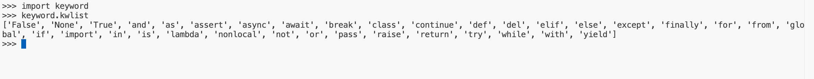
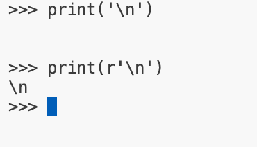
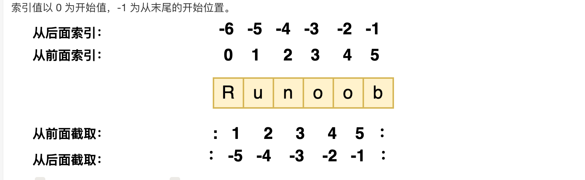
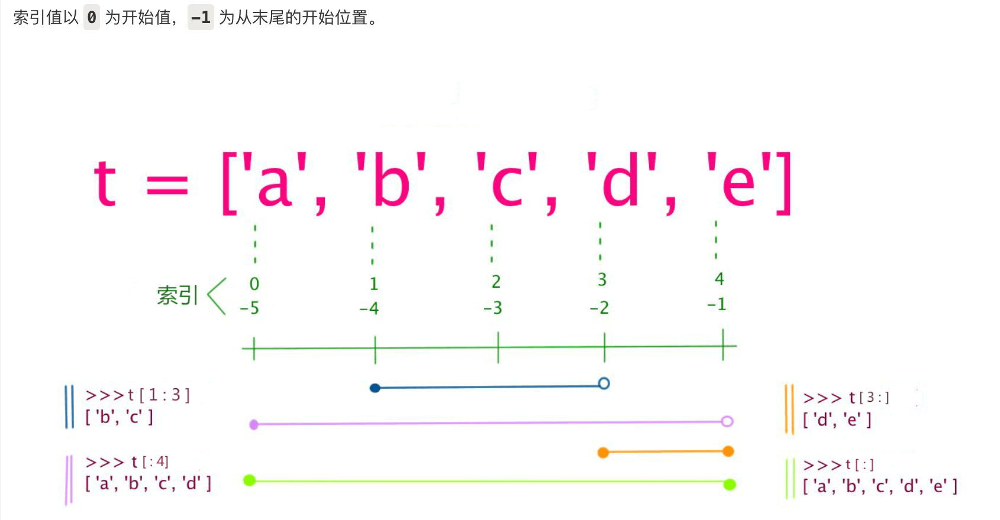
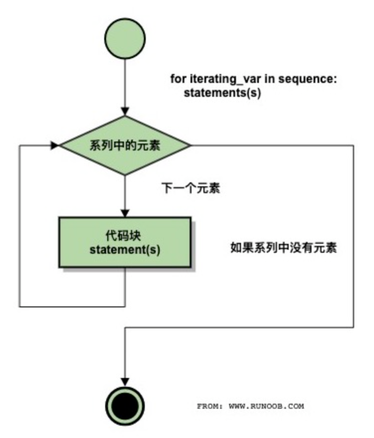
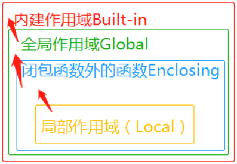

# python基础语法
## 编码方式
```python
#!/usr/bin/env python3
# -*- coding: utf-8 -*-
```

第一行注释是为了告诉Linux/OS X系统，这是一个Python可执行程序，Windows系统会忽略这个注释；

第二行注释是为了告诉Python解释器，按照UTF-8编码读取源代码，否则，你在源代码中写的中文输出可能会有乱码。

## 标识符
+ 第一个字符必须是字母表中字母或下划线 _ 。
+ 标识符的其他的部分由字母、数字和下划线组成。
+ 标识符对大小写敏感。


## python保留字


## 注释
```python
#!/usr/bin/python3
 
# 第一个注释
# 第二个注释
 
'''
第三注释
第四注释
'''
 
"""
第五注释
第六注释
"""
print ("Hello, Python!")
```

## 行与缩进
## 多行语句
使用/来实现

## 数字类型
python中数字有四种类型：整数、布尔型、浮点数和复数。

+ int (整数), 如 1, 只有一种整数类型 int，表示为长整型，没有 python2 中的 Long。
+ bool (布尔), 如 True。
+ float (浮点数), 如 1.23、3E-2
+ complex (复数) - 复数由实部和虚部组成，形式为 a + bj，其中 a 是实部，b 是虚部，j 表示虚数单位。如 1 + 2j、 1.1 + 2.2j

## 字符串
+ 转义符 \。
+ 反斜杠可以用来转义，使用 r 可以让反斜杠不发生转义。 如 r"this is a line with \n" 则 \n 会显示，并不是换行。
+ Python 没有单独的字符类型，一个字符就是长度为 1 的字符串。
+ 字符串的切片可以加上步长参数 step，语法格式如下：str[start:end:step]



## 空行
+ 空行也是程序的一部分

## 等待用户输入
```python
#!/usr/bin/python3
 
input("\n\n按下 enter 键后退出。")
```

以上代码中 ，\n\n 在结果输出前会输出两个新的空行。一旦用户按下 enter 键时，程序将退出。

## 同一行显示多行语句
使用;即可


## print 输出
print 

## import 与 from...import
在 python 用 import 或者 from...import 来导入相应的模块。

将整个模块(somemodule)导入，格式为： import somemodule

从某个模块中导入某个函数,格式为： from somemodule import somefunction

从某个模块中导入多个函数,格式为： from somemodule import firstfunc, secondfunc, thirdfunc

将某个模块中的全部函数导入，格式为： from somemodule import *，如果要实现不换行需要在变量末尾加上 end=""：

## 命令行参数


## 编程方式
### 交互式
终端交互式编程

### 脚本式
文件编程

# 基本数据类型
## 多变量赋值
```python
a, b, c = 1, 2, "runoob"
```

## 标准数据类型
Python3 中常见的数据类型有：

+ Number（数字）
+ String（字符串）
+ bool（布尔类型）
+ List（列表）
+ Tuple（元组）
+ Set（集合）
+ Dictionary（字典）

Python3 的六个标准数据类型中：

+ 不可变数据（3 个）：Number（数字）、String（字符串）、Tuple（元组）；
+ 可变数据（3 个）：List（列表）、Dictionary（字典）、Set（集合）。

## 数字
+ Python3 支持 int、float、bool、complex（复数）。
+ 内置的 type() 函数可以用来查询变量所指的对象类型。
+ 可以用isinstance来判断是什么数据类型

注意：Python3 中，bool 是 int 的子类，True 和 False 可以和数字相加， True==1、False==0 会返回 True，但可以通过 is 来判断类型。

## 数值运算
+ Python 还支持复数，复数由实数部分和虚数部分构成，可以用 a + bj，或者 complex(a,b) 表示， 复数的实部 a 和虚部 b 都是浮点型。

```python
>>> 5 + 4  # 加法
9
>>> 4.3 - 2 # 减法
2.3
>>> 3 * 7  # 乘法
21
>>> 2 / 4  # 除法，得到一个浮点数
0.5
>>> 2 // 4 # 除法，得到一个整数
0
>>> 17 % 3 # 取余 
2
>>> 2 ** 5 # 乘方
32
```

## 字符串
+ Python中的字符串用单引号 ' 或双引号 " 括起来，同时使用反斜杠 \ 转义特殊字符。
+ 加号 + 是字符串的连接符， 星号 * 表示复制当前字符串

### 索引


### 注意
注意：

+ 1、反斜杠可以用来转义，使用r可以让反斜杠不发生转义。
+ 2、字符串可以用+运算符连接在一起，用*运算符重复。
+ 3、Python中的字符串有两种索引方式，从左往右以0开始，从右往左以-1开始。
+ 4、Python中的字符串不能改变。

## bool类型
布尔类型特点：

+ 布尔类型只有两个值：True 和 False。
+ bool 是 int 的子类，因此布尔值可以被看作整数来使用，其中 True 等价于 1。
+ 布尔类型可以和其他数据类型进行比较，比如数字、字符串等。在比较时，Python 会将 True 视为 1，False 视为 0。
+ 布尔类型可以和逻辑运算符一起使用，包括 and、or 和 not。这些运算符可以用来组合多个布尔表达式，生成一个新的布尔值。
+ 布尔类型也可以被转换成其他数据类型，比如整数、浮点数和字符串。在转换时，True 会被转换成 1，False 会被转换成 0。
+ 可以使用 `bool()` 函数将其他类型的值转换为布尔值。以下值在转换为布尔值时为 `False`：`None`、`False`、零 (`0`、`0.0`、`0j`)、空序列（如 `''`、`()`、`[]`）和空映射（如 `{}`）。其他所有值转换为布尔值时均为 `True`。

## list（列表）
+ 列表可以完成大多数集合类的数据结构实现。列表中元素的类型可以不相同，它支持数字，字符串甚至可以包含列表（所谓嵌套）。列表是写在方括号 [] 之间、用逗号分隔开的元素列表。
+ 加号 + 是列表连接运算符，星号 * 是重复操作。

### 索引


### 注意
注意：

+ 1、列表写在方括号之间，元素用逗号隔开。
+ 2、和字符串一样，列表可以被索引和切片。
+ 3、列表可以使用 + 操作符进行拼接。
+ 4、列表中的元素是可以改变的。

## Tuple（元组）
+ 元组（tuple）与列表类似，不同之处在于元组的元素不能修改。元组写在小括号 () 里，元素之间用逗号隔开。
+ 如果你想创建只有一个元素的元组，需要注意在元素后面添加一个逗号，以区分它是一个元组而不是一个普通的值，这是因为在没有逗号的情况下，Python会将括号解释为数学运算中的括号，而不是元组的表示。

```python
tup1 = ()    # 空元组
tup2 = (20,) # 一个元素，需要在元素后添加逗号

```

### 例子
```python
#!/usr/bin/python3

tuple = ( 'abcd', 786 , 2.23, 'runoob', 70.2  )
tinytuple = (123, 'runoob')

print (tuple)             # 输出完整元组
print (tuple[0])          # 输出元组的第一个元素
print (tuple[1:3])        # 输出从第二个元素开始到第三个元素
print (tuple[2:])         # 输出从第三个元素开始的所有元素
print (tinytuple * 2)     # 输出两次元组
print (tuple + tinytuple) # 连接元组
```

以上实例输出结果：

```plain
('abcd', 786, 2.23, 'runoob', 70.2)
abcd
(786, 2.23)
(2.23, 'runoob', 70.2)
(123, 'runoob', 123, 'runoob')
('abcd', 786, 2.23, 'runoob', 70.2, 123, 'runoob')
```

### 注意
注意：

+ 1、与字符串一样，元组的元素不能修改。
+ 2、元组也可以被索引和切片，方法一样。
+ 3、注意构造包含 0 或 1 个元素的元组的特殊语法规则。
+ 4、元组也可以使用 + 操作符进行拼接。

## 集合
+ 在 Python 中，集合使用大括号 {} 表示，元素之间用逗号 , 分隔。
+ 另外，也可以使用 set() 函数创建集合。注意：创建一个空集合必须用 set() 而不是 { }，因为 { } 是用来创建一个空字典。

## 字典
+ 列表是有序的对象集合，字典是无序的对象集合。两者之间的区别在于：字典当中的元素是通过键来存取的，而不是通过偏移存取。
+ 键(key)必须使用不可变类型。
+ 在同一个字典中，键(key)必须是唯一的。
+ {x: x**2 for x in (2, 4, 6)} 该代码使用的是字典推导式，
+ 构造函数 dict() 可以直接从键值对序列中构建字典如下：

```python
>>> dict([('Runoob', 1), ('Google', 2), ('Taobao', 3)])
{'Runoob': 1, 'Google': 2, 'Taobao': 3}
>>> {x: x**2 for x in (2, 4, 6)}
{2: 4, 4: 16, 6: 36}
>>> dict(Runoob=1, Google=2, Taobao=3)
{'Runoob': 1, 'Google': 2, 'Taobao': 3}
```

### 例子


```python
#!/usr/bin/python3

dict = {}
dict['one'] = "1 - 菜鸟教程"
dict[2]     = "2 - 菜鸟工具"

tinydict = {'name': 'runoob','code':1, 'site': 'www.runoob.com'}


print (dict['one'])       # 输出键为 'one' 的值
print (dict[2])           # 输出键为 2 的值
print (tinydict)          # 输出完整的字典
print (tinydict.keys())   # 输出所有键
print (tinydict.values()) # 输出所有值
```

以上实例输出结果：

```plain
1 - 菜鸟教程
2 - 菜鸟工具
{'name': 'runoob', 'code': 1, 'site': 'www.runoob.com'}
dict_keys(['name', 'code', 'site'])
dict_values(['runoob', 1, 'www.runoob.com'])
```

### 注意
注意：

+ 1、字典是一种映射类型，它的元素是键值对。
+ 2、字典的关键字必须为不可变类型，且不能重复。
+ 3、创建空字典使用 { }。

## bites类型
+ 在 Python3 中，bytes 类型表示的是不可变的二进制序列（byte sequence）。
+ bytes 类型中的元素是整数值（0 到 255 之间的整数），而不是 Unicode 字符。
+ bytes 类型通常用于处理二进制数据，比如图像文件、音频文件、视频文件等等。在网络编程中，也经常使用 bytes 类型来传输二进制数据。
+ 创建 bytes 对象的方式有多种，最常见的方式是使用 b 前缀：

```python
x = bytes("hello", encoding="utf-8")
```

```python
x = b"hello"
y = x[1:3]  # 切片操作，得到 b"el"
z = x + b"world"  # 拼接操作，得到 b"helloworld"
```

## python数据类型转换
有时候，我们需要对数据内置的类型进行转换，数据类型的转换，你只需要将数据类型作为函数名即可，在下一章节 [Python3 数据类型转换](https://www.runoob.com/python3/python3-type-conversion.html) 会具体介绍。

以下几个内置的函数可以执行数据类型之间的转换。这些函数返回一个新的对象，表示转换的值。

| 函数 | 描述 |
| --- | --- |
| [int(x [,base])](https://www.runoob.com/python3/python-func-int.html) | 将x转换为一个整数 |
| [float(x)](https://www.runoob.com/python3/python-func-float.html) | 将x转换到一个浮点数 |
| [complex(real [,imag])](https://www.runoob.com/python3/python-func-complex.html) | 创建一个复数 |
| [str(x)](https://www.runoob.com/python3/python-func-str.html) | 将对象 x 转换为字符串 |
| [repr(x)](https://www.runoob.com/python3/python-func-repr.html) | 将对象 x 转换为表达式字符串 |
| [eval(str)](https://www.runoob.com/python3/python-func-eval.html) | 用来计算在字符串中的有效Python表达式,并返回一个对象 |
| [tuple(s)](https://www.runoob.com/python3/python3-func-tuple.html) | 将序列 s 转换为一个元组 |
| [list(s)](https://www.runoob.com/python3/python3-att-list-list.html) | 将序列 s 转换为一个列表 |
| [set(s)](https://www.runoob.com/python3/python-func-set.html) | 转换为可变集合 |
| [dict(d)](https://www.runoob.com/python3/python-func-dict.html) | 创建一个字典。d 必须是一个 (key, value)元组序列。 |
| [frozenset(s)](https://www.runoob.com/python3/python-func-frozenset.html) | 转换为不可变集合 |
| [chr(x)](https://www.runoob.com/python3/python-func-chr.html) | 将一个整数转换为一个字符 |
| [ord(x)](https://www.runoob.com/python3/python-func-ord.html) | 将一个字符转换为它的整数值 |
| [hex(x)](https://www.runoob.com/python3/python-func-hex.html) | 将一个整数转换为一个十六进制字符串 |
| [oct(x)](https://www.runoob.com/python3/python-func-oct.html) | 将一个整数转换为一个八进制字符串 |


# 运算符
## Python算术运算符
以下假设变量 a=10，变量 b=21：

| 运算符 | 描述 | 实例 |
| --- | --- | --- |
| + | 加 - 两个对象相加 | a + b 输出结果 31 |
| - | 减 - 得到负数或是一个数减去另一个数 | a - b 输出结果 -11 |
| * | 乘 - 两个数相乘或是返回一个被重复若干次的字符串 | a * b 输出结果 210 |
| / | 除 - x 除以 y | b / a 输出结果 2.1 |
| % | 取模 - 返回除法的余数 | b % a 输出结果 1 |
| ** | 幂 - 返回x的y次幂 | a**b 为10的21次方 |
| // | 取整除 - 往小的方向取整数 | ```plain >>> 9//2 4 >>> -9//2 -5 ```  |


## Python 比较运算符
以下假设变量 a 为 10，变量 b 为20：

| 运算符 | 描述 | 实例 |
| --- | --- | --- |
| == | 等于 - 比较对象是否相等 | (a == b) 返回 False。 |
| != | 不等于 - 比较两个对象是否不相等 | (a != b) 返回 True。 |
| > | 大于 - 返回x是否大于y | (a > b) 返回 False。 |
| < | 小于 - 返回x是否小于y。所有比较运算符返回1表示真，返回0表示假。这分别与特殊的变量True和False等价。注意，这些变量名的大写。 | (a < b) 返回 True。 |
| >= | 大于等于 - 返回x是否大于等于y。 | (a >= b) 返回 False。 |
| <= | 小于等于 - 返回x是否小于等于y。 | (a <= b) 返回 True。 |


## Python赋值运算符
以下假设变量a为10，变量b为20：

| 运算符 | 描述 | 实例 |
| --- | --- | --- |
| = | 简单的赋值运算符 | c = a + b 将 a + b 的运算结果赋值为 c |
| += | 加法赋值运算符 | c += a 等效于 c = c + a |
| -= | 减法赋值运算符 | c -= a 等效于 c = c - a |
| *= | 乘法赋值运算符 | c *= a 等效于 c = c * a |
| /= | 除法赋值运算符 | c /= a 等效于 c = c / a |
| %= | 取模赋值运算符 | c %= a 等效于 c = c % a |
| **= | 幂赋值运算符 | c **= a 等效于 c = c ** a |
| //= | 取整除赋值运算符 | c //= a 等效于 c = c // a |
| := | 海象运算符，这个运算符的主要目的是在表达式中同时进行赋值和返回赋值的值。Python3.8 版本新增运算符。 | 在这个示例中，赋值表达式可以避免调用 len() 两次:<br/>```plain if (n := len(a)) > 10:     print(f"List is too long ({n} elements, expected <= 10)") ```  |


###

## python位运算符
| 运算符 | 描述 | 实例 |
| --- | --- | --- |
| & | 按位与运算符：参与运算的两个值,如果两个相应位都为1,则该位的结果为1,否则为0 | (a & b) 输出结果 12 ，二进制解释： 0000 1100 |
| | | 按位或运算符：只要对应的二个二进位有一个为1时，结果位就为1。 | (a | b) 输出结果 61 ，二进制解释： 0011 1101 |
| ^ | 按位异或运算符：当两对应的二进位相异时，结果为1 | (a ^ b) 输出结果 49 ，二进制解释： 0011 0001 |
| ~ | 按位取反运算符：对数据的每个二进制位取反,即把1变为0,把0变为1。~x 类似于 -x-1 | (~a ) 输出结果 -61 ，二进制解释： 1100 0011， 在一个有符号二进制数的补码形式。 |
| << | 左移动运算符：运算数的各二进位全部左移若干位，由"<<"右边的数指定移动的位数，高位丢弃，低位补0。 | a << 2 输出结果 240 ，二进制解释： 1111 0000 |
| >> | 右移动运算符：把">>"左边的运算数的各二进位全部右移若干位，">>"右边的数指定移动的位数 | a >> 2 输出结果 15 ，二进制解释： 0000 1111 |


## Python逻辑运算符
Python语言支持逻辑运算符，以下假设变量 a 为 10, b为 20:

| 运算符 | 逻辑表达式 | 描述 | 实例 |
| --- | --- | --- | --- |
| and | x and y | 布尔"与" - 如果 x 为 False，x and y 返回 x 的值，否则返回 y 的计算值。 | (a and b) 返回 20。 |
| or | x or y | 布尔"或" - 如果 x 是 True，它返回 x 的值，否则它返回 y 的计算值。 | (a or b) 返回 10。 |
| not | not x | 布尔"非" - 如果 x 为 True，返回 False 。如果 x 为 False，它返回 True。 | not(a and b) 返回 False |


## Python成员运算符
除了以上的一些运算符之外，Python还支持成员运算符，测试实例中包含了一系列的成员，包括字符串，列表或元组。

| 运算符 | 描述 | 实例 |
| --- | --- | --- |
| in | 如果在指定的序列中找到值返回 True，否则返回 False。 | x 在 y 序列中 , 如果 x 在 y 序列中返回 True。 |
| not in | 如果在指定的序列中没有找到值返回 True，否则返回 False。 | x 不在 y 序列中 , 如果 x 不在 y 序列中返回 True。 |


## Python身份运算符
身份运算符用于比较两个对象的存储单元

| 运算符 | 描述 | 实例 |
| --- | --- | --- |
| is | is 是判断两个标识符是不是引用自一个对象 | x is y, 类似 id(x) == id(y) , 如果引用的是同一个对象则返回 True，否则返回 False |
| is not | is not 是判断两个标识符是不是引用自不同对象 | x is not y ， 类似 id(x) != id(y)。如果引用的不是同一个对象则返回结果 True，否则返回 False。 |


+ 注： [id()](https://www.runoob.com/python/python-func-id.html) 函数用于获取对象内存地址。

# 条件控制
## if else
## match...case
Python 3.10 增加了 match...case 的条件判断，不需要再使用一连串的 if-else 来判断了。

match 后的对象会依次与 case 后的内容进行匹配，如果匹配成功，则执行匹配到的表达式，否则直接跳过，_ 可以匹配一切。

语法格式如下：

```plain
match subject:
    case <pattern_1>:
        <action_1>
    case <pattern_2>:
        <action_2>
    case <pattern_3>:
        <action_3>
    case _:
        <action_wildcard>
```

# 循环语句
## while循环
## while 循环使用 else 语句
如果 while 后面的条件语句为 false 时，则执行 else 的语句块。

语法格式如下：

```plain
while <expr>:
    <statement(s)>
else:
    <additional_statement(s)>
```

## 简单语句组
类似 if 语句的语法，如果你的 while 循环体中只有一条语句，你可以将该语句与 while 写在同一行中， 如下所示：


```python
#!/usr/bin/python
 
flag = 1
 
while (flag): print ('欢迎访问菜鸟教程!')
 
print ("Good bye!")
```

注意：以上的无限循环你可以使用 CTRL+C 来中断循环。

执行以上脚本，输出结果如下：

```plain
欢迎访问菜鸟教程!
欢迎访问菜鸟教程!
欢迎访问菜鸟教程!
欢迎访问菜鸟教程!
欢迎访问菜鸟教程!
……
```

## for循环语句
+ Python for 循环可以遍历任何可迭代对象，如一个列表或者一个字符串。

```python
for <variable> in <sequence>:
    <statements>
else:
    <statements>
```



### 例子
```python
#!/usr/bin/python3
 
word = 'runoob'
 
for letter in word:
    print(letter)


#!/usr/bin/python3
 
#  1 到 5 的所有数字：
for number in range(1, 6):
    print(number)
```


## for...else
+ 在 Python 中，for...else 语句用于在循环结束后执行一段代码。
+ 使用break会直接跳出循环，不会执行else

语法格式如下：

```plain
for item in iterable:
    # 循环主体
else:
    # 循环结束后执行的代码
```

## range() 函数
+ 遍历数字序列，可以使用内置 range() 函数。它会生成数列，例如:

```python
>>>for i in range(5):
...     print(i)
...
0
1
2
3
4
```

## break 和 continue 语句及循环中的 else 子句
break 语句可以跳出 for 和 while 的循环体。如果你从 for 或 while 循环中终止，任何对应的循环 else 块将不执行。

continue 语句被用来告诉 Python 跳过当前循环块中的剩余语句，然后继续进行下一轮循环。

## pass 语句
Python pass是空语句，是为了保持程序结构的完整性。

pass 不做任何事情，一般用做占位语句，如下实例

# 推导式
+ Python 推导式是一种独特的数据处理方式，可以从一个数据序列构建另一个新的数据序列的结构体。

Python 支持各种数据结构的推导式：

+ 列表(list)推导式
+ 字典(dict)推导式
+ 集合(set)推导式
+ 元组(tuple)推导式

## 列表推导式
```python
[表达式 for 变量 in 列表] 
[out_exp_res for out_exp in input_list]

或者 

[表达式 for 变量 in 列表 if 条件]
[out_exp_res for out_exp in input_list if condition]
```

+ out_exp_res：列表生成元素表达式，可以是有返回值的函数。
+ for out_exp in input_list：迭代 input_list 将 out_exp 传入到 out_exp_res 表达式中。
+ if condition：条件语句，可以过滤列表中不符合条件的值。

## 字典推导式
例子

```python
listdemo = ['Google','Runoob', 'Taobao']
# 将列表中各字符串值为键，各字符串的长度为值，组成键值对
>>> newdict = {key:len(key) for key in listdemo}
>>> newdict
{'Google': 6, 'Runoob': 6, 'Taobao': 6}
```

[详细链接](https://www.runoob.com/python3/python-comprehensions.html)

## 集合推导式
```python
>>> setnew = {i**2 for i in (1,2,3)}
>>> setnew
{1, 4, 9}
```

## 元组推导式
```python
>>> a = (x for x in range(1,10))
>>> a
<generator object <genexpr> at 0x7faf6ee20a50>  # 返回的是生成器对象

>>> tuple(a)       # 使用 tuple() 函数，可以直接将生成器对象转换成元组
(1, 2, 3, 4, 5, 6, 7, 8, 9)
```

# 迭代器和生成器
## 迭代器
+ 迭代器有两个基本的方法：iter() 和 next()。
+ 迭代是 Python 最强大的功能之一，是访问集合元素的一种方式。
+ 字符串，列表或元组对象都可用于创建迭代器：

### 示例(迭代器）
```python
>>> list=[1,2,3,4]
>>> it = iter(list)    # 创建迭代器对象
>>> print (next(it))   # 输出迭代器的下一个元素
1
>>> print (next(it))
2
>>>
```

### 示例（使用next方法）
```python
#!/usr/bin/python3
 
import sys         # 引入 sys 模块
 
list=[1,2,3,4]
it = iter(list)    # 创建迭代器对象
 
while True:
    try:
        print (next(it))
    except StopIteration:
        sys.exit()
```

## 创建一个迭代器
+ 把一个类作为一个迭代器使用需要在类中实现两个方法 __iter__() 与 __next__() 。
+ __iter__() 方法返回一个特殊的迭代器对象， 这个迭代器对象实现了 __next__() 方法并通过 StopIteration 异常标识迭代的完成。__next__() 方法（Python 2 里是 next()）会返回下一个迭代器对象。

### 示例
```python
class MyNumbers:
  def __iter__(self):
    self.a = 1
    return self
 
  def __next__(self):
    x = self.a
    self.a += 1
    return x
 
myclass = MyNumbers()
myiter = iter(myclass)
 
print(next(myiter))
print(next(myiter))
print(next(myiter))
print(next(myiter))
print(next(myiter))
```

### StopIteration（防止出现无限循环）给出一个条件，不满住就raise StopIteration
中断迭代，防止出现无限循环的情况

### 示例
在迭代20次后停止迭代

```python
class MyNumbers:
  def __iter__(self):
    self.a = 1
    return self
 
  def __next__(self):
    if self.a <= 20:
      x = self.a
      self.a += 1
      return x
    else:
      raise StopIteration
 
myclass = MyNumbers()
myiter = iter(myclass)
 
for x in myiter:
  print(x)
```


## 生成器（yield ）（使用yield+next）
+ 生成器的函数里面要有yield 来实现暂停函数并返回数值。
+ yield 是一个关键字，用于定义生成器函数，生成器函数是一种特殊的函数，可以在迭代过程中逐步产生值，而不是一次性返回所有结果。
+ 当在生成器函数中使用 yield 语句时，函数的执行将会暂停，并将 yield 后面的表达式作为当前迭代的值返回。

### 示例
```python
def countdown(n):
    while n > 0:
        yield n
        n -= 1
 
# 创建生成器对象
generator = countdown(5)
 
# 通过迭代生成器获取值
print(next(generator))  # 输出: 5
print(next(generator))  # 输出: 4
print(next(generator))  # 输出: 3
 
# 使用 for 循环迭代生成器
for value in generator:
    print(value)  # 输出: 2 1
```

# python3函数
## 函数是什么
函数是组织好的，可重复使用的，用来实现单一，或相关联功能的代码段。

函数能提高应用的模块性，和代码的重复利用率。你已经知道Python提供了许多内建函数，比如print()。但你也可以自己创建函数，这被叫做用户自定义函数。


## 定义一个函数
你可以定义一个由自己想要功能的函数，以下是简单的规则：

+ 函数代码块以 def 关键词开头，后接函数标识符名称和圆括号 ()。
+ 任何传入参数和自变量必须放在圆括号中间，圆括号之间可以用于定义参数。
+ 函数的第一行语句可以选择性地使用文档字符串—用于存放函数说明。
+ 函数内容以冒号 : 起始，并且缩进。
+ return [表达式] 结束函数，选择性地返回一个值给调用方，不带表达式的 return 相当于返回 None。

```python
def 函数名（参数列表）:
    函数体

```

## 函数调用
示例

```python
#!/usr/bin/python3
 
# 定义函数
def printme( str ):
   # 打印任何传入的字符串
   print (str)
   return
 
# 调用函数
printme("我要调用用户自定义函数!")
printme("再次调用同一函数")
```

## 参数传递
参数可以是可变对象（如列表或字典）或不可变对象（如数字、字符串或元组）

+ 在 python 中，类型属于对象，对象有不同类型的区分，变量是没有类型的：

```python
a=[1,2,3]

a="Runoob"

```

以上代码中，[1,2,3] 是 List 类型，"Runoob" 是 String 类型，而变量 a 是没有类型，它仅仅是一个对象的引用（一个指针），可以是指向 List 类型对象，也可以是指向 String 类型对象。

### 可更改(mutable)与不可更改(immutable)对象
在 python 中，strings, tuples, 和 numbers 是不可更改的对象，而 list,dict 等则是可以修改的对象。

+ 不可变类型：变量赋值 a=5 后再赋值 a=10，这里实际是新生成一个 int 值对象 10，再让 a 指向它，而 5 被丢弃，不是改变 a 的值，相当于新生成了 a。
+ 可变类型：变量赋值 la=[1,2,3,4] 后再赋值 la[2]=5 则是将 list la 的第三个元素值更改，本身la没有动，只是其内部的一部分值被修改了。

python 函数的参数传递：

+ 不可变类型：类似 C++ 的值传递，如整数、字符串、元组。如 fun(a)，传递的只是 a 的值，没有影响 a 对象本身。如果在 fun(a) 内部修改 a 的值，则是新生成一个 a 的对象。
+ 可变类型：类似 C++ 的引用传递，如 列表，字典。如 fun(la)，则是将 la 真正的传过去，修改后 fun 外部的 la 也会受影响

python 中一切都是对象，严格意义我们不能说值传递还是引用传递，我们应该说传不可变对象和传可变对象。

### python 传不可变对象实例
示例

```python
def change(a):
    print(id(a))   # 指向的是同一个对象
    a=10
    print(id(a))   # 一个新对象
 
a=1
print(id(a))
change(a)
```

### 传可变对象实例
可变对象在函数里修改了参数，那么在调用这个函数的函数里，原始的参数也被改变了。例如：

```python
#!/usr/bin/python3
 
# 可写函数说明
def changeme( mylist ):
   "修改传入的列表"
   mylist.append([1,2,3,4])
   print ("函数内取值: ", mylist)
   return
 
# 调用changeme函数
mylist = [10,20,30]
changeme( mylist )
print ("函数外取值: ", mylist)
```

## 参数
以下是调用函数时可使用的正式参数类型：

+ 必需参数
+ 关键字参数
+ 默认参数
+ 不定长参数

### 必需参数
必需参数须以正确的顺序传入函数。调用时的数量必须和声明时的一样。

调用 printme() 函数，你必须传入一个参数，不然会出现语法错误：

```python
#!/usr/bin/python3
 
#可写函数说明
def printme( str ):
   "打印任何传入的字符串"
   print (str)
   return
 
# 调用 printme 函数，不加参数会报错
printme()
```

### 关键字参数(可以不指定参数传递的顺序）默认参数
关键字参数和函数调用关系紧密，函数调用使用关键字参数来确定传入的参数值。

示例:

```python
#!/usr/bin/python3
 
#可写函数说明
def printme( str ):
   "打印任何传入的字符串"
   print (str)
   return
 
#调用printme函数
printme( str = "菜鸟教程")
```

### 默认参数
调用函数时，如果没有传递参数，则会使用默认参数

### 不定长参数
需要一个函数能处理比当初声明时更多的参数。这些参数叫做不定长参数，和上述 2 种参数不同，声明时不会命名。基本语法如下：

```python
def functionname([formal_args,] *var_args_tuple ):
   "函数_文档字符串"
   function_suite
   return [expression]

```

#### 加了星号 * 的参数会以元组(tuple)的形式导入，存放所有未命名的变量参数。---直接使用序号访问元组
```python
#!/usr/bin/python3
  
# 可写函数说明
def printinfo( arg1, *vartuple ):
   "打印任何传入的参数"
   print ("输出: ")
   print (arg1)
   print (vartuple)
 
# 调用printinfo 函数
printinfo( 70, 60, 50 )
```

#### 加了两个星号 ** 的参数会以字典的形式导入。
```python
#!/usr/bin/python3
  
# 可写函数说明
def printinfo( arg1, **vardict ):
   "打印任何传入的参数"
   print ("输出: ")
   print (arg1)
   print (vardict)
 
# 调用printinfo 函数
printinfo(1, a=2,b=3)
```


#### 声明函数时，参数中星号 * 可以单独出现，例如:
```python
def f(a,b,*,c):
    return a+b+c
```

#### 如果单独出现星号 *，则星号 * 后的参数必须用关键字传入：
```python
>>> def f(a,b,*,c):
...     return a+b+c
... 
>>> f(1,2,3)   # 报错
Traceback (most recent call last):
  File "<stdin>", line 1, in <module>
TypeError: f() takes 2 positional arguments but 3 were given
>>> f(1,2,c=3) # 正常
6
>>>
```

## 匿名函数
Python 使用 lambda 来创建匿名函数。

所谓匿名，意即不再使用 def 语句这样标准的形式定义一个函数。

+ lambda 只是一个表达式，函数体比 def 简单很多。
+ lambda 的主体是一个表达式，而不是一个代码块。仅仅能在 lambda 表达式中封装有限的逻辑进去。
+ lambda 函数拥有自己的命名空间，且不能访问自己参数列表之外或全局命名空间里的参数。
+ 虽然 lambda 函数看起来只能写一行，却不等同于 C 或 C++ 的内联函数，内联函数的目的是调用小函数时不占用栈内存从而减少函数调用的开销，提高代码的执行速度。

### 语法
```python
lambda [arg1 [,arg2,.....argn]]:expression

```


## return 语句
```python
#!/usr/bin/python3
 
# 可写函数说明
def sum( arg1, arg2 ):
   # 返回2个参数的和."
   total = arg1 + arg2
   print ("函数内 : ", total)
   return total
 
# 调用sum函数
total = sum( 10, 20 )
print ("函数外 : ", total)
```

## 强制位置参数
Python3.8 新增了一个函数形参语法 / 用来指明函数形参必须使用指定位置参数，不能使用关键字参数的形式。

在以下的例子中，形参 a 和 b 必须使用指定位置参数，c 或 d 可以是位置形参或关键字形参，而 e 和 f 要求为关键字形参:

```python
def f(a, b, /, c, d, *, e, f):
    print(a, b, c, d, e, f)
```

# 装饰器
+ 装饰器（decorators）是 Python 中的一种高级功能，它允许你动态地修改函数或类的行为。
+ 装饰器是一种函数，它接受一个函数作为参数，并返回一个新的函数或修改原来的函数。

## 使用场景
装饰器的应用场景：

+ 日志记录: 装饰器可用于记录函数的调用信息、参数和返回值。
+ 性能分析: 可以使用装饰器来测量函数的执行时间。
+ 权限控制: 装饰器可用于限制对某些函数的访问权限。
+ 缓存: 装饰器可用于实现函数结果的缓存，以提高性能。


### 基本语法
Python 装饰允许在不修改原有函数代码的基础上，动态地增加或修改函数的功能，装饰器本质上是一个接收函数作为输入并返回一个新的包装过后的函数的对象。

```python
def decorator_function(original_function):
    def wrapper(*args, **kwargs):
        # 这里是在调用原始函数前添加的新功能
        before_call_code()
        
        result = original_function(*args, **kwargs)
        
        # 这里是在调用原始函数后添加的新功能
        after_call_code()
        
        return result
    return wrapper

# 使用装饰器
@decorator_function
def target_function(arg1, arg2):
    pass  # 原始函数的实现
```

解析：decorator 是一个装饰器函数，它接受一个函数 func 作为参数，并返回一个内部函数 wrapper，在 wrapper 函数内部，你可以执行一些额外的操作，然后调用原始函数 func，并返回其结果。

+ `decorator_function` 是装饰器，它接收一个函数 `original_function` 作为参数。
+ `wrapper` 是内部函数，它是实际会被调用的新函数，它包裹了原始函数的调用，并在其前后增加了额外的行为。
+ 当我们使用 `@decorator_function` 前缀在 `target_function` 定义前，Python会自动将 `target_function` 作为参数传递给 `decorator_function`，然后将返回的 `wrapper` 函数替换掉原来的 `target_function`。

## 使用装饰器
装饰器通过 @ 符号应用在函数定义之前，例如：

```python
@time_logger
def target_function():
    pass

```

等同于

```python
def target_function():
    pass
target_function = time_logger(target_function)
```

### 带参数的装饰器
饰器函数也可以接受参数，例如：

```python
def repeat(n):
    def decorator(func):
        def wrapper(*args, **kwargs):
            for _ in range(n):
                result = func(*args, **kwargs)
            return result
        return wrapper
    return decorator

@repeat(3)
def greet(name):
    print(f"Hello, {name}!")

greet("Alice")
```

以上代码中 repeat 函数是一个带参数的装饰器，它接受一个整数参数 n，然后返回一个装饰器函数。该装饰器函数内部定义了 wrapper 函数，在调用原始函数之前重复执行 n 次。因此，greet 函数在被 @repeat(3) 装饰后，会打印三次问候语。

### 类装饰器
除了函数装饰器，Python 还支持类装饰器。类装饰器是包含 __call__ 方法的类，它接受一个函数作为参数，并返回一个新的函数。

```python
class DecoratorClass:
    def __init__(self, func):
        self.func = func
    
    def __call__(self, *args, **kwargs):
        # 在调用原始函数之前/之后执行的代码
        result = self.func(*args, **kwargs)
        # 在调用原始函数之后执行的代码
        return result

@DecoratorClass
def my_function():
    pass
```


# 数据结构
## 列表
Python中列表是可变的，这是它区别于字符串和元组的最重要的特点，一句话概括即：列表可以修改，而字符串和元组不能。

以下是 Python 中列表的方法：

| 方法 | 描述 |
| --- | --- |
| list.append(x) | 把一个元素添加到列表的结尾，相当于 a[len(a):] = [x]。 |
| list.extend(L) | 通过添加指定列表的所有元素来扩充列表，相当于 a[len(a):] = L。 |
| list.insert(i, x) | 在指定位置插入一个元素。第一个参数是准备插入到其前面的那个元素的索引，例如 a.insert(0, x) 会插入到整个列表之前，而 a.insert(len(a), x) 相当于 a.append(x) 。 |
| list.remove(x) | 删除列表中值为 x 的第一个元素。如果没有这样的元素，就会返回一个错误。 |
| list.pop([i]) | 从列表的指定位置移除元素，并将其返回。如果没有指定索引，a.pop()返回最后一个元素。元素随即从列表中被移除。（方法中 i 两边的方括号表示这个参数是可选的，而不是要求你输入一对方括号，你会经常在 Python 库参考手册中遇到这样的标记。） |
| list.clear() | 移除列表中的所有项，等于del a[:]。 |
| list.index(x) | 返回列表中第一个值为 x 的元素的索引。如果没有匹配的元素就会返回一个错误。 |
| list.count(x) | 返回 x 在列表中出现的次数。 |
| list.sort() | 对列表中的元素进行排序。 |
| list.reverse() | 倒排列表中的元素。 |
| list.copy() | 返回列表的浅复制，等于a[:]。 |


## 将列表当做栈使用
在 Python 中，列表（list）可以用作队列（queue），但由于列表的特点，直接使用列表来实现队列并不是最优的选择。

队列是一种先进先出（FIFO, First-In-First-Out）的数据结构，意味着最早添加的元素最先被移除。

使用列表时，如果频繁地在列表的开头插入或删除元素，性能会受到影响，因为这些操作的时间复杂度是 O(n)。为了解决这个问题，Python 提供了 collections.deque，它是双端队列，可以在两端高效地添加和删除元素。

### 使用 collections.deque 实现队列\
collections.deque 是 Python 标准库的一部分，非常适合用于实现队列。

queue.popleft(）-移除元素

len(queue)

front_element = queue[0]------# 查看队首元素（不移除）

```python
from collections import deque

# 创建一个空队列
queue = deque()

# 向队尾添加元素
queue.append('a')
queue.append('b')
queue.append('c')

print("队列状态:", queue)  # 输出: 队列状态: deque(['a', 'b', 'c'])

# 从队首移除元素
first_element = queue.popleft()
print("移除的元素:", first_element)  # 输出: 移除的元素: a
print("队列状态:", queue)            # 输出: 队列状态: deque(['b', 'c'])

# 查看队首元素（不移除）
front_element = queue[0]
print("队首元素:", front_element)    # 输出: 队首元素: b

# 检查队列是否为空
is_empty = len(queue) == 0
print("队列是否为空:", is_empty)     # 输出: 队列是否为空: False

# 获取队列大小
size = len(queue)
print("队列大小:", size)            # 输出: 队列大小: 2
```

## 遍历技巧
在字典中遍历时，关键字和对应的值可以使用 items() 方法同时解读出来：

```python
>>> knights = {'gallahad': 'the pure', 'robin': 'the brave'}
>>> for k, v in knights.items():
...     print(k, v)
...
gallahad the pure
robin the brave
```

在序列中遍历时，索引位置和对应值可以使用 enumerate() 函数同时得到：

```python
>>> for i, v in enumerate(['tic', 'tac', 'toe']):
...     print(i, v)
...
0 tic
1 tac
2 toe
```

同时遍历两个或更多的序列，可以使用 zip() 组合：

```python
>>> questions = ['name', 'quest', 'favorite color']
>>> answers = ['lancelot', 'the holy grail', 'blue']
>>> for q, a in zip(questions, answers):
...     print('What is your {0}?  It is {1}.'.format(q, a))
...
What is your name?  It is lancelot.
What is your quest?  It is the holy grail.
What is your favorite color?  It is blue.
```

要反向遍历一个序列，首先指定这个序列，然后调用 reversed() 函数：

```python
>>> for i in reversed(range(1, 10, 2)):
...     print(i)
...
9
7
5
3
1
```

# 模块
在前面的几个章节中我们基本上是用 python 解释器来编程，如果你从 Python 解释器退出再进入，那么你定义的所有的方法和变量就都消失了。

为此 Python 提供了一个办法，把这些定义存放在文件中，为一些脚本或者交互式的解释器实例使用，这个文件被称为模块。

```python
$ python using_sys.py 参数1 参数2
命令行参数如下:
using_sys.py
参数1
参数2


Python 路径为： ['/root', '/usr/lib/python3.4', '/usr/lib/python3.4/plat-x86_64-linux-gnu', '/usr/lib/python3.4/lib-dynload', '/usr/local/lib/python3.4/dist-packages', '/usr/lib/python3/dist-packages'] 


```

+ 1、import sys 引入 python 标准库中的 sys.py 模块；这是引入某一模块的方法。
+ 2、sys.argv 是一个包含命令行参数的列表。
+ 3、sys.path 包含了一个 Python 解释器自动查找所需模块的路径的列表。

## import 语句
## from … import 语句
## from … import * 语句
## 深入模块
## __name__属性
一个模块被另一个程序第一次引入时，其主程序将运行。如果我们想在模块被引入时，模块中的某一程序块不执行，我们可以用__name__属性来使该程序块仅在该模块自身运行时执行。

```python
#!/usr/bin/python3
# Filename: using_name.py

if __name__ == '__main__':
   print('程序自身在运行')
else:
   print('我来自另一模块')

```

运行输出如下：

```plain
$ python using_name.py
程序自身在运行
```

## dir() 函数
内置的函数 dir() 可以找到模块内定义的所有名称。以一个字符串列表的形式返回:

```plain
>>> import fibo, sys
>>> dir(fibo)
['__name__', 'fib', 'fib2']
>>> dir(sys)  
['__displayhook__', '__doc__', '__excepthook__', '__loader__', '__name__',
 '__package__', '__stderr__', '__stdin__', '__stdout__',
 '_clear_type_cache', '_current_frames', '_debugmallocstats', '_getframe',
 '_home', '_mercurial', '_xoptions', 'abiflags', 'api_version', 'argv',
 'base_exec_prefix', 'base_prefix', 'builtin_module_names', 'byteorder',
 'call_tracing', 'callstats', 'copyright', 'displayhook',
 'dont_write_bytecode', 'exc_info', 'excepthook', 'exec_prefix',
 'executable', 'exit', 'flags', 'float_info', 'float_repr_style',
 'getcheckinterval', 'getdefaultencoding', 'getdlopenflags',
 'getfilesystemencoding', 'getobjects', 'getprofile', 'getrecursionlimit',
 'getrefcount', 'getsizeof', 'getswitchinterval', 'gettotalrefcount',
 'gettrace', 'hash_info', 'hexversion', 'implementation', 'int_info',
 'intern', 'maxsize', 'maxunicode', 'meta_path', 'modules', 'path',
 'path_hooks', 'path_importer_cache', 'platform', 'prefix', 'ps1',
 'setcheckinterval', 'setdlopenflags', 'setprofile', 'setrecursionlimit',
 'setswitchinterval', 'settrace', 'stderr', 'stdin', 'stdout',
 'thread_info', 'version', 'version_info', 'warnoptions']
```

如果没有给定参数，那么 dir() 函数会罗列出当前定义的所有名称:

```plain
>>> a = [1, 2, 3, 4, 5]
>>> import fibo
>>> fib = fibo.fib
>>> dir() # 得到一个当前模块中定义的属性列表
['__builtins__', '__name__', 'a', 'fib', 'fibo', 'sys']
>>> a = 5 # 建立一个新的变量 'a'
>>> dir()
['__builtins__', '__doc__', '__name__', 'a', 'sys']
>>>
>>> del a # 删除变量名a
>>>
>>> dir()
['__builtins__', '__doc__', '__name__', 'sys']
>>>
```

## 标准模块
Python 本身带着一些标准的模块库，在 Python 库参考文档中将会介绍到（就是后面的"库参考文档"）。

有些模块直接被构建在解析器里，这些虽然不是一些语言内置的功能，但是他却能很高效的使用，甚至是系统级调用也没问题。

这些组件会根据不同的操作系统进行不同形式的配置，比如 winreg 这个模块就只会提供给 Windows 系统。

## 包
包是一种管理 Python 模块命名空间的形式，采用"点模块名称"。

比如一个模块的名称是 A.B， 那么他表示一个包 A中的子模块 B 

目录只有包含一个叫做 __init__.py 的文件才会被认作是一个包，主要是为了避免一些滥俗的名字（比如叫做 string）不小心的影响搜索路径中的有效模块。

这里给出了一种可能的包结构（在分层的文件系统中）:

```plain
sound/                          顶层包
      __init__.py               初始化 sound 包
      formats/                  文件格式转换子包
              __init__.py
              wavread.py
              wavwrite.py
              aiffread.py
              aiffwrite.py
              auread.py
              auwrite.py
              ...
      effects/                  声音效果子包
              __init__.py
              echo.py
              surround.py
              reverse.py
              ...
      filters/                  filters 子包
              __init__.py
              equalizer.py
              vocoder.py
              karaoke.py
              ...
```

用户可以每次只导入一个包里面的特定模块，比如:

```python
import sound.effects.echo
```

这将会导入子模块:sound.effects.echo。 他必须使用全名去访问:

```python
sound.effects.echo.echofilter(input, output, delay=0.7, atten=4)
```

## 从一个包中导入*
导入语句遵循如下规则：如果包定义文件 __init__.py 存在一个叫做 __all__ 的列表变量，那么在使用 from package import * 的时候就把这个列表中的所有名字作为包内容导入。

作为包的作者，可别忘了在更新包之后保证 __all__ 也更新了啊。

以下实例在 file:sounds/effects/__init__.py 中包含如下代码:

__all__ = ["echo", "surround", "reverse"]


# python3输入输出	
Python两种输出值的方式: 表达式语句和 print() 函数。

第三种方式是使用文件对象的 write() 方法，标准输出文件可以用 sys.stdout 引用。

如果你希望输出的形式更加多样，可以使用 str.format() 函数来格式化输出值。

如果你希望将输出的值转成字符串，可以使用 repr() 或 str() 函数来实现。


## format
另一种格式化字符串的方法是使用字符串的`format()`方法，它会用传入的参数依次替换字符串内的占位符`{0}`、`{1}`……，不过这种方式写起来比%要麻烦得多：

```plain
>>> 'Hello, {0}, 成绩提升了 {1:.1f}%'.format('小明', 17.125)
'Hello, 小明, 成绩提升了 17.1%'
```

## 旧式字符串格式化
`%`运算符就是用来格式化字符串的。在字符串内部，`%s`表示用字符串替换，`%d`表示用整数替换，有几个`%?`占位符，后面就跟几个变量或者值，顺序要对应好。如果只有一个`%?`，括号可以省略。

常见的占位符有：

| 占位符 | 替换内容 |
| --- | --- |
| %d | 整数 |
| %f | 浮点数 |
| %s | 字符串 |
| %x | 十六进制整数 |


## 读取键盘输入	
Python 提供了 [input() 内置函数](https://www.runoob.com/python3/python3-func-input.html)从标准输入读入一行文本，默认的标准输入是键盘。	

```python
#!/usr/bin/python3

str = input("请输入：");
print ("你输入的内容是: ", str)
```

## 读和写文件
open() 将会返回一个 file 对象，基本语法格式如下:

```python
open(filename, mode)

```

+ filename：包含了你要访问的文件名称的字符串值。
+ mode：决定了打开文件的模式：只读，写入，追加等。所有可取值见如下的完全列表。这个参数是非强制的，默认文件访问模式为只读(r)。

| 模式 | 描述 |
| --- | --- |
| r | 以只读方式打开文件。文件的指针将会放在文件的开头。这是默认模式。 |
| rb | 以二进制格式打开一个文件用于只读。文件指针将会放在文件的开头。 |
| r+ | 打开一个文件用于读写。文件指针将会放在文件的开头。 |
| rb+ | 以二进制格式打开一个文件用于读写。文件指针将会放在文件的开头。 |
| w | 打开一个文件只用于写入。如果该文件已存在则打开文件，并从开头开始编辑，即原有内容会被删除。如果该文件不存在，创建新文件。 |
| wb | 以二进制格式打开一个文件只用于写入。如果该文件已存在则打开文件，并从开头开始编辑，即原有内容会被删除。如果该文件不存在，创建新文件。 |
| w+ | 打开一个文件用于读写。如果该文件已存在则打开文件，并从开头开始编辑，即原有内容会被删除。如果该文件不存在，创建新文件。 |
| wb+ | 以二进制格式打开一个文件用于读写。如果该文件已存在则打开文件，并从开头开始编辑，即原有内容会被删除。如果该文件不存在，创建新文件。 |
| a | 打开一个文件用于追加。如果该文件已存在，文件指针将会放在文件的结尾。也就是说，新的内容将会被写入到已有内容之后。如果该文件不存在，创建新文件进行写入。 |
| ab | 以二进制格式打开一个文件用于追加。如果该文件已存在，文件指针将会放在文件的结尾。也就是说，新的内容将会被写入到已有内容之后。如果该文件不存在，创建新文件进行写入。 |
| a+ | 打开一个文件用于读写。如果该文件已存在，文件指针将会放在文件的结尾。文件打开时会是追加模式。如果该文件不存在，创建新文件用于读写。 |
| ab+ | 以二进制格式打开一个文件用于追加。如果该文件已存在，文件指针将会放在文件的结尾。如果该文件不存在，创建新文件用于读写。 |


以下实例将字符串写入到文件 foo.txt 中：

```python
#!/usr/bin/python3

# 打开一个文件
f = open("/tmp/foo.txt", "w")

f.write( "Python 是一个非常好的语言。\n是的，的确非常好!!\n" )

# 关闭打开的文件
f.close()
```

+ 第一个参数为要打开的文件名。
+ 第二个参数描述文件如何使用的字符。 mode 可以是 'r' 如果文件只读, 'w' 只用于写 (如果存在同名文件则将被删除), 和 'a' 用于追加文件内容; 所写的任何数据都会被自动增加到末尾. 'r+' 同时用于读写。 mode 参数是可选的; 'r' 将是默认值。

## 文件对象的方法
### f.read()
为了读取一个文件的内容，调用 f.read(size), 这将读取一定数目的数据, 然后作为字符串或字节对象返回。

size 是一个可选的数字类型的参数。 当 size 被忽略了或者为负, 那么该文件的所有内容都将被读取并且返回。

以下实例假定文件 foo.txt 已存在（上面实例中已创建）：

```python
#!/usr/bin/python3

# 打开一个文件
f = open("/tmp/foo.txt", "r")

str = f.read()
print(str)

# 关闭打开的文件
f.close()
```

### f.readline()
f.readline() 会从文件中读取单独的一行。换行符为 '\n'。f.readline() 如果返回一个空字符串, 说明已经已经读取到最后一行。

```python
#!/usr/bin/python3

# 打开一个文件
f = open("/tmp/foo.txt", "r")

str = f.readline()
print(str)

# 关闭打开的文件
f.close()
```

### f.readlines()
f.readlines() 将返回该文件中包含的所有行。

如果设置可选参数 sizehint, 则读取指定长度的字节, 并且将这些字节按行分割。

```python
#!/usr/bin/python3

# 打开一个文件
f = open("/tmp/foo.txt", "r")

str = f.readlines()
print(str)

# 关闭打开的文件
f.close()
```

结果

```python
['Python 是一个非常好的语言。\n', '是的，的确非常好!!\n']
```

另一种方式是迭代一个文件对象然后读取每行:

```python
#!/usr/bin/python3

# 打开一个文件
f = open("/tmp/foo.txt", "r")

for line in f:
    print(line, end='')

# 关闭打开的文件
f.close()
```

### f.write()
f.write(string) 将 string 写入到文件中, 然后返回写入的字符数。

```python
#!/usr/bin/python3

# 打开一个文件
f = open("/tmp/foo.txt", "w")

num = f.write( "Python 是一个非常好的语言。\n是的，的确非常好!!\n" )
print(num)
# 关闭打开的文件
f.close()
```

如果要写入一些不是字符串的东西, 那么将需要先进行转换:

```python
#!/usr/bin/python3

# 打开一个文件
f = open("/tmp/foo1.txt", "w")

value = ('www.runoob.com', 14)
s = str(value)
f.write(s)

# 关闭打开的文件
f.close()
```

### f.tell()
f.tell() 用于返回文件当前的读/写位置（即文件指针的位置）。文件指针表示从文件开头开始的字节数偏移量。f.tell() 返回一个整数，表示文件指针的当前位置。	

### f.seek()
如果要改变文件指针当前的位置, 可以使用 f.seek(offset, from_what) 函数。

f.seek(offset, whence) 用于移动文件指针到指定位置。

offset 表示相对于 whence 参数的偏移量，from_what 的值, 如果是 0 表示开头, 如果是 1 表示当前位置, 2 表示文件的结尾，例如：

+ seek(x,0) ： 从起始位置即文件首行首字符开始移动 x 个字符
+ seek(x,1) ： 表示从当前位置往后移动x个字符
+ seek(-x,2)：表示从文件的结尾往前移动x个字符

from_what 值为默认为0，即文件开头。下面给出一个完整的例子：

### f.close()
在文本文件中 (那些打开文件的模式下没有 b 的), 只会相对于文件起始位置进行定位。

当你处理完一个文件后, 调用 f.close() 来关闭文件并释放系统的资源，如果尝试再调用该文件，则会抛出异常。

## pickle 模块--序列化
python的pickle模块实现了基本的数据序列和反序列化。

通过pickle模块的序列化操作我们能够将程序中运行的对象信息保存到文件中去，永久存储。

通过pickle模块的反序列化操作，我们能够从文件中创建上一次程序保存的对象。

基本接口：

```python
pickle.dump(obj, file, [,protocol])

```

有了 pickle 这个对象, 就能对 file 以读取的形式打开:

```python
x = pickle.load(file)

```

注解：从 file 中读取一个字符串，并将它重构为原来的python对象。

file: 类文件对象，有read()和readline()接口。

示例

```python
#!/usr/bin/python3
import pickle

# 使用pickle模块将数据对象保存到文件
data1 = {'a': [1, 2.0, 3, 4+6j],
         'b': ('string', u'Unicode string'),
         'c': None}

selfref_list = [1, 2, 3]
selfref_list.append(selfref_list)

output = open('data.pkl', 'wb')

# Pickle dictionary using protocol 0.
pickle.dump(data1, output)

# Pickle the list using the highest protocol available.
pickle.dump(selfref_list, output, -1)

output.close()
```

## json序列化
如果我们要在不同的编程语言之间传递对象，就必须把对象序列化为标准格式，比如XML，但更好的方法是序列化为JSON，因为JSON表示出来就是一个字符串，可以被所有语言读取，也可以方便地存储到磁盘或者通过网络传输。JSON不仅是标准格式，并且比XML更快，而且可以直接在Web页面中读取，非常方便。

JSON表示的对象就是标准的JavaScript语言的对象，JSON和Python内置的数据类型对应如下：

| JSON类型 | Python类型 |
| --- | --- |
| {} | dict |
| [] | list |
| "string" | str |
| 1234.56 | int或float |
| true/false | True/False |
| null | None |


### json序列化
Python内置的`json`模块提供了非常完善的Python对象到JSON格式的转换。我们先看看如何把Python对象变成一个JSON：

```plain
>>> import json
>>> d = dict(name='Bob', age=20, score=88)
>>> json.dumps(d)
'{"age": 20, "score": 88, "name": "Bob"}'
```

`dumps()`方法返回一个`str`，内容就是标准的JSON。类似的，`dump()`方法可以直接把JSON写入一个`file-like Object`。

### json反序列化
要把JSON反序列化为Python对象，用`loads()`或者对应的`load()`方法，前者把JSON的字符串反序列化，后者从`file-like Object`中读取字符串并反序列化：

```plain
>>> json_str = '{"age": 20, "score": 88, "name": "Bob"}'
>>> json.loads(json_str)
{'age': 20, 'score': 88, 'name': 'Bob'}
```

## pickle和JSON的区别
1、JSON是一种文本序列化格式（它输出unicode文本，虽然大部分时间它被编码utf-8），而pickle是二进制序列化格式。

2、JSON是人类可读的，而pickle则不是。

3、JSON是可互操作的，并且在Python生态系统之外广泛使用，而pickle是特定于Python的。


# io编程
## 文件读写
### 二进制文件
前面讲的默认都是读取文本文件，并且是UTF-8编码的文本文件。要读取二进制文件，比如图片、视频等等，用`'rb'`模式打开文件即可：

```plain
>>> f = open('/Users/michael/test.jpg', 'rb')
>>> f.read()
b'\xff\xd8\xff\xe1\x00\x18Exif\x00\x00...' # 十六进制表示的字节
```

### 字符编码
要读取非UTF-8编码的文本文件，需要给`open()`函数传入`encoding`参数，例如，读取GBK编码的文件：

```plain
>>> f = open('/Users/michael/gbk.txt', 'r', encoding='gbk')
>>> f.read()
'测试'
```

遇到有些编码不规范的文件，你可能会遇到`UnicodeDecodeError`，因为在文本文件中可能夹杂了一些非法编码的字符。遇到这种情况，`open()`函数还接收一个`errors`参数，表示如果遇到编码错误后如何处理。最简单的方式是直接忽略：

```plain
>>> f = open('/Users/michael/gbk.txt', 'r', encoding='gbk', errors='ignore')
```

## StringIO和BytesIO
### StringIO
很多时候，数据读写不一定是文件，也可以在内存中读写。

`StringIO`顾名思义就是在内存中读写`str`。

要把`str`写入`StringIO`，我们需要先创建一个`StringIO`，然后，像文件一样写入即可：

```plain
>>> from io import StringIO
>>> f = StringIO()
>>> f.write('hello')
5
>>> f.write(' ')
1
>>> f.write('world!')
6
>>> print(f.getvalue())
hello world!
```

### BytesIO
`StringIO`操作的只能是`str`，如果要操作二进制数据，就需要使用`BytesIO`。

`BytesIO`实现了在内存中读写`bytes`，我们创建一个``Bytes`IO`，然后写入一些bytes：

```plain
>>> from io import BytesIO
>>> f = BytesIO()
>>> f.write('中文'.encode('utf-8'))
6
>>> print(f.getvalue())
b'\xe4\xb8\xad\xe6\x96\x87'
```

请注意，写入的不是`str`，而是经过UTF-8编码的`bytes`。


# python3 os
## 示例一：加载环境变量
```python
from dotenv import load_dotenv
import  os
# 加载 .env 文件
load_dotenv()

# 获取环境变量
test_path = os.environ.get('test_path')
print(test_path)
```

[链接](https://www.runoob.com/python3/python3-os-file-methods.html)

os 模块提供了非常丰富的方法用来处理文件和目录。常用的方法如下表所示：

1. os.chdir(path):
    - 用途：改变当前工作目录。
    - 示例：

```plain
python


深色版本

import os
os.chdir("/home/user/documents")
```

2. os.getcwd():
    - 用途：获取当前工作目录。
    - 示例：

```plain
python


深色版本

import os
current_dir = os.getcwd()
print(current_dir)
```

3. os.listdir(path):
    - 用途：返回指定路径下的文件和文件夹名称列表。
    - 示例：

```plain
import os
files = os.listdir("./")
print(files)
```

4. os.mkdir(path[, mode]):
    - 用途：创建一个新的目录。
    - 示例：

```plain
import os
os.mkdir("/home/user/new_directory", mode=0o755)
```

5. os.makedirs(path[, mode]):
    - 用途：递归创建目录，如果中间目录不存在也会被创建。
    - 示例：

```plain
import os
os.makedirs("/home/user/new_directory/sub_directory", mode=0o755)
```

6. os.remove(path):
    - 用途：删除指定路径的文件。
    - 示例：

```plain
python


深色版本

import os
os.remove("/home/user/documents/old_file.txt")
```

7. os.rename(src, dst):
    - 用途：重命名文件或目录。
    - 示例：

```plain
python


深色版本

import os
os.rename("/home/user/old_name.txt", "/home/user/new_name.txt")
```

8. os.rmdir(path):
    - 用途：删除指定路径的空目录。
    - 示例：

```plain
python


深色版本

import os
os.rmdir("/home/user/empty_directory")
```

9. os.path.exists(path):
    - 用途：检查指定路径是否存在。
    - 示例：

```plain
python


深色版本

import os
if os.path.exists("/home/user/documents"):
    print("Path exists")
else:
    print("Path does not exist")
```

10. os.walk(top[, topdown=True[, onerror=None[, followlinks=False]]]):
    - 用途：遍历目录树，生成目录和文件的元组。
    - 示例：

```plain
import os
for root, dirs, files in os.walk("/home/user/documents"):
    print(f"Root: {root}")
    print(f"Directories: {dirs}")
    print(f"Files: {files}")
```

这些方法涵盖了文件和目录的基本操作，包括创建、删除、重命名、遍历和检查存在性等。使用这些方法可以轻松地管理和操作文件系统。

# 错误和异常
## 错误处理
### try
让我们用一个例子来看看`try`的机制：

```python
import os
for root, dirs, files in os.walk("./"):
    print(f"Root: {root}")
    print("-----------------------------")
    print(f"Directories: {dirs}")
    print("-----------------------------")
    print(f"Files: {files}")
```

如果没有使用try语句，错误会一直上报，直到到达python解释器就会释放

### 记录错误
如果不捕获错误，自然可以让Python解释器来打印出错误堆栈，但程序也被结束了。既然我们能捕获错误，就可以把错误堆栈打印出来，然后分析错误原因，同时，让程序继续执行下去。

Python内置的`logging`模块可以非常容易地记录错误信息：

```python
import logging

def foo(s):
    return 10 / int(s)

def bar(s):
    return foo(s) * 2

def main():
    try:
        bar('0')
    except Exception as e:
        logging.exception(e)

main()
print('END')
```

同样是出错，但程序打印完错误信息后会继续执行，并正常退出：

### 抛出错误
因为错误是class，捕获一个错误就是捕获到该class的一个实例。因此，错误并不是凭空产生的，而是有意创建并抛出的。Python的内置函数会抛出很多类型的错误，我们自己编写的函数也可以抛出错误。

如果要抛出错误，首先根据需要，可以定义一个错误的class，选择好继承关系，然后，用`raise`语句抛出一个错误的实例：

```python
class FooError(ValueError):
    pass

def foo(s):
    n = int(s)
    if n==0:
        raise FooError('invalid value: %s' % s)
    return 10 / n

foo('0')
```

## 调试
### 断言(直接在可能出错的地方加入断言）
凡是用`print()`来辅助查看的地方，都可以用断言（assert）来替代：

```python
def foo(s):
    n = int(s)
    assert n != 0, 'n is zero!'
    return 10 / n

def main():
    foo('0')
```

`assert`的意思是，表达式`n != 0`应该是`True`，否则，根据程序运行的逻辑，后面的代码肯定会出错。

如果断言失败，`assert`语句本身就会抛出`AssertionError`：

```plain
$ python err.py
Traceback (most recent call last):
  ...
AssertionError: n is zero!
```

### logging
把`print()`替换为`logging`是第3种方式，和`assert`比，`logging`不会抛出错误，而且可以输出到文件：

```python
import logging

s = '0'
n = int(s)
logging.info('n = %d' % n)
print(10 / n)
```

`logging.info()`就可以输出一段文本。运行，发现除了`ZeroDivisionError`，没有任何信息。怎么回事？

别急，在`import logging`之后添加一行配置再试试：

```python
import logging
logging.basicConfig(level=logging.INFO)
```

### pdb
第4种方式是启动Python的调试器pdb，让程序以单步方式运行，可以随时查看运行状态。我们先准备好程序：

```python
# err.py
s = '0'
n = int(s)
print(10 / n)
```

然后启动：

```plain
$ python -m pdb err.py
> /Users/michael/Github/learn-python3/samples/debug/err.py(2)<module>()
-> s = '0'
```

### pdb.set_trace()----设置断点
这个方法也是用pdb，但是不需要单步执行，我们只需要`import pdb`，然后，在可能出错的地方放一个`pdb.set_trace()`，就可以设置一个断点：

```python
# err.py
import pdb

s = '0'
n = int(s)
pdb.set_trace() # 运行到这里会自动暂停
print(10 / n)
```

## 单元测试
如果你听说过“测试驱动开发”（TDD：Test-Driven Development），单元测试就不陌生。

单元测试是用来对一个模块、一个函数或者一个类来进行正确性检验的测试工作。

比如对函数`abs()`，我们可以编写出以下几个测试用例：

1. 输入正数，比如`1`、`1.2`、`0.99`，期待返回值与输入相同；
2. 输入负数，比如`-1`、`-1.2`、`-0.99`，期待返回值与输入相反；
3. 输入`0`，期待返回`0`；
4. 输入非数值类型，比如`None`、`[]`、`{}`，期待抛出`TypeError`。

把上面的测试用例放到一个测试模块里，就是一个完整的单元测试。

如果单元测试通过，说明我们测试的这个函数能够正常工作。如果单元测试不通过，要么函数有bug，要么测试条件输入不正确，总之，需要修复使单元测试能够通过。

单元测试通过后有什么意义呢？如果我们对`abs()`函数代码做了修改，只需要再跑一遍单元测试，如果通过，说明我们的修改不会对`abs()`函数原有的行为造成影响，如果测试不通过，说明我们的修改与原有行为不一致，要么修改代码，要么修改测试。

这种以测试为驱动的开发模式最大的好处就是确保一个程序模块的行为符合我们设计的测试用例。在将来修改的时候，可以极大程度地保证该模块行为仍然是正确的。

我们来编写一个`Dict`类，这个类的行为和`dict`一致，但是可以通过属性来访问，用起来就像下面这样：

```plain
>>> d = Dict(a=1, b=2)
>>> d['a']
1
>>> d.a
1
```

`mydict.py`代码如下：

```python
class Dict(dict):
    def __init__(self, **kw):
        super().__init__(**kw)

    def __getattr__(self, key):
        try:
            return self[key]
        except KeyError:
            raise AttributeError(r"'Dict' object has no attribute '%s'" % key)

    def __setattr__(self, key, value):
        self[key] = value
```

为了编写单元测试，我们需要引入Python自带的`unittest`模块，编写`mydict_test.py`如下：

```python
import unittest

from mydict import Dict

class TestDict(unittest.TestCase):
    def test_init(self):
        d = Dict(a=1, b='test')
        self.assertEqual(d.a, 1)
        self.assertEqual(d.b, 'test')
        self.assertTrue(isinstance(d, dict))

    def test_key(self):
        d = Dict()
        d['key'] = 'value'
        self.assertEqual(d.key, 'value')

    def test_attr(self):
        d = Dict()
        d.key = 'value'
        self.assertTrue('key' in d)
        self.assertEqual(d['key'], 'value')

    def test_keyerror(self):
        d = Dict()
        with self.assertRaises(KeyError):
            value = d['empty']

    def test_attrerror(self):
        d = Dict()
        with self.assertRaises(AttributeError):
            value = d.empty
```


# 面向对象
## 面向对象技术简介
+ 类(Class): 用来描述具有相同的属性和方法的对象的集合。它定义了该集合中每个对象所共有的属性和方法。对象是类的实例。
+ 方法：类中定义的函数。
+ 类变量：类变量在整个实例化的对象中是公用的。类变量定义在类中且在函数体之外。类变量通常不作为实例变量使用。
+ 数据成员：类变量或者实例变量用于处理类及其实例对象的相关的数据。
+ 方法重写：如果从父类继承的方法不能满足子类的需求，可以对其进行改写，这个过程叫方法的覆盖（override），也称为方法的重写。
+ 局部变量：定义在方法中的变量，只作用于当前实例的类。
+ 实例变量：在类的声明中，属性是用变量来表示的，这种变量就称为实例变量，实例变量就是一个用 self 修饰的变量。
+ 继承：即一个派生类（derived class）继承基类（base class）的字段和方法。继承也允许把一个派生类的对象作为一个基类对象对待。例如，有这样一个设计：一个Dog类型的对象派生自Animal类，这是模拟"是一个（is-a）"关系（例图，Dog是一个Animal）。
+ 实例化：创建一个类的实例，类的具体对象。
+ 对象：通过类定义的数据结构实例。对象包括两个数据成员（类变量和实例变量）和方法。

## 类定义
语法格式如下：

```python
class ClassName:
    <statement-1>
    .
    .
    .
    <statement-N>
```

## 类对象
类对象支持两种操作：属性引用和实例化。

属性引用使用和 Python 中所有的属性引用一样的标准语法：obj.name。

类对象创建后，类命名空间中所有的命名都是有效属性名。所以如果类定义是这样:

```python
#!/usr/bin/python3
 
class MyClass:
    """一个简单的类实例"""
    i = 12345
    def f(self):
        return 'hello world'
 
# 实例化类
x = MyClass()
 
# 访问类的属性和方法
print("MyClass 类的属性 i 为：", x.i)
print("MyClass 类的方法 f 输出为：", x.f())
```

结果

```python
MyClass 类的属性 i 为： 12345
MyClass 类的方法 f 输出为： hello world
```

---

类有一个名为 __init__() 的特殊方法（构造方法），该方法在类实例化时会自动调用，像下面这样：

```python
def __init__(self):
    self.data = []
```

### self 代表类的实例，而非类  非常重要
类的方法与普通的函数只有一个特别的区别——它们必须有一个额外的第一个参数名称, 按照惯例它的名称是 self。

```python
class Test:
    def prt(self):
        print(self)
        print(self.__class__)
 
t = Test()
t.prt()
```

结果：

```python
<__main__.Test instance at 0x100771878>
__main__.Test

```

## 继承
Python 同样支持类的继承，如果一种语言不支持继承，类就没有什么意义。派生类的定义如下所示:

```python
class DerivedClassName(BaseClassName):
    <statement-1>
    .
    .
    .
    <statement-N>
```

```python
#!/usr/bin/python3
 
#类定义
class people:
    #定义基本属性
    name = ''
    age = 0
    #定义私有属性,私有属性在类外部无法直接进行访问
    __weight = 0
    #定义构造方法
    def __init__(self,n,a,w):
        self.name = n
        self.age = a
        self.__weight = w
    def speak(self):
        print("%s 说: 我 %d 岁。" %(self.name,self.age))
 
#单继承示例
class student(people):
    grade = ''
    def __init__(self,n,a,w,g):
        #调用父类的构函
        people.__init__(self,n,a,w)
        self.grade = g
    #覆写父类的方法
    def speak(self):
        print("%s 说: 我 %d 岁了，我在读 %d 年级"%(self.name,self.age,self.grade))
 
 
 
s = student('ken',10,60,3)
s.speak()
```

## 多继承
Python同样有限的支持多继承形式。多继承的类定义形如下例:

```python
class DerivedClassName(Base1, Base2, Base3):
    <statement-1>
    .
    .
    .
    <statement-N>
```

需要注意圆括号中父类的顺序，若是父类中有相同的方法名，而在子类使用时未指定，python从左至右搜索 即方法在子类中未找到时，从左到右查找父类中是否包含方法。

例子:

```python
#!/usr/bin/python3
 
#类定义
class people:
    #定义基本属性
    name = ''
    age = 0
    #定义私有属性,私有属性在类外部无法直接进行访问
    __weight = 0
    #定义构造方法
    def __init__(self,n,a,w):
        self.name = n
        self.age = a
        self.__weight = w
    def speak(self):
        print("%s 说: 我 %d 岁。" %(self.name,self.age))
 
#单继承示例
class student(people):
    grade = ''
    def __init__(self,n,a,w,g):
        #调用父类的构函
        people.__init__(self,n,a,w)
        self.grade = g
    #覆写父类的方法
    def speak(self):
        print("%s 说: 我 %d 岁了，我在读 %d 年级"%(self.name,self.age,self.grade))
 
#另一个类，多继承之前的准备
class speaker():
    topic = ''
    name = ''
    def __init__(self,n,t):
        self.name = n
        self.topic = t
    def speak(self):
        print("我叫 %s，我是一个演说家，我演讲的主题是 %s"%(self.name,self.topic))
 
#多继承
class sample(speaker,student):
    a =''
    def __init__(self,n,a,w,g,t):
        student.__init__(self,n,a,w,g)
        speaker.__init__(self,n,t)
 
test = sample("Tim",25,80,4,"Python")
test.speak()   #方法名同，默认调用的是在括号中参数位置排前父类的方法
```

## 方法重写
如果你的父类方法的功能不能满足你的需求，你可以在子类重写你父类的方法，实例如下：

```python
#!/usr/bin/python3
 
class Parent:        # 定义父类
   def myMethod(self):
      print ('调用父类方法')
 
class Child(Parent): # 定义子类
   def myMethod(self):
      print ('调用子类方法')
 
c = Child()          # 子类实例
c.myMethod()         # 子类调用重写方法
super(Child,c).myMethod() #用子类对象调用父类已被覆盖的方法	
```

## 类属性与方法
### 类的私有属性
__private_attrs：两个下划线开头，声明该属性为私有，不能在类的外部被使用或直接访问。在类内部的方法中使用时 self.__private_attrs。

### 类的方法
在类的内部，使用 def 关键字来定义一个方法，与一般函数定义不同，类方法必须包含参数 self，且为第一个参数，self 代表的是类的实例。

self 的名字并不是规定死的，也可以使用 this，但是最好还是按照约定使用 self。

### 类的私有方法(不能被外部程序访问）
__private_method：两个下划线开头，声明该方法为私有方法，只能在类的内部调用 ，不能在类的外部调用。self.__private_methods。

### 运算符重载
Python同样支持运算符重载，我们可以对类的专有方法进行重载，实例如下：

```python
#!/usr/bin/python3
 
class Vector:
   def __init__(self, a, b):
      self.a = a
      self.b = b
 
   def __str__(self):
      return 'Vector (%d, %d)' % (self.a, self.b)
   
   def __add__(self,other):
      return Vector(self.a + other.a, self.b + other.b)
 
v1 = Vector(2,10)
v2 = Vector(5,-2)
print (v1 + v2)
```

## 多态	（和装饰器连接起来，结合使用）
```plain
# 多态
class animal:
    def __init__(self,name):
        self.name = name
    def talk(self):
        pass

class cat(animal):
    def talk(self):
        print('miao miao')

class dog(animal):
    def talk(self):
        print('wang wang')

if __name__ == '__main__':
    c = cat('cat')
    c.talk()
    d = dog('dog')      #自动调用父类的构造函数
    d.talk()
```

要理解多态的好处，我们还需要再编写一个函数，这个函数接受一个`Animal`类型的变量：

```python
def run_twice(animal):
    animal.run()
    animal.run()
```

当我们传入`Animal`的实例时，`run_twice()`就打印出：

```plain
>>> run_twice(Animal())
Animal is running...
Animal is running...
```

当我们传入`Dog`的实例时，`run_twice()`就打印出：

```plain
>>> run_twice(Dog())
Dog is running...
Dog is running...
```

当我们传入`Cat`的实例时，`run_twice()`就打印出：

```plain
>>> run_twice(Cat())
Cat is running...
Cat is running...
```

# 面向对象高级编程
# 使用__slots__
### 给实例绑定一个属性：
给示例绑定属性，对另一个属性是没有作用的

```plain
>>> s = Student()
>>> s.name = 'Michael' # 动态给实例绑定一个属性
>>> print(s.name)
Michael
```

### 使用__slots__
但是，如果我们想要限制实例的属性怎么办？比如，只允许对Student实例添加`name`和`age`属性。

为了达到限制的目的，Python允许在定义`class`的时候，定义一个特殊的`__slots__`变量，来限制该`class`实例能添加的属性：

```python
class Student(object):
    __slots__ = ('name', 'age') # 用tuple定义允许绑定的属性名称
```

## 使用@property
isinstance----判断参数是否是某个类型

还记得装饰器（decorator）可以给函数动态加上功能吗？对于类的方法，装饰器一样起作用。Python内置的`@property`装饰器就是负责把一个方法变成属性调用的：

```python
class Student(object):
    @property
    def score(self):
        return self._score

    @score.setter
    def score(self, value):
        if not isinstance(value, int):
            raise ValueError('score must be an integer!')
        if value < 0 or value > 100:
            raise ValueError('score must between 0 ~ 100!')
        self._score = value
```

`@property`的实现比较复杂，我们先考察如何使用。把一个getter方法变成属性，只需要加上`@property`就可以了，此时，`@property`本身又创建了另一个装饰器`@score.setter`，负责把一个setter方法变成属性赋值，于是，我们就拥有一个可控的属性操作：

```plain
>>> s = Student()
>>> s.score = 60 # OK，实际转化为s.set_score(60)
>>> s.score # OK，实际转化为s.get_score()
60
>>> s.score = 9999
Traceback (most recent call last):
  ...
ValueError: score must between 0 ~ 100!
```


# 作用域
作用域就是一个 Python 程序可以直接访问命名空间的正文区域。

在一个 python 程序中，直接访问一个变量，会从内到外依次访问所有的作用域直到找到，否则会报未定义的错误。

Python 中，程序的变量并不是在哪个位置都可以访问的，访问权限决定于这个变量是在哪里赋值的。

变量的作用域决定了在哪一部分程序可以访问哪个特定的变量名称。Python 的作用域一共有4种，分别是：

有四种作用域：

+ L（Local）：最内层，包含局部变量，比如一个函数/方法内部。
+ E（Enclosing）：包含了非局部(non-local)也非全局(non-global)的变量。比如两个嵌套函数，一个函数（或类） A 里面又包含了一个函数 B ，那么对于 B 中的名称来说 A 中的作用域就为 nonlocal。
+ G（Global）：当前脚本的最外层，比如当前模块的全局变量。
+ B（Built-in）： 包含了内建的变量/关键字等，最后被搜索。



## global 和 nonlocal关键字
当内部作用域想修改外部作用域的变量时，就要用到 global 和 nonlocal 关键字了。

以下实例修改全局变量 num：

```python
#!/usr/bin/python3
 
def outer():
    num = 10
    def inner():
        nonlocal num   # nonlocal关键字声明
        num = 100
        print(num)
    inner()
    print(num)
outer()	
```

结果：

```python
100
100

```

# 其他知识点
## end关键字
python的输出默认是换行的

示例:

```python
#!/usr/bin/python3
 
# Fibonacci series: 斐波纳契数列
# 两个元素的总和确定了下一个数
a, b = 0, 1
while b < 1000:
    print(b, end=',')
    a, b = b, a+b
```

输出

```python
1,1,2,3,5,8,13,21,34,55,89,144,233,377,610,987,
```


