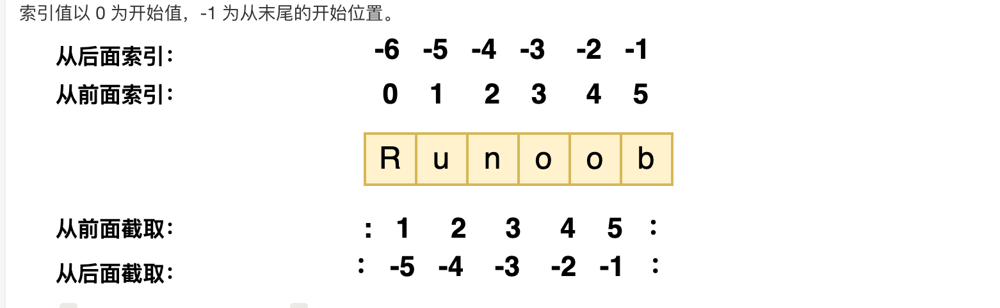

# 1. 基础语法

## 1.1. 编码方式

```python
#!/usr/bin/env python3
# -*- coding: utf-8 -*-
```

第一行注释是为了告诉Linux/OS X系统，这是一个Python可执行程序，Windows系统会忽略这个注释；

第二行注释是为了告诉Python解释器，按照UTF-8编码读取源代码，否则，你在源代码中写的中文输出可能会有乱码。

## 1.2. python编码方式

Python中默认的编码格式是 ASCII （一个字节）格式，在没修改编码格式时无法正确打印汉字，所以在读取中文时会报错。所以需要修改为utf-8

## 1.3. 标识符

- 第一个字符必须是字母表中字母或下划线 _ ，不能是数字！
- 标识符的其他的部分由字母、数字和下划线组成。
- 标识符对大小写敏感。

## 1.4. python保留字

这些保留字不能用作常数或变数，或任何其他标识符名称。

```python
╰─$ python
Python 3.11.13 | packaged by conda-forge | (main, Jun  4 2025, 14:48:23) [GCC 13.3.0] on linux
Type "help", "copyright", "credits" or "license" for more information.
>>> import keyword
>>> keyword.kwlist
['False', 'None', 'True', 'and', 'as', 'assert', 'async', 'await', 'break', 'class', 'continue', 'def', 'del', 'elif', 'else', 'except', 'finally', 'for', 'from', 'global', 'if', 'import', 'in', 'is', 'lambda', 'nonlocal', 'not', 'or', 'pass', 'raise', 'return', 'try', 'while', 'with', 'yield']
>>> 
```

## 1.5. 注释

注意：嵌套多行注释会导致语法错误

```python
#!/usr/bin/python3
 
# 第一个注释
# 第二个注释
 
'''
第三注释
第四注释
'''
 
"""
第五注释
第六注释
"""
print ("Hello, Python!")
```

## 1.6. 行与缩进

python的语法结构与缩进有关，所以缩进很重要

```python
def test():
    print("Test function executed")

if __name__ == "__main__":
    test()
```

## 1.7. 多行语句

使用 "/" 来实现

## 1.8. 输入

```python
#!/usr/bin/python3
 
input("\n\n按下 enter 键后退出。")
```

以上代码中 ，\n\n 在结果输出前会输出两个新的空行。一旦用户按下 enter 键时，程序将退出。

## 1.9. 输出

### 1.9.1. end 关键字

```python
#!/usr/bin/python3
a, b = 0, 1
while b < 1000:
    print(b, end=',')
    a, b = b, a+b
```

## 1.11. 编程方式

### 1.11.1. 交互式

终端交互式编程

```shell
╰─$ python
Python 3.10.12 (main, Aug 15 2025, 14:32:43) [GCC 11.4.0] on linux
Type "help", "copyright", "credits" or "license" for more information.
>>> print("hello world!")
hello world!
```

### 1.11.2. 脚本式

先编写完整的程序再一次执行。

```python
def main():
    print("Hello from python-learn!")


if __name__ == "__main__":
    main()
```

# 2. 基本数据类型

## 2.1. 标准数据类型

Python3 中常见的数据类型有：

- Number（数字）
- String（字符串）
- bool（布尔类型）
- List（列表）
- Tuple（元组）
- Set（集合）
- Dictionary（字典）

Python3 的六个标准数据类型中：

- 不可变数据（3 个）：Number（数字）、String（字符串）、Tuple（元组）；
- 可变数据（3 个）：List（列表）、Dictionary（字典）、Set（集合）。

## 2.2. 数字

- Python3 支持 int、float、bool、complex（复数）。
- 内置的 **type()** 函数可以用来查询变量所指的对象类型。
- 可以用**isinstance**来判断是什么数据类型

**注意：Python3 中，bool 是 int 的子类，True 和 False 可以和数字相加， True==1、False==0 会返回 True，但可以通过 is 来判断类型。**

- 长整型也可以使用小写 l，但是还是建议您使用大写 L，避免与数字 1 混淆。Python使用 L 来显示长整型。
- Python 还支持复数，复数由实数部分和虚数部分构成，可以用 a + bj,或者 complex(a,b) 表示， 复数的实部 a 和虚部 b 都是浮点型。

### 2.2.1. 数值运算

- Python 还支持复数，复数由实数部分和虚数部分构成，可以用 a + bj，或者 complex(a,b) 表示， 复数的实部 a 和虚部 b 都是浮点型。

```python
>>> 5 + 4  # 加法
9
>>> 4.3 - 2 # 减法
2.3
>>> 3 * 7  # 乘法
21
>>> 2 / 4  # 除法，得到一个浮点数
0.5
>>> 2 // 4 # 除法，得到一个整数
0
>>> 17 % 3 # 取余 
2
>>> 2 ** 5 # 乘方
32
```

## 2.3. 字符串

- Python中的字符串用单引号 ' 或双引号 " 括起来，同时使用反斜杠 \ 转义特殊字符。
- 加号 + 是字符串的连接符， 星号 * 表示复制当前字符串

### 2.3.1. 索引



### 2.3.2. 注意

注意：

- 1、反斜杠可以用来转义，使用r可以让反斜杠不发生转义。
- 2、字符串可以用+运算符连接在一起，用*运算符重复。
- 3、Python中的字符串有两种索引方式，从左往右以0开始，从右往左以-1开始。
- 4、Python中的字符串不能改变。

### 2.3.3. 转义

```markdown
\：反斜杠本身。如果你想在字符串中表示一个反斜杠，你需要使用两个反斜杠 \\。
\'：单引号。这在你想在单引号包围的字符串中包含一个单引号时很有用。
\"：双引号。这在你想在双引号包围的字符串中包含一个双引号时很有用。
\n：换行符。它会在字符串中插入一个新行。
\r：回车符。
\t：制表符（Tab）。
\b：退格符。
\f：换页符。
\v：垂直制表符。
```

## 2.4. bool类型

布尔类型特点：

- 布尔类型只有两个值：True 和 False。
- bool 是 int 的子类，因此布尔值可以被看作整数来使用，其中 True 等价于 1。
- 布尔类型可以和其他数据类型进行比较，比如数字、字符串等。在比较时，Python 会将 True 视为 1，False 视为 0。
- 布尔类型可以和逻辑运算符一起使用，包括 and、or 和 not。这些运算符可以用来组合多个布尔表达式，生成一个新的布尔值。
- 布尔类型也可以被转换成其他数据类型，比如整数、浮点数和字符串。在转换时，True 会被转换成 1，False 会被转换成 0。
- 可以使用 `bool()` 函数将其他类型的值转换为布尔值。以下值在转换为布尔值时为 `False`：`None`、`False`、零 (`0`、`0.0`、`0j`)、空序列（如 `''`、`()`、`[]`）和空映射（如 `{}`）。其他所有值转换为布尔值时均为 `True`。

## 2.5. list（列表）

- 列表可以完成大多数集合类的数据结构实现。列表中元素的类型可以不相同，它支持数字，字符串甚至可以包含列表（所谓嵌套）。列表是写在方括号 [] 之间、用逗号分隔开的元素列表。 
- 加号 + 是列表连接运算符，星号 * 是重复操作。（这个地方可以类比字符串）

### 2.5.1. 索引

* 通列表一样

### 2.5.2. 注意

注意：

- 1、列表写在方括号之间，元素用逗号隔开。
- 2、和字符串一样，列表可以被索引和切片。
- 3、列表可以使用 + 操作符进行拼接。
- 4、列表中的元素是可以改变的。

## 2.6. Tuple（元组）

- 元组（tuple）与列表类似，不同之处在于元组的元素不能修改。元组写在小括号 () 里，元素之间用逗号隔开。
- 如果你想创建只有一个元素的元组，需要注意在元素后面添加一个逗号，以区分它是一个元组而不是一个普通的值，这是因为在没有逗号的情况下，Python会将括号解释为数学运算中的括号，而不是元组的表示。

```python
tup1 = ()    # 空元组
tup2 = (20,) # 一个元素，需要在元素后添加逗号
```

### 2.6.1. 例子

```python
#!/usr/bin/python3

tuple = ( 'abcd', 786 , 2.23, 'runoob', 70.2  )
tinytuple = (123, 'runoob')

print (tuple)             # 输出完整元组
print (tuple[0])          # 输出元组的第一个元素
print (tuple[1:3])        # 输出从第二个元素开始到第三个元素
print (tuple[2:])         # 输出从第三个元素开始的所有元素
print (tinytuple * 2)     # 输出两次元组
print (tuple + tinytuple) # 连接元组
```

以上实例输出结果：

```plain
('abcd', 786, 2.23, 'runoob', 70.2)
abcd
(786, 2.23)
(2.23, 'runoob', 70.2)
(123, 'runoob', 123, 'runoob')
('abcd', 786, 2.23, 'runoob', 70.2, 123, 'runoob')
```

### 2.6.2. 注意

注意：

- 1、与字符串一样，元组的元素不能修改。
- 2、元组也可以被索引和切片，方法一样。
- 3、注意构造包含 0 或 1 个元素的元组的特殊语法规则。
- 4、元组也可以使用 + 操作符进行拼接。

## 2.7. 集合

- Python 中的集合（Set）是一种无序、可变的数据类型，用于存储唯一的元素。
- 集合中的元素不会重复，并且可以进行交集、并集、差集等常见的集合操作。
- 在 Python 中，集合使用大括号 **{}** 表示，元素之间用逗号 **,** 分隔。
- 另外，也可以使用 **set()** 函数创建集合。
- **注意：**创建一个空集合必须用 **set()** 而不是 **{ }**，因为 **{ }** 是用来创建一个空字典。

创建格式：

```python
parame = {value01,value02,...}
或者
set(value)
```

## 2.8. 字典

- 列表是有序的对象集合，字典是无序的对象集合。两者之间的区别在于：字典当中的元素是通过键来存取的，而不是通过偏移存取。
- 键(key)必须使用不可变类型。
- 在同一个字典中，键(key)必须是唯一的。
- {x: x**2 for x in (2, 4, 6)} 该代码使用的是字典推导式，
- 构造函数 dict() 可以直接从键值对序列中构建字典如下：

```python
>>> dict([('Runoob', 1), ('Google', 2), ('Taobao', 3)])
{'Runoob': 1, 'Google': 2, 'Taobao': 3}
>>> {x: x**2 for x in (2, 4, 6)}
{2: 4, 4: 16, 6: 36}
>>> dict(Runoob=1, Google=2, Taobao=3)
{'Runoob': 1, 'Google': 2, 'Taobao': 3}
```

### 2.8.1. 例子

```python
#!/usr/bin/python3

dict = {}
dict['one'] = "1 - 菜鸟教程"
dict[2]     = "2 - 菜鸟工具"

tinydict = {'name': 'runoob','code':1, 'site': 'www.runoob.com'}


print (dict['one'])       # 输出键为 'one' 的值
print (dict[2])           # 输出键为 2 的值
print (tinydict)          # 输出完整的字典
print (tinydict.keys())   # 输出所有键
print (tinydict.values()) # 输出所有值
```

以上实例输出结果：

```plain
1 - 菜鸟教程
2 - 菜鸟工具
{'name': 'runoob', 'code': 1, 'site': 'www.runoob.com'}
dict_keys(['name', 'code', 'site'])
dict_values(['runoob', 1, 'www.runoob.com'])
```

### 2.8.2. 注意

注意：

- 1、字典是一种映射类型，它的元素是键值对。
- 2、字典的关键字必须为不可变类型，且不能重复。
- 3、创建空字典使用 { }。

## 2.9. bites类型

- 在 Python3 中，bytes 类型表示的是不可变的二进制序列（byte sequence）。
- bytes 类型中的元素是整数值（0 到 255 之间的整数），而不是 Unicode 字符。
- bytes 类型通常用于处理二进制数据，比如图像文件、音频文件、视频文件等等。在网络编程中，也经常使用 bytes 类型来传输二进制数据。
- 创建 bytes 对象的方式有多种，最常见的方式是使用 b 前缀：

```python
x = bytes("hello", encoding="utf-8")
x = b"hello"
y = x[1:3]  # 切片操作，得到 b"el"
z = x + b"world"  # 拼接操作，得到 b"helloworld"
```

## 2.10. python数据类型转换

### 2.10.1. 隐示转换（自动类型转换）

1. **算术运算中的转换**：

- 当不同类型的数值（如整数和浮点数）进行算术运算时，Python会将整数转换为浮点数，以确保运算的精确性。

```python
python
result = 5 + 3.2  # 整数5被隐式转换为浮点数5.0，结果是8.2
```

1. **布尔值与数值运算**：

- 布尔值在算术运算中会被转换为整数，`True`转换为`1`，`False`转换为`0`。

```python
python
result = True + 2  # True被转换为1，结果是3
```

1. **字符串与其他类型的拼接**：

- 虽然Python不允许直接将非字符串类型与字符串进行拼接，但某些情况下（如使用`format`方法或f-string），隐式转换会发生在字符串格式化过程中。不过，直接的`+`拼接会导致`TypeError`，需要使用`str()`显式转换。

```python
python
# 直接拼接会报错
# result = "The number is " + 5  # TypeError
 
# 使用f-string或format方法进行隐式处理（在内部处理）
result = f"The number is {5}"  # 正确，5被隐式转换为字符串
# 或者
result = "The number is {}".format(5)  # 正确，5被隐式处理为字符串
```

1. **比较运算中的转换**：

- 在比较不同类型的对象时，Python会尝试进行隐式转换以使它们可比较。例如，比较数值和字符串通常会导致`TypeError`，但在某些特定情况下（如所有操作数均可转换为数值时），可能会进行隐式转换（不过这种情况较少且依赖于具体实现和上下文）。
- 更常见的是，不同类型的对象（如整数和浮点数）在比较时会被视为可比较，因为Python内部有处理这种比较的机制。

### 2.10.2. 显示转换

数据类型的转换，你只需要将数据类型作为函数名即可。

以下几个内置的函数可以执行数据类型之间的转换。这些函数返回一个新的对象，表示转换的值。

| 函数                                                         | 描述                                                |
| ------------------------------------------------------------ | --------------------------------------------------- |
| [int(x [,base\])](https://www.runoob.com/python3/python-func-int.html) | 将x转换为一个整数                                   |
| [float(x)](https://www.runoob.com/python3/python-func-float.html) | 将x转换到一个浮点数                                 |
| [complex(real [,imag\])](https://www.runoob.com/python3/python-func-complex.html) | 创建一个复数                                        |
| [str(x)](https://www.runoob.com/python3/python-func-str.html) | 将对象 x 转换为字符串                               |
| [repr(x)](https://www.runoob.com/python3/python-func-repr.html) | 将对象 x 转换为表达式字符串                         |
| [eval(str)](https://www.runoob.com/python3/python-func-eval.html) | 用来计算在字符串中的有效Python表达式,并返回一个对象 |
| [tuple(s)](https://www.runoob.com/python3/python3-func-tuple.html) | 将序列 s 转换为一个元组                             |
| [list(s)](https://www.runoob.com/python3/python3-att-list-list.html) | 将序列 s 转换为一个列表                             |
| [set(s)](https://www.runoob.com/python3/python-func-set.html) | 转换为可变集合                                      |
| [dict(d)](https://www.runoob.com/python3/python-func-dict.html) | 创建一个字典。d 必须是一个 (key, value)元组序列。   |
| [frozenset(s)](https://www.runoob.com/python3/python-func-frozenset.html) | 转换为不可变集合                                    |
| [chr(x)](https://www.runoob.com/python3/python-func-chr.html) | 将一个整数转换为一个字符                            |
| [ord(x)](https://www.runoob.com/python3/python-func-ord.html) | 将一个字符转换为它的整数值                          |
| [hex(x)](https://www.runoob.com/python3/python-func-hex.html) | 将一个整数转换为一个十六进制字符串                  |
| [oct(x)](https://www.runoob.com/python3/python-func-oct.html) | 将一个整数转换为一个八进制字符串                    |

# 3. 运算符

## 3.1. Python算术运算符

以下假设变量 a=10，变量 b=21：

| 运算符 | 描述                                            | 实例                      |
| ------ | ----------------------------------------------- | ------------------------- |
| +      | 加 - 两个对象相加                               | a + b 输出结果 31         |
| -      | 减 - 得到负数或是一个数减去另一个数             | a - b 输出结果 -11        |
| *      | 乘 - 两个数相乘或是返回一个被重复若干次的字符串 | a * b 输出结果 210        |
| /      | 除 - x 除以 y                                   | b / a 输出结果 2.1        |
| %      | 取模 - 返回除法的余数                           | b % a 输出结果 1          |
| **     | 幂 - 返回x的y次幂                               | a**b 为10的21次方         |
| //     | 取整除 - 往小的方向取整数                       | `>>> 9//2 4 >>> -9//2 -5` |

## 3.2. Python 比较运算符

以下假设变量 a 为 10，变量 b 为20：

| 运算符 | 描述                                                         | 实例                  |
| ------ | ------------------------------------------------------------ | --------------------- |
| ==     | 等于 - 比较对象是否相等                                      | (a == b) 返回 False。 |
| !=     | 不等于 - 比较两个对象是否不相等                              | (a != b) 返回 True。  |
| >      | 大于 - 返回x是否大于y                                        | (a > b) 返回 False。  |
| <      | 小于 - 返回x是否小于y。所有比较运算符返回1表示真，返回0表示假。这分别与特殊的变量True和False等价。注意，这些变量名的大写。 | (a < b) 返回 True。   |
| >=     | 大于等于 - 返回x是否大于等于y。                              | (a >= b) 返回 False。 |
| <=     | 小于等于 - 返回x是否小于等于y。                              | (a <= b) 返回 True。  |

## 3.3. Python赋值运算符

以下假设变量a为10，变量b为20：

| 运算符 | 描述                                                         | 实例                                                         |
| ------ | ------------------------------------------------------------ | ------------------------------------------------------------ |
| =      | 简单的赋值运算符                                             | c = a + b 将 a + b 的运算结果赋值为 c                        |
| +=     | 加法赋值运算符                                               | c += a 等效于 c = c + a                                      |
| -=     | 减法赋值运算符                                               | c -= a 等效于 c = c - a                                      |
| *=     | 乘法赋值运算符                                               | c *= a 等效于 c = c * a                                      |
| /=     | 除法赋值运算符                                               | c /= a 等效于 c = c / a                                      |
| %=     | 取模赋值运算符                                               | c %= a 等效于 c = c % a                                      |
| **=    | 幂赋值运算符                                                 | c **= a 等效于 c = c ** a                                    |
| //=    | 取整除赋值运算符                                             | c //= a 等效于 c = c // a                                    |
| :=     | 海象运算符，这个运算符的主要目的是在表达式中同时进行赋值和返回赋值的值。Python3.8 版本新增运算符。 | 在这个示例中，赋值表达式可以避免调用 len() 两次:`if (n := len(a)) > 10:    print(f"List is too long ({n} elements, expected <= 10)")` |

海象运算符：

```plain
(variable_name := expression or value)
```

即一个变量名后跟一个表达式或者一个值，这个和赋值运算符 `=` 类似，可以看作是一种新的赋值运算符。

## 3.4. python位运算符

以下假设变量 a 为 10，变量 b 为20：(高位在前）

| 运算符 | 描述                                                         | 实例                                                         |
| ------ | ------------------------------------------------------------ | ------------------------------------------------------------ |
| &      | 按位与运算符：参与运算的两个值,如果两个相应位都为1,则该位的结果为1,否则为0 | (a & b) 输出结果 12 ，二进制解释： 0000 1100                 |
| \|     | 按位或运算符：只要对应的二个二进位有一个为1时，结果位就为1。 | (a \| b) 输出结果 61 ，二进制解释： 0011 1101                |
| ^      | 按位异或运算符：当两对应的二进位相异时，结果为1              | (a ^ b) 输出结果 49 ，二进制解释： 0011 0001                 |
| ~      | 按位取反运算符：对数据的每个二进制位取反,即把1变为0,把0变为1。~x 类似于 -x-1 | (~a ) 输出结果 -61 ，二进制解释： 1100 0011， 在一个有符号二进制数的补码形式。 |
| <<     | 左移动运算符：运算数的各二进位全部左移若干位，由"<<"右边的数指定移动的位数，高位丢弃，低位补0。 | a << 2 输出结果 240 ，二进制解释： 1111 0000                 |
| >>     | 右移动运算符：把">>"左边的运算数的各二进位全部右移若干位，">>"右边的数指定移动的位数 | a >> 2 输出结果 15 ，二进制解释： 0000 1111                  |

## 3.5. Python逻辑运算符

Python语言支持逻辑运算符，以下假设变量 a 为 10, b为 20:

| 运算符 | 逻辑表达式 | 描述                                                         | 实例                    |
| ------ | ---------- | ------------------------------------------------------------ | ----------------------- |
| and    | x and y    | 布尔"与" - 如果 x 为 False，x and y 返回 x 的值，否则返回 y 的计算值。 | (a and b) 返回 20。     |
| or     | x or y     | 布尔"或" - 如果 x 是 True，它返回 x 的值，否则它返回 y 的计算值。 | (a or b) 返回 10。      |
| not    | not x      | 布尔"非" - 如果 x 为 True，返回 False 。如果 x 为 False，它返回 True。 | not(a and b) 返回 False |

## 3.6. Python成员运算符

除了以上的一些运算符之外，Python还支持成员运算符，测试实例中包含了一系列的成员，包括字符串，列表或元组。

| 运算符 | 描述                                                    | 实例                                              |
| ------ | ------------------------------------------------------- | ------------------------------------------------- |
| in     | 如果在指定的序列中找到值返回 True，否则返回 False。     | x 在 y 序列中 , 如果 x 在 y 序列中返回 True。     |
| not in | 如果在指定的序列中没有找到值返回 True，否则返回 False。 | x 不在 y 序列中 , 如果 x 不在 y 序列中返回 True。 |

## 3.7. Python身份运算符（判断是否是某一个类型）

身份运算符用于比较两个对象的存储单元，判断两个变量（标识符）是不是英勇的同一个对象！）

| 运算符 | 描述                                        | 实例                                                         |
| ------ | ------------------------------------------- | ------------------------------------------------------------ |
| is     | is 是判断两个标识符是不是引用自一个对象     | x is y, 类似 id(x) == id(y) , 如果引用的是同一个对象则返回 True，否则返回 False |
| is not | is not 是判断两个标识符是不是引用自不同对象 | x is not y ， 类似 id(x) != id(y)。如果引用的不是同一个对象则返回结果 True，否则返回 False。 |

- 注： [id()](https://www.runoob.com/python/python-func-id.html) 函数用于获取对象内存地址。

# 4. 条件控制

## 4.1. if else


```markdown
if 判断条件1:
    执行语句1……
elif 判断条件2:
    执行语句2……
elif 判断条件3:
    执行语句3……
else:
    执行语句4……
```

## 4.2. match...case（类似于c的Switch case）

Python 3.10 增加了 match...case 的条件判断，不需要再使用一连串的 if-else 来判断了。

match 后的对象会依次与 case 后的内容进行匹配，如果匹配成功，则执行匹配到的表达式，否则直接跳过，_ 可以匹配一切。

语法格式如下：

```plain
match subject:
    case <pattern_1>:
        <action_1>
    case <pattern_2>:
        <action_2>
    case <pattern_3>:
        <action_3>
    case _:
        <action_wildcard>
```

示例

```python
test_num = 1

match test_num:
    case 1:
        print("1")
    case 2:
        print("2")
    case _:
        print("other")
```

# 5. 循环语句

循环语句用于重复执行一段代码，直到满足某个条件为止。Python 中主要的循环语句有 `while` 和 `for`。本节先介绍 `while` 循环。

---

## 5.1. while循环

`while` 循环会在条件表达式为真（True）时重复执行循环体内的语句，直到条件变为假（False）时退出循环。

语法格式：

```python
while 条件表达式:
    循环体语句
```

> 注意：循环体必须缩进（通常为 4 个空格），这是 Python 语法的要求。

执行流程：

1. 判断条件表达式是否为真。
2. 如果为真，执行循环体语句，然后回到步骤 1。
3. 如果为假，退出循环，继续执行后续代码。

```python
#!/usr/bin/python3

count = 0
while count < 5:
    print(count, "小于 5")
    count += 1  # 等价于 count = count + 1

print("循环结束，count =", count)
```


## 5.2. while 循环使用 else 语句

如果 while 后面的条件语句为 false 时，则执行 else 的语句块。

语法格式如下：

```plain
while <expr>:
    <statement(s)>
else:
    <additional_statement(s)>
```

示例：

```python
#!/usr/bin/python3
 
count = 0
while count < 5:
   print (count, " 小于 5")
   count = count + 1
else:
   print (count, " 大于或等于 5")
```

## 5.3. 简单语句组(主要是简化代码）

类似 if 语句的语法，如果你的 while 循环体中只有一条语句，你可以将该语句与 while 写在同一行中， 如下所示：

```python
#!/usr/bin/python
 
flag = 1
 
while (flag): print ('欢迎访问菜鸟教程!')
 
print ("Good bye!")
```

注意：以上的无限循环你可以使用 CTRL+C 来中断循环。

执行以上脚本，输出结果如下：

```plain
欢迎访问菜鸟教程!
欢迎访问菜鸟教程!
欢迎访问菜鸟教程!
欢迎访问菜鸟教程!
欢迎访问菜鸟教程!
……
```

## 5.4. for循环语句

- Python for 循环可以遍历任何可迭代对象，如一个列表或者一个字符串。

```python
for <variable> in <sequence>:
    <statements>
else:
    <statements>
#!/usr/bin/python3
 
word = 'runoob'
 
for letter in word:
    print(letter)


#!/usr/bin/python3
 
#  1 到 5 的所有数字：
for number in range(1, 6):
    print(number)
```


## 5.5. for...else

- 在 Python 中，for...else 语句用于在循环结束后执行一段代码。
- 使用break会直接跳出循环，不会执行else

语法格式如下：

```plain
for item in iterable:
    # 循环主体
else:
    # 循环结束后执行的代码
```

## 5.6. range() 函数(注意是从0开始的）

- 遍历数字序列，可以使用内置 range() 函数。它会生成数列，例如:

```python
>>>for i in range(5):
...     print(i)
...
0
1
2
3
4
```

## 5.7. break 和 continue 语句及循环中的 else 子句

break 语句可以跳出 for 和 while 的循环体。如果你从 for 或 while 循环中终止，任何对应的循环 else 块将不执行。

continue 语句被用来跳过当前循环块中的剩余语句，然后继续进行下一轮循环。

## 5.8. pass 语句

Python pass是空语句，是为了保持程序结构的完整性，有些情况不能直接为空

pass 不做任何事情，一般用做占位语句。

```python
def add(a, b):
    pass


def sub(a, b):
    pass
```

# 6. 推导式（从一个数据序列构建一个新的数据序列）

- Python 推导式是一种独特的数据处理方式，可以**从一个数据序列构建另一个新的数据序列的结构体**。

Python 支持各种数据结构的推导式：

- 列表(list)推导式
- 字典(dict)推导式
- 集合(set)推导式
- 元组(tuple)推导式

## 6.1. 列表推导式

```python
[表达式 for 变量 in 列表] 
[out_exp_res for out_exp in input_list]

或者 

[表达式 for 变量 in 列表 if 条件]
[out_exp_res for out_exp in input_list if condition]
```

- out_exp_res：列表生成元素表达式，可以是有返回值的函数。
- for out_exp in input_list：迭代 input_list 将 out_exp 传入到 out_exp_res 表达式中。
- if condition：条件语句，可以过滤列表中不符合条件的值。

```python
# 列表推导式
new_list = [i for i in range(10)]
print(new_list)
```

## 6.2. 字典推导式

```python
{ key_expr: value_expr for value in collection }

或

{ key_expr: value_expr for value in collection if condition }
listdemo = ['Google','Runoob', 'Taobao']
# 将列表中各字符串值为键，各字符串的长度为值，组成键值对
>>> newdict = {key:len(key) for key in listdemo}
>>> newdict
{'Google': 6, 'Runoob': 6, 'Taobao': 6}
```

[详细链接](https://www.runoob.com/python3/python-comprehensions.html)

## 6.3. 集合推导式

```python
# 集合推导式

# 生成一个集合
a = {x for x in 'abracadabra' if x not in 'abc'}
print(a)  # {'r', 'd'}
```

## 6.4. 元组推导式

```python
>>> a = (x for x in range(1,10))
>>> a
<generator object <genexpr> at 0x7faf6ee20a50>  # 返回的是生成器对象

>>> tuple(a)       # 使用 tuple() 函数，可以直接将生成器对象转换成元组
(1, 2, 3, 4, 5, 6, 7, 8, 9)
```

# 7. 迭代器和生成器

## 7.1. 迭代器

- 迭代器有两个基本的方法：iter() 和 next()。
- 迭代是 Python 最强大的功能之一，是访问集合元素的一种方式。
- 字符串，列表或元组对象都可用于创建迭代器：

### 7.1.1. 示例(迭代器）

```python
>>> list=[1,2,3,4]
>>> it = iter(list)    # 创建迭代器对象
>>> print (next(it))   # 输出迭代器的下一个元素
1
>>> print (next(it))
2
>>>
```

### 7.1.2. 示例（使用next方法）

```python
#!/usr/bin/python3
 
import sys         # 引入 sys 模块
 
list=[1,2,3,4]
it = iter(list)    # 创建迭代器对象
 
while True:
    try:
        print (next(it))
    except StopIteration:
        sys.exit()
```

## 7.2. 创建一个迭代器

- 把一个类作为一个迭代器使用需要在类中实现两个方法 __iter__() 与 __next__() 。
- **__iter__()** 方法返回一个特殊的迭代器对象， 这个迭代器对象实现了 __next__() 方法并通过 StopIteration 异常标识迭代的完成。__next__() 方法（Python 2 里是 next()）会返回下一个迭代器对象。

### 7.2.1. 示例

```python
class MyNumbers:
  def __iter__(self):
    self.a = 1
    return self
 
  def __next__(self):
    x = self.a
    self.a += 1
    return x
 
myclass = MyNumbers()
myiter = iter(myclass)
 
print(next(myiter))
print(next(myiter))
print(next(myiter))
print(next(myiter))
print(next(myiter))
```

## 7.3. StopIteration（防止出现无限循环）给出一个条件，不满住就raise StopIteration

中断迭代，防止出现无限循环的情况

### 7.3.1. 示例

在迭代20次后停止迭代

```python
class MyNumbers:
  def __iter__(self):
    self.a = 1
    return self
 
  def __next__(self):
    if self.a <= 20:
      x = self.a
      self.a += 1
      return x
    else:
      raise StopIteration
 
myclass = MyNumbers()
myiter = iter(myclass)
 
for x in myiter:
  print(x)
```


## 7.4. 生成器（yield ）（使用yield+next）-------在大模型对话中可以实现流式返回

- 生成器的函数里面要有yield 来实现暂停函数并返回数值。
- yield 是一个关键字，用于定义生成器函数，生成器函数是一种特殊的函数，可以在迭代过程中逐步产生值，而不是一次性返回所有结果。
- 当在生成器函数中使用 yield 语句时，函数的执行将会暂停，并将 yield 后面的表达式作为当前迭代的值返回。

### 7.4.1. 示例

```python
def countdown(n):
    while n > 0:
        yield n
        n -= 1
 
# 创建生成器对象
generator = countdown(5)
 
# 通过迭代生成器获取值
print(next(generator))  # 输出: 5
print(next(generator))  # 输出: 4
print(next(generator))  # 输出: 3
 
# 使用 for 循环迭代生成器
for value in generator:
    print(value)  # 输出: 2 1
```

# 8. Python3 函数

## 8.1. 函数基础

### 8.1.1. 什么是函数

函数是组织好的、可重复使用的、用来实现单一或相关联功能的代码段。

**函数的优点：**

- 提高代码的**模块性**和**可维护性**
- 提高代码的**重复利用率**，避免重复编写相同代码
- 提高代码的**可读性**，使程序结构更清晰
- 方便**测试和调试**

Python 提供了许多内建函数（如 `print()`、`len()`、`type()` 等），同时也支持自定义函数。

### 8.1.2. 函数定义

**基本语法：**

```python
def 函数名(参数列表):
    """文档字符串（可选）"""
    函数体
    return 返回值  # 可选
```

**定义规则：**

1. 使用 `def` 关键字开头，后接函数名和圆括号 `()`
2. 函数名遵循标识符命名规则（字母、数字、下划线，不能以数字开头）
3. 参数列表放在圆括号中，多个参数用逗号分隔
4. 函数的第一行可以使用文档字符串（docstring）描述函数功能
5. 函数体以冒号 `:` 开始，并且需要缩进
6. `return` 语句用于返回值，可选；不带 `return` 或 `return` 后无表达式则返回 `None`

**示例：**

```python
def greet(name):
    """向指定的人打招呼"""
    message = f"你好, {name}!"
    return message

def calculate_area(length, width):
    """计算矩形面积"""
    area = length * width
    return area

# 无返回值的函数
def print_info(text):
    """打印信息"""
    print(text)
    # 没有 return 语句，默认返回 None
```

### 8.1.3. 函数调用

定义函数后，通过函数名加括号来调用函数，需要传入对应的参数。

```python
# 定义函数
def greet(name):
    """向指定的人打招呼"""
    return f"你好, {name}!"

# 调用函数
message = greet("张三")
print(message)  # 输出: 你好, 张三!

# 多次调用
print(greet("李四"))  # 输出: 你好, 李四!
print(greet("王五"))  # 输出: 你好, 王五!
```

### 8.1.4. 返回值

**单个返回值：**

```python
def add(a, b):
    """返回两个数的和"""
    return a + b

result = add(3, 5)
print(result)  # 输出: 8
```

**多个返回值（返回元组）：**

```python
def get_user_info():
    """返回用户信息"""
    name = "张三"
    age = 25
    city = "北京"
    return name, age, city  # 实际返回一个元组

# 接收返回值
name, age, city = get_user_info()
print(f"{name}, {age}岁, 来自{city}")

# 也可以作为元组接收
info = get_user_info()
print(info)  # 输出: ('张三', 25, '北京')
```

**无返回值：**

```python
def print_message(msg):
    """打印消息，无返回值"""
    print(msg)
    # 没有return，默认返回 None

result = print_message("Hello")
print(result)  # 输出: None
```

## 8.2. 参数传递机制

### 8.2.1. Python 中的对象和变量

在理解参数传递之前，需要先理解 Python 中的对象和变量：

- 在 Python 中，**类型属于对象**，而**变量没有类型**
- 变量只是对象的引用（类似指针），可以指向不同类型的对象

```python
a = [1, 2, 3]   # a 指向一个 List 对象
a = "Hello"     # a 现在指向一个 String 对象
```

### 8.2.2. 可变对象与不可变对象

Python 中的对象分为两类：

| 类型           | 对象类型                                            | 特点                               |
| -------------- | --------------------------------------------------- | ---------------------------------- |
| **不可变对象** | `int`、`float`、`str`、`tuple`、`bool`、`frozenset` | 对象内容不可修改，修改会创建新对象 |
| **可变对象**   | `list`、`dict`、`set`、自定义类对象                 | 对象内容可以修改，对象地址不变     |

**不可变对象示例：**

```python
a = 5
print(id(a))  # 输出内存地址，例如：140234567890

a = 10        # 创建新对象，a 指向新地址
print(id(a))  # 输出不同的内存地址
```

**可变对象示例：**

```python
lst = [1, 2, 3]
print(id(lst))   # 输出内存地址

lst[0] = 100     # 修改列表内容
print(id(lst))   # 地址不变，还是同一个对象
```

### 8.2.3. 参数传递方式

Python 采用**"传对象引用"**的方式（既不是值传递，也不是引用传递）：

- 传递的是对象的引用（地址）
- 函数内部得到的是原对象的引用
- 是否影响原对象取决于对象是否可变

**传递不可变对象（类似值传递）：**

```python
def modify_number(x):
    print(f"函数内部修改前: x = {x}, id = {id(x)}")
    x = 100  # 创建新对象，x 指向新地址
    print(f"函数内部修改后: x = {x}, id = {id(x)}")

a = 10
print(f"函数调用前: a = {a}, id = {id(a)}")
modify_number(a)
print(f"函数调用后: a = {a}, id = {id(a)}")  # a 不变
```

**输出：**

```
函数调用前: a = 10, id = 140234567890
函数内部修改前: x = 10, id = 140234567890
函数内部修改后: x = 100, id = 140234568000
函数调用后: a = 10, id = 140234567890
```

**传递可变对象（类似引用传递）：**

```python
def modify_list(lst):
    print(f"函数内部修改前: lst = {lst}, id = {id(lst)}")
    lst.append(4)  # 修改原对象
    print(f"函数内部修改后: lst = {lst}, id = {id(lst)}")

my_list = [1, 2, 3]
print(f"函数调用前: my_list = {my_list}, id = {id(my_list)}")
modify_list(my_list)
print(f"函数调用后: my_list = {my_list}, id = {id(my_list)}")  # my_list 被修改
```

**输出：**

```
函数调用前: my_list = [1, 2, 3], id = 140234567890
函数内部修改前: lst = [1, 2, 3], id = 140234567890
函数内部修改后: lst = [1, 2, 3, 4], id = 140234567890
函数调用后: my_list = [1, 2, 3, 4], id = 140234567890
```

### 8.2.4. 避免修改可变参数

如果不想在函数内部修改原对象，可以使用拷贝：

**浅拷贝：**

```python
def modify_list_safely(lst):
    local_lst = lst.copy()  # 或 lst[:]
    local_lst.append(4)
    return local_lst

my_list = [1, 2, 3]
new_list = modify_list_safely(my_list)
print(f"原列表: {my_list}")    # 输出: [1, 2, 3]
print(f"新列表: {new_list}")   # 输出: [1, 2, 3, 4]
```

**深拷贝（处理嵌套结构）：**

```python
import copy

def modify_nested_list(lst):
    local_lst = copy.deepcopy(lst)
    local_lst[0][0] = 999
    return local_lst

my_list = [[1, 2], [3, 4]]
new_list = modify_nested_list(my_list)
print(f"原列表: {my_list}")    # 输出: [[1, 2], [3, 4]]
print(f"新列表: {new_list}")   # 输出: [[999, 2], [3, 4]]
```

## 8.3. 函数参数类型

Python 函数支持多种参数类型，可以灵活组合使用。

### 8.3.1. 位置参数（必需参数）

位置参数是最常见的参数类型，调用时必须按照定义的顺序传递，且数量必须匹配。

```python
def greet(name, age):
    """必须传入两个参数，且顺序要对应"""
    print(f"{name} 今年 {age} 岁")

greet("张三", 25)      # 正确
greet(25, "张三")      # 错误：参数顺序不对
# greet("张三")        # 错误：缺少参数
# greet("张三", 25, 30) # 错误：参数过多
```

### 8.3.2. 关键字参数

使用关键字参数调用函数时，可以不按照参数定义的顺序传递。

```python
def introduce(name, age, city):
    print(f"我是{name}，{age}岁，来自{city}")

# 使用关键字参数，顺序可以任意
introduce(age=25, city="北京", name="张三")
introduce(name="李四", city="上海", age=30)

# 混合使用位置参数和关键字参数（位置参数必须在前）
introduce("王五", age=28, city="广州")
```

**注意事项：**

- 关键字参数必须在位置参数之后
- 同一个参数不能同时用位置和关键字方式传递

```python
# 错误示例
# introduce(name="张三", 25, "北京")  # 关键字参数在位置参数前
# introduce("张三", 25, name="李四")  # name 被传递两次
```

### 8.3.3. 默认参数

为参数设置默认值，调用时可以不传递该参数。

```python
def greet(name, greeting="你好"):
    """greeting 有默认值，可以不传"""
    print(f"{greeting}, {name}!")

greet("张三")              # 使用默认值：你好, 张三!
greet("李四", "早上好")     # 使用指定值：早上好, 李四!
greet("王五", greeting="晚上好")  # 使用关键字参数
```

**注意事项：**

1. **默认参数必须在位置参数之后**
2. **默认参数不要使用可变对象**（重要！）

```python
# ❌ 错误示例：使用可变对象作为默认参数
def add_item(item, lst=[]):
    lst.append(item)
    return lst

print(add_item("a"))  # ['a']
print(add_item("b"))  # ['a', 'b'] ← 问题：默认列表被复用了！

# ✅ 正确做法
def add_item(item, lst=None):
    if lst is None:
        lst = []
    lst.append(item)
    return lst

print(add_item("a"))  # ['a']
print(add_item("b"))  # ['b'] ← 正确
```

### 8.3.4. 可变参数（*args）

使用 `*args` 接收任意数量的位置参数，参数以**元组**形式传入。

```python
def sum_numbers(*numbers):
    """接收任意数量的数字参数"""
    total = 0
    for num in numbers:
        total += num
    return total

print(sum_numbers(1, 2, 3))           # 6
print(sum_numbers(1, 2, 3, 4, 5))     # 15
print(sum_numbers())                   # 0

# 混合使用
def greet(greeting, *names):
    """第一个参数是问候语，后面接任意数量的名字"""
    for name in names:
        print(f"{greeting}, {name}!")

greet("你好", "张三", "李四", "王五")
```

**传递列表给 *args：**

```python
def print_items(*items):
    for item in items:
        print(item)

my_list = [1, 2, 3, 4]
print_items(*my_list)  # 使用 * 解包列表
```

### 8.3.5. 关键字可变参数（**kwargs）

使用 `**kwargs` 接收任意数量的关键字参数，参数以**字典**形式传入。

```python
def print_info(**info):
    """接收任意数量的关键字参数"""
    for key, value in info.items():
        print(f"{key}: {value}")

print_info(name="张三", age=25, city="北京")
# 输出:
# name: 张三
# age: 25
# city: 北京

# 混合使用
def create_user(username, **user_info):
    print(f"用户名: {username}")
    for key, value in user_info.items():
        print(f"{key}: {value}")

create_user("zhangsan", age=25, email="zhangsan@example.com", city="北京")
```

**传递字典给 **kwargs：**

```python
def print_settings(**settings):
    for key, value in settings.items():
        print(f"{key} = {value}")

config = {"host": "localhost", "port": 8080, "debug": True}
print_settings(**config)  # 使用 ** 解包字典
```

### 8.3.6. 参数定义顺序

函数定义时，参数必须按照以下顺序排列：

```python
def function(
    pos1, pos2,           # 1. 位置参数
    *args,                # 2. 可变位置参数
    key1=default1,        # 3. 默认参数（关键字参数）
    **kwargs              # 4. 可变关键字参数
):
    pass
```

**完整示例：**

```python
def complex_function(a, b, *args, x=10, y=20, **kwargs):
    print(f"位置参数: a={a}, b={b}")
    print(f"可变位置参数 *args: {args}")
    print(f"默认参数: x={x}, y={y}")
    print(f"可变关键字参数 **kwargs: {kwargs}")

complex_function(1, 2, 3, 4, 5, x=100, y=200, name="张三", age=25)
# 输出:
# 位置参数: a=1, b=2
# 可变位置参数 *args: (3, 4, 5)
# 默认参数: x=100, y=200
# 可变关键字参数 **kwargs: {'name': '张三', 'age': 25}
```

### 8.3.7. 强制位置参数（/）

Python 3.8+ 支持使用 `/` 指定某些参数必须使用位置方式传递。

```python
def divide(a, b, /):
    """a 和 b 必须用位置参数传递"""
    return a / b

print(divide(10, 2))      # ✅ 正确
# print(divide(a=10, b=2)) # ❌ 错误：不能使用关键字参数
```

### 8.3.8. 强制关键字参数（*）

使用单独的 `*` 指定后面的参数必须使用关键字方式传递。

```python
def greet(name, *, greeting="你好", punctuation="!"):
    """greeting 和 punctuation 必须用关键字参数传递"""
    print(f"{greeting}, {name}{punctuation}")

greet("张三")                                    # ✅ 正确
greet("李四", greeting="早上好")                  # ✅ 正确
greet("王五", greeting="晚上好", punctuation="。") # ✅ 正确
# greet("赵六", "下午好")                         # ❌ 错误
```

### 8.3.9. 完整的参数顺序

```python
def full_example(
    pos_only1, pos_only2, /,        # 1. 仅限位置参数
    pos_or_kw1, pos_or_kw2,         # 2. 位置或关键字参数
    *args,                           # 3. 可变位置参数
    kw_only1, kw_only2=None,        # 4. 仅限关键字参数
    **kwargs                         # 5. 可变关键字参数
):
    pass

# 调用示例
full_example(
    1, 2,                    # pos_only1, pos_only2（必须位置）
    3, 4,                    # pos_or_kw1, pos_or_kw2（位置或关键字）
    5, 6,                    # *args
    kw_only1=7,             # kw_only1（必须关键字）
    kw_only2=8,             # kw_only2（必须关键字）
    extra1=9, extra2=10     # **kwargs
)
```

## 8.4. 匿名函数（Lambda）

### 8.4.1. 什么是 Lambda 函数

Lambda 函数是一种简洁的、匿名的、单行的函数定义方式。

**特点：**

- 使用 `lambda` 关键字定义，不需要 `def`
- 没有函数名（匿名）
- 只能包含一个表达式，不能有多条语句
- 表达式的结果自动作为返回值
- 拥有自己的命名空间，但不能访问参数列表之外的变量

**语法：**

```python
lambda 参数1, 参数2, ... : 表达式
```

### 8.4.2. 基本用法

**普通函数 vs Lambda 函数：**

```python
# 普通函数
def add(x, y):
    return x + y

# Lambda 函数
add_lambda = lambda x, y: x + y

print(add(3, 5))          # 8
print(add_lambda(3, 5))   # 8
```

**多种参数形式：**

```python
# 单个参数
square = lambda x: x ** 2
print(square(5))  # 25

# 多个参数
multiply = lambda x, y, z: x * y * z
print(multiply(2, 3, 4))  # 24

# 无参数
greet = lambda: "Hello, World!"
print(greet())  # Hello, World!

# 默认参数
power = lambda x, n=2: x ** n
print(power(5))      # 25 (5^2)
print(power(5, 3))   # 125 (5^3)
```

### 8.4.3. 常见应用场景

**1. 与内置函数配合使用**

**sorted() 排序：**

```python
# 按字符串长度排序
words = ["apple", "banana", "kiwi", "orange"]
sorted_words = sorted(words, key=lambda x: len(x))
print(sorted_words)  # ['kiwi', 'apple', 'banana', 'orange']

# 按元组第二个元素排序
students = [("张三", 85), ("李四", 92), ("王五", 78)]
sorted_students = sorted(students, key=lambda x: x[1], reverse=True)
print(sorted_students)  # [('李四', 92), ('张三', 85), ('王五', 78)]

# 按字典的值排序
data = {"apple": 3, "banana": 1, "orange": 2}
sorted_items = sorted(data.items(), key=lambda x: x[1])
print(sorted_items)  # [('banana', 1), ('orange', 2), ('apple', 3)]
```

**map() 映射：**

```python
# 将列表中每个元素平方
numbers = [1, 2, 3, 4, 5]
squared = list(map(lambda x: x ** 2, numbers))
print(squared)  # [1, 4, 9, 16, 25]

# 将两个列表对应元素相加
a = [1, 2, 3, 4]
b = [10, 20, 30, 40]
result = list(map(lambda x, y: x + y, a, b))
print(result)  # [11, 22, 33, 44]
```

**filter() 过滤：**

```python
# 过滤出偶数
numbers = [1, 2, 3, 4, 5, 6, 7, 8, 9, 10]
even_numbers = list(filter(lambda x: x % 2 == 0, numbers))
print(even_numbers)  # [2, 4, 6, 8, 10]

# 过滤出长度大于 5 的字符串
words = ["hello", "world", "python", "programming"]
long_words = list(filter(lambda x: len(x) > 5, words))
print(long_words)  # ['python', 'programming']
```

**reduce() 累积：**

```python
from functools import reduce

# 计算列表所有元素的乘积
numbers = [1, 2, 3, 4, 5]
product = reduce(lambda x, y: x * y, numbers)
print(product)  # 120

# 找出列表中的最大值
numbers = [3, 7, 2, 9, 4]
maximum = reduce(lambda x, y: x if x > y else y, numbers)
print(maximum)  # 9
```

**2. 条件表达式：**

```python
# 判断奇偶
check_even = lambda x: "偶数" if x % 2 == 0 else "奇数"
print(check_even(4))  # 偶数
print(check_even(7))  # 奇数

# 找出两个数中的较大值
max_num = lambda a, b: a if a > b else b
print(max_num(10, 20))  # 20
```

**3. 作为函数返回值：**

```python
def make_multiplier(n):
    """返回一个乘以 n 的函数"""
    return lambda x: x * n

multiply_by_2 = make_multiplier(2)
multiply_by_5 = make_multiplier(5)

print(multiply_by_2(10))  # 20
print(multiply_by_5(10))  # 50
```

**4. 在数据结构中使用：**

```python
# 函数字典
operations = {
    "add": lambda x, y: x + y,
    "subtract": lambda x, y: x - y,
    "multiply": lambda x, y: x * y,
    "divide": lambda x, y: x / y if y != 0 else "除数不能为0"
}

print(operations["add"](10, 5))       # 15
print(operations["multiply"](10, 5))  # 50

# 函数列表
functions = [
    lambda x: x + 1,
    lambda x: x * 2,
    lambda x: x ** 2
]

num = 5
for func in functions:
    print(func(num))  # 6, 10, 25
```

### 8.4.4. Lambda vs 普通函数

| 特性       | Lambda 函数          | 普通函数           |
| ---------- | -------------------- | ------------------ |
| 定义方式   | `lambda` 关键字      | `def` 关键字       |
| 函数名     | 匿名（可赋值给变量） | 必须有名字         |
| 函数体     | 只能有一个表达式     | 可以有多条语句     |
| 返回值     | 表达式结果自动返回   | 需要 `return` 语句 |
| 文档字符串 | 不支持               | 支持               |
| 类型注解   | 有限支持             | 完全支持           |
| 适用场景   | 简单的单行操作       | 复杂逻辑           |

**使用建议：**

- ✅ 简单操作（如排序、过滤）使用 Lambda
- ✅ 需要复用但很简单的逻辑使用 Lambda
- ❌ 复杂逻辑、多行代码使用普通函数
- ❌ 需要文档说明的函数使用普通函数

### 8.4.5. Lambda 的限制

Lambda 函数有一些限制，不适合复杂场景：

```python
# ❌ 不能使用多条语句
# result = lambda x: (print(x), x + 1)  # 错误

# ❌ 不能使用复杂的控制流
# check = lambda x: if x > 0: return x  # 错误

# ✅ 可以使用条件表达式（三元运算符）
check = lambda x: x if x > 0 else 0

# ✅ 可以使用简单的表达式
process = lambda x: x.strip().lower() if isinstance(x, str) else x
```

## 8.5. 常用内置函数

Python 提供了许多实用的内置函数：

### 8.7.1. 数学相关

```python
# 绝对值
print(abs(-10))  # 10

# 四舍五入
print(round(3.14159, 2))  # 3.14

# 幂运算
print(pow(2, 3))  # 8

# 最大值、最小值
print(max(1, 5, 3))      # 5
print(min([1, 5, 3]))    # 1

# 求和
print(sum([1, 2, 3, 4]))  # 10
```

### 8.7.2. 序列操作

```python
# 长度
print(len([1, 2, 3]))  # 3

# 枚举
for index, value in enumerate(['a', 'b', 'c']):
    print(f"{index}: {value}")

# 打包
pairs = zip([1, 2, 3], ['a', 'b', 'c'])
print(list(pairs))  # [(1, 'a'), (2, 'b'), (3, 'c')]

# 反转
print(list(reversed([1, 2, 3])))  # [3, 2, 1]

# 全部/任意
print(all([True, True, False]))  # False
print(any([True, False, False]))  # True
```

### 8.7.3. 类型转换

```python
# 转换为列表、元组、集合
print(list("abc"))     # ['a', 'b', 'c']
print(tuple([1, 2]))   # (1, 2)
print(set([1, 1, 2]))  # {1, 2}

print(float("3.14"))  # 3.14
```

## 8.6. 最佳实践

### 8.6.1. 函数设计原则

1. **单一职责**：一个函数只做一件事
2. **命名清晰**：使用动词或动词短语命名
3. **参数合理**：参数不宜过多（建议 ≤ 5 个）
4. **添加文档**：使用 docstring 说明函数功能
5. **返回一致**：返回值类型应保持一致

```python
# ✅ 好的函数设计
def calculate_total_price(items: List[Dict], tax_rate: float = 0.1) -> float:
    """
    计算商品总价（含税）
    
    Args:
        items: 商品列表，每个商品是包含 'price' 和 'quantity' 的字典
        tax_rate: 税率，默认 10%
    
    Returns:
        float: 总价（含税）
    
    Example:
        >>> items = [{'price': 10, 'quantity': 2}, {'price': 5, 'quantity': 3}]
        >>> calculate_total_price(items)
        38.5
    """
    subtotal = sum(item['price'] * item['quantity'] for item in items)
    return subtotal * (1 + tax_rate)

# ❌ 不好的函数设计
def calc(a, b, c, d, e):  # 参数过多，命名不清晰
    # 没有文档说明
    return a * b + c - d / e  # 功能不明确
```

### 8.6.2. 常见错误与解决

```python
# ❌ 错误：使用可变对象作为默认参数
def append_to(element, target=[]):
    target.append(element)
    return target

# ✅ 正确：使用 None 作为默认值
def append_to(element, target=None):
    if target is None:
        target = []
    target.append(element)
    return target

# ❌ 错误：在循环中创建闭包
functions = []
for i in range(3):
    functions.append(lambda: i)

for f in functions:
    print(f())  # 都输出 2

# ✅ 正确：使用默认参数
functions = []
for i in range(3):
    functions.append(lambda x=i: x)

for f in functions:
    print(f())  # 输出 0, 1, 2
```

## 8.7. 小结

本章介绍了 Python 函数的核心知识：

- ✅ **函数基础**：定义、调用、返回值
- ✅ **参数传递**：理解可变/不可变对象的传递机制
- ✅ **参数类型**：位置参数、关键字参数、默认参数、可变参数
- ✅ **Lambda 函数**：简洁的匿名函数定义
- ✅ **最佳实践**：函数设计原则和常见错误

**下一步学习：**

- 学习面向对象编程
- 了解函数式编程概念
- 深入学习装饰器（见进阶章节）

# 9. 面向对象：

[2 面向对象](https://www.yuque.com/wds2dxh/gt6gw7/sfgvo723z5dud33k)

# 10. 模块

## 10.1. 什么是模块？

模块是一个包含Python定义和语句的文件。文件名就是模块名加上`.py`后缀。模块可以包含可执行语句和函数定义，这些语句用于初始化模块，它们仅在import语句第一次遇到模块名时才执行。

### 10.1.1. 模块的作用

- **代码复用**：将常用的功能封装到模块中，可以在多个程序中重复使用。
- **命名空间管理**：模块可以避免命名冲突，不同模块中的同名函数或变量不会互相干扰。
- **代码组织**：将代码按功能划分到不同的模块中，使程序结构更清晰。

### 10.1.2. 创建和使用模块

创建一个简单的模块 `math_utils.py`：

```python
# math_utils.py
PI = 3.14159

def add(a, b):
    return a + b

def multiply(a, b):
    return a * b

def area_of_circle(radius):
    return PI * radius * radius
```

使用模块的几种方式：

```python
# 1. 导入整个模块
import math_utils
result = math_utils.add(5, 3)
print(math_utils.PI)

# 2. 导入特定函数或变量
from math_utils import add, PI
result = add(5, 3)
print(PI)

# 3. 导入所有内容（不推荐）
from math_utils import *

# 4. 给模块起别名
import math_utils as mu
result = mu.add(5, 3)

# 5. 给导入的函数起别名
from math_utils import add as plus
result = plus(5, 3)
```

## 10.2. 什么是包？

包是一种组织模块的方式，使用"点模块名"的形式。包是一个包含多个模块的目录，必须有一个`__init__.py`文件（可以是空文件）来表示这是一个包。

### 10.2.1. 包的结构示例

```plain
my_package/
    __init__.py
    module1.py
    module2.py
    subpackage/
        __init__.py
        module3.py
        module4.py
```

### 10.2.2. 创建包的示例

创建一个名为`calculator`的包：

```plain
calculator/
    __init__.py
    basic.py
    advanced.py
```

`calculator/__init__.py`：

```python
# 可以在这里定义包级别的变量和函数
__version__ = "1.0.0"

# 控制 from calculator import * 的行为
__all__ = ["basic", "advanced"]
```

`calculator/basic.py`：

```python
def add(a, b):
    return a + b

def subtract(a, b):
    return a - b
```

`calculator/advanced.py`：

```python
import math

def power(base, exponent):
    return base ** exponent

def sqrt(number):
    return math.sqrt(number)
```

### 10.2.3. 使用包

```python
# 1. 导入包中的模块
import calculator.basic
result = calculator.basic.add(10, 5)

# 2. 从包中导入模块
from calculator import basic
result = basic.add(10, 5)

# 3. 从包的模块中导入函数
from calculator.basic import add
result = add(10, 5)

# 4. 导入子包
from calculator.advanced import sqrt
result = sqrt(16)
```

## 10.3. 重要概念

### 10.3.1. `__init__.py`文件

- 标识目录为Python包
- 可以包含包的初始化代码
- 控制包的导入行为

```python
# calculator/__init__.py
from .basic import add, subtract
from .advanced import power, sqrt

# 现在可以直接使用：
# from calculator import add, power
```

### 10.3.2. 相对导入和绝对导入

在包内部，可以使用相对导入：

```python
# 在 calculator/advanced.py 中
from .basic import add  # 相对导入
from calculator.basic import add  # 绝对导入
```

### 10.3.3. `__all__`属性

控制`from package import *`的行为：

```python
# calculator/__init__.py
__all__ = ["add", "subtract", "power"]
```

### 10.3.4. 模块搜索路径

Python按以下顺序搜索模块：

1. 当前目录（运行python脚本的当前目录！ ）
2. PYTHONPATH环境变量中的目录
3. 标准库目录
4. site-packages目录

```python
import sys
print(sys.path)  # 查看模块搜索路径
```

## 10.4. 常用的内置模块

```python
# 1. os - 操作系统接口
import os
print(os.getcwd())  # 当前工作目录

# 2. sys - 系统相关参数和函数
import sys
print(sys.version)  # Python版本

# 3. datetime - 日期时间处理
from datetime import datetime
now = datetime.now()

# 4. json - JSON数据处理
import json
data = {"name": "Alice", "age": 30}
json_str = json.dumps(data)

# 5. random - 随机数生成
import random
print(random.randint(1, 10))
```

## 10.5. 最佳实践

1. **模块命名**：使用小写字母，单词间用下划线分隔
2. **避免循环导入**：合理组织模块结构
3. **使用**`**if __name__ == "__main__":**`：

```python
def main():
    print("这个模块被直接运行")

if __name__ == "__main__":
    main()
```

1. **文档字符串**：为模块、函数添加说明

```python
"""
这是一个数学工具模块
提供基本的数学运算函数
"""

def add(a, b):
    """返回两个数的和"""
    return a + b
```

模块和包是Python代码组织的核心概念，掌握它们能让你的代码更加模块化、可维护和可重用。

# 11. Python输入输出详细

## 11.1. 格式化输出

### 11.1.1. f-string (Python 3.6+) - 推荐方式

```python
name = '小明'
score = 17.125
age = 18

# 基本用法
print(f'Hello, {name}, 成绩提升了 {score:.1f}%')

# 表达式支持
print(f'{name}明年{age + 1}岁')

# 格式化选项
print(f'分数：{score:>8.2f}')      # 右对齐，宽度8，2位小数
print(f'姓名：{name:<10}')         # 左对齐，宽度10
print(f'编号：{age:04d}')          # 用0填充，宽度4

# 日期格式化
from datetime import datetime
now = datetime.now()
print(f'现在是：{now:%Y-%m-%d %H:%M:%S}')

# 进制转换
num = 255
print(f'十进制：{num}, 十六进制：{num:x}, 八进制：{num:o}, 二进制：{num:b}')
```

### 11.1.2.  format方法

```python
# 基本用法
'Hello, {0}, 成绩提升了 {1:.1f}%'.format('小明', 17.125)

# 命名参数
'Hello, {name}, 成绩提升了 {score:.1f}%'.format(name='小明', score=17.125)

# 格式化选项
'{:>10}'.format('右对齐')
'{:<10}'.format('左对齐')  
'{:^10}'.format('居中')
'{:*^10}'.format('填充')  # ***填充***

# 数字格式化
'{:.2%}'.format(0.25)      # 25.00%
'{:,}'.format(1234567)     # 1,234,567
'{:+.2f}'.format(3.14)     # +3.14
```

### 11.1.3. 旧式字符串格式化

```python
# 基本占位符
print('%s已经%d岁了，身高%.2f米' % ('小明', 18, 1.75))

# 更多占位符类型
'%c' % 65          # 'A' (ASCII字符)
'%e' % 1234.5      # '1.234500e+03' (科学计数法)
'%g' % 1234.5      # '1234.5' (自动选择格式)
'%%'               # '%' (转义百分号)

# 格式化选项
'%10s' % 'hello'       # 右对齐，宽度10
'%-10s' % 'hello'      # 左对齐，宽度10
'%05d' % 42            # 00042 (用0填充)
'%+d' % 42             # +42 (显示符号)
```

## 11.2. 输入处理

### 11.2.1. 基本输入

```python
# 基本字符串输入
str_input = input("请输入：")
print("你输入的内容是:", str_input)

# 数字输入与类型转换
num = int(input("请输入一个整数："))
float_num = float(input("请输入一个浮点数："))

# 安全的数字输入（异常处理）
def safe_int_input(prompt):
    while True:
        try:
            return int(input(prompt))
        except ValueError:
            print("请输入有效的整数！")

age = safe_int_input("请输入年龄：")
```

### 11.2.2. 多值输入处理

```python
# 分割输入
numbers = input("请输入多个数字（空格分隔）：").split()
numbers = [int(x) for x in numbers]

# 使用map函数
a, b, c = map(int, input("输入三个数字：").split())

# 多行输入
lines = []
print("输入多行文本（输入'end'结束）：")
while True:
    line = input()
    if line == 'end':
        break
    lines.append(line)
```

## 11.3. 高级输入输出

### 11.3.1. sys模块的输入输出

```python
import sys

# 标准输入输出
sys.stdout.write('直接写入标准输出\n')
sys.stderr.write('写入错误输出\n')

# 从标准输入读取
for line in sys.stdin:
    print(f'读取到：{line.strip()}')
```

### 11.3.2. print函数的高级用法

```python
# 控制输出格式
print('Hello', 'World', sep='-')        # Hello-World
print('Hello', 'World', end='!\n')      # Hello World!

# 输出到文件
with open('output.txt', 'w') as f:
    print('写入文件', file=f)

# 刷新输出缓冲区
print('立即输出', flush=True)

# 多个值的格式化输出
items = ['苹果', '香蕉', '橙子']
print(*items, sep=', ')                  # 苹果, 香蕉, 橙子
```

### 11.3.3. JSON数据的输入输出

```python
import json

# 写入JSON
data = {'name': '小明', 'age': 18, 'scores': [90, 85, 92]}
with open('data.json', 'w', encoding='utf-8') as f:
    json.dump(data, f, ensure_ascii=False, indent=2)

# 读取JSON
with open('data.json', 'r', encoding='utf-8') as f:
    data = json.load(f)
    print(data)

# 字符串与JSON转换
json_str = json.dumps(data, ensure_ascii=False)
parsed_data = json.loads(json_str)
```

### 11.3.4. CSV文件处理

```python
import csv

# 写入CSV
data = [
    ['姓名', '年龄', '分数'],
    ['小明', 18, 90],
    ['小红', 17, 95]
]

with open('students.csv', 'w', newline='', encoding='utf-8') as f:
    writer = csv.writer(f)
    writer.writerows(data)

# 读取CSV
with open('students.csv', 'r', encoding='utf-8') as f:
    reader = csv.reader(f)
    for row in reader:
        print(row)

# 使用字典读写CSV
with open('students.csv', 'r', encoding='utf-8') as f:
    reader = csv.DictReader(f)
    for row in reader:
        print(f"{row['姓名']}的分数是{row['分数']}")
```

## 11.4. 实用技巧和最佳实践

### 11.4.1. 输入验证

```python
def get_valid_input(prompt, validator, error_msg):
    """通用输入验证函数"""
    while True:
        try:
            user_input = input(prompt)
            result = validator(user_input)
            return result
        except Exception:
            print(error_msg)

# 使用示例
age = get_valid_input(
    "请输入年龄：",
    lambda x: int(x) if 0 < int(x) < 150 else None,
    "请输入有效的年龄（1-149）"
)
```

### 11.4.2. 进度显示

```python
import time

def show_progress(current, total, bar_length=50):
    """显示进度条"""
    progress = current / total
    block = int(bar_length * progress)
    bar = '█' * block + '░' * (bar_length - block)
    print(f'\r进度: [{bar}] {progress:.1%} ({current}/{total})', end='')

# 使用示例
for i in range(1, 101):
    show_progress(i, 100)
    time.sleep(0.1)
print()  # 换行
```

### 11.4.3. 彩色输出

```python
# ANSI颜色代码
class Colors:
    RED = '\033[91m'
    GREEN = '\033[92m'
    YELLOW = '\033[93m'
    BLUE = '\033[94m'
    PURPLE = '\033[95m'
    CYAN = '\033[96m'
    WHITE = '\033[97m'
    END = '\033[0m'

print(f"{Colors.RED}错误信息{Colors.END}")
print(f"{Colors.GREEN}成功信息{Colors.END}")
print(f"{Colors.YELLOW}警告信息{Colors.END}")
```

# 12. 文件操作

[0文件操作](https://www.yuque.com/wds2dxh/gt6gw7/wb3g4zfxi8nn4mb3)

# 13. Python 错误与异常详解

## 13.1. 异常基础

- **异常（Exception）**：运行时发生的不正常情况，由 `Exception` 类及其子类表示。
- **抛出**：当错误出现时，Python 会“抛出”一个异常实例。
- **捕获**：通过 `try/except` 语句捕获，避免程序崩溃。

------

## 13.2. `try` / `except` / `else` / `finally`

```python
try:
    result = 10 / int(s)
except ZeroDivisionError:
    print("错误：不能除以 0")
except ValueError as e:
    print("错误：输入不是整数—", e)
except Exception as e:
    print("其他错误：", e)
else:
    print("运算结果：", result)
finally:
    print("执行清理工作（无论是否有异常）")
```

- **多分支捕获**：按顺序匹配，第一个符合就执行。
- `**else**` **块**：无异常时执行，适合放主逻辑后续。
- `**finally**` **块**：始终执行，用于释放资源（文件、网络、数据库连接等）。

## 13.3. 主动抛出异常：`raise`

```python
class FooError(ValueError):
    """自定义异常，继承自 ValueError"""
    pass

def foo(s):
    n = int(s)
    if n == 0:
        raise FooError(f"非法参数：{s!r}")
    return 10 / n

try:
    foo("0")
except FooError as e:
    print("捕获到 FooError：", e)
```

- **自定义异常**：继承自合适的内建异常类（如 `ValueError`、`RuntimeError` 等）。
- `**raise**` **用法**：

- `raise Exception("msg")`
- 在 `except` 内重新抛出当前异常：`raise`（不带参数）。

------

## 13.4. 断言校验：`assert`

```python
def divide(s):
    n = int(s)
    assert n != 0, "n 不能为 0"
    return 10 / n
```

- **作用**：调试时检查前置条件或不变量；失败时抛出 `AssertionError`。
- **注意**：在生产环境可通过 `python -O`（优化模式）关闭断言，不可依赖它做关键逻辑校验。

------

## 13.5. 调试工具：`pdb`

### 13.5.1. 命令行模式

```bash
python -m pdb myscript.py
```

常用命令：

- `n`（next）：执行下一行
- `s`（step）：进入函数内部
- `c`（continue）：继续运行至下一个断点或程序结束
- `l`（list）：查看当前源码
- `p expr`：打印表达式的值
- `q`：退出调试器

### 13.5.2. 代码中断点

```python
import pdb

def foo():
    pdb.set_trace()  # 运行到此处自动暂停，进入调试模式
    return 42

foo()
```

## 13.6. 综合示例

```python
import logging, pdb

logging.basicConfig(level=logging.INFO)

def compute(s):
    try:
        n = int(s)
        assert n > 0, "n 必须大于 0"
        return 100 / n
    except AssertionError as e:
        logging.error("断言失败：%s", e)
    except ZeroDivisionError:
        logging.exception("除以零错误")
    except ValueError:
        logging.exception("数值格式转换错误")
    finally:
        logging.info("compute(%r) 调用结束", s)

if __name__ == "__main__":
    pdb.set_trace()
    for val in ["10", "0", "abc", "-5"]:
        print("结果：", compute(val))
```

- `try/except` 保证程序不中断；
- `logging` 记录详细信息；
- `assert` 做开发阶段的校验；
- `pdb` 进行交互式调试；
- `raise` 主动抛错，突出异常原因。

# 14. Python 作用域（Scope）

作用域（Scope）决定了在程序的哪一部分可以访问特定的变量名称。Python 遵循 **LEGB** 规则，按从内到外的顺序搜索名称：

1. **L（Local）局部作用域** - 当前函数或方法内部的命名空间，包括函数参数和在函数体内赋值的变量
2. **E（Enclosing）闭包函数外侧作用域** - 嵌套函数外层（非全局）函数的命名空间，仅当存在嵌套函数时才会使用
3. **G（Global）全局作用域** - 当前模块的顶层命名空间，在模块中定义的变量和函数
4. **B（Built-in）内建作用域** - Python 解释器启动时加载的内建名称，如 `len`、`Exception` 等

---

## 14.1. `global` 关键字

**概念**：用于在函数内声明某名字指向模块级全局变量，允许在函数内部读写该全局变量。如果不加 `global` 关键字，函数体内对同名变量的赋值会创建一个新的局部变量，遮蔽全局同名变量。

**示例**：

```python
count = 0  # 全局变量

def inc():
    global count  # 声明使用全局变量
    count += 1
    print(f"函数内: {count}")

def dec():
    global count  # 声明使用全局变量
    count -= 1
    print(f"函数内: {count}")

print(f"初始值: {count}")  # 初始值: 0
inc()                      # 函数内: 1
inc()                      # 函数内: 2
dec()                      # 函数内: 1
print(f"最终值: {count}")  # 最终值: 1
```

---

## 14.2. `nonlocal` 关键字

**概念**：在嵌套函数中声明某名字指向最内层外侧（Enclosing）函数作用域的变量，允许在嵌套函数中读写外层函数的变量。只能用于嵌套函数，且该变量在外层函数中必须已定义。注意：`nonlocal` 是 Python 3 专有特性。

**示例**：

```python
def outer():
    x = 10  # Enclosing 作用域的变量
    
    def inner():
        nonlocal x  # 声明使用外层函数的变量
        x = 100
        print(f"inner 内: {x}")
    
    def another():
        nonlocal x  # 声明使用外层函数的变量
        x += 50
        print(f"another 内: {x}")
    
    print(f"outer 初始: {x}")  # outer 初始: 10
    inner()                     # inner 内: 100
    another()                   # another 内: 150
    print(f"outer 最终: {x}")   # outer 最终: 150

outer()
```

---

## 14.3. Local 局部作用域

**概念**：函数内部定义的变量只在该函数内部有效。当函数执行完毕后，函数内的局部变量会被销毁。在函数外部无法访问局部变量。

**示例**：

```python
def func():
    y = 5  # 局部变量
    z = 10
    print(f"func 内部 y={y}, z={z}")

func()  # func 内部 y=5, z=10

try:
    print(y)  # 尝试访问局部变量
except NameError:
    print("错误：y 是局部变量，在函数外无法访问")
```

---

## 14.4. Enclosing 闭包作用域

**概念**：外层函数内部定义的变量构成 Enclosing 作用域。当嵌套函数需要访问这些变量时，会先在 Local 作用域中查找，若找不到就会在 Enclosing 作用域中查找。嵌套函数可以访问（读取）外层函数的变量，但若要修改需要使用 `nonlocal` 关键字。

**示例**：

* 即使外层函数已经结束执行，变量 `z` 依然**随内层函数一同存活**，形成一个“被捕获的环境”。 

```python
def outer():
    x = 10
    def inner():
        print(x)   # inner 捕获了 x
    return inner

f = outer()  # outer 已返回
f()           # 仍能访问 x，输出 10
```

---

## 14.5. 常见误区与注意事项

1. **只读不需要 `global`**：直接读取全局变量无需声明 `global` 关键字

   ```python
   x = 5
   def foo():
       print(x)  # 可以直接读取全局变量
   foo()  # 输出: 5
   ```

2. **赋值时的遮蔽（Shadowing）问题**：在函数体内对某名赋值，Python 会自动视为局部变量，遮蔽外层同名变量

   ```python
   x = 1
   def f():
       print(x)   # UnboundLocalError: x 被引用但未赋值
       x = 2      # Python 解析时发现赋值，将 x 视为局部变量
   f()
   ```

3. **`nonlocal` 必须已定义**：在外层函数中必须已定义该变量，否则会报错

   ```python
   def outer():
       def inner():
           nonlocal y  # 错误！y 在外层未定义
           y = 10
   ```

4. **避免过度使用 `global`**：全局可变状态容易导致代码混乱，优先使用函数参数和返回值

   ```python
   # 不推荐
   total = 0
   def add(x):
       global total
       total += x
   
   # 推荐
   def add(total, x):
       return total + x
   ```

5. **列表推导式作用域**：在 Python 3 中，列表推导式内部的变量不会污染外层作用域

   ```python
   i = 10
   lst = [i for i in range(3)]
   print(i)  # 输出: 10（外层 i 保持不变）
   ```

---

## 14.6. 实际使用建议

- **尽量减少 `global` 使用**，全局可变状态易出错
- **闭包场景需谨慎**，`nonlocal` 用于状态保存或工厂函数
- **遵守命名规范**，避免与内建名、模块全局名冲突
- **优先使用函数参数和返回值**，以减少对外部状态的依赖
- **在嵌套函数中明确使用 `nonlocal`**，增强代码可读性


**—— 本文内容是参考 python3 菜鸟教程 以及 廖雪峰python3 的笔记，结合一些自己的理解整理而成。**
**原文链接：**

[**https://liaoxuefeng.com/books/python/introduction/index.html**](https://liaoxuefeng.com/books/python/introduction/index.html) [**https://www.runoob.com/python3/python3-tutorial.html**](https://www.runoob.com/python3/python3-tutorial.html)