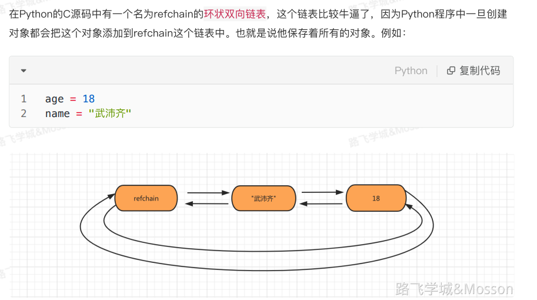

# 2.垃圾回收
# 什么是内存管理和垃圾回收
Python GC主要使用引用计数(reference counting)来跟踪和回收垃圾。在引用计数的基础上，通过“标记-清除”(mark and sweep)解决容器对象可能产生的循环引用问题，通过“分代回收”(generation collection)以空间换时间的方法提高垃圾回收效率。

**<font style="color:rgb(77, 77, 77);background-color:#FBDE28;">python采用的是引用计数机制为主，标记-清除和分代收集两种机制为辅的策略</font>**

# 引用计数器--环状双向链表
<font style="color:rgb(77, 77, 77);">当一个对象有新的引用时，</font>



Python 使用引用计数作为其主要的垃圾收集机制。每个对象都有一个引用计数器，每当有一个新的引用指向这个对象时，引用计数器加一；当某个引用不再指向这个对象时，引用计数器减一。当一个对象的引用计数降为零时，意味着这个对象不再被使用，Python 将会回收这个对象占用的内存。

## 示例代码：
```python
import sys

def reference_count_example():
    a = [1, 2, 3]  # 创建一个列表对象，此时 a 的引用计数为 1
    b = a          # b 指向了 a 指向的对象，a 的引用计数增加到 2
    print(sys.getrefcount(a))  # 输出 a 的引用计数
    
    del b          # 删除 b 对象对 a 的引用，a 的引用计数减少到 1
    print(sys.getrefcount(a))  # 再次输出 a 的引用计数

reference_count_example()
```

# 循环垃圾检测 (Cyclic Garbage Collection)
## 循环引用问题
在 Python 中，每个对象都有一个引用计数器，记录有多少个引用指向该对象。当一个对象的引用计数降为零时，Python 的垃圾回收器会自动回收该对象占用的内存。然而，当对象之间存在循环引用时，即使这些对象不再被外部引用，它们的引用计数也不会降为零，从而导致内存泄漏。

## 循环垃圾检测机制
Python 使用一个名为 `gc`（garbage collection）的模块来检测和处理循环引用。`gc` 模块周期性地运行一个垃圾收集器，该收集器能够识别并清理那些互相引用但不再使用的对象。

### 主要功能
1. **检测循环引用**：`gc` 模块会遍历所有对象，查找那些引用计数非零但不可达的对象。
2. **回收内存**：一旦找到这样的对象，`gc` 模块会释放这些对象占用的内存。

## 工作流程
1. **初始化**：Python 启动时，`gc` 模块会自动启用。可以通过 `gc.enable()` 和 `gc.disable()` 函数手动控制其启停。
2. **周期性检测**：`gc` 模块会定期运行，检查是否存在循环引用。这个周期可以通过 `gc.set_threshold()` 函数设置。
3. **标记和清理**：
    - **标记**：从一组根对象（如全局变量、栈上的局部变量等）开始，递归地标记所有可访问的对象。
    - **清理**：遍历所有对象，释放那些未被标记的对象所占用的内存。

## 代码示例
### 示例 1：基本的循环引用
```python
import gc

def create_cycle():
    # 创建两个对象，形成循环引用
    a = []
    b = [a]
    a.append(b)
    
    # 删除对 a 和 b 的直接引用
    del a
    del b

# 创建循环引用
create_cycle()

# 手动触发垃圾回收
gc.collect()  # 返回值是这次垃圾回收中释放的对象数量
print("Garbage collected objects:", gc.garbage)
```

在这个例子中，`a` 和 `b` 形成了一个循环引用。即使删除了对它们的直接引用，它们的引用计数也不会降为零。通过调用 `gc.collect()`，Python 的垃圾回收器会检测并清理这些对象。

### 示例 2：控制垃圾回收
```python
import gc

# 初始化时禁用垃圾回收
gc.disable()

def create_cycle():
    a = []
    b = [a]
    a.append(b)
    
    del a
    del b

# 创建循环引用
create_cycle()

# 查看当前垃圾对象
print("Before garbage collection:", gc.garbage)

# 手动触发垃圾回收
gc.collect()
print("After garbage collection:", gc.garbage)

# 重新启用垃圾回收
gc.enable()
```

在这个例子中，我们首先禁用了垃圾回收，然后创建了一个循环引用。通过查看 `gc.garbage`，可以看到未被回收的垃圾对象。手动调用 `gc.collect()` 后，这些对象被成功回收。

## 高级用法
## 设置阈值
可以通过 `gc.set_threshold()` 函数设置垃圾回收的阈值，控制 `gc` 模块的运行频率。

```python
import gc

# 设置阈值，当分配的对象数量达到阈值时触发垃圾回收
gc.set_threshold(700, 10, 10)

# 查看当前的阈值
print("Current thresholds:", gc.get_threshold())
```

## 自定义不可回收对象
有些对象可能不适合自动垃圾回收，可以通过 `gc.garbage` 列表来查看这些对象，并手动处理。

```python
import gc

class UnreachableObject:
    def __del__(self):
        print("Unreachable object is being deleted")

def create_unreachable_cycle():
    a = UnreachableObject()
    b = [a]
    a.b = b
    
    del a
    del b

create_unreachable_cycle()

# 触发垃圾回收
gc.collect()

# 查看不可回收的对象
print("Unreachable objects:", gc.garbage)
```

在这个例子中，`UnreachableObject` 类的实例可能会因为某些原因无法被自动回收。通过查看 `gc.garbage`，我们可以发现这些对象，并采取适当的措施。

## 总结
Python 的循环垃圾检测机制通过 `gc` 模块有效地解决了引用计数无法处理的循环引用问题。通过周期性地运行垃圾收集器，Python 能够自动检测并清理这些对象，避免内存泄漏。希望这些示例和解释能帮助你更好地理解和使用 Python 的垃圾回收机制。

# 分代回收 (Generational Collection)
Python 的垃圾回收机制采用 **分代回收（Generational Garbage Collection）** 策略，这种方式的核心思想是：**长期存在的对象比短期存在的对象更不容易被回收**，因此可以通过把对象分为不同的“代”，不同代的对象使用不同的回收策略。

### 分代回收的基本概念
在 Python 中，对象的生命周期并不是一成不变的。垃圾回收器将对象分为 **三代**，每一代的回收策略和回收频率不同：

1. **第一代（Generation 0）**：存放新创建的对象。
2. **第二代（Generation 1）**：存放存活了一定时间的对象。
3. **第三代（Generation 2）**：存放长时间存活的对象。

### 分代回收的工作原理
分代回收的基本思想是：对象越长时间存活，越不容易被回收。具体的回收机制是基于每个代的对象创建、存活和回收的过程来实现的。

+ **第一代（Generation 0）**：新创建的对象会首先被分配到第一代。当一个对象在第一代中存活超过一定次数时，它会晋升到第二代。
+ **第二代（Generation 1）**：存活了一定时间的对象会被晋升到第二代。在这个代中的对象，如果没有在一定周期内被回收，它们会晋升到第三代。
+ **第三代（Generation 2）**：这是最老的一代。对象在这里存活的时间最长，回收频率最低。第三代对象只有在内存压力较大时才会被回收。

#### 为什么要分代回收？
分代回收利用了 **“大多数对象都是短命的”** 这一观察。由于大多数对象的生命周期都比较短，且在程序运行时不会长时间存在，因此我们可以更频繁地回收第一代中的对象，而不需要频繁地回收已经存在较长时间的对象。这样既能减少垃圾回收的开销，又能高效地回收大多数无用的对象。

### 具体的回收过程
#### 1. 第一代（Generation 0）的回收
+ 当 Python 的垃圾回收器发现第一代中的对象没有引用时，它会立即回收这些对象。
+ 如果第一代的对象回收后，仍然存在一些对象，并且这些对象的引用计数为零，它们就会被删除。

#### 2. 第二代（Generation 1）的回收
+ 如果第一代的回收没有回收掉足够的内存，垃圾回收器会检查第二代的对象。如果第二代的对象没有足够的引用计数，也会被回收。
+ 对象从第一代晋升到第二代，意味着它们存活了一段时间，不再那么容易被回收。

#### 3. 第三代（Generation 2）的回收
+ 第三代中的对象只有在垃圾回收器运行频繁时才会被检查。回收第三代对象的次数较少，但这部分对象往往是比较老的对象，且回收时会有更大的性能开销。

### 具体实现
Python 的垃圾回收器通过三个代的 **阈值（threshold）** 来控制何时触发回收。每个代都有一个回收阈值，阈值设置了垃圾回收器检查该代的对象的频率。

Python 会定期检查并尝试回收那些不可达的对象。回收的过程分为两个步骤：**标记（mark）** 和 **清除（sweep）**。具体来说，垃圾回收器会在以下几个条件下触发回收：

1. **回收触发条件**：当某一代的对象数量达到设置的阈值时，就会触发垃圾回收。
2. **垃圾回收过程**：回收过程中，垃圾回收器会检查当前代中的对象，找出不再被引用的对象，然后清除它们。

#### 回收的阈值和调整
在 Python 中，可以通过 `gc.set_threshold()` 来手动设置各代的垃圾回收阈值。

#### 示例代码：
```python
import gc

# 设置各代回收的阈值
# 第一个参数：第0代的阈值
# 第二个参数：第1代的阈值
# 第三个参数：第2代的阈值
gc.set_threshold(700, 10, 10)

# 查看当前的垃圾回收阈值
print(gc.get_threshold())
```

#### 返回值：
`gc.get_threshold()` 会返回一个元组 `(threshold0, threshold1, threshold2)`，表示各代的垃圾回收阈值。

### 触发垃圾回收的条件
垃圾回收器通常会在以下条件下进行回收：

1. **第0代对象的数量超过阈值**：会触发对第0代对象的回收，回收后存活的对象会晋升到第1代。
2. **第1代对象的数量超过阈值**：会触发对第1代对象的回收，存活的对象会晋升到第2代。
3. **第2代对象的数量超过阈值**：会触发对第2代对象的回收，存活的对象会继续存活在第2代。

### 分代回收的性能优化
由于 <font style="background-color:#FBDE28;">Python 会根据对象的“寿命”对对象进行分代管理</font>，这种分代策略有助于减少回收的开销，提高程序的运行效率。例如，程序中创建大量短生命周期的对象时，垃圾回收器会更频繁地回收第一代，从而更高效地释放内存。而对第三代对象的回收频率相对较低，避免了过度的回收操作。

### 手动控制垃圾回收
你还可以手动控制垃圾回收的行为，如禁用或启用垃圾回收器，强制触发垃圾回收等。

```python
import gc

# 禁用垃圾回收
gc.disable()

# 强制垃圾回收
gc.collect()

# 启用垃圾回收
gc.enable()
```

### 总结
Python 的垃圾回收机制通过分代回收策略来提高内存管理的效率。分代回收将对象分为三代，并通过对各代对象回收频率的不同设置来优化回收过程。Python 根据对象的存活时间来调整回收频率，短期存活的对象更频繁地被回收，而长期存活的对象则较少被回收。通过这种方式，Python 能够高效地管理内存，减少性能开销。

你可以通过 `gc` 模块手动控制垃圾回收的行为，包括禁用、启用垃圾回收，调整回收阈值，以及强制执行回收。

