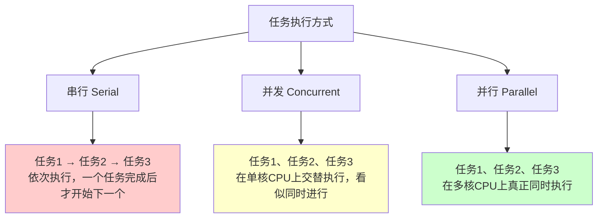
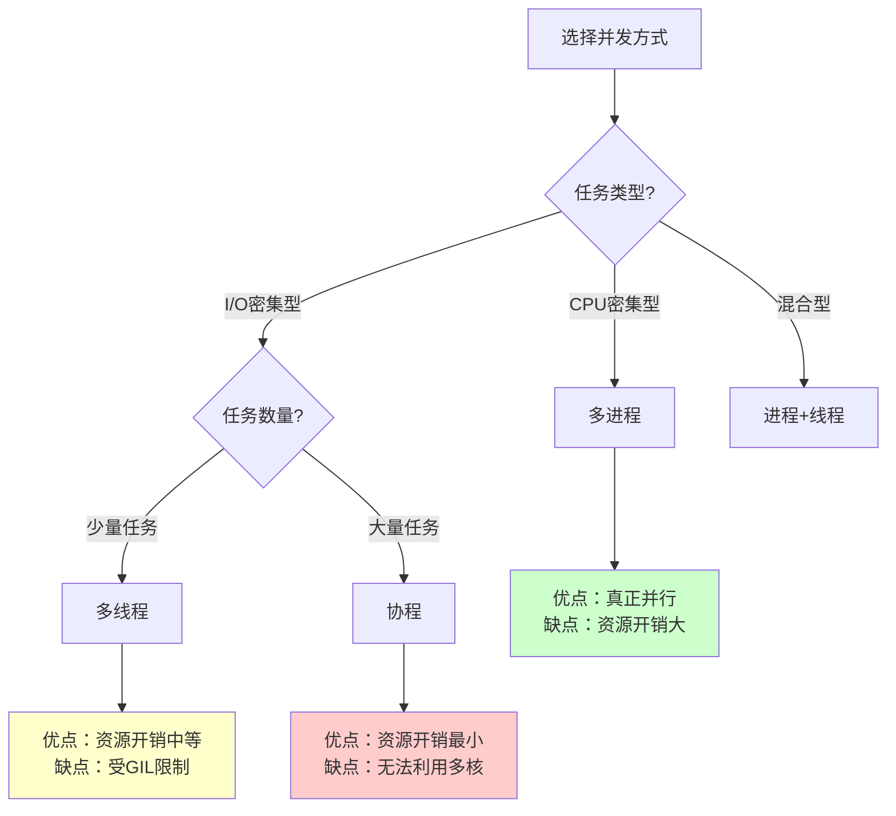
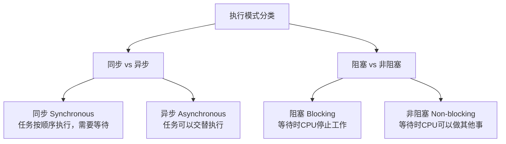
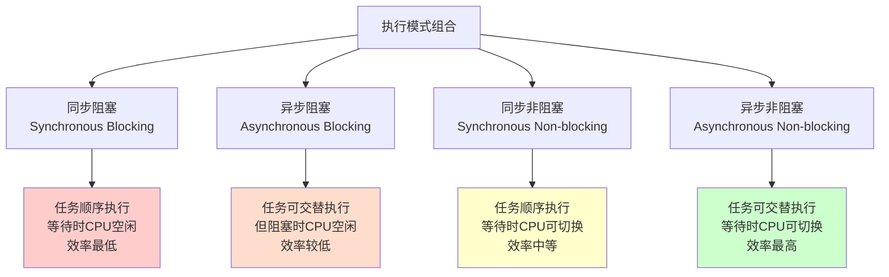

# 第一部分：并发编程基础理论

## 1. 并发编程概述

### 1.1 并发编程的概念与目标

并发编程的核心目标是提高程序执行效率，充分利用多核CPU资源，使得多个任务能够在同一时间段内进行处理，达到提高计算机资源利用率的效果。并发编程不仅能改善程序性能，还能在I/O密集型任务中减少等待时间，提升用户体验。

### 1.2 并行 vs 并发 vs 串行



- **串行（Serial）**：多个任务依次执行，一个任务完成后，才开始下一个任务。
- **并发（Concurrent）**：多个任务在同一个CPU核心上交替执行，看似同时进行，实际上任务是串行执行的，适用于单核CPU。
- **并行（Parallel）**：多个任务在多个CPU核心上同时执行，适用于多核CPU的环境。

### 1.3 实现多任务的三种方式

#### 1.3.1 进程 (Process)

- **定义**：进程是操作系统中资源分配和独立执行的基本单位。每个进程有独立的内存空间、代码段、数据段、堆栈等，操作系统为每个进程分配资源。
- **特点**：
  - 进程之间互相独立，彼此不共享内存。
  - 一个进程崩溃不会直接影响到其他进程。
  - 进程的创建和销毁成本较高。
- **适用场景**：
  - 适合执行完全独立的任务，例如独立的服务进程、计算密集型任务。
- **注意事项**：
  - 进程之间的通信（IPC，Inter-process Communication）通常比线程复杂，例如通过管道、消息队列或共享内存。

#### 1.3.2 线程 (Thread)

- **定义**：线程是进程内部的最小执行单元，是操作系统调度和执行的基本单位。一个进程中可以有多个线程，线程共享进程的资源，如内存空间、文件描述符等。
- **特点**：
  - 线程之间共享进程的内存空间，这使得线程之间的数据交换非常高效。
  - 线程的创建和销毁比进程轻量。
  - 线程间的资源竞争可能导致数据不一致，需使用同步机制（如锁）避免冲突。
- **适用场景**：
  - 适用于任务紧密相关的并发操作，例如Web服务器、计算密集型任务中的并行处理。
- **注意事项**：
  - 线程是轻量级的，但仍然需要操作系统进行调度。
  - 线程之间的同步是并发编程的一个重要问题，常用的同步机制有：互斥锁（mutex）、条件变量、读写锁等。

#### 1.3.3 协程 (Coroutine)

- **定义**：协程是用户态的轻量级线程，由程序员通过代码控制其调度。协程通过让出控制权来模拟多线程的行为，不依赖操作系统的线程调度。
- **特点**：
  - 协程之间的切换非常轻量，通常不需要操作系统干预。
  - 协程可以在单个线程内实现并发，适合处理大量I/O密集型操作。
  - 协程之间的通信非常高效，因为它们共享内存空间。
- **适用场景**：
  - 适用于I/O密集型任务，如网络请求、文件操作等。通过非阻塞式I/O操作，协程能够在等待I/O的过程中执行其他任务，从而提升程序的响应速度。
- **注意事项**：
  - 协程是单线程内的调度，因此无法直接利用多核CPU进行并行计算。对于计算密集型任务，协程的优势不明显。

#### 1.3.4 注意

严格来讲：

- **进程 (Process)** 和 **线程 (Thread)** → 是 **操作系统级别** 的调度单位，属于 **并发执行的物理载体**。
- **协程 (Coroutine)** → 是 **语言运行时或库层面** 的概念，它本质上是 **用户态的调度机制**，和操作系统的调度单位不是一个层次。

### 1.4 各种方式的对比

| 特性          | 进程         | 线程           | 协程          |
| :------------ | :----------- | :------------- | :------------ |
| 调度单位      | 操作系统     | 操作系统       | **用户代码**  |
| 内存空间      | 独立         | 共享           | 共享          |
| 创建/销毁成本 | 高           | 中             | 低            |
| 并发性能      | 较差         | 较好           | 最好          |
| 通信方式      | IPC          | 共享内存、同步 | 共享内存      |
| 适用场景      | 完全独立任务 | 密切相关任务   | I/O密集型任务 |
| CPU利用       | 真正并行     | 受GIL限制      | 单线程        |

### 1.5 适用场景与选择策略



- **进程**适合独立、互不干扰的任务。比如，多个独立服务或计算密集型任务。
- **线程**适合任务相关、需要共享数据的场景。多线程通常用于需要高并发计算的任务，但要小心同步问题。
- **协程**适合I/O密集型任务，尤其是需要高并发处理的场景，如高并发的Web服务器、爬虫程序等（有一点像我们的rtos的多任务，但是协程是基于yield和await主动让出）。

## 2. 同步与异步、阻塞与非阻塞

### 2.1 基础概念详解

这四个概念有助于理解进程和线程如何处理任务，它们是并发编程中的重要理论基础。



#### 2.1.1 同步与异步

- **同步（Synchronous）**：任务执行时，后续任务必须等待前一个任务完成。
- **异步（Asynchronous）**：任务执行时，后续任务可以在等待任务完成的同时执行。

#### 2.1.2 阻塞与非阻塞

- **阻塞（Blocking）**：任务等待某个操作完成时，当前任务暂停执行，CPU不执行其他任务。
- **非阻塞（Non-blocking）**：任务等待某个操作完成时，CPU仍然可以执行其他任务。

### 2.2 四种组合方式

这四种方式可以组合形成不同的执行模式：



- **同步阻塞**：任务一个接一个地执行，等待时CPU不做其他事。
- **异步阻塞**：任务可以交替执行，但一旦某个任务阻塞，CPU也会停顿。
- **同步非阻塞**：任务一个接一个地执行，等待时CPU可以切换到其他任务。
- **异步非阻塞**：多个任务可以交替执行，任何任务阻塞时，CPU也能继续执行其他任务。

### 2.3 示例

```python
import time
import requests
import aiohttp
import asyncio
import socket

# ===============================
# 1. 同步阻塞 (Synchronous Blocking)
# ===============================
def sync_blocking_example():
    """同步阻塞示例：依次请求多个URL"""
    urls = ['http://httpbin.org/delay/1'] * 3
    start_time = time.time()

    for url in urls:
        response = requests.get(url)  # 阻塞等待响应
        print(f"[Sync Blocking] Got response: {response.status_code}")

    print(f"[Sync Blocking] Total time: {time.time() - start_time:.2f}s")
    # 结果约 ~3s（因为顺序执行）


# ===============================
# 2. 异步阻塞 (Asynchronous Blocking)
# ===============================
def async_blocking_example():
    """异步阻塞示例：启动多个线程，但每个请求仍阻塞CPU"""
    import threading

    urls = ['http://httpbin.org/delay/1'] * 3
    start_time = time.time()

    def fetch(url):
        response = requests.get(url)  # 阻塞调用
        print(f"[Async Blocking] Got response: {response.status_code}")

    threads = []
    for url in urls:
        t = threading.Thread(target=fetch, args=(url,))
        t.start()
        threads.append(t)

    for t in threads:
        t.join()

    print(f"[Async Blocking] Total time: {time.time() - start_time:.2f}s")
    # 多线程并发，大约 ~1s，但每个线程依然阻塞 CPU


# ===============================
# 3. 同步非阻塞 (Synchronous Non-blocking)
# ===============================
def sync_nonblocking_example():
    """同步非阻塞示例：非阻塞socket轮询"""
    start_time = time.time()
    host, port = "httpbin.org", 80

    # 创建非阻塞 socket
    s = socket.socket()
    s.setblocking(False)
    try:
        s.connect((host, port))
    except BlockingIOError:
        pass  # 非阻塞下 connect 会抛异常，表示正在连接

    # 使用轮询等待连接
    while True:
        try:
            s.send(b"GET /delay/1 HTTP/1.0\r\nHost: httpbin.org\r\n\r\n")
            break
        except BlockingIOError:
            continue  # CPU 可以继续做其他事

    response = b""
    while True:
        try:
            chunk = s.recv(4096)
            if not chunk:
                break
            response += chunk
        except BlockingIOError:
            continue  # 继续轮询

    print(f"[Sync Non-blocking] Got response length: {len(response)}")
    print(f"[Sync Non-blocking] Total time: {time.time() - start_time:.2f}s")
    s.close()
    # 通过轮询实现非阻塞，但CPU效率不高


# ===============================
# 4. 异步非阻塞 (Asynchronous Non-blocking)
# ===============================
async def async_nonblocking_example():
    """异步非阻塞示例：使用 aiohttp + asyncio"""
    urls = ['http://httpbin.org/delay/1'] * 3
    start_time = time.time()

    async with aiohttp.ClientSession() as session:
        tasks = [session.get(url) for url in urls]
        responses = await asyncio.gather(*tasks)

        for resp in responses:
            print(f"[Async Non-blocking] Got response: {resp.status}")
            await resp.text()  # 消费响应

    print(f"[Async Non-blocking] Total time: {time.time() - start_time:.2f}s")
    # 所有请求并发执行，总耗时约 ~1s


# ===============================
# 主程序入口
# ===============================
if __name__ == "__main__":
    print("=== 1. 同步阻塞 ===")
    sync_blocking_example()

    print("\n=== 2. 异步阻塞 ===")
    async_blocking_example()

    print("\n=== 3. 同步非阻塞 ===")
    sync_nonblocking_example()

    print("\n=== 4. 异步非阻塞 ===")
    asyncio.run(async_nonblocking_example())

```

