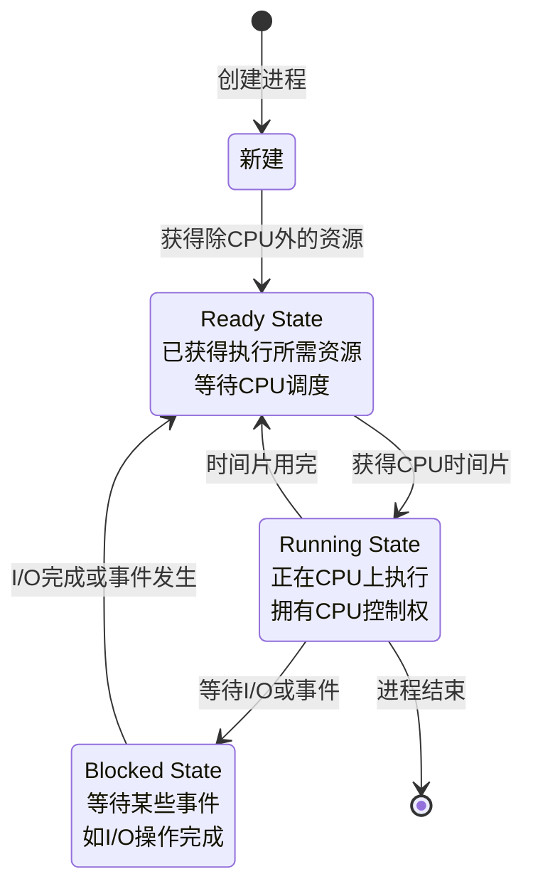
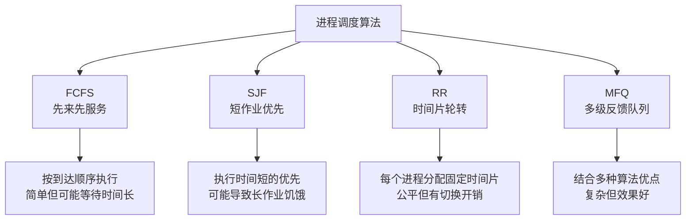
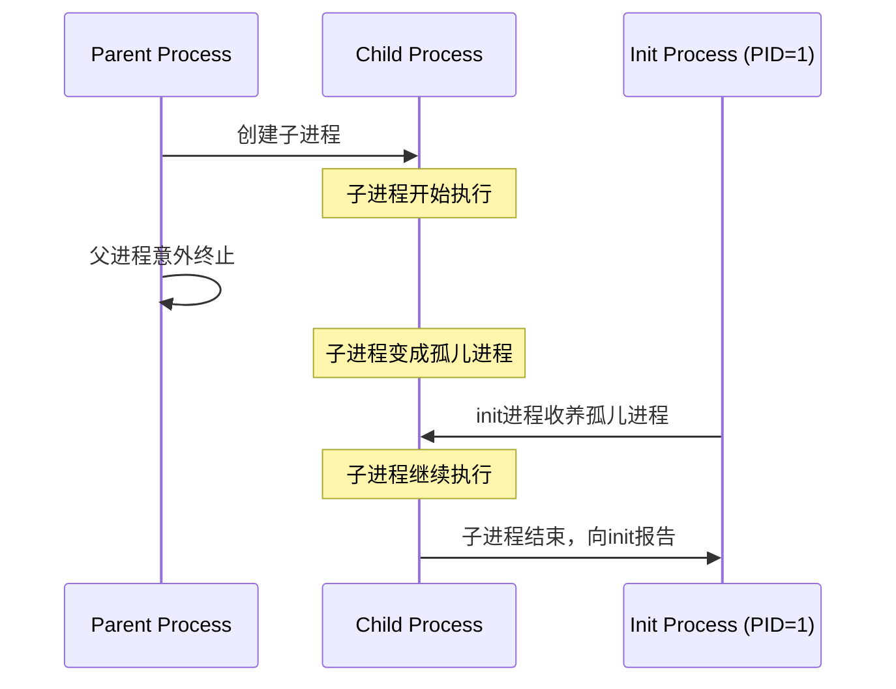
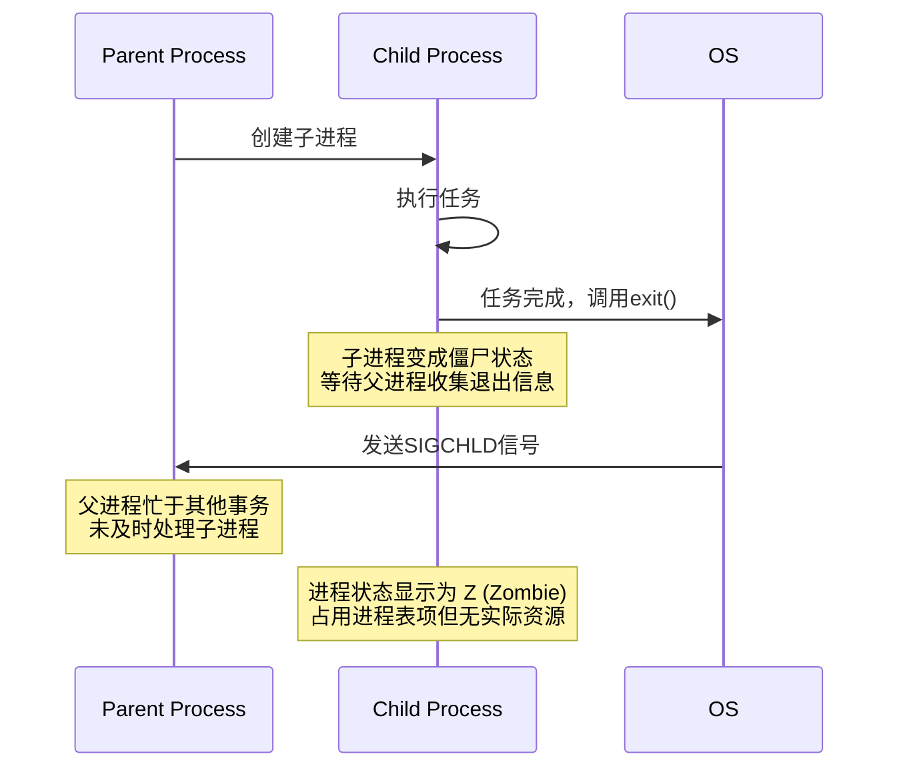
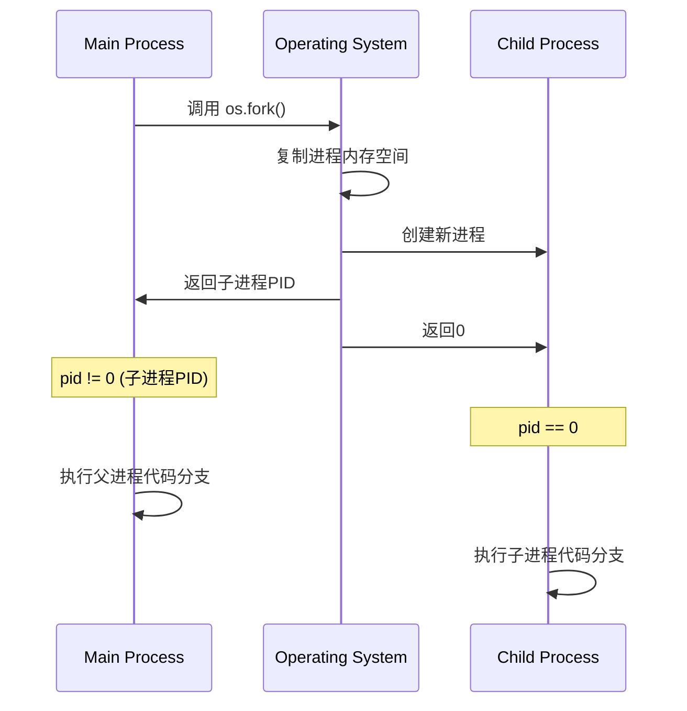
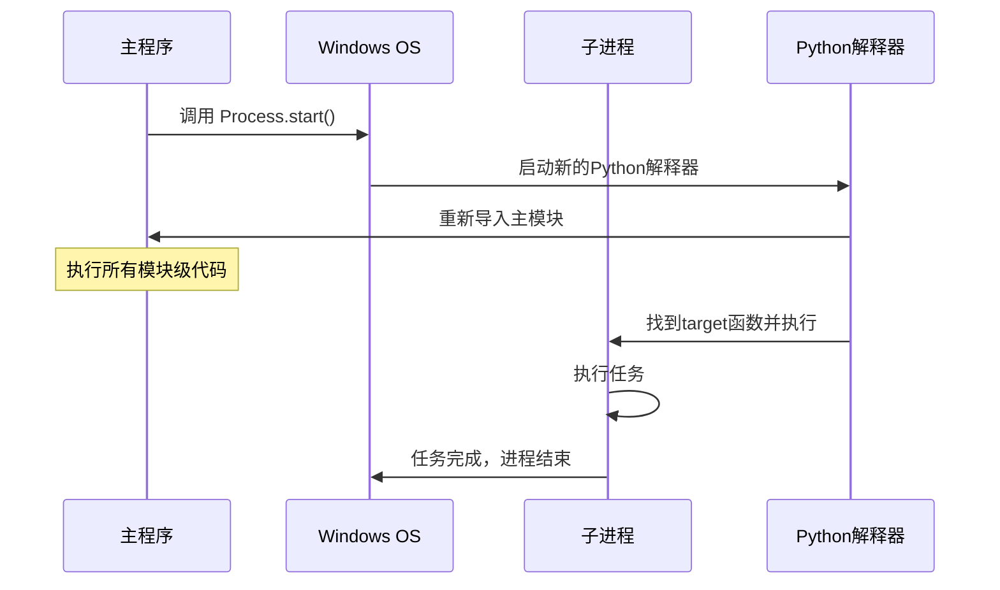
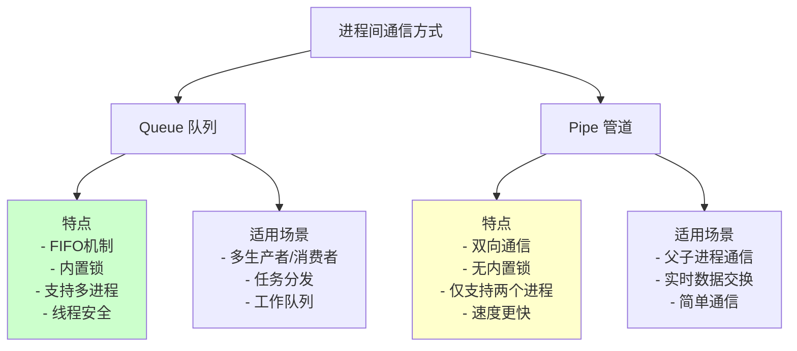
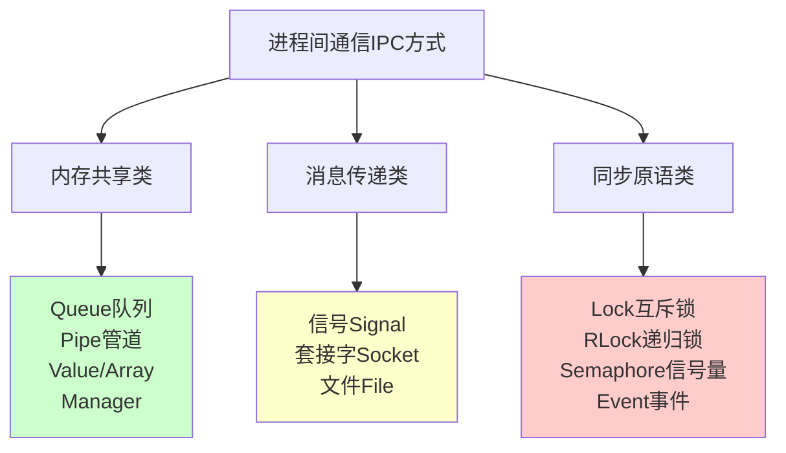
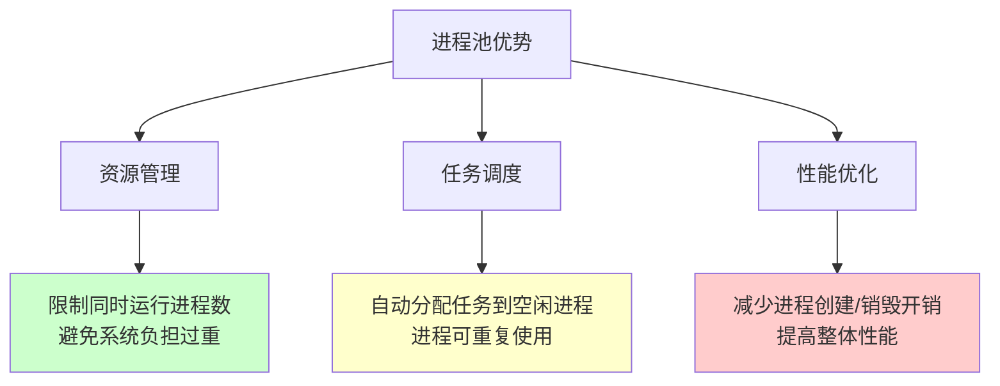

# 第二部分：多进程

## 3. 进程基础理论

### 3.1 进程的定义与组成

#### 3.1.1 进程的定义

- **狭义定义**：进程是正在运行的程序实例，比如运行一个python脚本。
- **广义定义**：进程是一个程序在操作系统中的一次执行实例，包含程序、数据、以及系统为执行该程序分配的资源。

#### 3.1.2 进程与程序的区别

- **程序**是静态的，它只是存储在磁盘上的代码文件。
- **进程**是程序的动态实例，是操作系统进行资源分配和管理的基本单位，包含程序代码及其运行时所需的资源。

一个程序可以有多个进程实例，每个进程互相独立执行。

#### 3.1.3 进程的组成

一个进程主要由以下部分组成：

1. **程序段**：存储在内存中的代码段，是进程执行的指令集。
2. **数据段**：进程执行时所需的数据，包括全局变量和局部变量等。
3. **进程控制块（PCB）**：进程控制块是操作系统管理进程的关键，它记录进程的状态、程序计数器、寄存器内容等信息。

### 3.2 进程标识符与层次关系

#### 3.2.1 进程标识符（PID）

每个进程都有一个唯一的进程ID（PID），操作系统通过PID来区分和管理进程。通过`os.getpid()`和`os.getppid()`可以获取当前进程和父进程的PID。

```python
import os
import time

if __name__ == '__main__':
    print(f"当前进程PID: {os.getpid()}")
    print(f"父进程PID: {os.getppid()}")

    for i in range(3):
        time.sleep(1)
        print(f"第{i+1}秒 - 进程{os.getpid()}正在运行")
```

#### 3.2.2 父进程与子进程详解

**父进程（Parent Process）**：

- 创建其他进程（子进程）的进程
- 负责管理和监控子进程的执行
- 通常需要等待子进程完成或回收子进程资源
- 可以通过`os.getppid()`在子进程中获取父进程PID

**子进程（Child Process）**：

- 由父进程创建的新进程
- 拥有自己独立的进程空间和PID
- 创建时会继承父进程的代码，但数据空间是独立的
- 可以执行与父进程相同或不同的任务

### 3.3 进程状态与调度

#### 3.3.1 进程状态

进程的状态描述了它在生命周期中的不同阶段：



主要有三种基本状态：

- **就绪状态（Ready）**：进程已获得执行所需的资源，但正在等待CPU资源。
- **运行状态（Running）**：进程获得CPU资源并正在执行。
- **阻塞状态（Blocked）**：进程因等待某些事件（如I/O操作）而无法继续执行，进入阻塞状态。

#### 3.3.2 进程调度算法

进程的调度是操作系统的核心任务，它决定了多个进程如何共享CPU资源：



1. **FCFS（先来先服务）**：按照进程到达的顺序执行，适合长时间运行的作业。
2. **SJF（短作业优先）**：优先调度执行时间短的作业，可能导致长作业饥饿。
3. **RR（时间片轮转）**：为每个进程分配固定的时间片，适合多任务并发处理。
4. **MFQ（多级反馈队列）**：结合了多种调度算法的优点，适合处理不同类型的任务。

## 4. 特殊进程类型详解

### 4.1 孤儿进程深入解析

**孤儿进程（Orphan Process）**是指父进程在子进程结束之前就终止了，使得子进程失去父进程的进程。



#### 4.1.1 孤儿进程的特点

- **产生原因**：父进程在子进程结束前意外终止或被强制杀死
- **系统处理**：孤儿进程会被pid=1的init进程（系统守护进程）收养
- **资源回收**：init进程会对所有的孤儿进程进行资源回收
- **危害程度**：孤儿进程不会对系统造成危害，因为有init进程负责清理

#### 4.1.2 孤儿进程示例

* 注意在 **现代 Linux 桌面环境**（Ubuntu + systemd 用户会话）下，孤儿进程 **不会直接被 PID=1 的 init 收养**。
* 被收养的好处就是自动的回收子进程的退出状态！

```python
import os
import time
from multiprocessing import Process

def child_task():
    print(f"子进程启动，PID={os.getpid()}，父PID={os.getppid()}")
    for i in range(30):
        time.sleep(1)
        print(f"{i+1}秒 - 子进程PID={os.getpid()}，父PID={os.getppid()}")
        if os.getppid() == 1:
            print("👉 已被 init 收养，成为孤儿")

if __name__ == "__main__":
    print(f"主进程PID={os.getpid()}")
    p = Process(target=child_task)
    p.start()

    time.sleep(3)
    print("主进程强制退出")
    os._exit(0)  # ⚠️ 主进程立即消亡

```

**测试方法**：

```bash
# 运行上述代码后，在另一个终端中观察进程
ps aux | grep python
```

### 4.2 僵尸进程成因与避免

* 父进程死掉时，僵尸进程会被 init 回收

* 简单理解就是爹还在但是不管他就变僵尸了！ （爹还在所以init无法插手回收！）

**僵尸进程（Zombie Process）**是指子进程已经结束，但父进程还没有调用`wait()`或类似系统调用来收集子进程的退出状态信息。



#### 4.2.1 僵尸进程的危害

- **资源占用**：虽然不占用实际的内存和CPU，但会占用进程表项
- **系统限制**：大量僵尸进程会耗尽进程表，影响系统创建新进程
- **状态标识**：在`ps`命令中显示状态为"Z"

#### 4.2.2 产生僵尸进程的示例

```python
import time
import multiprocessing
import os

def zombie_child():
    """会变成僵尸进程的子进程"""
    print(f"子进程开始执行，PID: {os.getpid()}")
    print("子进程即将结束...")
    time.sleep(2)
    print("子进程结束")
    # 子进程结束后，如果父进程不调用join()，就会变成僵尸进程

if __name__ == '__main__':
    print(f"主进程PID: {os.getpid()}")

    # 创建多个子进程但不等待它们结束
    for i in range(3):
        process = multiprocessing.Process(target=zombie_child)
        process.start()
        # 注意：这里没有调用 process.join()
        print(f"子进程 {i+1} 已启动，PID可能是: {process.pid}")

    print("主进程继续执行其他任务...")
    time.sleep(30)  # 主进程继续运行30秒，子进程变成僵尸

    print("主进程即将结束")
```

**检查僵尸进程**：

```bash
# 在另一个终端执行
ps -ef | grep python
# 会看到状态为 Z+ 或 <defunct> 的进程
```

#### 4.2.3 避免僵尸进程的方法

* 使用join()等待子进程结束！ 

**更优雅的处理方式**：

* 使用资源管理器，退出的时候自动的终止所有子进程

```python
import multiprocessing
import os
import time
from contextlib import contextmanager

@contextmanager
def managed_processes():
    """进程管理器，确保所有进程被正确清理"""
    processes = []
    try:
        yield processes
    finally:
        # 等待所有进程结束
        for process in processes:
            if process.is_alive():
                process.join(timeout=5)  # 最多等待5秒
                if process.is_alive():
                    process.terminate()  # 强制终止
                    process.join()
        print("所有进程已清理完毕")

def worker_task(name, duration):
    print(f"工作进程 {name} 开始，PID: {os.getpid()}")
    time.sleep(duration)
    print(f"工作进程 {name} 完成")

if __name__ == '__main__':
    with managed_processes() as processes:
        # 创建多个进程
        for i in range(3):
            p = multiprocessing.Process(
                target=worker_task,
                args=(f"Task-{i+1}", 2)
            )
            p.start()
            processes.append(p)

        print("所有进程已启动，等待完成...")

    print("程序结束，无僵尸进程")
```

### 4.3 守护进程（注意和系统的守护进程不同）

**守护进程（Daemon Process）**也叫精灵进程，是一种特殊的进程，一般在后台运行，不与任何控制终端相关联，并且周期性地执行某种任务或等待处理某些发生的事件。

#### 4.3.1 守护进程的特点

1. **生存周期**：一般启动了以后就会一直驻留在操作系统中，直到**主进程结束**。
2. **自动结束**：主进程创建了守护进程以后，守护进程作为一个特殊的子进程会随着主进程的代码结束而自动结束。
3. **进程限制**：守护进程内不允许再开子进程（孙子进程）。
4. **终端独立**：守护进程是在后台运行，和终端无关联，不会占着终端，终端可以执行其他命令或操作。

#### 4.3.2 守护进程示例

```python
import time
import os
from multiprocessing import Process

def daemon_task():
    """守护进程任务"""
    print(f"守护进程启动，PID: {os.getpid()}")
    count = 0
    while True:
        count += 1
        print(f"守护进程运行中... 计数: {count}")
        time.sleep(2)

        # 避免无限运行，实际守护进程通常是无限循环
        if count >= 10:
            print("守护进程达到最大计数，准备结束")
            break

if __name__ == '__main__':
    print(f"主进程PID: {os.getpid()}")

    # 创建守护进程
    daemon_process = Process(target=daemon_task)
    daemon_process.daemon = True  # 设置为守护进程，必须在start()之前设置
    daemon_process.start()

    print("主进程继续执行其他任务...")

    # 主进程执行一些任务
    for i in range(5):
        time.sleep(1)
        print(f"主进程工作中... {i+1}/5")

    print("主进程即将结束")
    time.sleep(1)
    print("主进程结束 - 守护进程也会自动结束")

    # 注意：不需要调用 daemon_process.join()
    # 因为守护进程会随主进程结束而自动结束
```

#### 4.3.3 守护进程 vs 普通子进程

| 特性                  | 普通子进程                                       | 守护进程 (`daemon=True`)                                     |
| --------------------- | ------------------------------------------------ | ------------------------------------------------------------ |
| **生命周期**          | 独立运行，主进程结束后仍可继续执行，直到任务完成 | 随主进程结束而强制终止                                       |
| **用途**              | 执行主要任务或需要保证完成的工作                 | 执行辅助性或后台任务，不保证完成                             |
| **主进程等待**        | 默认情况下，`join()` 可等待其完成                | 主进程退出时自动结束，`join()` 可等待，但主进程结束前可能被终止 |
| **与终端/输出的关系** | 可继承主进程终端，输出可见                       | 不依赖终端，通常用于后台辅助任务                             |
| **创建方式**          | `Process(target=func)`                           | `p = Process(target=func); p.daemon = True`                  |
| **典型应用**          | 数据处理、计算任务、文件操作                     | 日志记录、状态监控、定时清理、后台轮询                       |

## 5. 进程创建与管理

### 5.1 os.fork() 的工作原理

`os.fork()` 是基于 Linux/Unix 系统的系统调用，它用于创建一个子进程。Windows 系统不支持 `fork()`，因此在 Windows 下执行时会报错。

#### 5.1.1 fork() 工作机制

* 父进程返回的是子进程的pid
* 子进程返回的是父进程的pid，固定为0



#### 5.1.2 基础示例

* 创建子进程
* 创建子进程的时候，子进程中返回的0，父进程返回的是子进程的PID（因为一个父进程可能会有多个子进程）

```python
import os

if __name__ == '__main__':
    w = 100
    print(f"fork前: PID={os.getpid()}, w={w}")

    pid = os.fork()  # 创建子进程

    if pid == 0:
        # 子进程执行的代码
        w = 200  # 子进程修改变量（不影响父进程）
        print(f"子进程: PID={os.getpid()}, PPID={os.getppid()}, w={w}")
        print("子进程工作完成")
    else:
        # 父进程执行的代码
        print(f"父进程: PID={os.getpid()}, 创建了子进程PID={pid}")
        print(f"父进程: w={w}")  # 父进程的w仍然是100

        # 等待子进程结束
        os.waitpid(pid, 0)  # 0代表阻塞等待子进程结束
        print("父进程：子进程已结束")
```

#### 5.1.3 fork() 的优缺点

**优点**：

- 创建速度快（写时复制机制）
- 完全的内存隔离，安全性高
- 符合Unix哲学的简洁设计

**缺点**：

- 仅支持Unix/Linux系统
- 内存使用量较大（虽然有写时复制优化）
- 不适合需要共享大量数据的场景
- fork 后如果不 `wait()` / `waitpid()` 回收子进程 → 子进程变**僵尸进程**

### 5.2 multiprocessing 实现多进程

`multiprocessing` 模块是 Python 提供的多进程库，它提供了比 `os.fork()` 更丰富的功能，并且能在 Windows 和 Linux 下跨平台使用。

#### 5.2.1 基础用法

* 创建并等待子进程执行结束

```python
import os
import time
import multiprocessing

def worker_task(name, duration):
    """工作进程任务"""
    print(f"进程 {name} 开始工作，PID: {os.getpid()}")

    for i in range(duration):
        time.sleep(1)
        print(f"进程 {name} 工作中... {i+1}/{duration}")

    print(f"进程 {name} 工作完成")
    return f"进程 {name} 的结果"

if __name__ == '__main__':
    print(f"主进程PID: {os.getpid()}")

    # 创建进程
    process = multiprocessing.Process(
        target=worker_task,
        args=("Worker-1", 3)
    )

    print("启动子进程...")
    process.start()

    print("主进程继续执行其他任务")
    time.sleep(1)

    print("等待子进程结束...")
    process.join()

    print("所有任务完成")
```

#### 5.2.2 Process类的方法和属性

**常用方法**：

| 方法名            | 描述                                                         |
| :---------------- | :----------------------------------------------------------- |
| p.start()         | 在主进程中启动子进程p，并调用该子进程p中的run()方法          |
| p.run()           | 子进程p启动时运行的方法，去调用start方法的参数target指定的函数/方法 |
| p.join([timeout]) | 主进程等待子进程结束，可指定超时时间                         |
| p.terminate()     | 强制终止子进程p（需要谨慎使用）                              |
| p.is_alive()      | 检测进程是否还存活                                           |
| p.kill()          | 强制杀死进程（Python 3.7+）                                  |

**常用属性**：

| 属性名     | 描述                                  |
| :--------- | :------------------------------------ |
| p.name     | 进程的名称                            |
| p.pid      | 进程的唯一标识符                      |
| p.daemon   | 是否为守护进程（必须在start()前设置） |
| p.exitcode | 进程的退出码                          |

#### 5.2.3 传递参数（区别于ipc，只是在运行的时候传递参数）

1. **args 必须顺序正确**：位置参数是靠顺序匹配的。
   - 如果 `args=("张三",)` 只给了一个参数，就会报错缺少 `age`。
2. **kwargs 必须名字正确**：关键字参数要和函数签名里的参数名一致。
   - 如果写错 `{"nam": "李四"}` 会报错 `unexpected keyword argument 'nam'`。
3. **混合时，args 先匹配前面的位置参数，kwargs 负责补充/覆盖**。

```python
import multiprocessing

def task_with_args(name, age, city="Unknown", **kwargs):
    """接收不同类型参数的任务"""
    print(f"姓名: {name}, 年龄: {age}, 城市: {city}")
    print(f"其他信息: {kwargs}")

def demonstrate_arguments():
    """演示不同的参数传递方式"""
    processes = []

    # 方式1: 使用args传递位置参数
    p1 = multiprocessing.Process(
        target=task_with_args,
        args=("张三", 25)
    )

    # 方式2: 使用kwargs传递关键字参数
    p2 = multiprocessing.Process(
        target=task_with_args,
        kwargs={"name": "李四", "age": 30, "city": "北京"}
    )

    # 方式3: 混合使用
    p3 = multiprocessing.Process(
        target=task_with_args,
        args=("王五", 28),
        kwargs={"city": "上海", "job": "程序员", "hobby": "编程"}
    )

    processes = [p1, p2, p3]

    # 启动并等待所有进程
    for p in processes:
        p.start()

    for p in processes:
        p.join()

if __name__ == '__main__':
    demonstrate_arguments()
```

### 5.3 自定义Process类

#### 5.3.1 继承Process类

* 重写run，自定义运行逻辑！

```python
import os
import time
from multiprocessing import Process, current_process

class CustomWorker(Process):
    """自定义工作进程类"""

    def __init__(self, task_name, work_duration, *args, **kwargs):
        super().__init__(*args, **kwargs)
        self.task_name = task_name
        self.work_duration = work_duration
        self.result = None

    def run(self):
        """重写run方法，定义进程要执行的任务"""
        current = current_process()
        print(f"自定义进程 {current.name} 开始执行任务: {self.task_name}")
        print(f"进程PID: {os.getpid()}")

        # 执行具体任务
        for i in range(self.work_duration):
            time.sleep(1)
            print(f"{current.name} - {self.task_name} 进度: {i+1}/{self.work_duration}")

        self.result = f"{self.task_name} 完成"
        print(f"自定义进程 {current.name} 任务完成")

class DataProcessor(Process):
    """数据处理进程类"""

    def __init__(self, data_list, process_func, name=None):
        super().__init__(name=name)
        self.data_list = data_list
        self.process_func = process_func
        self.processed_data = []

    def run(self):
        """处理数据"""
        print(f"数据处理进程 {self.name} 开始处理 {len(self.data_list)} 个数据项")

        for i, data in enumerate(self.data_list):
            processed = self.process_func(data)
            self.processed_data.append(processed)
            print(f"{self.name}: 处理 {i+1}/{len(self.data_list)} - {data} -> {processed}")
            time.sleep(0.5)

        print(f"数据处理进程 {self.name} 完成")

def square(x):
    """平方函数"""
    return x * x

def demonstrate_custom_process():
    """演示自定义进程类"""
    print(f"主进程PID: {os.getpid()}")

    # 创建自定义工作进程
    workers = [
        CustomWorker("数据清洗", 3, name="Cleaner"),
        CustomWorker("数据分析", 4, name="Analyzer"),
        CustomWorker("报告生成", 2, name="Reporter")
    ]

    # 创建数据处理进程
    data_processor = DataProcessor(
        data_list=[1, 2, 3, 4, 5],
        process_func=square,
        name="DataProcessor"
    )

    all_processes = workers + [data_processor]

    # 启动所有进程
    for p in all_processes:
        p.start()
        print(f"启动进程: {p.name}")

    # 等待所有进程完成
    for p in all_processes:
        p.join()
        print(f"进程 {p.name} 已结束")

    print("所有自定义进程已完成")

if __name__ == '__main__':
    demonstrate_custom_process()
```

### 5.4 Windows 系统特殊处理

在 Windows 下，Python 使用 `multiprocessing` 模块时会通过导入父进程的代码来创建子进程，因此需要注意以下几点：

#### 5.4.1 Windows下的进程创建机制



#### 5.4.2 必须使用 `if __name__ == '__main__':`

**错误示例（会导致无限递归）**：

```python
# 错误：没有使用 if __name__ == '__main__'
import multiprocessing

def worker():
    print("工作进程执行")

# 危险：在Windows下会无限创建进程
process = multiprocessing.Process(target=worker)
process.start()
process.join()
```

**正确示例**：

```python
import multiprocessing
import os

def worker(name):
    print(f"工作进程 {name} 执行，PID: {os.getpid()}")

def safe_windows_example():
    """Windows安全的多进程示例"""
    print(f"主进程PID: {os.getpid()}")

    processes = []

    for i in range(3):
        p = multiprocessing.Process(
            target=worker,
            args=(f"Worker-{i+1}",)
        )
        processes.append(p)
        p.start()

    for p in processes:
        p.join()

    print("所有进程完成")

if __name__ == '__main__':
    # 只有在作为主程序运行时才执行多进程代码
    safe_windows_example()
```

#### 5.4.3 跨平台兼容性处理

```python
import multiprocessing
import os
import platform

def cross_platform_task(data):
    """跨平台任务"""
    system = platform.system()
    pid = os.getpid()
    print(f"系统: {system}, 进程PID: {pid}, 处理数据: {data}")
    return data * 2

def get_process_count():
    """根据系统获取合适的进程数"""
    cpu_count = multiprocessing.cpu_count()
    system = platform.system()

    if system == "Windows":
        # Windows下创建进程开销较大，使用较少的进程，或执行其他的操作
        return min(4, cpu_count)
    else:
        # Unix-like系统可以使用更多进程
        return cpu_count

def cross_platform_demo():
    """跨平台多进程演示"""
    print(f"当前系统: {platform.system()}")
    print(f"CPU核心数: {multiprocessing.cpu_count()}")

    process_count = get_process_count()
    print(f"使用进程数: {process_count}")

    # 准备数据
    data_list = list(range(1, 11))

    # 创建进程池处理数据（进程池将在后面详细介绍）
    with multiprocessing.Pool(process_count) as pool:
        results = pool.map(cross_platform_task, data_list)

    print(f"处理结果: {results}")

if __name__ == '__main__':
    cross_platform_demo()
```

## 6. 进程间通信与同步

### 6.1 进程数据隔离

在操作系统中，父进程和子进程的数据段是隔离的。子进程在创建时会复制父进程的内存空间，但它们的数据段是独立的。即使父进程和子进程有相同的代码段，它们的内存中的数据是各自独立的。

#### 6.1.1 数据隔离示例

```python
import time, random
from multiprocessing import Process

num = 100

def func():
    global num
    num -= 1

if __name__ == '__main__':
    process_list = []
    for i in range(10):
        p = Process(target=func)
        p.start()
        process_list.append(p)
    t2 = time.time()
    for p in process_list:
        p.join()

    print(num)  # num=?
```


### 6.2 Queue 队列通信

`Queue` 是一个基于文件类型的通信队列对象，可以用来在进程间传递数据。它支持先进先出（FIFO）机制，并且内置了锁机制来保证数据一致性。

#### 6.2.1 Queue 基础用法

```python
from multiprocessing import Process, Queue
import os
import time

def producer(queue, producer_id, item_count):
    """生产者进程"""
    print(f"生产者 {producer_id} 开始生产，PID: {os.getpid()}")

    for i in range(item_count):
        item = f"Producer-{producer_id}-Item-{i+1}"
        queue.put(item)
        print(f"生产者 {producer_id} 生产: {item}")
        time.sleep(0.5)

    # 放入结束标志
    queue.put(f"END-{producer_id}")
    print(f"生产者 {producer_id} 完成")

def consumer(queue, consumer_id):
    """消费者进程"""
    print(f"消费者 {consumer_id} 开始消费，PID: {os.getpid()}")
    consumed_items = []

    while True:
        item = queue.get()  # 从队列获取数据

        if item.startswith("END"):
            print(f"消费者 {consumer_id} 收到结束信号: {item}")
            queue.put(item)  # 把结束信号放回去，供其他消费者使用
            break

        consumed_items.append(item)
        print(f"消费者 {consumer_id} 消费: {item}")
        time.sleep(0.3)

    print(f"消费者 {consumer_id} 完成，共消费 {len(consumed_items)} 个商品")

def queue_demo():
    """队列通信演示"""
    # 创建队列
    q = Queue(maxsize=10)  # 设置最大容量

    processes = []

    # 创建生产者进程
    for i in range(2):
        p = Process(target=producer, args=(q, i+1, 3))
        p.start()
        processes.append(p)

    # 创建消费者进程
    for i in range(2):
        p = Process(target=consumer, args=(q, i+1))
        p.start()
        processes.append(p)

    # 等待所有进程完成
    for p in processes:
        p.join()

    print("所有进程完成")

if __name__ == '__main__':
    queue_demo()
```

#### 6.2.2 使用Queue进行任务分发

```python
from multiprocessing import Process, Queue, current_process
import time
import random

def calculate_task(task_data):
    """计算任务"""
    task_id, numbers = task_data
    result = sum(x * x for x in numbers)
    time.sleep(random.uniform(0.5, 2.0))  # 模拟计算时间
    return task_id, result

def worker_process(task_queue, result_queue):
    """工作进程"""
    process = current_process()
    print(f"{process.name} 开始工作")

    completed_tasks = 0

    while True:
        try:
            # 从任务队列获取任务
            task_data = task_queue.get(timeout=2)

            if task_data is None:  # 结束标志
                print(f"{process.name} 收到结束信号")
                break

            # 执行任务
            task_id, numbers = task_data
            print(f"{process.name} 处理任务 {task_id}")

            result = calculate_task(task_data)

            # 将结果放入结果队列
            result_queue.put(result)
            completed_tasks += 1

        except Exception as e:
            print(f"{process.name} 发生错误: {e}")
            break

    print(f"{process.name} 完成 {completed_tasks} 个任务")

def task_distribution_demo():
    """任务分发演示"""
    task_queue = Queue()
    result_queue = Queue()

    # 准备任务数据
    tasks = []
    for i in range(10):
        numbers = [random.randint(1, 100) for _ in range(5)]
        tasks.append((f"Task-{i+1}", numbers))

    # 将任务放入队列
    print("正在分发任务...")
    for task in tasks:
        task_queue.put(task)
        print(f"分发任务: {task[0]}")

    # 创建工作进程
    workers = []
    for i in range(3):
        p = Process(
            target=worker_process,
            args=(task_queue, result_queue),
            name=f"Worker-{i+1}"
        )
        p.start()
        workers.append(p)

    # 等待一段时间后发送结束信号
    time.sleep(1)
    for _ in workers:
        task_queue.put(None)  # 发送结束信号

    # 收集结果
    print("正在收集结果...")
    results = []
    for _ in tasks:
        result = result_queue.get()
        results.append(result)
        print(f"收到结果: {result}")

    # 等待所有工作进程完成
    for p in workers:
        p.join()

    print(f"所有任务完成，共收到 {len(results)} 个结果")

if __name__ == '__main__':
    task_distribution_demo()
```

### 6.3 Pipe 管道通信

`Pipe` 是一个基于文件类型的**双向通信管道**，允许在两个进程间传递数据。与 `Queue` 不同，`Pipe` 没有先进先出的机制，并且没有内置锁。

#### 6.3.1 Pipe 基础用法

```python
from multiprocessing import Process, Pipe
import os
import time

def sender_process(conn, sender_id):
    """发送者进程"""
    print(f"发送者 {sender_id} 开始，PID: {os.getpid()}")

    messages = [
        f"Hello from {sender_id}",
        f"Message 1 from {sender_id}",
        f"Message 2 from {sender_id}",
        {"type": "data", "sender": sender_id, "value": 42},
        [1, 2, 3, 4, 5]
    ]

    for i, msg in enumerate(messages):
        conn.send(msg)
        print(f"发送者 {sender_id} 发送: {msg}")
        time.sleep(0.5)

    # 发送结束信号
    conn.send("END")
    conn.close()
    print(f"发送者 {sender_id} 完成")

def receiver_process(conn, receiver_id):
    """接收者进程"""
    print(f"接收者 {receiver_id} 开始，PID: {os.getpid()}")
    received_count = 0

    while True:
        try:
            msg = conn.recv()
            if msg == "END":
                print(f"接收者 {receiver_id} 收到结束信号")
                break

            received_count += 1
            print(f"接收者 {receiver_id} 接收: {msg} (类型: {type(msg).__name__})")

        except EOFError:
            print(f"接收者 {receiver_id} 连接关闭")
            break

    conn.close()
    print(f"接收者 {receiver_id} 完成，共接收 {received_count} 条消息")

def simple_pipe_demo():
    """简单的Pipe演示"""
    # 创建管道
    parent_conn, child_conn = Pipe()

    # 创建发送者和接收者进程
    sender = Process(target=sender_process, args=(child_conn, "Sender-1"))
    receiver = Process(target=receiver_process, args=(parent_conn, "Receiver-1"))

    # 启动进程
    sender.start()
    receiver.start()

    # 等待完成
    sender.join()
    receiver.join()

    print("简单Pipe演示完成")

if __name__ == '__main__':
    simple_pipe_demo()
```

#### 6.3.2 双向通信示例

```python
from multiprocessing import Process, Pipe
import time
import random

def interactive_process(conn, process_name, message_count):
    """交互进程，既发送也接收消息"""
    print(f"{process_name} 开始交互")

    for i in range(message_count):
        # 发送消息
        message = f"{process_name} 的消息 {i+1}: {random.randint(1, 100)}"
        conn.send(message)
        print(f"{process_name} 发送: {message}")

        # 等待并接收响应
        try:
            if conn.poll(timeout=2):  # 等待2秒
                response = conn.recv()
                print(f"{process_name} 接收: {response}")
            else:
                print(f"{process_name} 没有收到响应")
        except:
            print(f"{process_name} 接收异常")

        time.sleep(0.5)

    # 发送结束信号
    conn.send("FINISH")
    print(f"{process_name} 完成")

def bidirectional_pipe_demo():
    """双向通信演示"""
    conn1, conn2 = Pipe()

    # 创建两个交互进程
    p1 = Process(target=interactive_process, args=(conn1, "Process-A", 3))
    p2 = Process(target=interactive_process, args=(conn2, "Process-B", 3))

    p1.start()
    p2.start()

    p1.join()
    p2.join()

    print("双向通信演示完成")

if __name__ == '__main__':
    bidirectional_pipe_demo()
```

### 6.4 Queue vs Pipe 对比



**对比表**：

| 特性     | Queue        | Pipe     |
| :------- | :----------- | :------- |
| 通信模式 | 多对多       | 一对一   |
| 数据结构 | FIFO队列     | 双向通道 |
| 线程安全 | 是（内置锁） | 否       |
| 性能     | 较慢         | 较快     |
| 内存使用 | 较大         | 较小     |
| 缓冲支持 | 支持maxsize  | 无       |
| 复杂度   | 较复杂       | 简单     |

### 6.5 进程锁机制

在多进程环境中，多个进程访问共享资源时，可能会导致数据不一致。为了避免这种情况，可以使用 **锁** 来同步多个进程对共享资源的访问。

#### 6.5.1 没有锁的问题演示

```python
import json
import time
import os
from multiprocessing import Process

def get_ticket_info(username):
    """查询余票"""
    with open("ticket.json", "r") as f:
        data = json.load(f)
        print(f"{username} 查询余票：{data['count']} 张")
        return data['count']

def buy_ticket_unsafe(username):
    """不安全的购票操作"""
    print(f"{username} 开始购票流程")

    # 模拟网络延迟
    time.sleep(0.1)

    # 读取票数
    with open("ticket.json", "r") as f:
        data = json.load(f)
        print(f"{username} 读取到票数：{data['count']}")

    if data["count"] > 0:
        # 模拟购票处理时间
        time.sleep(0.2)

        # 减少票数
        data["count"] -= 1
        print(f"{username} 成功购买票！余票：{data['count']}")

        # 写回数据
        with open("ticket.json", "w") as f:
            json.dump(data, f)
    else:
        print(f"{username} 购票失败！余票不足")

def prepare_ticket_file():
    """准备票务数据文件"""
    ticket_data = {"count": 5}
    with open("ticket.json", "w") as f:
        json.dump(ticket_data, f)
    print(f"初始化票务数据：{ticket_data['count']} 张")

def unsafe_ticket_demo():
    """不安全的购票演示"""
    print("=== 不安全的多进程购票演示 ===")

    # 准备数据
    prepare_ticket_file()

    # 创建多个购票进程
    processes = []
    users = ["Alice", "Bob", "Charlie", "David", "Eve", "Frank", "Grace"]

    for user in users:
        p = Process(target=buy_ticket_unsafe, args=(user,))
        processes.append(p)
        p.start()
        time.sleep(0.05)  # 小延迟，增加竞争概率

    # 等待所有进程完成
    for p in processes:
        p.join()

    # 检查最终结果
    with open("ticket.json", "r") as f:
        final_data = json.load(f)
        print(f"最终余票：{final_data['count']} 张")
        print(f"问题：可能出现超卖情况！")

    # 清理文件
    os.remove("ticket.json")

if __name__ == '__main__':
    unsafe_ticket_demo()
```

#### 6.5.2 使用Lock解决问题

* 初始化一把锁然后把锁作为参数传递给进程

```python
import json
import time
import os
from multiprocessing import Process, Lock

def buy_ticket_safe(username, lock):
    """安全的购票操作（使用锁）"""
    print(f"{username} 开始购票流程")

    # 查询操作不需要锁（只读）
    with open("ticket.json", "r") as f:
        data = json.load(f)
        print(f"{username} 查询余票：{data['count']} 张")

    # 使用锁保护购票操作
    with lock:  # 获取锁
        print(f"{username} 获得锁，开始购票...")

        # 再次读取（确保数据最新）
        with open("ticket.json", "r") as f:
            data = json.load(f)

        if data["count"] > 0:
            # 模拟购票处理时间
            time.sleep(0.1)

            data["count"] -= 1
            print(f"{username} 成功购买票！余票：{data['count']}")

            # 写回数据
            with open("ticket.json", "w") as f:
                json.dump(data, f)
        else:
            print(f"{username} 购票失败！余票不足")

        print(f"{username} 释放锁")
    # 自动释放锁

def safe_ticket_demo():
    """安全的购票演示"""
    print("=== 安全的多进程购票演示 ===")

    # 准备数据
    ticket_data = {"count": 5}
    with open("ticket.json", "w") as f:
        json.dump(ticket_data, f)
    print(f"初始化票务数据：{ticket_data['count']} 张")

    # 创建锁
    lock = Lock()

    # 创建多个购票进程
    processes = []
    users = ["Alice", "Bob", "Charlie", "David", "Eve", "Frank", "Grace"]

    for user in users:
        p = Process(target=buy_ticket_safe, args=(user, lock))
        processes.append(p)
        p.start()
        time.sleep(0.05)

    # 等待所有进程完成
    for p in processes:
        p.join()

    # 检查最终结果
    with open("ticket.json", "r") as f:
        final_data = json.load(f)
        print(f"最终余票：{final_data['count']} 张")
        print("结果：正确，没有超卖！")

    # 清理文件
    os.remove("ticket.json")

if __name__ == '__main__':
    safe_ticket_demo()
```

### 6.6 IPC 方式对比总结



**IPC方式对比表**：

| 方式    | 复杂度 | 性能 | 安全性 | 适用场景               |
| :------ | :----- | :--- | :----- | :--------------------- |
| Queue   | 低     | 中   | 高     | 任务分发、生产者消费者 |
| Pipe    | 低     | 高   | 中     | 父子进程通信、实时数据 |
| Lock    | 低     | 中   | 高     | 保护共享资源           |
| Manager | 高     | 低   | 高     | 复杂数据共享           |
| Socket  | 高     | 高   | 中     | 网络通信、跨机器       |

## 7. 进程池与子进程管理

### 7.1 进程池 (Pool) 详解

当需要启动大量的子进程时，直接使用 `Process` 创建进程可能会导致进程创建和管理的开销变得过大。为了提高效率和简化进程管理，可以使用进程池 (`Pool`) 来批量管理子进程。



#### 7.1.1 基础进程池示例

```python
from multiprocessing import Pool
import os
import time
import random


def cpu_intensive_task(task_data):
    """计算密集型任务"""
    task_id, numbers = task_data
    worker_pid = os.getpid()

    print(f"Task {task_id} 开始 - Worker PID: {worker_pid}")

    # 模拟复杂计算
    result = 0
    for num in numbers:
        result += sum(i*i for i in range(num))

    # 模拟可变计算时间
    time.sleep(random.uniform(0.5, 2.0))

    print(f"Task {task_id} 完成 - Worker PID: {worker_pid}, Result: {result}")
    return task_id, result, worker_pid


def basic_pool_demo():
    """基础进程池演示"""
    print("=== 基础进程池演示 ===")
    print(f"主进程PID: {os.getpid()}")

    # 准备任务数据
    tasks = []
    for i in range(8):
        numbers = [random.randint(50, 200) for _ in range(3)]
        tasks.append((f"Task-{i+1}", numbers))

    # 创建进程池（最多4个进程同时执行）
    with Pool(processes=4) as pool:
        print("进程池已创建，开始处理任务...")

        start_time = time.time()

        # 使用 map 方法批量处理任务
        results = pool.map(cpu_intensive_task, tasks)

        end_time = time.time()

    print(f"\n所有任务完成，总耗时: {end_time - start_time:.2f}秒")
    print("处理结果:")
    for task_id, result, worker_pid in results:
        print(f"  {task_id}: {result} (Worker: {worker_pid})")


if __name__ == '__main__':
    basic_pool_demo()

```

#### 7.1.2 进程池的不同方法

| 方法                        | 特点                                                  | 场景                                 |
| --------------------------- | ----------------------------------------------------- | ------------------------------------ |
| `pool.map(func, iterable)`  | 阻塞式，按顺序返回结果，类似内置`map`                 | 任务简单、顺序处理、需完整结果       |
| `pool.map_async(...)`       | 异步非阻塞，返回`AsyncResult`对象，需`.get()`获取结果 | 需要并发执行 + 后续处理              |
| `pool.apply(func, args)`    | 单任务阻塞调用（一次只派一个任务）                    | 调试或特殊单任务                     |
| `pool.apply_async(...)`     | 单任务异步调用，返回`AsyncResult`，可加回调           | 灵活控制每个任务 + 回调              |
| `pool.imap(func, iterable)` | 返回迭代器，结果按输入顺序逐个产生，边算边取          | 数据量大，边计算边处理，降低内存占用 |

```python
from multiprocessing import Pool, current_process
import time
import os

def sample_task(x):
    """示例任务"""
    process = current_process()
    pid = os.getpid()
    print(f"Processing {x} in {process.name} (PID: {pid})")
    time.sleep(1)
    return x * x

def callback_success(result):
    """成功回调函数"""
    print(f"Task completed successfully: {result}")

def callback_error(error):
    """错误回调函数"""
    print(f"Task failed with error: {error}")

def pool_methods_demo():
    """进程池不同方法演示"""
    print("=== 进程池方法演示 ===")

    with Pool(processes=3) as pool:
        data = [1, 2, 3, 4, 5]

        print("\n1. 使用 map() - 阙塞式批量处理")
        results = pool.map(sample_task, data)
        print(f"Map 结果: {results}")

        print("\n2. 使用 map_async() - 异步批量处理")
        async_result = pool.map_async(sample_task, data)
        print("异步任务已提交，等待结果...")
        results = async_result.get(timeout=10)  # 等待结果
        print(f"Map_async 结果: {results}")

        print("\n3. 使用 apply() - 单个任务阙塞式")
        result = pool.apply(sample_task, (10,))
        print(f"Apply 结果: {result}")

        print("\n4. 使用 apply_async() - 单个任务异步")
        async_results = []
        for i in range(3):
            ar = pool.apply_async(
                sample_task,
                (i + 20,),
                callback=callback_success,
                error_callback=callback_error
            )
            async_results.append(ar)

        # 获取所有异步结果
        final_results = [ar.get() for ar in async_results]
        print(f"Apply_async 结果: {final_results}")

        print("\n5. 使用 imap() - 迭代式处理")
        for i, result in enumerate(pool.imap(sample_task, [30, 31, 32])):
            print(f"Imap 结果 {i+1}: {result}")

if __name__ == '__main__':
    pool_methods_demo()
```

#### 7.1.3 进程池 vs 手动创建进程对比

* **一次性小任务 → `Process` 更快**

* **重复大量任务 → `Pool` 更快（节省进程创建开销）**

**pool更快：**

```python
from multiprocessing import Process, Pool
import time


def task(x):
    return sum(i*i for i in range(10_000))

# 每次新建 10 个进程


def run_processes():
    for _ in range(100):  # 重复 100 批
        ps = []
        for i in range(10):
            p = Process(target=task, args=(i,))
            ps.append(p)
            p.start()
        for p in ps:
            p.join()

# 用进程池复用进程


def run_pool():
    with Pool(10) as pool:
        for _ in range(100):  # 重复 100 批
            pool.map(task, range(10))


if __name__ == '__main__':
    t1 = time.time()
    run_processes()
    print("Process:", time.time()-t1)

    t2 = time.time()
    run_pool()
    print("Pool:", time.time()-t2)

```

**process更快**

```python
from multiprocessing import Process, Pool
import time, os

def task(x):
    return sum(i*i for i in range(10_0000))

# 手动创建 10 个进程
def run_processes():
    ps = []
    for i in range(10):
        p = Process(target=task, args=(i,))
        ps.append(p)
        p.start()
    for p in ps:
        p.join()

# 用进程池
def run_pool():
    with Pool(10) as pool:
        pool.map(task, range(10))

if __name__ == '__main__':
    t1 = time.time(); run_processes(); print("Process:", time.time()-t1)
    t2 = time.time(); run_pool(); print("Pool:", time.time()-t2)

```


### 7.2 subprocess 模块详解

`subprocess` 模块是Python中用于创建和管理子进程的标准库。它允许你启动新的应用程序、连接到它们的输入/输出/错误管道，并获得返回码。

#### 7.2.1 核心概念

**主要功能：**

- 执行外部命令和程序
- 捕获命令的输出和错误
- 向子进程发送输入
- 控制进程的生命周期

**两种主要方式以及区别：**

**subprocess.run()**

- ✅ **同步** - 等待命令完成才返回
- ✅ **简单** - 一行代码搞定
- ✅ **安全** - 自动资源清理
- ❌ **阻塞** - 无法实时获取输出
- ❌ **控制有限** - 只能设置超时

**subprocess.Popen**

- ✅ **异步** - 立即返回进程对象
- ✅ **实时** - 可以边执行边获取输出
- ✅ **灵活** - 完全控制进程生命周期
- ❌ **复杂** - 需要手动管理资源
- ❌ **容易出错** - 忘记cleanup可能造成僵尸进程

#### 7.2.2 使用 subprocess.run()

```python
import subprocess
import sys
import os

def run_basic_commands():
    """运行基础命令"""
    print("=== 基础命令执行 ===")

    # 1. 基础命令执行
    print("1. 执行 ls 命令:")
    result = subprocess.run(['ls', '-la'], capture_output=True, text=True)
    print(f"  返回码: {result.returncode}")
    print(f"  输出前5行:\n{chr(10).join(result.stdout.split(chr(10))[:5])}")

    # 2. 检查Python版本
    print("\n2. 检查Python版本:")
    result = subprocess.run([sys.executable, '--version'],
                          capture_output=True, text=True)
    print(f"  Python版本: {result.stdout.strip()}")

    # 3. 执行系统命令
    if os.name == 'posix':  # Unix-like系统
        print("\n3. 获取系统信息:")
        result = subprocess.run(['uname', '-a'], capture_output=True, text=True)
        print(f"  系统信息: {result.stdout.strip()}")

    # 4. 处理错误
    print("\n4. 处理命令错误:")
    result = subprocess.run(['nonexistent_command'],
                          capture_output=True, text=True)
    print(f"  返回码: {result.returncode}")
    print(f"  错误输出: {result.stderr.strip()}")

def run_with_input():
    """带输入的命令执行"""
    print("\n=== 带输入的命令执行 ===")

    # 使用grep命令过滤文本
    text_input = """apple
                    banana
                    cherry
                    apricot
                    blueberry"""

    result = subprocess.run(['grep', 'ap'],
                          input=text_input,
                          text=True,
                          capture_output=True)

    print(f"Grep 结果:\n{result.stdout}")

def run_python_script():
    """执行Python代码"""
    print("=== 执行Python代码 ===")

    python_code = """
                import sys
                import os
                print(f"Hello from subprocess!")
                print(f"Current PID: {os.getpid()}")
                print(f"Arguments: {sys.argv[1:]}")
                for i in range(3):
                    print(f"Count: {i+1}")
                """

    # 执行内联Python代码
    result = subprocess.run([sys.executable, '-c', python_code, 'arg1', 'arg2'],
                          capture_output=True, text=True)

    print(f"Python脚本输出:\n{result.stdout}")

def subprocess_run_demo():
    """
subprocess.run() 演示"""
    run_basic_commands()
    run_with_input()
    run_python_script()

if __name__ == '__main__':
    subprocess_run_demo()
```

#### 7.2.3 使用 subprocess.Popen

`Popen` 提供更底层的控制，适合需要实时交互的场景：

```python
import subprocess
import time
import threading

def popen_basic_example():
    """基础Popen示例"""
    print("=== 基础Popen示例 ===")

    # 创建子进程
    process = subprocess.Popen(
        ['python', '-c', '''import time
for i in range(5):
    print(f"Output {i+1}")
    time.sleep(1)'''],
        stdout=subprocess.PIPE,
        stderr=subprocess.PIPE,
        text=True
    )

    print(f"子进程PID: {process.pid}")
    print("等待子进程完成...")

    # 等待完成并获取结果
    stdout, stderr = process.communicate()

    print(f"返回码: {process.returncode}")
    print(f"输出:\n{stdout}")
    if stderr:
        print(f"错误:\n{stderr}")

def popen_realtime_output():
    """实时输出示例"""
    print("\n=== 实时输出示例 ===")

    # 创建一个持续输出的进程
    process = subprocess.Popen(
        ['python', '-c', '''
    import time
    import sys
    for i in range(10):
    print(f"Real-time output {i+1}")
    sys.stdout.flush()  # 刷新缓冲区
    time.sleep(0.5)'''],
        stdout=subprocess.PIPE,
        stderr=subprocess.PIPE,
        text=True,
        bufsize=1  # 行缓冲
    )

    print("实时输出:")

    # 读取实时输出
    while True:
        output = process.stdout.readline()
        if output == '' and process.poll() is not None:
            break
        if output:
            print(f"  {output.strip()}")

    # 获取任何剩余输出
    remaining_output, stderr = process.communicate()
    if remaining_output:
        print(f"  {remaining_output}")

    print(f"进程结束，返回码: {process.returncode}")

def popen_interactive_example():
    """交互式进程示例"""
    print("\n=== 交互式进程示例 ===")

    # 启动一个Python交互式解释器
    process = subprocess.Popen(
        ['python', '-i'],
        stdin=subprocess.PIPE,
        stdout=subprocess.PIPE,
        stderr=subprocess.PIPE,
        text=True,
        bufsize=1
    )

    # 发送命令并读取结果
    commands = [
        "print('Hello from interactive Python!')",
        "x = 10",
        "y = 20",
        "print(f'x + y = {x + y}')",
        "import math",
        "print(f'sqrt(100) = {math.sqrt(100)}')",
        "exit()"  # 退出Python
    ]

    for cmd in commands:
        print(f">>> {cmd}")
        process.stdin.write(cmd + '\n')
        process.stdin.flush()
        time.sleep(0.1)  # 等待输出

    # 等待进程结束
    stdout, stderr = process.communicate()

    print("输出:")
    # 过滤一些Python交互式的干扰信息
    lines = stdout.split('\n')
    for line in lines:
        if line.strip() and not line.startswith('>>>') and not line.startswith('...'):
            print(f"  {line}")

def subprocess_popen_demo():
    """
subprocess.Popen 演示"""
    popen_basic_example()
    popen_realtime_output()
    popen_interactive_example()

if __name__ == '__main__':
    subprocess_popen_demo()
```

#### 7.2.4 错误处理和超时控制

```python
import subprocess
import time

def error_handling_demo():
    """错误处理演示"""
    print("=== 错误处理演示 ===")

    # 1. 使用check=True检查错误
    try:
        result = subprocess.run(
            ['python', '-c', 'raise ValueError("Something went wrong!")'],
            check=True,  # 如果返回码非0则抛出异常
            capture_output=True,
            text=True
        )
    except subprocess.CalledProcessError as e:
        print(f"1. 命令执行失败:")
        print(f"   返回码: {e.returncode}")
        print(f"   错误输出: {e.stderr.strip()}")

    # 2. 手动检查返回码
    print("\n2. 手动检查返回码:")
    result = subprocess.run(
        ['ls', '/nonexistent/directory'],
        capture_output=True,
        text=True
    )

    if result.returncode != 0:
        print(f"   命令失败，返回码: {result.returncode}")
        print(f"   错误信息: {result.stderr.strip()}")

    # 3. 处理文件不存在的情况
    try:
        result = subprocess.run(
            ['nonexistent_program'],
            check=True,
            capture_output=True
        )
    except FileNotFoundError:
        print("\n3. 程序不存在")
    except subprocess.CalledProcessError as e:
        print(f"\n3. 程序执行失败: {e}")

def timeout_demo():
    """超时控制演示"""
    print("\n=== 超时控制演示 ===")

    # 1. subprocess.run 的超时
    try:
        print("1. 执行耐时命令（设置2秒超时）:")
        result = subprocess.run(
            ['python', '-c', 'import time; time.sleep(5); print("Done")'],
            timeout=2,  # 2秒超时
            capture_output=True,
            text=True
        )
        print(f"   结果: {result.stdout}")
    except subprocess.TimeoutExpired:
        print("   命令执行超时")

    # 2. Popen 的超时控制
    print("\n2. Popen 超时控制:")
    process = subprocess.Popen(
        ['python', '-c', '''
import time
print("Starting long task...")
for i in range(10):
    print(f"Step {i+1}")
    time.sleep(1)
print("Task completed")'''],
        stdout=subprocess.PIPE,
        stderr=subprocess.PIPE,
        text=True
    )

    try:
        stdout, stderr = process.communicate(timeout=3)
        print(f"   输出: {stdout}")
    except subprocess.TimeoutExpired:
        print("   进程超时，正在终止...")
        process.kill()  # 终止进程
        stdout, stderr = process.communicate()  # 清理缓冲区
        print("   进程已终止")

def advanced_subprocess_demo():
    """高级subprocess功能演示"""
    error_handling_demo()
    timeout_demo()

if __name__ == '__main__':
    advanced_subprocess_demo()
```

## 总结

在第二部分中，我们深入学习了Python多进程编程的所有关键概念：

1. **进程基础理论**：进程的定义、组成、状态转换和调度算法
2. **特殊进程类型**：孤儿进程、僵尸进程、守护进程的深入分析
3. **进程创建与管理**：os.fork()和multiprocessing模块的全面使用
4. **进程间通信**：Queue、Pipe等通信机制和同步原语
5. **高级进程管理**：进程池和subprocess模块的实际应用

# 