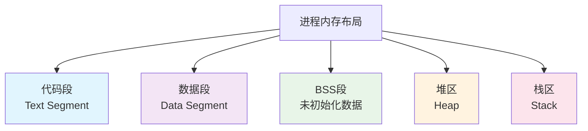
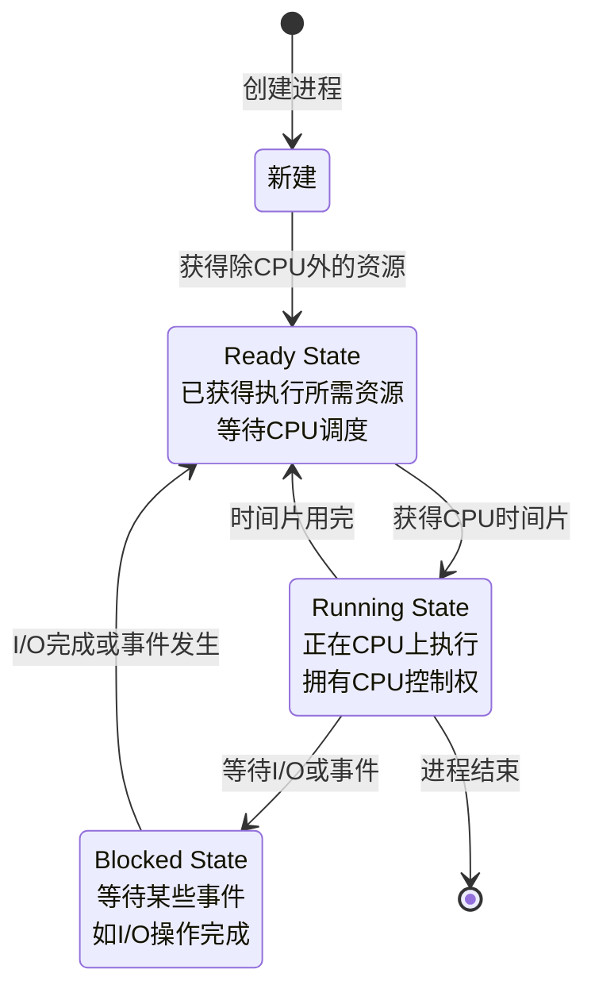
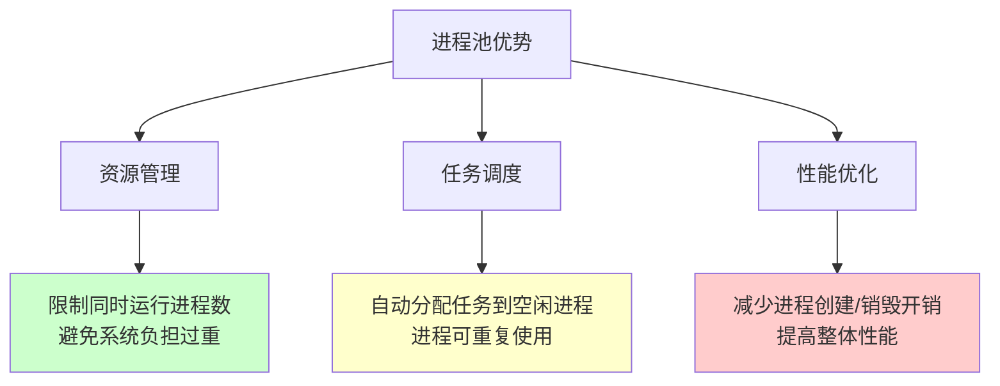

# 第二部分：多进程

## 1. 进程基础理论

### 1.1 进程的定义与组成

#### 1.1.1 进程的定义

- **狭义定义**：进程是正在运行的程序实例，比如运行一个 python 脚本。
- **广义定义**：进程是一个程序在操作系统中的一次执行实例，包含程序、数据、以及系统为执行该程序分配的资源。

#### 1.1.2 进程与程序的区别

- **程序**是静态的，它只是存储在磁盘上的代码文件。
- **进程**是程序的动态实例，是操作系统进行资源分配和管理的基本单位，包含程序代码及其运行时所需的资源。

一个程序可以有多个进程实例，每个进程互相独立执行。

#### 1.1.3 进程的组成

一个进程主要由以下部分组成：

1. **程序段（代码段）**：存储在内存中的代码段，是进程执行的指令集，通常是只读的。
2. **数据段**：进程执行时所需的数据，包括全局变量、静态变量等已初始化数据。
3. **BSS 段**：存储未初始化的全局变量和静态变量。
4. **堆区（Heap）**：用于动态内存分配，向高地址扩展，由程序员手动管理。
5. **栈区（Stack）**：用于存储函数参数、局部变量和函数调用信息，向低地址扩展。
6. **进程控制块（PCB）**：进程控制块是操作系统管理进程的关键，它记录进程的状态、程序计数器、寄存器内容等信息。

### 1.2 进程控制块与内存布局

#### 1.2.1 进程控制块（PCB）

进程控制块（Process Control Block，PCB）是操作系统用于管理和控制进程的核心数据结构。每个进程都有一个唯一的 PCB，它包含操作系统所需的所有信息来管理该进程。PCB 主要包括以下信息：

1. **进程标识信息**：

   - 进程 ID（PID）
   - 父进程 ID（PPID）
   - 用户 ID 和组 ID

2. **处理器状态信息**：

   - 程序计数器（PC）：指向下一条要执行的指令地址
   - CPU 寄存器：包括通用寄存器、累加器、索引寄存器等
   - 程序状态字（PSW）寄存器：包含条件码、执行模式、中断屏蔽等信息

3. **进程调度信息**：

   - 进程状态（就绪、运行、阻塞等）
   - 进程优先级
   - 调度队列指针

4. **内存管理信息**：

   - 基址寄存器
   - 界限寄存器
   - 页表或段表指针

5. **I/O 状态信息**：
   - 分配给进程的 I/O 设备列表
   - 打开的文件列表
   - I/O 操作状态

#### 1.2.2 进程内存布局

一个进程在内存中的典型布局如下：



- **代码段（Text Segment）**：存放程序的可执行代码，通常是只读的，可以被多个进程共享。
- **数据段（Data Segment）**：存放已初始化的全局变量和静态变量。
- **BSS 段**：存放未初始化的全局变量和静态变量，程序启动时通常被初始化为 0。
- **堆区（Heap）**：用于动态内存分配，由程序员手动管理，向高地址扩展。
- **栈区（Stack）**：用于存储函数调用信息、局部变量等，由系统自动管理，向低地址扩展。

#### 1.2.3 上下文切换

上下文切换是操作系统在不同进程间切换 CPU 控制权的过程，主要包括以下步骤：

1. 保存当前进程的 CPU 状态（寄存器、程序计数器等）
2. 更新当前进程的 PCB 信息
3. 选择下一个要执行的进程
4. 更新被选中进程的 PCB 信息
5. 恢复被选中进程的 CPU 状态
6. 将控制权交给被选中的进程

上下文切换是多任务操作系统的核心机制，但频繁的上下文切换会影响系统性能。

### 1.3 进程标识符与层次关系

#### 1.3.1 进程标识符（PID）

每个进程都有一个唯一的进程 ID（PID），操作系统通过 PID 来区分和管理进程。通过`os.getpid()`和`os.getppid()`可以获取当前进程和父进程的 PID。

```python
import os
import time

if __name__ == '__main__':
    print(f"当前进程PID: {os.getpid()}")
    print(f"父进程PID: {os.getppid()}")

    for i in range(3):
        time.sleep(1)
        print(f"第{i+1}秒 - 进程{os.getpid()}正在运行")
```

#### 1.3.2 父进程与子进程详解

**父进程（Parent Process）**：

- 创建其他进程（子进程）的进程
- 负责管理和监控子进程的执行
- 通常需要等待子进程完成或回收子进程资源
- 可以通过`os.getppid()`在子进程中获取父进程 PID

**子进程（Child Process）**：

- 由父进程创建的新进程
- 拥有自己独立的进程空间和 PID
- 创建时会继承父进程的代码，但数据空间是独立的
- 可以执行与父进程相同或不同的任务

### 1.4 进程状态与调度

#### 1.4.1 进程状态

进程的状态描述了它在生命周期中的不同阶段：



主要有三种基本状态：

- **就绪状态（Ready）**：进程已获得执行所需的资源，但正在等待 CPU 资源。
- **运行状态（Running）**：进程获得 CPU 资源并正在执行。
- **阻塞状态（Blocked）**：进程因等待某些事件（如 I/O 操作）而无法继续执行，进入阻塞状态。

#### 1.4.2 进程调度算法

现代操作系统很少使用教科书中的简单调度算法，而是采用复杂的混合调度策略。以下是实际系统中最常用的调度方式：

##### 1. 时间片轮转（Round Robin, RR）

- **核心思想**：每个进程分配固定时间片（如 10-100ms），时间片用完就切换到下一个进程
- **适用场景**：通用多任务系统（桌面、服务器）
- **特点**：公平但有上下文切换开销

##### 2. 多级反馈队列（Multilevel Feedback Queue, MFQ）

- **核心思想**：
  - 多个优先级队列（如 0-31 级）
  - 新进程进入高优先级队列
  - CPU 密集型进程逐渐降级，I/O 密集型保持高优先级
  - 自动优化交互式应用响应速度
- **实际系统**：
  - **Windows**：32 级优先级队列 + 动态优先级调整
  - **Linux (CFS)**：效果类似 MFQ（偏向短作业和交互式进程）

##### 3. 完全公平调度器（CFS - Completely Fair Scheduler）

- **核心思想**：
  - 不使用固定时间片
  - 基于“虚拟运行时间”公平分配 CPU
  - 使用红黑树高效管理进程
- **特点**：
  - 自动偏向短作业（类似 SJF 效果）
  - 保证交互式应用的响应性
  - **Linux 默认调度器**

#### 1.4.3 实时调度策略（Real-time Scheduling）

> 需要显式设置，普通进程不会自动使用！
>
> 普通的 linux 中 即使设置了 `SCHED_FIFO`，当内核正在处理系统调用、中断或其他内核任务时，实时进程**必须等待**

| 策略               | 算法                   | 特点                     | 适用场景           |
| ------------------ | ---------------------- | ------------------------ | ------------------ |
| **SCHED_FIFO**     | 先进先出               | 无时间片，高优先级可抢占 | 电机控制、数据采集 |
| **SCHED_RR**       | 时间片轮转             | 同优先级轮流执行         | 多个实时任务       |
| **SCHED_DEADLINE** | EDF (最早截止时间优先) | 基于截止时间调度         | 严格时间约束任务   |

##### 调度策略选择

| 应用类型       | 推荐调度策略   | 说明               |
| -------------- | -------------- | ------------------ |
| **Web 服务器** | CFS (默认)     | 自动优化短请求响应 |
| **桌面应用**   | MFQ/CFS        | 保证 UI 交互流畅   |
| **批处理任务** | CFS + 低优先级 | 避免影响其他进程   |
| **工业控制**   | SCHED_FIFO     | 确定性实时响应     |
| **音视频处理** | SCHED_RR       | 平衡多个实时流     |

##### 总结

1. **普通 Python 程序使用默认调度器**（Linux: CFS, Windows: MFQ）
2. **无法在代码中直接选择 FCFS/SJF 等经典算法**
3. **实时调度需要 RT-Linux + 显式设置**
4. **现代调度器都是混合型**，结合了多种算法的优点
5. **作为开发者，重点是理解原理，合理设置进程优先级**

## 2. 特殊进程类型

### 2.1 孤儿进程深入解析

**孤儿进程（Orphan Process）**是指父进程在子进程结束之前就终止了，使得子进程失去父进程的进程。

#### 2.1.1 孤儿进程的特点

- **产生原因**：父进程在子进程结束前意外终止或被强制杀死
- **系统处理**：孤儿进程会被 pid=1 的 init 进程（系统守护进程）收养
- **资源回收**：init 进程会对所有的孤儿进程进行资源回收
- **危害程度**：孤儿进程不会对系统造成危害，因为有 init 进程负责清理

#### 2.1.2 孤儿进程示例

- 注意在 **现代 Linux 桌面环境**（Ubuntu + systemd 用户会话）下，孤儿进程 **不会直接被 PID=1 的 init 收养**。
- 被收养的好处就是自动的回收子进程的退出状态！
- 在 **现代 Linux（尤其是 systemd 管理的系统）** 上，孤儿进程通常 **不会再被 `init` 直接收养**。
  而是：被一个称为 **“per-user systemd 实例”** 的进程（例如 `systemd --user`）接管。

```python
import os
import time
from multiprocessing import Process

def child_task():
    print(f"子进程启动，PID={os.getpid()}，父PID={os.getppid()}")
    for i in range(30):
        time.sleep(1)
        print(f"{i+1}秒 - 子进程PID={os.getpid()}，父PID={os.getppid()}")
        if os.getppid() == 1:
            print("👉 已被 init 收养，成为孤儿")

if __name__ == "__main__":
    print(f"主进程PID={os.getpid()}")
    p = Process(target=child_task)
    p.start()

    time.sleep(3)
    print("主进程强制退出")
    os._exit(0)  # ⚠️ 主进程立即消亡

```

### 2.2 僵尸进程成因与避免

**僵尸进程（Zombie Process）**是指子进程已经结束，但父进程还没有调用`wait()`或类似系统调用来收集子进程的退出状态信息。

- 父进程死掉时，僵尸进程会被 init 回收

- 简单理解就是爹还在但是不管他就变僵尸了！ （爹还在所以 init 无法插手回收！）

#### 2.2.1 僵尸进程的危害

- **资源占用**：虽然不占用实际的内存和 CPU，但会占用进程表项
- **系统限制**：大量僵尸进程会耗尽进程表，影响系统创建新进程
- **状态标识**：在`ps`命令中显示状态为"Z"

#### 2.2.2 产生僵尸进程的示例

```python
import time
import multiprocessing
import os

def zombie_child():
    """会变成僵尸进程的子进程"""
    print(f"子进程开始执行，PID: {os.getpid()}")
    print("子进程即将结束...")
    time.sleep(2)
    print("子进程结束")
    # 子进程结束后，如果父进程不调用join()，就会变成僵尸进程

if __name__ == '__main__':
    print(f"主进程PID: {os.getpid()}")

    # 创建多个子进程但不等待它们结束
    for i in range(3):
        process = multiprocessing.Process(target=zombie_child)
        process.start()
        # 注意：这里没有调用 process.join()
        print(f"子进程 {i+1} 已启动，PID可能是: {process.pid}")

    print("主进程继续执行其他任务...")
    time.sleep(30)  # 主进程继续运行30秒，子进程变成僵尸

    print("主进程即将结束")
```

**检查僵尸进程**：

```bash
# 在另一个终端执行
ps -ef | grep python
# 会看到状态为 Z+ 或 <defunct> 的进程
```

#### 2.2.3 避免僵尸进程的方法

- 使用 join()等待子进程结束！

**更优雅的处理方式**：

- 使用资源管理器，退出的时候自动的终止所有子进程

```python
import multiprocessing
import os
import time
from contextlib import contextmanager

@contextmanager
def managed_processes():
    """进程管理器，确保所有进程被正确清理"""
    processes = []
    try:
        yield processes
    finally:
        # 等待所有进程结束
        for process in processes:
            if process.is_alive():
                process.join(timeout=5)  # 最多等待5秒
                if process.is_alive():
                    process.terminate()  # 强制终止
                    process.join()
        print("所有进程已清理完毕")

def worker_task(name, duration):
    print(f"工作进程 {name} 开始，PID: {os.getpid()}")
    time.sleep(duration)
    print(f"工作进程 {name} 完成")

if __name__ == '__main__':
    with managed_processes() as processes:
        # 创建多个进程
        for i in range(3):
            p = multiprocessing.Process(
                target=worker_task,
                args=(f"Task-{i+1}", 2)
            )
            p.start()
            processes.append(p)

        print("所有进程已启动，等待完成...")

    print("程序结束，无僵尸进程")
```

### 2.3 守护进程（注意和系统的守护进程不同）

**守护进程（Daemon Process）**也叫精灵进程，是一种特殊的进程，一般在后台运行，不与任何控制终端相关联，并且周期性地执行某种任务或等待处理某些发生的事件。

#### 2.3.1 守护进程的特点

1. **生存周期**：一般启动了以后就会一直驻留在操作系统中，直到**主进程结束**。
2. **自动结束**：主进程创建了守护进程以后，守护进程作为一个特殊的子进程会随着主进程的代码结束而自动结束。
3. **进程限制**：守护进程内不允许再开子进程（孙子进程）。
4. **终端独立**：守护进程是在后台运行，和终端无关联，不会占着终端，终端可以执行其他命令或操作。

#### 2.3.2 守护进程示例

```python
import time
import os
from multiprocessing import Process

def daemon_task():
    """守护进程任务"""
    print(f"守护进程启动，PID: {os.getpid()}")
    count = 0
    while True:
        count += 1
        print(f"守护进程运行中... 计数: {count}")
        time.sleep(2)

        # 避免无限运行，实际守护进程通常是无限循环
        if count >= 10:
            print("守护进程达到最大计数，准备结束")
            break

if __name__ == '__main__':
    print(f"主进程PID: {os.getpid()}")

    # 创建守护进程
    daemon_process = Process(target=daemon_task)
    daemon_process.daemon = True  # 设置为守护进程，必须在start()之前设置
    daemon_process.start()

    print("主进程继续执行其他任务...")

    # 主进程执行一些任务
    for i in range(5):
        time.sleep(1)
        print(f"主进程工作中... {i+1}/5")

    print("主进程即将结束")
    time.sleep(1)
    print("主进程结束 - 守护进程也会自动结束")

    # 注意：不需要调用 daemon_process.join()
    # 因为守护进程会随主进程结束而自动结束
```

#### 2.3.3 守护进程 vs 普通子进程

| 特性                  | 普通子进程                                       | 守护进程 (`daemon=True`)                                        |
| --------------------- | ------------------------------------------------ | --------------------------------------------------------------- |
| **生命周期**          | 独立运行，主进程结束后仍可继续执行，直到任务完成 | 随主进程结束而强制终止                                          |
| **用途**              | 执行主要任务或需要保证完成的工作                 | 执行辅助性或后台任务，不保证完成                                |
| **主进程等待**        | 默认情况下，`join()` 可等待其完成                | 主进程退出时自动结束，`join()` 可等待，但主进程结束前可能被终止 |
| **与终端/输出的关系** | 可继承主进程终端，输出可见                       | 不依赖终端，通常用于后台辅助任务                                |
| **创建方式**          | `Process(target=func)`                           | `p = Process(target=func); p.daemon = True`                     |
| **典型应用**          | 数据处理、计算任务、文件操作                     | 日志记录、状态监控、定时清理、后台轮询                          |

## 3. 进程创建与管理

### 3.1 os.fork() 的工作原理

`os.fork()` 是基于 Linux/Unix 系统的系统调用，它用于创建一个子进程。Windows 系统不支持 `fork()`，因此在 Windows 下执行时会报错。

#### 3.1.1 fork() 工作机制

- 父进程返回的是子进程的 pid
- 子进程返回的是父进程的 pid，固定为 0

#### 3.1.2 基础示例

- 创建子进程
- 创建子进程的时候，子进程中返回的 0，父进程返回的是子进程的 PID（因为一个父进程可能会有多个子进程）

```python
import os

if __name__ == '__main__':
    w = 100
    print(f"fork前: PID={os.getpid()}, w={w}")

    pid = os.fork()  # 创建子进程

    if pid == 0:
        # 子进程执行的代码
        w = 200  # 子进程修改变量（不影响父进程）
        print(f"子进程: PID={os.getpid()}, PPID={os.getppid()}, w={w}")
        print("子进程工作完成")
    else:
        # 父进程执行的代码
        print(f"父进程: PID={os.getpid()}, 创建了子进程PID={pid}")
        print(f"父进程: w={w}")  # 父进程的w仍然是100

        # 等待子进程结束
        os.waitpid(pid, 0)  # 0代表阻塞等待子进程结束
        print("父进程：子进程已结束")
```

#### 3.1.3 fork() 的优缺点

**优点**：

- 创建速度快（写时复制机制）
- 完全的内存隔离，安全性高
- 符合 Unix 哲学的简洁设计

**缺点**：

- 仅支持 Unix/Linux 系统
- 内存使用量较大（虽然有写时复制优化）
- 不适合需要共享大量数据的场景
- fork 后如果不 `wait()` / `waitpid()` 回收子进程 → 子进程变**僵尸进程**

### 3.2 multiprocessing 实现多进程

`multiprocessing` 模块是 Python 提供的多进程库，它提供了比 `os.fork()` 更丰富的功能，并且能在 Windows 和 Linux 下跨平台使用。

#### 3.2.1 基础用法

- 创建并等待子进程执行结束

```python
import os
import time
import multiprocessing

def worker_task(name, duration):
    """工作进程任务"""
    print(f"进程 {name} 开始工作，PID: {os.getpid()}")

    for i in range(duration):
        time.sleep(1)
        print(f"进程 {name} 工作中... {i+1}/{duration}")

    print(f"进程 {name} 工作完成")
    return f"进程 {name} 的结果"

if __name__ == '__main__':
    print(f"主进程PID: {os.getpid()}")

    # 创建进程
    process = multiprocessing.Process(
        target=worker_task,
        args=("Worker-1", 3)
    )

    print("启动子进程...")
    process.start()

    print("主进程继续执行其他任务")
    time.sleep(1)

    print("等待子进程结束...")
    process.join()

    print("所有任务完成")
```

#### 3.2.2 Process 类的方法和属性

**常用方法**：

| 方法名            | 描述                                                                      |
| :---------------- | :------------------------------------------------------------------------ |
| p.start()         | 在主进程中启动子进程 p，并调用该子进程 p 中的 run()方法                   |
| p.run()           | 子进程 p 启动时运行的方法，去调用 start 方法的参数 target 指定的函数/方法 |
| p.join([timeout]) | 主进程等待子进程结束，可指定超时时间                                      |
| p.terminate()     | 强制终止子进程 p（需要谨慎使用）                                          |
| p.is_alive()      | 检测进程是否还存活                                                        |
| p.kill()          | 强制杀死进程（Python 3.7+）                                               |

**常用属性**：

| 属性名     | 描述                                   |
| :--------- | :------------------------------------- |
| p.name     | 进程的名称                             |
| p.pid      | 进程的唯一标识符                       |
| p.daemon   | 是否为守护进程（必须在 start()前设置） |
| p.exitcode | 进程的退出码                           |

#### 3.2.3 传递参数（区别于 ipc，只是在运行的时候传递参数）

1. **args 必须顺序正确**：位置参数是靠顺序匹配的。
   - 如果 `args=("张三",)` 只给了一个参数，就会报错缺少 `age`。
2. **kwargs 必须名字正确**：关键字参数要和函数签名里的参数名一致。
   - 如果写错 `{"nam": "李四"}` 会报错 `unexpected keyword argument 'nam'`。
3. **混合时，args 先匹配前面的位置参数，kwargs 负责补充/覆盖**。

```python
import multiprocessing

def task_with_args(name, age, city="Unknown", **kwargs):
    """接收不同类型参数的任务"""
    print(f"姓名: {name}, 年龄: {age}, 城市: {city}")
    print(f"其他信息: {kwargs}")

def demonstrate_arguments():
    """演示不同的参数传递方式"""
    processes = []

    # 方式1: 使用args传递位置参数
    p1 = multiprocessing.Process(
        target=task_with_args,
        args=("张三", 25)
    )

    # 方式2: 使用kwargs传递关键字参数
    p2 = multiprocessing.Process(
        target=task_with_args,
        kwargs={"name": "李四", "age": 30, "city": "北京"}
    )

    # 方式3: 混合使用
    p3 = multiprocessing.Process(
        target=task_with_args,
        args=("王五", 28),
        kwargs={"city": "上海", "job": "程序员", "hobby": "编程"}
    )

    processes = [p1, p2, p3]

    # 启动并等待所有进程
    for p in processes:
        p.start()

    for p in processes:
        p.join()

if __name__ == '__main__':
    demonstrate_arguments()
```

### 3.3 自定义 Process 类

#### 3.3.1 继承 Process 类

- 重写 run，自定义运行逻辑！

优点：

- 封装性更强
- 数据与逻辑绑定，便于管理

```python
import os
import time
from multiprocessing import Process, current_process

class CustomWorker(Process):
    """自定义工作进程类"""

    def __init__(self, task_name, work_duration, *args, **kwargs):
        super().__init__(*args, **kwargs)
        self.task_name = task_name
        self.work_duration = work_duration
        self.result = None

    def run(self):
        """重写run方法，定义进程要执行的任务"""
        current = current_process()
        print(f"自定义进程 {current.name} 开始执行任务: {self.task_name}")
        print(f"进程PID: {os.getpid()}")

        # 执行具体任务
        for i in range(self.work_duration):
            time.sleep(1)
            print(f"{current.name} - {self.task_name} 进度: {i+1}/{self.work_duration}")

        self.result = f"{self.task_name} 完成"
        print(f"自定义进程 {current.name} 任务完成")

class DataProcessor(Process):
    """数据处理进程类"""

    def __init__(self, data_list, process_func, name=None):
        super().__init__(name=name)
        self.data_list = data_list
        self.process_func = process_func
        self.processed_data = []

    def run(self):
        """处理数据"""
        print(f"数据处理进程 {self.name} 开始处理 {len(self.data_list)} 个数据项")

        for i, data in enumerate(self.data_list):
            processed = self.process_func(data)
            self.processed_data.append(processed)
            print(f"{self.name}: 处理 {i+1}/{len(self.data_list)} - {data} -> {processed}")
            time.sleep(0.5)

        print(f"数据处理进程 {self.name} 完成")

def square(x):
    """平方函数"""
    return x * x

def demonstrate_custom_process():
    """演示自定义进程类"""
    print(f"主进程PID: {os.getpid()}")

    # 创建自定义工作进程
    workers = [
        CustomWorker("数据清洗", 3, name="Cleaner"),
        CustomWorker("数据分析", 4, name="Analyzer"),
        CustomWorker("报告生成", 2, name="Reporter")
    ]

    # 创建数据处理进程
    data_processor = DataProcessor(
        data_list=[1, 2, 3, 4, 5],
        process_func=square,
        name="DataProcessor"
    )

    all_processes = workers + [data_processor]

    # 启动所有进程
    for p in all_processes:
        p.start()
        print(f"启动进程: {p.name}")

    # 等待所有进程完成
    for p in all_processes:
        p.join()
        print(f"进程 {p.name} 已结束")

    print("所有自定义进程已完成")

if __name__ == '__main__':
    demonstrate_custom_process()
```

### 3.4 Windows 系统特殊处理

在 Windows 下，Python 使用 `multiprocessing` 模块时会通过导入父进程的代码来创建子进程，因此需要注意以下几点：

#### 3.4.1 Windows 下的进程创建机制

在 Windows 系统下，Python 多进程的创建机制与 Unix/Linux 系统有显著差异：

1. **启动方式**: 当调用 `Process.start()` 时，Windows 操作系统会启动一个新的 Python 解释器实例。

2. **代码导入**: 新的 Python 解释器会重新导入主模块（即包含 multiprocessing 代码的脚本），这意味着整个脚本文件会被重新执行。

3. **模块级代码执行**: 由于重新导入，所有在模块级别定义的代码（不在 `if __name__ == '__main__':` 保护下的代码）都会被执行。

4. **目标函数执行**: Python 解释器找到通过`target`参数指定的函数，并在新进程中执行该函数。

5. **进程运行**: 子进程执行指定的任务。

6. **进程结束**: 任务完成后，子进程结束并退出。

这种机制的关键点是 Windows 下进程创建不像 Unix 的 fork 那样复制内存空间，而是重新启动一个全新的 Python 解释器并重新执行脚本，这可能导致意外的行为，特别是会造成无限递归创建进程的问题。

#### 3.4.2 必须使用 `if __name__ == '__main__':`

**错误示例（会导致无限递归）**：

```python
# 错误：没有使用 if __name__ == '__main__'
import multiprocessing

def worker():
    print("工作进程执行")

# 危险：在Windows下会无限创建进程
process = multiprocessing.Process(target=worker)
process.start()
process.join()
```

**正确示例**：

```python
import multiprocessing
import os

def worker(name):
    print(f"工作进程 {name} 执行，PID: {os.getpid()}")

def safe_windows_example():
    """Windows安全的多进程示例"""
    print(f"主进程PID: {os.getpid()}")

    processes = []

    for i in range(3):
        p = multiprocessing.Process(
            target=worker,
            args=(f"Worker-{i+1}",)
        )
        processes.append(p)
        p.start()

    for p in processes:
        p.join()

    print("所有进程完成")

if __name__ == '__main__':
    # 只有在作为主程序运行时才执行多进程代码
    safe_windows_example()
```

#### 3.4.3 跨平台兼容性处理

```python
import multiprocessing
import os
import platform

def cross_platform_task(data):
    """跨平台任务"""
    system = platform.system()
    pid = os.getpid()
    print(f"系统: {system}, 进程PID: {pid}, 处理数据: {data}")
    return data * 2

def get_process_count():
    """根据系统获取合适的进程数"""
    cpu_count = multiprocessing.cpu_count()
    system = platform.system()

    if system == "Windows":
        # Windows下创建进程开销较大，使用较少的进程，或执行其他的操作
        return min(4, cpu_count)
    else:
        # Unix-like系统可以使用更多进程
        return cpu_count

def cross_platform_demo():
    """跨平台多进程演示"""
    print(f"当前系统: {platform.system()}")
    print(f"CPU核心数: {multiprocessing.cpu_count()}")

    process_count = get_process_count()
    print(f"使用进程数: {process_count}")

    # 准备数据
    data_list = list(range(1, 11))

    # 创建进程池处理数据（进程池将在后面详细介绍）
    with multiprocessing.Pool(process_count) as pool:
        results = pool.map(cross_platform_task, data_list)

    print(f"处理结果: {results}")

if __name__ == '__main__':
    cross_platform_demo()
```

## 4. 进程间通信与同步

### 4.1 进程数据隔离

在操作系统中，父进程和子进程的数据段是隔离的。子进程在创建时会复制父进程的内存空间，但它们的数据段是独立的。即使父进程和子进程有相同的代码段，它们的内存中的数据是各自独立的。

#### 4.1.1 数据隔离示例

```python
import time
from multiprocessing import Process

num = 100
def func():
    global num
    num -= 1
if __name__ == '__main__':
    process_list = []
    for i in range(10):
        p = Process(target=func)
        p.start()
        process_list.append(p)
    t2 = time.time()
    for p in process_list:
        p.join()

    print(num)  # num=?

```

### 4.2 一：管道 Pipe

管道分为两类（内核缓冲区在内核态转运数据，进程在用户态读写，Python 会对对象做序列化/反序列化）：

- 匿名管道（unnamed pipe）：仅在有亲缘关系的进程之间使用，`multiprocessing.Pipe` 属此类（底层可能由匿名管道或套接字对实现）。
- 命名管道（named pipe/FIFO）：在同一主机不同进程间通过一个命名路径通信，通常是 Unix 的特殊设备文件。

要点：

- 模式：点对点、全双工（`Pipe` 端点成对出现）；FIFO（命名管道）通常是字节流，适合顺序消息。
- 适用：父子进程、两个组件间快速互通；命名管道适合不同进程/语言间对接。
- 注意：端点数量有限，不适合 1→N 广播；对象需可被 pickle；FIFO 为 Unix 特性，Windows 支持有限。

#### 4.2.1 匿名管道（multiprocessing.Pipe）

```python
from multiprocessing import Process, Pipe
import os, time

def sender(conn, name):
    for msg in (f"hello from {name}", 123, {"ok": True}):
        conn.send(msg)
        print("发送:", msg)
        time.sleep(0.2)
    conn.send("END")
    conn.close()

def receiver(conn):
    while True:
        msg = conn.recv()
        if msg == "END":
            print("接收: 结束信号")
            break
        print("接收:", msg)
    conn.close()

if __name__ == "__main__":
    pconn, cconn = Pipe()
    p1 = Process(target=sender, args=(cconn, "child"))
    p2 = Process(target=receiver, args=(pconn,))
    p1.start(); p2.start()
    p1.join(); p2.join()
```

#### 4.2.2 命名管道（FIFO，Unix）

```python
import os, time, sys
from multiprocessing import Process

FIFO_PATH = "./demo_fifo"

def fifo_reader(path):
    with open(path, "r") as f:
        for line in f:
            print("读到:", line.strip())

def fifo_writer(path):
    with open(path, "w") as f:
        for msg in ["hello", "fifo", "pipe"]:
            f.write(msg + "\n"); f.flush()
            print("写入:", msg)
            time.sleep(0.2)

if __name__ == "__main__":
    if os.name != "posix":
        print("命名管道(FIFO)示例仅适用于 Unix-like 平台")
        sys.exit(0)

    # 创建 FIFO（若已存在先移除）
    if os.path.exists(FIFO_PATH):
        os.remove(FIFO_PATH)
    os.mkfifo(FIFO_PATH)

    try:
        # 先启动读者，再稍后启动写者（避免双方阻塞过久）
        r = Process(target=fifo_reader, args=(FIFO_PATH,))
        r.start(); time.sleep(0.1)
        w = Process(target=fifo_writer, args=(FIFO_PATH,))
        w.start(); r.join(); w.join()
    finally:
        os.remove(FIFO_PATH)
```

### 4.3 二：消息队列 Queue

`Queue` 提供先进先出（FIFO）的消息传递，封装了底层管道与锁，适合多生产者/多消费者的任务分发与结果收集。

要点：

- 支持 1→N、M→N 模式，天然适合生产者-消费者、工作队列、任务风扇（fan-out/fan-in）。
- 自带锁与缓冲，`maxsize` 可做背压；`get/put` 有阻塞/超时选择。
- 传输对象需可 pickle；相较共享内存有序列化与拷贝开销，胜在易用与解耦。

#### 4.3.1 基础示例

```python
from multiprocessing import Process, Queue
import os, time

def producer(q, n=5):
    for i in range(n):
        item = f"item-{i}"
        q.put(item)
        print("生产:", item)
        time.sleep(0.2)
    q.put("END")

def consumer(q):
    while True:
        x = q.get()
        if x == "END":
            print("消费: 结束信号")
            break
        print("消费:", x)

if __name__ == "__main__":
    q = Queue()
    p1 = Process(target=producer, args=(q,))
    p2 = Process(target=consumer, args=(q,))
    p1.start(); p2.start()
    p1.join(); p2.join()
```

### 4.4 三：共享内存

共享内存让多个进程直接读写同一块内存，实现零拷贝低延迟；Python 提供两类方式：

- `Value/Array`：基于 `ctypes` 的定长、定类型共享变量/数组，简单高效；
- `SharedMemory`：命名共享内存块，更灵活，适合大块二进制或配合 numpy 使用。

`multiprocessing.Value` 与 `multiprocessing.Array` 使用底层共享内存（基于 `ctypes`），让多个进程在同一块内存上读写标量或数组，速度快、开销小，适合数值型共享状态。

要点：

- 优点：零拷贝、吞吐高；适合热数据、矩阵/图像等数值密集型场景。
- 约束：需要搭配同步原语（`Lock/Condition` 等）保证一致性；自行设计内存布局与生命周期。

#### 4.4.1 Value/Array 基础示例（计数与数组）

```python
from multiprocessing import Process, Value, Array, Lock
import time

def add_counter(counter, lock, n):
    for _ in range(n):
        with lock:
            counter.value += 1
        time.sleep(0.001)

def square_inplace(nums, lock):
    with lock:
        for i in range(len(nums)):
            nums[i] = nums[i] * nums[i]

if __name__ == "__main__":
    counter = Value('i', 0)
    nums = Array('i', [1, 2, 3, 4])
    lock = Lock()

    ps = [Process(target=add_counter, args=(counter, lock, 1000)) for _ in range(4)]
    for p in ps: p.start()
    for p in ps: p.join()
    print("计数结果:", counter.value)

    p = Process(target=square_inplace, args=(nums, lock))
    p.start(); p.join()
    print("平方后:", list(nums))
```

#### 4.4.2 SharedMemory 基础示例（字节视图）

```python
from multiprocessing import Process
from multiprocessing.shared_memory import SharedMemory

def reader(name, size):
    shm = SharedMemory(name=name)
    try:
        data = bytes(shm.buf[:size])
        print("子进程读取:", data.decode())
    finally:
        shm.close()

if __name__ == "__main__":
    shm = SharedMemory(create=True, size=64)
    try:
        shm.buf[:11] = b"hello world"
        p = Process(target=reader, args=(shm.name, 11))
        p.start(); p.join()
    finally:
        shm.close(); shm.unlink()
```

### 4.5 四：信号量 Semaphore

`Semaphore` 是一种计数型同步原语，用于限制同时访问共享资源的进程数（如连接池/并发上限）。也可作为轻量的“限流通信”：许可即“资源票”。

要点：

- 模式：通过 `acquire/release` 领取/归还配额；`BoundedSemaphore` 防止超额归还。
- 适用：控制并发、保护稀缺资源（文件句柄、数据库连接）。
- 注意：不承载数据载荷，常与队列/共享内存配合使用；调小许可可做背压。

#### 4.5.1 基础示例

```python
from multiprocessing import Process, Semaphore
import time, os, random

def worker(i, sem: Semaphore):
    with sem:  # 获取一个许可
        print(f"{os.getpid()} 开始任务 {i}")
        time.sleep(random.uniform(0.2, 0.6))
        print(f"{os.getpid()} 结束任务 {i}")

if __name__ == "__main__":
    sem = Semaphore(3)  # 最多允许3个并发进入
    ps = [Process(target=worker, args=(i, sem)) for i in range(8)]
    for p in ps: p.start()
    for p in ps: p.join()
```

### 4.6 五：信号 Signal

信号是内核向进程发送的异步通知，常用于中断、终止、配置重载、用户自定义事件（`SIGUSR1/2`）。进程可向目标 PID 发送信号实现轻量通信（Unix）。

要点：

- 特性：异步、无载荷或载荷极少（RT 信号可携少量）；不可高频滥用。
- 跨平台：Unix 友好，Windows 支持有限；适合作为“触发器”，非数据通道。
- 典型：优雅退出、日志轮转、配置热加载，配合其他 IPC 传递数据。

#### 4.6.1 基础示例（Unix 下 SIGUSR1）

```python
import os
import signal
import time
from multiprocessing import Process

flag = False


def handler(signum, frame):
    global flag
    flag = True
    print("主进程收到信号:", signum)


def child_sender(ppid):
    time.sleep(0.2)
    if hasattr(signal, "SIGUSR1"):
        os.kill(ppid, signal.SIGUSR1)   # 发送 SIGUSR1 信号
    else:
        print("当前平台不支持 SIGUSR1 示例")


if __name__ == "__main__":
    if hasattr(signal, "SIGUSR1"):  # 检查平台是否支持 SIGUSR1
        signal.signal(signal.SIGUSR1, handler)  # 注册信号处理器

    p = Process(target=child_sender, args=(os.getpid(),))
    p.start()
    p.join()
    print("标志位:", flag)

```

### 4.7 六：套接字 Socket

套接字是最通用的进程间通信方式，既可本机也可跨主机。支持流式（TCP）与数据报（UDP），需要协议设计与健壮的错误处理。

要点：

- 连接方式：TCP（有序可靠，适合长连接）、UDP（无连接低延迟，需自行容错）。
- 适用：跨语言/跨主机、服务化拆分、模块边界清晰的系统。
- 注意：安全与鉴权、超时与重试、粘包与分包（TCP）等工程细节需处理。

#### 4.7.1 基础示例（本地 TCP）

```python
import socket, time
from multiprocessing import Process

ADDR = ("127.0.0.1", 6001)

def server():
    s = socket.socket(socket.AF_INET, socket.SOCK_STREAM)
    s.setsockopt(socket.SOL_SOCKET, socket.SO_REUSEADDR, 1)
    s.bind(ADDR); s.listen(1)
    conn, addr = s.accept()
    data = conn.recv(1024)
    print("服务端收到:", data.decode())
    conn.sendall(b"OK:" + data)
    conn.close(); s.close()

def client():
    c = socket.socket(socket.AF_INET, socket.SOCK_STREAM)
    c.connect(ADDR)
    c.sendall(b"hello")
    print("客户端收到:", c.recv(1024).decode())
    c.close()

if __name__ == "__main__":
    ps = [Process(target=server)]
    ps[0].start(); time.sleep(0.2)
    ps.append(Process(target=client))
    ps[1].start()
    for p in ps: p.join()
```

### 4.8 进程同步与锁机制

在多进程环境中，多个进程访问共享资源时，可能会导致数据不一致。为了避免这种情况，需要使用同步原语约束并发访问。常见原语：`Lock`、`RLock`、`Semaphore/BoundedSemaphore`、`Event`、`Condition`、`Barrier`。

#### 4.8.1 使用 Lock 解决问题

`Manager` 是 Python `multiprocessing` 模块提供的一个**进程间共享状态的管理器**。它允许你在**多个进程之间安全地共享和修改复杂对象**（如字典、列表、命名空间等）。

- Manager **本地进程的同步原语**，**无法被 manager 代理对象安全使用**。（如果涉及到 lock Condition 也需要使用 manager 来创建！！！）

```python
from multiprocessing import Process, Lock, Manager

def deposit(account, lock, n):
    for _ in range(n):
        with lock:
            account["balance"] += 1  # 非原子操作，用锁保护

if __name__ == "__main__":
    with Manager() as m:
        account = m.dict(balance=0)
        lock = Lock()

        ps = [Process(target=deposit, args=(account, lock, 1000)) for _ in range(4)]
        for p in ps: p.start()
        for p in ps: p.join()

        print("最终余额:", account["balance"])  # 预期 4000
```

#### 4.8.2 RLock 可重入锁

同一进程/线程内允许对同一把锁重复加锁，适合递归或需要在持锁函数内部再次调用持锁函数的场景。

```python
from multiprocessing import RLock, Lock

lock = RLock()
def f():
    with lock:
        print("外层持锁")
        g()
def g():
    with lock:  # 若用普通 Lock，将会死锁
        print("内层持锁")


# 普通锁
lock2 = Lock()
def f2():
    with lock2:
        print("外层持锁")
        g2()
def g2():
    with lock2:  # 使用普通锁不会死锁
        print("内层持锁")
if __name__ == "__main__":
    f()
    f2()

```

#### 4.8.3 Semaphore 与 BoundedSemaphore

用于限制并发进入临界区的数量；示例见 4.5 通信方式四：信号量 Semaphore。

#### 4.8.4 Event 事件

用于一次性/多次广播信号，等待者通过 `event.wait()` 挂起，触发方 `set()` 放行。

```python
from multiprocessing import Process, Event
import time

def worker(evt: Event, i: int):
    print(f"工人{i} 等待开工信号...")
    evt.wait()  # 等待 set
    print(f"工人{i} 开始工作")

if __name__ == "__main__":
    evt = Event()
    ps = [Process(target=worker, args=(evt, i)) for i in range(3)]
    for p in ps: p.start()
    time.sleep(1)
    print("主管发出开工信号")
    evt.set()
    for p in ps: p.join()
```

#### 4.8.5 Condition 条件变量

在持有锁的基础上，支持等待特定条件并由生产者 `notify/notify_all` 唤醒，适合精准的生产者/消费者协调。

- **`Event`**：只能表达 **“一件事发生了”**（二值信号：`set` / `clear`）。
- **`Condition`**：可以表达 **“某个条件满足了”**，并支持**复杂的等待逻辑 + 多进程协调**。

```python
from multiprocessing import Process, Manager
import time


def producer(buf, cond):
    for i in range(5):
        with cond:
            buf.append(i)
            print("生产:", i)
            cond.notify()
        time.sleep(0.2)


def consumer(buf, cond):
    for _ in range(5):
        with cond:
            while not buf:
                cond.wait()
            v = buf.pop(0)
            print("消费:", v)


if __name__ == "__main__":
    with Manager() as manager:
        buf = manager.list()
        # ✅ 关键：从 manager 创建 Lock 和 Condition
        lock = manager.Lock()
        cond = manager.Condition(lock)

        p1 = Process(target=producer, args=(buf, cond))
        p2 = Process(target=consumer, args=(buf, cond))

        p1.start()
        p2.start()

        p1.join()
        p2.join()

```

#### 4.8.6 Barrier 屏障

让一组进程在屏障处等待，直到凑齐指定数量再一起继续。

```python
from multiprocessing import Process, Barrier
import os

def worker(i, bar: Barrier):
    print(f"{os.getpid()} 到达屏障 {i}")
    bar.wait()
    print(f"{os.getpid()} 通过屏障 {i}")

if __name__ == "__main__":
    bar = Barrier(3)
    ps = [Process(target=worker, args=(i, bar)) for i in range(3)]
    for p in ps: p.start()
    for p in ps: p.join()
```

### 4.9 IPC 方式对比总结

- 管道 Pipe：点对点、全双工、轻量快速；匿名管道多用于亲缘进程，命名管道可用于同机不同进程；需自管并发安全。
- 消息队列 Queue：多生产者/消费者、顺序化任务分发，内置锁，使用简单；序列化与拷贝开销较高。
- 共享内存（Value/Array/SharedMemory）：高性能、零拷贝；需自行设计内存布局并做好同步保护。
- 信号量 Semaphore：通过许可数量控制并发，适合连接池/限流；不传输数据本身。
- 信号 Signal：异步通知，轻量触发事件；携带信息有限，跨平台差异明显（Windows 支持受限）。
- 套接字 Socket：最通用、可跨主机；需设计协议与序列化，网络健壮性需考虑。

同步原语选型建议：

- 简单互斥：Lock；需要可重入：RLock
- 限制并发：Semaphore/BoundedSemaphore
- 广播信号：Event；条件等待：Condition；分批齐步走：Barrier

## 5. 进程池与子进程管理

### 5.1 进程池 (Pool) 详解

当需要启动大量的子进程时，直接使用 `Process` 创建进程可能会导致进程创建和管理的开销变得过大。为了提高效率和简化进程管理，可以使用进程池 (`Pool`) 来批量管理子进程。



#### 5.1.1 进程池核心概念

**进程池的工作原理**：

- 预先创建一定数量的进程，避免频繁创建和销毁的开销
- 任务队列管理，自动分配任务给空闲的工作进程
- 任务完成后进程不销毁，继续等待处理下一个任务

**进程池的优势**：

- **性能优化**：减少进程创建/销毁的开销
- **资源控制**：限制并发进程数量，避免系统资源耗尽
- **简化管理**：自动管理进程生命周期

**适用场景**：

- 大量独立的计算密集型任务
- 需要控制并发数量的场景
- 重复执行相同类型任务的场景

#### 5.1.2 进程池的不同方法

`multiprocessing.Pool` 提供多种任务调度方法，每种方法适用于不同的使用场景：

| 方法                        | 特点                                                  | 场景                                 |
| --------------------------- | ----------------------------------------------------- | ------------------------------------ |
| `pool.map(func, iterable)`  | 阻塞式，按顺序返回结果，类似内置`map`                 | 任务简单、顺序处理、需完整结果       |
| `pool.map_async(...)`       | 异步非阻塞，返回`AsyncResult`对象，需`.get()`获取结果 | 需要并发执行 + 后续处理              |
| `pool.apply(func, args)`    | 单任务阻塞调用（一次只派一个任务）                    | 调试或特殊单任务                     |
| `pool.apply_async(...)`     | 单任务异步调用，返回`AsyncResult`，可加回调           | 灵活控制每个任务 + 回调              |
| `pool.imap(func, iterable)` | 返回迭代器，结果按输入顺序逐个产生，边算边取          | 数据量大，边计算边处理，降低内存占用 |

#### 5.1.3 基础进程池示例

```python
from multiprocessing import Pool
import os
import time

def cpu_intensive_task(n):
    """计算密集型任务示例"""
    result = sum(i*i for i in range(n))
    return result

def basic_pool_demo():
    """基础进程池演示"""
    print(f"主进程PID: {os.getpid()}")

    # 创建任务数据
    tasks = [10000, 20000, 30000, 40000]

    # 创建进程池（最多4个进程同时执行）
    with Pool(processes=4) as pool:
        print("进程池已创建，开始处理任务...")

        start_time = time.time()

        # 使用 map 方法批量处理任务
        results = pool.map(cpu_intensive_task, tasks)

        end_time = time.time()

    print(f"总耗时: {end_time - start_time:.2f}秒")
    print(f"处理结果: {results[:3]}...")  # 只显示前3个结果

if __name__ == '__main__':
    basic_pool_demo()
```

#### 5.1.4 进程池 vs 手动创建进程对比

**何时使用进程池**：

- 重复大量任务 → `Pool` 更快（节省进程创建开销）
- 需要控制并发数量 → 使用 `Pool` 限制进程数
- 长期运行的任务调度 → 进程池适合长期复用

**何时使用手动创建进程**：

- 一次性小任务 → `Process` 更直接
- 进程生命周期各不相同 → 需要独立控制

```python
from multiprocessing import Process, Pool
import time
def task(x):
    return sum(i * i for i in range(10_000))

# 进程池方式（适用于重复任务）
def run_pool():
    with Pool(200) as pool:
        results = pool.map(task, range(20))
    return results

def run_processes():  # 手动创建进程（适用于一次性任务）
    processes = []
    results = []

    for i in range(200):
        p = Process(target=lambda x: x, args=(task(i),))
        processes.append(p)
        p.start()

    for p in processes:
        p.join()

    return results

# 性能对比示例
if __name__ == '__main__':
    # 对于重复任务，进程池通常更快
    t1 = time.time()
    run_pool()
    pool_time = time.time() - t1

    print(f"进程池耗时: {pool_time:.2f}秒")

    # 对于一次性任务，手动创建进程可能更合适
    t2 = time.time()
    run_processes()
    process_time = time.time() - t2
    print(f"手动创建进程耗时: {process_time:.2f}秒")

```

### 5.2 subprocess 模块详解

`subprocess` 模块是 Python 中用于创建和管理子进程的标准库，它允许你启动新的应用程序、连接到它们的输入/输出/错误管道，并获得返回码。

#### 5.2.1 核心概念

**主要功能**：

- 执行外部命令和程序
- 捕获命令的输出和错误
- 向子进程发送输入
- 控制进程的生命周期

**两种主要方式**：

- **subprocess.run()**: 同步执行，等待命令完成，适合简单的命令执行
- **subprocess.Popen**: 异步执行，返回进程对象，适合需要实时交互或精细控制的场景

#### 5.2.2 使用 subprocess.run()

`subprocess.run()` 是执行外部命令的推荐方式，它提供简单、安全的接口：

```python
import subprocess
import sys

def run_command_examples():
    """subprocess.run() 示例"""

    # 基础命令执行
    result = subprocess.run(['python', '--version'],
                          capture_output=True, text=True)
    print(f"Python版本: {result.stdout.strip()}")

    # 执行带参数的命令
    result = subprocess.run(['ls', '-la'],
                          capture_output=True, text=True)
    if result.returncode == 0:
        print("命令执行成功")
        print(f"输出行数: {len(result.stdout.split())}")
    else:
        print(f"命令执行失败，返回码: {result.returncode}")
        print(f"错误: {result.stderr}")

if __name__ == '__main__':
    run_command_examples()
```

#### 5.2.3 使用 subprocess.Popen

- **终端是交互式**：当你在终端直接运行 Python 脚本时，标准输出（stdout）通常是“行缓冲”或“无缓冲”的。只要遇到换行，或者缓冲区满了，内容就会立刻显示出来。
- **print 默认刷新**：在终端环境下，`print` 每输出一行，Python 通常会自动刷新缓冲区，所以你能立刻看到结果。
- 如果 `print` 的输出被重定向（比如用管道、文件，或者被 `subprocess.PIPE` 捕获），Python 会采用“全缓冲”模式，只有缓冲区满了或手动刷新（`flush=True`），内容才会被读取到。

```python
import time

for i in range(5):
    print(f"Step {i}", end='')  # 没有换行	最后才会输出
    time.sleep(1)
```

`Popen` 提供更底层的控制，适合需要实时交互的场景：

```python
import subprocess


def popen_example():
    """subprocess.Popen 实时输出示例"""

    # 使用 -u 参数让 Python 无缓冲输出
    process = subprocess.Popen(
        ['python', '-u', '-c',
            'import time; [print(f"Step {i}", flush=True) or time.sleep(1) for i in range(5)]'],
        stdout=subprocess.PIPE,
        stderr=subprocess.PIPE,
        text=True
    )

    # 实时读取输出
    while True:
        output = process.stdout.readline()
        if output == '' and process.poll() is not None:
            break
        if output:
            print(f"实时输出: {output.strip()}")

    # 获取最终结果
    _, stderr = process.communicate()
    print(f"进程结束，返回码: {process.returncode}")


if __name__ == '__main__':
    popen_example()

```

#### 5.2.4 错误处理和超时控制

正确的错误处理是使用 subprocess 的关键：

```python
import subprocess

def error_handling_example():
    """错误处理示例"""

    # 捕获命令执行错误
    try:
        result = subprocess.run(
            ['python', '-c', 'raise ValueError("错误示例")'],
            check=True,  # 如果返回码非0则抛出异常
            capture_output=True,
            text=True
        )
    except subprocess.CalledProcessError as e:
        print(f"命令执行失败，返回码: {e.returncode}")
        print(f"错误信息: {e.stderr}")

    # 超时控制
    try:
        result = subprocess.run(
            ['python', '-c', 'import time; time.sleep(5)'],
            timeout=2,  # 2秒超时
            capture_output=True,
            text=True
        )
    except subprocess.TimeoutExpired:
        print("命令执行超时")

if __name__ == '__main__':
    error_handling_example()
```

## 总结

Python 多进程编程的所有关键概念：

1. **进程基础理论**：进程的定义、组成、内存布局、PCB、状态转换和调度算法
2. **特殊进程类型**：孤儿进程、僵尸进程、守护进程的深入分析
3. **进程创建与管理**：os.fork()和 multiprocessing 模块的全面使用
4. **进程间通信**：Queue、Pipe 等通信机制和同步原语
5. **高级进程管理**：进程池和 subprocess 模块的实际应用
