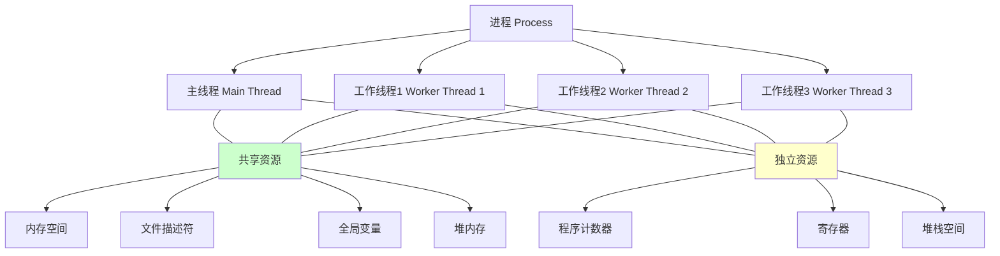
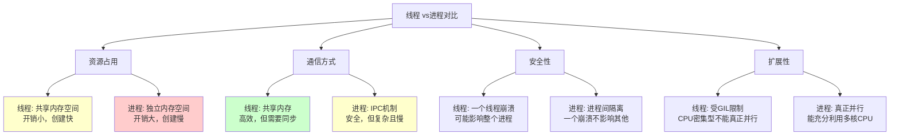
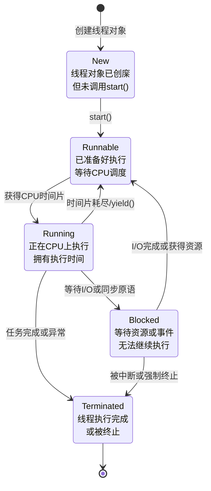
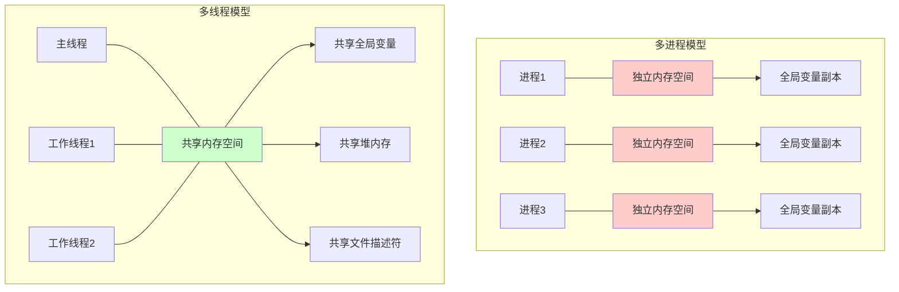
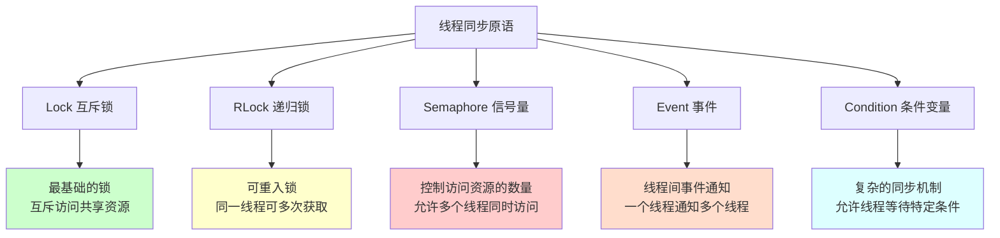

# 第三部分：多线程

## 8. 线程基础理论

### 8.1 线程的定义与特点

**线程（Thread）**是进程内部的最小执行单元，是操作系统调度和执行的基本单位。一个进程中可以有多个线程，线程共享进程的资源。



#### 8.1.1 线程的主要特点

**优点**：

- **轻量级**：创建和销毁开销比进程小
- **资源共享**：线程间可以高效共享数据
- **响应性好**：适合I/O密集型任务，可提高程序响应性
- **上下文切换快**：线程间切换比进程切换更快

**缺点**：

- **数据竞争**：需要同步机制防止数据不一致
- **调试困难**：多线程程序难以调试和测试
- **GIL限制**：在Python中受全局解释器锁影响
- **死锁风险**：不当的同步可能导致死锁

#### 8.1.2 线程 vs 进程详细对比



| 特性       | 线程           | 进程         |
| :--------- | :------------- | :----------- |
| 内存共享   | 共享进程内存   | 独立内存空间 |
| 创建开销   | 小             | 大           |
| 通信效率   | 高（共享内存） | 低（IPC）    |
| 同步复杂度 | 高             | 低           |
| 调试难度   | 困难           | 相对简单     |
| 错误隔离   | 差             | 好           |
| 适用场景   | I/O密集型      | CPU密集型    |

### 8.2 线程状态与生命周期

线程在其生命周期中会经历多个状态的转换：



#### 8.2.1 线程主要状态

1. **新建状态 (New)**：
   - 线程对象已创庺但未调用 `start()` 方法
   - 此时系统还没有为该线程分配资源

2. **就绪状态 (Runnable)**：
   - 线程已准备好执行，等待CPU调度
   - 具备运行条件，但由于CPU资源有限而等待

3. **运行状态 (Running)**：
   - 线程正在CPU上执行
   - 在单核系统上，同时只能有一个线程处于运行状态

4. **阻塞状态 (Blocked)**：
   - 线程因等待I/O操作或获取同步资源而暂停执行
   - 只有当等待的条件满足时，线程才能返回就绪状态

5. **终止状态 (Terminated)**：
   - 线程执行完成或被强制终止
   - 线程资源已被释放，不能再次启动

### 8.3 线程与进程的详细区别

#### 8.3.1 内存模型对比



#### 8.3.2 实际对比示例

* 进程不可以直接使用全局变量！

```python
import threading
import multiprocessing
import time
import os

# 全局变量
counter = 0
shared_list = []

def thread_worker(worker_id, iterations):
    """线程工作函数"""
    global counter, shared_list

    print(f"Thread Worker {worker_id} started - PID: {os.getpid()}, TID: {threading.get_ident()}")

    for i in range(iterations):
        counter += 1
        shared_list.append(f"Thread-{worker_id}-Item-{i+1}")
        time.sleep(0.01)  # 模拟工作

    print(f"Thread Worker {worker_id} finished - counter: {counter}, list_size: {len(shared_list)}")

def process_worker(worker_id, iterations):
    """进程工作函数"""
    global counter, shared_list

    print(f"Process Worker {worker_id} started - PID: {os.getpid()}")

    for i in range(iterations):
        counter += 1
        shared_list.append(f"Process-{worker_id}-Item-{i+1}")
        time.sleep(0.01)  # 模拟工作

    print(f"Process Worker {worker_id} finished - counter: {counter}, list_size: {len(shared_list)}")

def compare_thread_process():
    """对比线程和进程的数据共享"""
    global counter, shared_list

    print("=== 线程 vs 进程数据共享对比 ===")
    print(f"Main process PID: {os.getpid()}")

    # 重置全局变量
    counter = 0
    shared_list = []

    print(f"\n初始状态 - counter: {counter}, shared_list: {len(shared_list)}")

    # 1. 多线程测试
    print("\n=== 多线程测试 ===")
    threads = []
    start_time = time.time()

    for i in range(3):
        t = threading.Thread(target=thread_worker, args=(i+1, 5))
        threads.append(t)
        t.start()

    for t in threads:
        t.join()

    thread_time = time.time() - start_time
    print(f"Thread 结果 - counter: {counter}, shared_list: {len(shared_list)}")
    print(f"Thread 耗时: {thread_time:.3f}秒")
    print(f"List内容前5项: {shared_list[:5]}")

    # 重置变量供进程测试
    counter = 0
    shared_list = []

    # 2. 多进程测试
    print("\n=== 多进程测试 ===")
    processes = []
    start_time = time.time()

    for i in range(3):
        p = multiprocessing.Process(target=process_worker, args=(i+1, 5))
        processes.append(p)
        p.start()

    for p in processes:
        p.join()

    process_time = time.time() - start_time
    print(f"Process 结果 - counter: {counter}, shared_list: {len(shared_list)}")
    print(f"Process 耗时: {process_time:.3f}秒")

    # 总结
    print("\n=== 对比结果 ===")
    print(f"Thread: 数据共享，3个线程修改同一个全局变量")
    print(f"Process: 数据隔离，3个进程各自有独立的变量副本")
    print(f"Thread 性能: {thread_time:.3f}s, Process 性能: {process_time:.3f}s")

if __name__ == '__main__':
    compare_thread_process()
```

## 9. 线程创建与管理

### 9.1 threading 模块基础

Python的`threading`模块提供了高级的线程接口，是进行多线程编程的主要工具。

#### 9.1.1 基础线程创建以及参数传递

* 带参数的任务传递的方式和进程类似

```python
import threading
import time
import os

def simple_task():
    """简单的线程任务"""
    thread_name = threading.current_thread().name
    process_id = os.getpid()
    thread_id = threading.get_ident()

    print(f"{thread_name} 开始执行 - PID: {process_id}, TID: {thread_id}")

    for i in range(5):
        print(f"{thread_name}: 步骤 {i+1}")
        time.sleep(0.5)

    print(f"{thread_name} 执行完成")

def basic_threading_demo():
    """基础线程演示"""
    print("=== 基础线程创建演示 ===")
    print(f"主线程: {threading.current_thread().name} - PID: {os.getpid()}")

    # 方法1: 使用Thread类
    thread1 = threading.Thread(target=simple_task, name="Worker-1")
    thread2 = threading.Thread(target=simple_task, name="Worker-2")

    print("\n启动线程...")
    thread1.start()
    thread2.start()

    print("主线程继续执行其他任务...")
    time.sleep(1)

    print("主线程等待子线程完成...")
    thread1.join()
    thread2.join()

    print("所有线程已完成")

def task_with_parameters(name, count, delay):
    """带参数的任务"""
    for i in range(count):
        print(f"{name}: 第{i+1}次执行")
        time.sleep(delay)
    return f"{name} 完成 {count} 次任务"

def threading_with_params():
    """带参数的线程示例"""
    print("\n=== 带参数的线程 ===")

    threads = []

    # 使用args传递位置参数
    t1 = threading.Thread(
        target=task_with_parameters,
        args=("Task-A", 3, 0.5),
        name="Thread-A"
    )

    # 使用kwargs传递关键字参数
    t2 = threading.Thread(
        target=task_with_parameters,
        kwargs={"name": "Task-B", "count": 4, "delay": 0.3},
        name="Thread-B"
    )

    # 混合使用
    t3 = threading.Thread(
        target=task_with_parameters,
        args=("Task-C", 2),
        kwargs={"delay": 0.8},
        name="Thread-C"
    )

    threads = [t1, t2, t3]

    # 启动所有线程
    for t in threads:
        t.start()

    # 等待所有线程完成
    for t in threads:
        t.join()

    print("所有带参数的线程已完成")

if __name__ == '__main__':
    basic_threading_demo()
    threading_with_params()
```

#### 9.1.2 Thread类的属性和方法

| 方法                 | 参数           | 说明                                               |
| -------------------- | -------------- | -------------------------------------------------- |
| `start()`            | 无             | 启动线程，调用目标函数                             |
| `join(timeout=None)` | timeout: float | 等待线程完成，可设置超时时间                       |
| `run()`              | 无             | 线程执行的方法，通常不直接调用，`start()` 会调用它 |
| `is_alive()`         | 无             | 判断线程是否仍在运行                               |
| `setName(name)`      | name: str      | 设置线程名称（也可直接 `t.name = "XXX"`）          |
| `getName()`          | 无             | 获取线程名称（也可直接 `t.name`）                  |
| `daemon`             | True/False     | 设置线程为守护线程（必须在 `start()` 前设置）      |

| 函数                         | 说明                                      |
| ---------------------------- | ----------------------------------------- |
| `threading.current_thread()` | 获取当前线程对象                          |
| `threading.main_thread()`    | 获取主线程对象                            |
| `threading.active_count()`   | 当前活跃线程数                            |
| `threading.enumerate()`      | 返回所有活跃线程列表                      |
| `threading.get_ident()`      | 获取当前线程 ID（与 `thread.ident` 类似） |

```python
import threading
import time
import random

def demonstrate_thread_methods():
    """演示Thread类的各种方法和属性"""
    print("=== Thread类方法和属性演示 ===")

    def worker_task(task_id, work_time):
        """Worker任务"""
        thread = threading.current_thread()
        print(f"Task {task_id} 开始 - Thread: {thread.name} (ID: {thread.ident})")

        for i in range(work_time):
            if not thread.is_alive():
                print(f"Task {task_id} 被终止")
                break

            print(f"Task {task_id} 工作中... {i+1}/{work_time}")
            time.sleep(1)

        print(f"Task {task_id} 完成")

    # 创建线程
    threads = []
    for i in range(3):
        t = threading.Thread(
            target=worker_task,
            args=(i+1, random.randint(3, 6)),
            name=f"Worker-{i+1}"
        )
        threads.append(t)

    # 显示线程创建后的状态
    print("\n线程创建后的状态:")
    for t in threads:
        print(f"  {t.name}: is_alive={t.is_alive()}, daemon={t.daemon}, ident={t.ident}")

    # 启动线程
    print("\n启动所有线程...")
    for t in threads:
        t.start()
        print(f"  启动: {t.name} (ID: {t.ident})")

    # 显示启动后的状态
    print("\n线程启动后的状态:")
    for t in threads:
        print(f"  {t.name}: is_alive={t.is_alive()}, ident={t.ident}")

    # 监控线程执行
    print("\n监控线程执行:")
    while any(t.is_alive() for t in threads):
        alive_threads = [t.name for t in threads if t.is_alive()]
        print(f"  活跃线程: {alive_threads} (Total: {threading.active_count()})")
        time.sleep(1)

    print("\n所有线程执行完成")

    # 显示最终状态
    print("\n最终状态:")
    for t in threads:
        print(f"  {t.name}: is_alive={t.is_alive()}")

def demonstrate_thread_info():
    """演示线程信息获取"""
    print("\n=== 线程信息获取 ===")

    def info_task():
        """Display thread information"""
        current = threading.current_thread()
        main = threading.main_thread()

        print(f"\n当前线程信息:")
        print(f"  名称: {current.name}")
        print(f"  ID: {current.ident}")
        print(f"  是否守护线程: {current.daemon}")
        print(f"  是否活跃: {current.is_alive()}")

        print(f"\n主线程信息:")
        print(f"  名称: {main.name}")
        print(f"  ID: {main.ident}")
        print(f"  是否活跃: {main.is_alive()}")

        print(f"\n系统信息:")
        print(f"  活跃线程数: {threading.active_count()}")
        print(f"  所有线程: {[t.name for t in threading.enumerate()]}")

    # 创建信息显示线程
    info_thread = threading.Thread(target=info_task, name="InfoThread")
    info_thread.start()
    info_thread.join()

if __name__ == '__main__':
    demonstrate_thread_methods()
    demonstrate_thread_info()
```

### 9.2 自定义线程类

#### 9.2.1 继承Thread类

* 重写run实现更多自定义功能（和重写进程类似）

```python
import threading
import time
import queue
import random

class WorkerThread(threading.Thread):
    """自定义工作线程类"""

    def __init__(self, name, task_queue, result_queue):
        super().__init__(name=name)
        self.task_queue = task_queue
        self.result_queue = result_queue
        self.running = True

    def run(self):
        """Override run method"""
        print(f"{self.name} 开始工作")

        while self.running:
            try:
                # 从任务队列获取任务
                task = self.task_queue.get(timeout=1)

                if task is None:  # 终止信号
                    print(f"{self.name} 收到终止信号")
                    break

                # 执行任务
                result = self.process_task(task)

                # 将结果放入结果队列
                self.result_queue.put(result)

                # 标记任务完成
                self.task_queue.task_done()

            except queue.Empty:
                # 超时无任务，继续等待
                continue
            except Exception as e:
                print(f"{self.name} 出现错误: {e}")
                self.result_queue.put(f"Error: {e}")
                if not self.task_queue.empty():
                    self.task_queue.task_done()

        print(f"{self.name} 工作结束")

    def process_task(self, task):
        """处理具体任务"""
        task_id, data = task
        print(f"{self.name} 处理任务 {task_id}: {data}")

        # 模拟处理时间
        processing_time = random.uniform(0.5, 2.0)
        time.sleep(processing_time)

        # 返回结果
        result = {
            'task_id': task_id,
            'input_data': data,
            'result': data * 2 if isinstance(data, (int, float)) else f"Processed: {data}",
            'processing_time': processing_time,
            'worker': self.name
        }

        return result

    def stop(self):
        """停止线程"""
        self.running = False

class TaskManager(threading.Thread):
    """任务管理器线程"""

    def __init__(self, task_queue, result_queue, total_tasks):
        super().__init__(name="TaskManager")
        self.task_queue = task_queue
        self.result_queue = result_queue
        self.total_tasks = total_tasks
        self.completed_tasks = 0

    def run(self):
        """Run task manager"""
        print(f"{self.name} 开始监控任务")

        while self.completed_tasks < self.total_tasks:
            try:
                result = self.result_queue.get(timeout=1)
                self.completed_tasks += 1

                print(f"{self.name} 收到结果 {self.completed_tasks}/{self.total_tasks}: "
                      f"Task {result['task_id']} by {result['worker']}")

                self.result_queue.task_done()

            except queue.Empty:
                continue

        print(f"{self.name} 所有任务已完成")

def custom_thread_demo():
    """自定义线程演示"""
    print("=== 自定义线程演示 ===")

    # 创建队列
    task_queue = queue.Queue()
    result_queue = queue.Queue()

    # 准备任务
    tasks = [
        (1, 10),
        (2, "Hello"),
        (3, 3.14),
        (4, "World"),
        (5, 42),
        (6, "Python"),
        (7, 100),
        (8, "Threading")
    ]

    # 将任务放入队列
    for task in tasks:
        task_queue.put(task)

    # 创建工作线程
    workers = []
    for i in range(3):
        worker = WorkerThread(f"Worker-{i+1}", task_queue, result_queue)
        workers.append(worker)
        worker.start()

    # 创建任务管理器
    manager = TaskManager(task_queue, result_queue, len(tasks))
    manager.start()

    # 等待所有任务完成
    task_queue.join()

    # 停止工作线程
    for worker in workers:
        worker.stop()
        task_queue.put(None)  # 发送终止信号

    # 等待所有线程结束
    for worker in workers:
        worker.join()
    manager.join()

    print("自定义线程演示完成")

if __name__ == '__main__':
    custom_thread_demo()
```

### 9.3 守护线程

守护线程（Daemon Thread）是一种在后台运行的线程，当所有非守护线程结束时，守护线程会自动终止。

#### 9.3.1 守护线程特点

1. **生命周期**： 
   - 与主线程同步启动。
   - 随主线程结束而终止，无法独立存在。
2. **自动终止** ：当程序中所有非守护线程结束时，程序不会等待守护线程完成，守护线程会被强制终止。
3. **后台运行**： 在后台执行，不占用终端，也不会影响用户交互。
4. **依赖主线程**： 无法独立存在，主程序结束时，守护线程会被强制结束。

#### 9.3.2 守护线程示例

* 守护线程会随着主线程结束强制结束
* 主线程会等待子线程

```python
import threading
import time

def daemon_task():
    """守护线程任务"""
    count = 0
    while True:
        count += 1
        print(f"Daemon thread 正在运行... 计数: {count}")
        time.sleep(1)

        # 正常情况下这个循环不会退出
        if count > 20:  # 仅为防止无限运行
            print("Daemon thread 超过最大计数，退出")
            break

def regular_task():
    """普通线程任务"""
    for i in range(5):
        print(f"Regular thread 步骤 {i+1}/5")
        time.sleep(1)
    print("Regular thread 完成")

def daemon_thread_demo():
    """守护线程演示"""
    print("=== 守护线程演示 ===")

    # 创建守护线程
    daemon_thread = threading.Thread(target=daemon_task, name="DaemonThread")
    daemon_thread.daemon = True  # 设置为守护线程

    # 创建普通线程
    regular_thread = threading.Thread(target=regular_task, name="RegularThread")

    print(f"Daemon thread daemon: {daemon_thread.daemon}")
    print(f"Regular thread daemon: {regular_thread.daemon}")

    # 启动线程
    daemon_thread.start()
    regular_thread.start()

    print("主线程等待普通线程结束...")
    regular_thread.join()  # 只等待普通线程

    print("主线程即将结束，守护线程也会自动终止")
    time.sleep(1)  # 等待1秒看守护线程的最后输出
    print("主线程结束")

def daemon_vs_regular():
    """守护线程 vs 普通线程对比"""
    print("\n=== 守护线程 vs 普通线程对比 ===")

    def long_running_task(name, is_daemon=False):
        """Long running task"""
        thread_type = "Daemon" if is_daemon else "Regular"
        for i in range(10):
            print(f"{thread_type} thread {name} - 步骤 {i+1}/10")
            time.sleep(0.5)
        print(f"{thread_type} thread {name} 完成")

    # 创建两个线程
    regular = threading.Thread(target=long_running_task, args=("A", False), name="Regular-A")
    daemon = threading.Thread(target=long_running_task, args=("B", True), name="Daemon-B")
    daemon.daemon = True

    # 启动线程
    regular.start()
    daemon.start()

    print("主线程等待2秒后结束...")
    time.sleep(2)
    print("主线程结束 - 守护线程也会被强制终止")

    # 子线程没有结束所以主线程也不会结束

if __name__ == '__main__':
    # daemon_thread_demo()
    daemon_vs_regular()
```

## 10. 线程同步与安全

### 10.1 线程锁机制详解

在多线程编程中，当多个线程访问共享资源时，可能会导致数据不一致的问题。锁是解决这个问题的主要手段。



#### 10.1.1 Lock 互斥锁

`threading.Lock()` 是**普通互斥锁**。

**特点**：

- 同一时刻，只有一个线程可以获得锁。
- **不允许同一个线程重复获得**，如果一个线程已经持有锁，再次尝试获取会阻塞（可能导致死锁）。

**应用场景**：

- 用于保护共享资源（例如计数器、列表、字典）不被多个线程同时修改，避免竞态条件。

```python
import threading
import time
import random

def demonstrate_race_condition():
    """演示竞态条件问题"""
    print("=== 竞态条件问题演示 ===")

    # 共享资源
    shared_counter = {'value': 0}
    shared_list = []

    def unsafe_increment(thread_id, iterations):
        """Unsafe increment operation"""
        for i in range(iterations):
            # 读取、修改、写入操作不是原子的
            current_value = shared_counter['value']
            time.sleep(0.001)  # 模拟一些处理时间
            shared_counter['value'] = current_value + 1
            shared_list.append(f"Thread-{thread_id}-{i+1}")

        print(f"Thread-{thread_id} 完成，本地计数: {iterations}")

    # 创建多个线程
    threads = []
    for i in range(5):
        t = threading.Thread(target=unsafe_increment, args=(i+1, 100))
        threads.append(t)
        t.start()

    # 等待所有线程完成
    for t in threads:
        t.join()

    print(f"期望结果: 500, 实际结果: {shared_counter['value']}")
    print(f"List 长度: {len(shared_list)}")
    print("问题：由于竞态条件，结果可能不正确")

def demonstrate_lock_solution():
    """使用Lock解决竞态条件"""
    print("\n=== 使用Lock解决方案 ===")

    # 共享资源
    shared_counter = {'value': 0}
    shared_list = []
    lock = threading.Lock()

    def safe_increment(thread_id, iterations):
        """Safe increment with lock"""
        local_count = 0
        for i in range(iterations):
            with lock:  # 使用 with 语句自动获取和释放锁
                current_value = shared_counter['value']
                time.sleep(0.001)  # 模拟处理时间
                shared_counter['value'] = current_value + 1
                shared_list.append(f"Thread-{thread_id}-{i+1}")
                local_count += 1

        print(f"Thread-{thread_id} 完成，本地计数: {local_count}")

    # 创建多个线程
    threads = []
    start_time = time.time()

    for i in range(5):
        t = threading.Thread(target=safe_increment, args=(i+1, 100))
        threads.append(t)
        t.start()

    # 等待所有线程完成
    for t in threads:
        t.join()

    end_time = time.time()
    print(f"期望结果: 500, 实际结果: {shared_counter['value']}")
    print(f"List 长度: {len(shared_list)}")
    print(f"耗时: {end_time - start_time:.3f}秒")
    print("结果：使用锁后，结果正确但性能降低")

def demonstrate_lock_methods():
    """演示Lock的不同使用方法"""
    print("\n=== Lock使用方法演示 ===")

    lock = threading.Lock()
    shared_resource = {'data': 0}

    def method1_with_statement():
        """Method 1: Using with statement (recommended)"""
        thread_name = threading.current_thread().name
        print(f"{thread_name} 尝试获取锁 (with statement)")

        with lock:
            print(f"{thread_name} 获得锁")
            shared_resource['data'] += 10
            time.sleep(0.5)
            print(f"{thread_name} 处理完成，数据: {shared_resource['data']}")
        # 自动释放锁

        print(f"{thread_name} 释放锁")

    def method2_acquire_release():
        """Method 2: Manual acquire/release"""
        thread_name = threading.current_thread().name
        print(f"{thread_name} 尝试获取锁 (acquire/release)")

        lock.acquire()
        try:
            print(f"{thread_name} 获得锁")
            shared_resource['data'] += 5
            time.sleep(0.3)
            print(f"{thread_name} 处理完成，数据: {shared_resource['data']}")
        finally:
            lock.release()
            print(f"{thread_name} 释放锁")

    def method3_timeout():
        """Method 3: Try to acquire with timeout"""
        thread_name = threading.current_thread().name
        print(f"{thread_name} 尝试获取锁 (timeout)")

        if lock.acquire(timeout=1):  # 等待1秒
            try:
                print(f"{thread_name} 获得锁")
                shared_resource['data'] += 1
                time.sleep(0.2)
                print(f"{thread_name} 处理完成，数据: {shared_resource['data']}")
            finally:
                lock.release()
                print(f"{thread_name} 释放锁")
        else:
            print(f"{thread_name} 获取锁超时")

    # 创建线程测试不同方法
    threads = [
        threading.Thread(target=method1_with_statement, name="With-Thread"),
        threading.Thread(target=method2_acquire_release, name="Manual-Thread"),
        threading.Thread(target=method3_timeout, name="Timeout-Thread")
    ]

    for t in threads:
        t.start()
        time.sleep(0.1)  # 稍微错开启动时间

    for t in threads:
        t.join()

    print(f"最终数据值: {shared_resource['data']}")

if __name__ == '__main__':
    demonstrate_race_condition()
    demonstrate_lock_solution()
    demonstrate_lock_methods()
```

#### 10.1.2 RLock 递归锁

`threading.RLock()`（可重入锁）允许同一个线程多次获取同一把锁，而不会阻塞自己。**但**其他线程**在该锁被持有期间，**仍然不能获取这把锁**，会阻塞等待。

**特点**：

- 同一个线程可以**多次获取同一把锁**，不会阻塞自己。
- 内部有计数器，每次 `acquire()` 增加，`release()` 减少，当计数器为 0 时真正释放锁。

**应用场景**：

- 递归调用需要访问共享资源时。
- 同一个线程调用多个方法，每个方法都需要加锁。

```python
import threading
import time

# 创建递归锁
rlock = threading.RLock()
counter = 0


def recursive_task(depth):
    global counter
    print(f"{threading.current_thread().name} 尝试获取锁，深度 {depth}")

    with rlock:
        print(f"{threading.current_thread().name} 获得锁，深度 {depth}")
        counter += 1
        time.sleep(0.2)

        # 递归调用自己，再次获取同一把锁
        if depth < 3:
            recursive_task(depth + 1)

    print(f"{threading.current_thread().name} 释放锁，深度 {depth}")


if __name__ == "__main__":
    t = threading.Thread(target=recursive_task, args=(1,), name="RLockThread")
    t.start()
    t.join()
    print(f"最终计数器值: {counter}")

```

### 10.2 死锁问题与解决方案

死锁是多线程编程中一个严重的问题，发生在两个或多个线程相互等待对方释放资源的情况下。

#### 10.2.1 死锁的主要原因

1. **互斥条件**
   - 资源一次只能被一个线程占用，例如 Lock、文件句柄。
2. **占有且等待**
   - 一个线程已经持有了部分资源，又去请求新的资源，但不释放已有资源。
3. **不可剥夺**
   - 线程持有的资源在任务完成前，不能被强行剥夺。
4. **循环等待**（最典型）
   - 线程 A 等待线程 B 持有的资源，而线程 B 又等待线程 A 的资源，形成环路。

#### 10.2.2 常见死锁场景（多线程）

- **多把锁交叉使用**

  ```
  Thread 1: 获取锁 A → 再获取锁 B  
  Thread 2: 获取锁 B → 再获取锁 A  
  ```

- **递归调用 + 普通 Lock**
  同一线程在递归时尝试再次获取自己已持有的锁，会死锁。

- **等待条件变量或 I/O**
  某个线程永远等不到条件满足。

#### 10.2.3 避免死锁

1. **避免死锁**

- **固定加锁顺序**
  所有线程都按相同顺序申请资源，避免循环等待。
- **一次性申请所有需要的锁**
  避免“占有且等待”。
- **使用超时机制**
  `lock.acquire(timeout=...)`，避免无限等待。
- **使用更高层的并发工具**
  例如 `Queue`、`concurrent.futures`，避免自己管理锁。

2. **使用递归锁（RLock）**

- 当同一线程需要重复获取同一把锁时，使用 `RLock` 而不是 `Lock`，避免自我死锁。

3. **死锁检测与恢复（较少在应用层使用）**

- 系统层可以通过构建“资源等待图”检测循环等待，发现后强制终止某个线程。


### 10.3 全局解释器锁 (GIL)

- **定义**：GIL 是 **CPython 解释器**（Python 最常用的实现）中使用的一把**全局互斥锁**，它保证了在任意时刻，只有**一个线程**能执行 Python 字节码。换句话说：即使你开了很多线程，在多核 CPU 上，Python 的字节码执行**仍然是串行的**。
- 由于GIL,在 CPU 密集型任务中（例如大循环、数学计算），多线程 **并不会更快**，甚至可能更慢。所以多线程更适合io密集的任务如网络请求文件读写。

#### 10.3.1 GIL对多线程的影响演示

* 对于io密集型任务优化明显
* 对于cpu密集型任务就没有明显优化

```python
import threading
import time
import concurrent.futures

def cpu_intensive_task(name, duration):
    """CPU密集型任务"""
    print(f"开始 {name} - 线程ID: {threading.get_ident()}")
    start_time = time.time()

    # 计算密集型工作
    count = 0
    end_time = start_time + duration
    while time.time() < end_time:
        count += 1

    elapsed = time.time() - start_time
    print(f"完成 {name} - 耗时: {elapsed:.2f}秒, 计算次数: {count}")
    return count

def io_intensive_task(name, duration):
    """I/O密集型任务"""
    print(f"开始 {name} - 线程ID: {threading.get_ident()}")
    start_time = time.time()

    # 模拟I/O操作
    for i in range(int(duration * 10)):
        time.sleep(0.1)

    elapsed = time.time() - start_time
    print(f"完成 {name} - 实际耗时: {elapsed:.2f}秒")

def demonstrate_gil_impact():
    """演示GIL对不同类型任务的影响"""
    print("=== GIL对不同任务类型的影响 ===")

    # CPU密集型任务对比
    print("\n1. CPU密集型任务对比:")
    start_time = time.time()
    cpu_intensive_task("单线程CPU任务", 2)
    single_cpu_time = time.time() - start_time

    start_time = time.time()
    with concurrent.futures.ThreadPoolExecutor(max_workers=2) as executor:
        futures = [executor.submit(cpu_intensive_task, f"多线程CPU-{i+1}", 2) for i in range(2)]
        [future.result() for future in futures]
    multi_cpu_time = time.time() - start_time

    print(f"CPU任务 - 单线程: {single_cpu_time:.2f}秒, 多线程: {multi_cpu_time:.2f}秒")
    print(f"CPU任务性能比: {single_cpu_time / multi_cpu_time:.2f}")

    # I/O密集型任务对比
    print("\n2. I/O密集型任务对比:")
    start_time = time.time()
    for i in range(3):
        io_intensive_task(f"单线程IO-{i+1}", 1)
    single_io_time = time.time() - start_time

    start_time = time.time()
    with concurrent.futures.ThreadPoolExecutor(max_workers=3) as executor:
        futures = [executor.submit(io_intensive_task, f"多线程IO-{i+1}", 1) for i in range(3)]
        [future.result() for future in futures]
    multi_io_time = time.time() - start_time

    print(f"I/O任务 - 单线程: {single_io_time:.2f}秒, 多线程: {multi_io_time:.2f}秒")
    print(f"I/O任务性能提升: {single_io_time / multi_io_time:.2f}倍")

if __name__ == '__main__':
    demonstrate_gil_impact()
```

### 10.4 ThreadLocal 线程本地存储

`ThreadLocal` 提供了线程局部存储，每个线程都有自己独立的数据副本，避免了线程间的数据冲突。

#### 10.4.1 ThreadLocal基础概念

`ThreadLocal` 是 **线程本地存储**（Thread Local Storage, TLS）的一种实现。

它提供了一种机制：每个线程都可以 **独立存取属于自己的数据副本**，而不会和其他线程互相干扰。

特点：

1. **线程隔离**
   每个线程在 `ThreadLocal` 中存取的值，**只对自己可见**。----可以跨函数访问！ 
   就像每个线程有一个小抽屉，里面的东西互不干扰。
2. **避免共享冲突**
   不需要加锁（Lock / RLock）来保证安全，因为每个线程拿到的都是自己的数据。
3. **生命周期**
   - 数据会跟随线程的生命周期：线程结束后，对应的本地存储也会被清理。

#### 10.4.2 ThreadLocal使用示例

* 相比于直接定义函数内的局部变量使用local可以在同一个线程内跨函数访问！ 

```python
import threading
import time

# 创建ThreadLocal对象
thread_local = threading.local()

def function_a():
    """函数A：设置数据"""
    thread_local.user_name = "Alice"
    thread_local.user_id = 12345
    print(f"函数A设置: user_name={thread_local.user_name}, user_id={thread_local.user_id}")
    
    function_b()  # 调用函数B，无需传递参数

def function_b():
    """函数B：读取数据并调用函数C"""
    print(f"函数B读取: user_name={thread_local.user_name}, user_id={thread_local.user_id}")
    
    function_c()  # 调用函数C，仍然无需传递参数

def function_c():
    """函数C：修改数据并调用函数D"""
    thread_local.timestamp = time.time()
    print(f"函数C读取并添加: user_name={thread_local.user_name}, timestamp={thread_local.timestamp}")
    
    function_d()  # 调用函数D

def function_d():
    """函数D：最深层的函数"""
    print(f"函数D访问所有数据:")
    print(f"  user_name: {thread_local.user_name}")
    print(f"  user_id: {thread_local.user_id}")
    print(f"  timestamp: {thread_local.timestamp}")

# 在不同线程中运行
def worker(thread_name):
    print(f"\n=== {thread_name} 开始执行 ===")
    function_a()  # 只需要调用入口函数
    print(f"=== {thread_name} 执行完毕 ===\n")

# 创建两个线程
thread1 = threading.Thread(target=worker, args=("线程1",))
thread2 = threading.Thread(target=worker, args=("线程2",))

thread1.start()
thread2.start()

thread1.join()
thread2.join()
```

---

## 总结

1. **线程基础理论**：
   - 线程的定义、特点和生命周期
   - 线程与进程的详细对比和适用场景
   - 线程状态转换和管理机制
2. **线程创建与管理**：
   - `threading.Thread`类的基础用法和高级特性
   - 自定义线程类的实现方法
   - 守护线程的概念和实际应用
3. **线程同步机制**：
   - **Lock**: 基础互斥锁，解决数据竞争问题
   - **RLock**: 可重入锁，支持同一线程多次获取
   - **Semaphore**: 信号量，控制资源访问数量
   - **Event**: 事件对象，实现线程间协调
   - **Condition**: 条件变量，实现复杂的等待-通知机制
4. **高级主题**：
   - **GIL全局解释器锁**：深入理解其工作原理和性能影响
   - **ThreadLocal线程本地存储**：实现线程间数据完全隔离
   - **死锁预防策略**：识别、避免和解决死锁问题