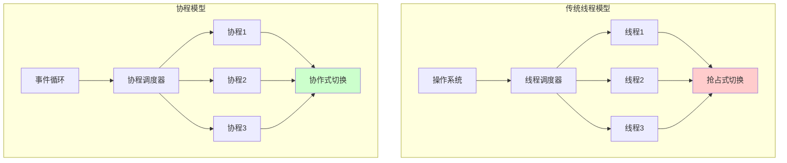
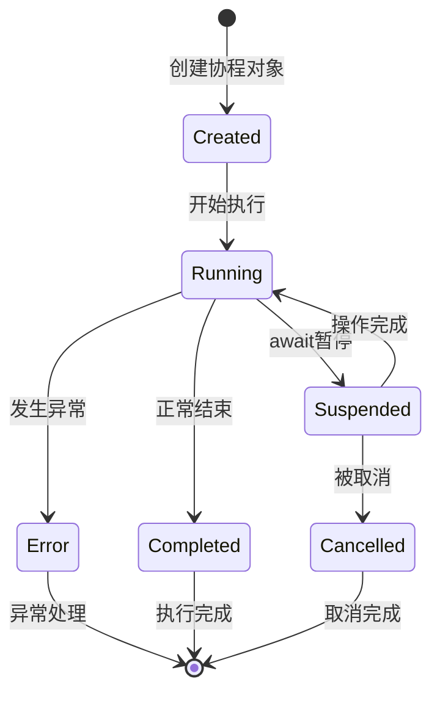

# 第四部分：协程与异步编程

协程（Coroutine）和异步编程是现代Python并发编程的重要组成部分。与传统的多线程编程相比，协程提供了一种更轻量级、更高效的并发处理方式，特别适合I/O密集型任务。

## 11. 协程基础理论

### 11.1 协程的本质与工作原理

#### 11.1.1 协程的定义

**协程（Coroutine）**是一种用户态的轻量级线程，由用户程序进行调度。协程拥有自己的寄存器上下文和栈，协程调度切换时，将寄存器上下文和栈保存到其他地方，在切回来时恢复先前保存的寄存器上下文和栈。

协程的核心特点是**协作式多任务处理**：

- **主动让出控制权**：协程通过 `await` 关键字主动暂停执行，让出CPU控制权
- **保存执行状态**：暂停时保存当前的执行状态（变量值、执行位置等）
- **恢复执行**：当等待的操作完成后，从暂停的地方恢复执行

#### 11.1.2 协程vs传统并发模型的深度对比



**并发模型对比分析**：

| 维度           | 操作系统线程           | 协程               | 优势解释                     |
| :------------- | :--------------------- | :----------------- | :--------------------------- |
| **调度方式**   | 抢占式（只是切换+GIL） | 协作式（程序控制） | 协程避免了不必要的上下文切换 |
| **创建开销**   | ~8MB栈空间             | ~2KB对象开销       | 协程内存占用是线程的1/4000   |
| **切换成本**   | 内核态切换（μs级）     | 用户态切换（ns级） | 协程切换比线程快1000倍       |
| **最大数量**   | 几百到几千             | 几万到几十万       | 协程支持更高的并发度         |
| **同步复杂度** | 需要锁、信号量         | 天然串行执行       | 协程避免了大部分同步问题     |

#### 11.1.3 协程的生命周期与状态转换



**状态详解**：

- **Created**：协程对象已创建，但未开始执行
- **Running**：协程正在执行代码
- **Suspended**：协程因 `await` 暂停，等待操作完成
- **Completed**：协程正常执行完成
- **Error**：协程执行过程中发生异常
- **Cancelled**：协程被外部取消

#### 11.1.4 为什么协程适合I/O密集型任务

**I/O密集型任务的特点**：

1. **等待时间长**：大量时间花在等待磁盘、网络、数据库响应
2. **CPU利用率低**：等待期间CPU处于空闲状态
3. **并发需求高**：需要同时处理大量请求

**协程的优势**：

```python
# 传统同步I/O（阻塞式）
def sync_request():
    data1 = database_query()      # 阻塞100ms
    data2 = api_call()           # 阻塞200ms
    data3 = file_read()          # 阻塞50ms
    # 总时间：350ms，CPU大部分时间空闲

# 协程异步I/O（非阻塞式）
async def async_request():
    data1, data2, data3 = await asyncio.gather(
        async_database_query(),   # 100ms
        async_api_call(),        # 200ms
        async_file_read()        # 50ms
    )
    # 总时间：200ms（最长的操作），CPU利用率高
```


### 11.2 事件循环机制

#### 11.2.1 事件循环的本质与原理

**事件循环（Event Loop）**是协程异步编程的核心机制，它是一个单线程的无限循环，负责调度和执行协程任务。

**事件循环的基本工作流程**：

1. **检查任务队列**：查看是否有待执行的任务
2. **执行任务**：取出任务并执行到遇到`await`或完成
3. **处理I/O事件**：如果遇到`await`，暂停任务并注册I/O回调
4. **等待事件**：如果没有就绪任务，等待I/O事件完成
5. **唤醒任务**：I/O事件完成后，唤醒对应的暂停任务
6. **循环执行**：重复上述过程

#### 11.2.2 事件循环的工作流程详解

**1. 初始化阶段**：

- 创建事件循环对象
- 初始化任务队列和回调队列
- 设置I/O多路复用器（select/epoll/kqueue）

**2. 运行阶段**：

```python
# 事件循环的伪代码实现
class EventLoop:
    def __init__(self):
        self.ready_queue = []        # 就绪任务队列
        self.waiting_tasks = {}      # 等待中的任务
        self.io_selector = Selector() # I/O多路复用器

    def run_forever(self):
        while True:
            # 1. 执行所有就绪的任务
            while self.ready_queue:
                task = self.ready_queue.pop(0)
                try:
                    # 执行任务直到遇到await或完成
                    task.step()
                except StopIteration:
                    # 任务完成，设置结果
                    task.set_result()
                except Exception as e:
                    task.set_exception(e)

            # 2. 处理I/O事件
            timeout = self._calculate_timeout()
            events = self.io_selector.select(timeout)

            # 3. 唤醒等待I/O的任务
            for event in events:
                task = self.waiting_tasks.pop(event)
                self.ready_queue.append(task)
```

#### 11.2.3 事件循环的核心组件

**事件循环包含以下核心组件**：

- **就绪队列（Ready Queue）**：存储可立即执行的任务
- **等待队列（Waiting Queue）**：存储暂停中的任务
- **I/O选择器（I/O Selector）**：监控I/O事件的完成状态
- **任务调度器（Task Scheduler）**：负责任务的调度和执行
- **定时器堆（Timer Heap）**：管理延时任务
- **回调队列（Callback Queue）**：存储I/O完成后的回调函数

#### 11.2.4 协程调度机制详解

**协程状态转换与调度**：

1. **创建与注册**：

```python
async def my_coroutine():
    result = await some_io_operation()
    return result

# 创建任务并注册到事件循环
task = loop.create_task(my_coroutine())
# 任务被添加到就绪队列等待执行
```

2. **执行与暂停**：

```python
# 协程执行流程
def coroutine_step(task):
    try:
        # 从上次暂停的地方继续执行
        result = task.coroutine.send(last_result)

        if isinstance(result, Awaitable):
            # 遇到await，暂停协程
            task.suspend(result)
            # 注册唤醒条件（I/O完成、定时器到期等）
            register_wakeup_condition(task, result)
        else:
            # 协程完成
            task.set_result(result)

    except StopIteration as e:
        # 协程正常结束
        task.set_result(e.value)
```

3. **唤醒与恢复**：

```python
# I/O操作完成后的唤醒过程
def io_completion_callback(task, io_result):
    # 将任务重新添加到就绪队列
    loop.ready_queue.append(task)
    # 设置I/O操作的结果
    task.set_wakeup_result(io_result)
```

#### 11.2.5 事件循环的性能优化机制

**1. I/O多路复用技术**：

- **Linux**: epoll（高效轮询）
- **macOS**: kqueue（内核事件队列）
- **Windows**: IOCP（I/O完成端口）

**2. 任务调度优化**：

- **就绪队列优化**：使用双端队列提高插入/删除效率
- **定时器优化**：使用堆结构管理定时任务
- **内存池**：重用任务对象减少GC压力

**3. 系统调用减少**：

- **批量处理**：一次系统调用处理多个I/O事件
- **边缘触发**：只在状态变化时通知，减少冗余事件


## 12. async/await 语法详解

### 12.1 异步编程模式理论基础

#### 12.1.1 异步编程的核心思想

**异步编程**是一种编程范式，其核心思想是让程序能够在等待I/O操作时不阻塞，而是去执行其他任务，从而提高程序的整体效率。

**同步编程模式 vs 异步编程模式**：

- **同步编程模式**：任务必须按顺序执行，每个任务完成后才能开始下一个任务。在等待I/O操作时，程序会阻塞，无法处理其他事务，导致CPU资源浪费。

- **异步编程模式**：当遇到I/O操作时，程序可以暂停当前任务并转去执行其他任务，当I/O操作完成后再恢复暂停的任务。这样能够充分利用等待时间，提高程序的整体效率。

#### 12.1.2 异步编程的关键概念

**1. 非阻塞I/O（Non-blocking I/O）**：

- **传统阻塞I/O**：调用read()时，程序等待直到数据就绪
- **非阻塞I/O**：调用read()时，如果数据未就绪立即返回，程序可以处理其他事务

**2. 回调机制（Callback）**：

- I/O操作完成时，系统调用预先注册的回调函数
- 避免了轮询检查I/O状态的开销

**3. 事件驱动（Event-Driven）**：

- 程序响应事件（I/O完成、定时器到期等）而不是按顺序执行
- 事件循环负责分发和处理事件

#### 12.1.3 异步编程模式分类

**异步编程的三种主要模式**：

1. **回调模式（Callback Pattern）**
   - **优点**：实现简单直接，性能高
   - **缺点**：容易形成回调地狱，代码难以维护和理解
   - **适用场景**：简单的异步操作

2. **Promise/Future模式**
   - **优点**：避免回调地狱，支持链式调用
   - **缺点**：状态管理复杂，错误处理困难
   - **适用场景**：复杂的异步流程控制

3. **协程模式（Coroutine Pattern）**
   - **优点**：使用同步风格编写异步代码，易于理解和维护
   - **缺点**：需要语言层面的支持
   - **适用场景**：现代异步编程的首选方式

**模式对比**：

| 模式               | 优点                   | 缺点               | 适用场景     |
| :----------------- | :--------------------- | :----------------- | :----------- |
| **回调模式**       | 简单直接，性能高       | 回调地狱，难以维护 | 简单异步操作 |
| **Promise/Future** | 避免回调地狱，链式调用 | 状态管理复杂       | 复杂异步流程 |
| **协程模式**       | 同步风格，易理解       | 需要语言层面支持   | 现代异步编程 |

### 12.2 async 关键字深度解析

#### 12.2.1 async关键字的本质

`async` 关键字用于定义协程函数，它的作用是：

1. **函数标记**：告诉Python解释器这是一个协程函数
2. **返回值包装**：将函数的返回值包装成协程对象
3. **执行模式变更**：函数内部可以使用await关键字

```python
# async关键字的工作机制演示
def normal_function():
    """普通函数：立即执行并返回结果"""
    return "立即返回的结果"

async def coroutine_function():
    """协程函数：返回协程对象，需要事件循环执行"""
    return "协程返回的结果"

# 调用对比
result1 = normal_function()        # 直接得到结果
print(type(result1))              # <class 'str'>

result2 = coroutine_function()     # 得到协程对象
print(type(result2))              # <class 'coroutine'>
print(result2)                    # <coroutine object coroutine_function at 0x...>

# 需要用事件循环执行协程
import asyncio
actual_result = asyncio.run(coroutine_function())
print(actual_result)              # "协程返回的结果"
```

#### 12.2.2 协程函数的生命周期

**协程函数的生命周期流程**：

1. **创建阶段**：调用`async`函数时，返回协程对象而不是直接执行
2. **注册阶段**：将协程对象提交给事件循环进行调度
3. **执行阶段**：事件循环开始执行协程代码
4. **暂停阶段**：遇到`await`时，协程暂停并发起I/O请求
5. **切换阶段**：协程交出控制权，事件循环处理其他任务
6. **等待阶段**：I/O操作在后台进行
7. **唤醒阶段**：I/O完成时，事件循环收到通知
8. **恢复阶段**：事件循环恢复协程执行
9. **完成阶段**：协程返回结果并传递给调用者

#### 12.2.3 async函数的深入特性

```python
import asyncio
import inspect
import time

# 普通函数
def normal_function():
    """普通函数：同步执行，立即返回结果"""
    return "普通函数结果"

# 协程函数
async def async_function():
    """协程函数：异步执行，返回协程对象"""
    return "协程函数结果"

def analyze_function_types():
    """深度分析不同函数类型的特性和行为差异"""
    print("=== 函数类型深度分析 ===")

    # 1. 函数对象类型检查
    print("1. 函数对象本身的特性:")
    print(f"   普通函数类型: {type(normal_function)}")
    print(f"   协程函数类型: {type(async_function)}")
    print(f"   普通函数是否为协程: {inspect.iscoroutinefunction(normal_function)}")
    print(f"   协程函数是否为协程: {inspect.iscoroutinefunction(async_function)}")

    # 2. 函数调用结果对比
    print("\n2. 函数调用结果的差异:")

    # 普通函数调用：立即执行并返回结果
    start_time = time.time()
    normal_result = normal_function()
    normal_exec_time = time.time() - start_time
    print(f"   普通函数调用:")
    print(f"     结果: {normal_result}")
    print(f"     结果类型: {type(normal_result)}")
    print(f"     执行时间: {normal_exec_time:.6f}秒 (立即执行)")

    # 协程函数调用：返回协程对象，未实际执行
    start_time = time.time()
    async_result = async_function()
    call_time = time.time() - start_time
    print(f"\n   协程函数调用:")
    print(f"     返回对象: {async_result}")
    print(f"     对象类型: {type(async_result)}")
    print(f"     是否为协程对象: {inspect.iscoroutine(async_result)}")
    print(f"     调用耗时: {call_time:.6f}秒 (仅创建对象)")
    print(f"     注意: 协程函数此时并未真正执行！")

    # 3. 协程对象的状态
    print(f"\n3. 协程对象状态信息:")
    print(f"   协程状态: {inspect.getgeneratorstate(async_result)}")
    print(f"   协程名称: {async_result.__name__ if hasattr(async_result, '__name__') else 'N/A'}")

    # 4. 正确执行协程的方式
    print(f"\n4. 协程的正确执行方式:")

    async def run_coroutine():
        """演示协程的正确执行方式"""
        start_time = time.time()
        result = await async_function()  # 在这里才真正执行协程
        exec_time = time.time() - start_time
        print(f"     通过await执行结果: {result}")
        print(f"     实际执行时间: {exec_time:.6f}秒")
        return result

    # 使用事件循环执行协程
    print("   使用asyncio.run()执行协程:")
    final_result = asyncio.run(run_coroutine())
    print(f"     最终结果: {final_result}")

    # 清理未执行的协程对象（避免警告）
    async_result.close()
    print(f"\n   清理协程对象: 已关闭未执行的协程以避免内存泄漏")

# 演示协程的执行时机
async def demonstrate_execution_timing():
    """演示协程的执行时机和顺序"""
    print("\n=== 协程执行时机演示 ===")

    async def delayed_task(name, delay):
        """带延迟的协程任务"""
        print(f"   任务 {name} 开始执行")
        await asyncio.sleep(delay)  # 模拟异步操作
        print(f"   任务 {name} 执行完成")
        return f"任务 {name} 的结果"

    print("1. 创建协程对象（不会立即执行）:")
    task1 = delayed_task("A", 1)
    task2 = delayed_task("B", 0.5)
    print(f"   已创建协程对象: {type(task1)}")
    print("   注意：此时没有任何输出，因为协程尚未执行")

    print("\n2. 执行协程（现在才真正开始）:")
    start_time = time.time()

    # 并发执行多个协程
    results = await asyncio.gather(task1, task2)

    total_time = time.time() - start_time
    print(f"   执行结果: {results}")
    print(f"   总执行时间: {total_time:.2f}秒")
    print(f"   说明: 两个任务并发执行，总时间约等于最长任务的时间")

if __name__ == '__main__':
    # 分析函数类型
    analyze_function_types()

    # 演示执行时机
    asyncio.run(demonstrate_execution_timing())
```

### 12.3 await 关键字深度解析

#### 12.3.1 await的本质与工作机制

`await` 关键字是协程暂停和恢复的核心机制，它的作用是：

1. **暂停当前协程**：让出CPU控制权给事件循环
2. **等待操作完成**：等待被await的对象完成其异步操作
3. **恢复协程执行**：操作完成后从暂停点继续执行
4. **返回结果**：获取异步操作的结果

**await关键字的工作机制**：

1. **暂停执行**：当协程执行到`await`时，当前协程会被暂停
2. **注册回调**：事件循环注册相应的回调函数来监听操作完成
3. **发起请求**：向I/O系统发起异步请求（如网络请求、文件读写等）
4. **切换任务**：事件循环继续处理其他就绪的协程任务
5. **等待完成**：I/O操作在后台异步进行
6. **接收通知**：当I/O操作完成时，事件循环收到完成通知
7. **唤醒协程**：事件循环唤醒之前暂停的协程
8. **传递结果**：将I/O操作的结果传递给协程
9. **继续执行**：协程从`await`语句的下一行继续执行

#### 12.3.2 可等待对象的类型与特性

```python
import asyncio
import time
from typing import Awaitable

async def demonstrate_awaitable_objects():
    """深度演示不同类型可等待对象的特性和用法"""
    print("=== 可等待对象深度分析 ===")

    # 1. 协程对象 (Coroutine Object)
    print("1. 协程对象 - 最基础的可等待对象:")

    async def simple_coroutine(message, delay=0.5):
        """简单的协程函数，模拟异步操作"""
        print(f"   协程开始: {message}")
        await asyncio.sleep(delay)  # 模拟I/O操作
        print(f"   协程完成: {message}")
        return f"协程结果: {message}"

    start_time = time.time()
    result = await simple_coroutine("基础协程", 0.3)
    elapsed = time.time() - start_time
    print(f"   返回结果: {result}")
    print(f"   执行时间: {elapsed:.2f}秒")

    # 2. Task对象 - 包装的协程，可以并发执行
    print("\n2. Task对象 - 协程的并发执行包装:")

    start_time = time.time()
    # 创建Task对象，立即开始在后台执行
    task = asyncio.create_task(simple_coroutine("Task协程", 0.4))
    print(f"   Task状态: {task.done()}")  # False，因为还在执行
    print(f"   Task对象: {task}")

    # 等待Task完成
    result = await task
    elapsed = time.time() - start_time
    print(f"   Task结果: {result}")
    print(f"   Task状态: {task.done()}")  # True，已完成
    print(f"   执行时间: {elapsed:.2f}秒")

    # 3. Future对象 - 手动控制的异步结果容器
    print("\n3. Future对象 - 异步结果的容器:")

    future = asyncio.Future()
    print(f"   Future初始状态: done={future.done()}, cancelled={future.cancelled()}")

    # 创建一个任务来设置Future的结果
    async def set_future_result(fut, delay):
        """异步设置Future结果"""
        await asyncio.sleep(delay)
        if not fut.done():  # 检查是否已经设置过结果
            fut.set_result("Future异步结果")
            print("   Future结果已设置")

    # 启动设置结果的任务
    asyncio.create_task(set_future_result(future, 0.2))

    start_time = time.time()
    result = await future  # 等待Future被设置结果
    elapsed = time.time() - start_time
    print(f"   Future结果: {result}")
    print(f"   等待时间: {elapsed:.2f}秒")
    print(f"   Future最终状态: done={future.done()}")

    # 4. asyncio.gather - 并发等待多个协程
    print("\n4. asyncio.gather - 并发执行多个可等待对象:")

    async def worker_task(worker_id, work_duration):
        """工作任务，模拟不同耗时的操作"""
        print(f"   Worker {worker_id} 开始工作 (预计{work_duration}秒)")
        await asyncio.sleep(work_duration)
        print(f"   Worker {worker_id} 工作完成")
        return f"Worker {worker_id} 的成果"

    start_time = time.time()

    # 并发执行多个任务
    results = await asyncio.gather(
        worker_task("A", 0.3),
        worker_task("B", 0.5),
        worker_task("C", 0.2),
        return_exceptions=True  # 即使有异常也返回结果
    )

    elapsed = time.time() - start_time
    print(f"   所有任务结果: {results}")
    print(f"   总执行时间: {elapsed:.2f}秒 (并发执行，时间≈最慢任务)")
    print(f"   性能说明: 串行执行需要 {0.3+0.5+0.2}秒，并发执行只需 {max(0.3,0.5,0.2)}秒")

    # 5. 自定义可等待对象
    print("\n5. 自定义可等待对象:")

    class CustomAwaitable:
        """自定义可等待对象，实现__await__方法"""
        def __init__(self, value, delay):
            self.value = value
            self.delay = delay

        def __await__(self):
            """实现可等待协议"""
            # 返回一个生成器，实现暂停和恢复
            yield from asyncio.sleep(self.delay).__await__()
            return f"自定义结果: {self.value}"

    custom_awaitable = CustomAwaitable("测试数据", 0.3)
    result = await custom_awaitable
    print(f"   自定义可等待对象结果: {result}")

    # 6. 条件等待和超时控制
    print("\n6. 条件等待和超时控制:")

    async def slow_operation():
        """慢速操作，用于演示超时"""
        await asyncio.sleep(2.0)
        return "慢操作完成"

    # 超时等待
    try:
        result = await asyncio.wait_for(slow_operation(), timeout=1.0)
        print(f"   操作结果: {result}")
    except asyncio.TimeoutError:
        print("   操作超时！演示了超时控制机制")

    # 等待第一个完成
    async def quick_task(task_id, delay):
        await asyncio.sleep(delay)
        return f"任务{task_id}完成"

    print("\n   等待第一个任务完成:")
    done, pending = await asyncio.wait(
        [
            asyncio.create_task(quick_task(1, 0.3)),
            asyncio.create_task(quick_task(2, 0.5)),
            asyncio.create_task(quick_task(3, 0.7))
        ],
        return_when=asyncio.FIRST_COMPLETED
    )

    # 获取完成的任务结果
    completed_task = list(done)[0]
    result = await completed_task
    print(f"   第一个完成的任务: {result}")

    # 取消未完成的任务
    for task in pending:
        task.cancel()
    print(f"   取消了 {len(pending)} 个未完成的任务")

async def await_patterns():
    """常见的await使用模式"""
    print("\n=== await 使用模式 ===")

    async def fetch_data(source, delay):
        """模拟数据获取"""
        print(f"开始从 {source} 获取数据...")
        await asyncio.sleep(delay)
        print(f"从 {source} 获取数据完成")
        return f"来自 {source} 的数据"

    # 模式1: 顺序等待（串行）
    print("1. 顺序等待 (串行):")
    start_time = time.time()

    data1 = await fetch_data("数据库", 1)
    data2 = await fetch_data("API", 0.8)
    data3 = await fetch_data("缓存", 0.3)

    serial_time = time.time() - start_time
    print(f"   串行总耗时: {serial_time:.2f}秒")
    print(f"   数据: {[data1, data2, data3]}")

    # 模式2: 并发等待（并行）
    print("\n2. 并发等待 (并行):")
    start_time = time.time()

    data1, data2, data3 = await asyncio.gather(
        fetch_data("数据库", 1),
        fetch_data("API", 0.8),
        fetch_data("缓存", 0.3)
    )

    parallel_time = time.time() - start_time
    print(f"   并行总耗时: {parallel_time:.2f}秒")
    print(f"   性能提升: {serial_time / parallel_time:.2f}倍")
    print(f"   数据: {[data1, data2, data3]}")

    # 模式3: 有条件等待
    print("\n3. 有条件等待:")
    async def conditional_fetch():
        # 先尝试从缓存获取
        cache_data = await fetch_data("缓存", 0.1)

        if "缓存" in cache_data:  # 缓存命中
            return cache_data
        else:  # 缓存未命中，从数据库获取
            return await fetch_data("数据库", 1)

    result = await conditional_fetch()
    print(f"   条件获取结果: {result}")

if __name__ == '__main__':
    # 运行可等待对象演示
    asyncio.run(demonstrate_awaitable_objects())
```

#### 12.3.3 await使用的最佳实践

**1. 性能优化原则**：

- **并发优于串行**：使用 `asyncio.gather()` 而不是顺序await
- **避免阻塞操作**：在协程中不要使用 `time.sleep()`，应该用 `asyncio.sleep()`
- **合理控制并发数**：使用 `asyncio.Semaphore` 限制并发数量

**2. 错误处理策略**：

- **使用try-except包装await**：处理可能的异常
- **设置合理的超时**：使用 `asyncio.wait_for()` 避免无限等待
- **优雅的任务取消**：正确处理 `asyncio.CancelledError`

**3. 代码可读性**：

- **避免深度嵌套**：合理拆分协程函数
- **清晰的命名**：函数名应体现其异步特性
- **适当的注释**：说明await的作用和预期耗时

```
### 12.3 协程的并发控制

#### 12.3.1 asyncio.gather() 详解

```python
import asyncio
import random
import time

async def worker_task(worker_id, work_time, success_rate=0.8):
    """模拟工作任务"""
    print(f"Worker {worker_id} 开始工作...")
    await asyncio.sleep(work_time)

    # 模拟任务可能失败
    if random.random() < success_rate:
        result = f"Worker {worker_id} 成功完成"
        print(result)
        return result
    else:
        error_msg = f"Worker {worker_id} 执行失败"
        print(error_msg)
        raise Exception(error_msg)

async def demonstrate_gather():
    """演示asyncio.gather的使用"""
    print("=== asyncio.gather() 演示 ===")

    # 1. 基础用法
    print("1. 基础并发执行:")
    start_time = time.time()

    results = await asyncio.gather(
        worker_task(1, 1.0),
        worker_task(2, 0.8),
        worker_task(3, 1.2),
        return_exceptions=False  # 遇到异常立即抛出
    )

    elapsed = time.time() - start_time
    print(f"   完成时间: {elapsed:.2f}秒")
    print(f"   结果: {results}")

    # 2. 异常处理
    print("\n2. 异常处理模式:")
    try:
        results = await asyncio.gather(
            worker_task(4, 0.5, success_rate=1.0),
            worker_task(5, 0.3, success_rate=0.3),  # 很可能失败
            worker_task(6, 0.7, success_rate=1.0),
            return_exceptions=True  # 不抛出异常，返回异常对象
        )

        print("   结果处理:")
        for i, result in enumerate(results, 4):
            if isinstance(result, Exception):
                print(f"     Worker {i} 失败: {result}")
            else:
                print(f"     Worker {i} 成功: {result}")

    except Exception as e:
        print(f"   捕获异常: {e}")

async def demonstrate_task_management():
    """演示任务管理和取消"""
    print("\n=== 任务管理与取消演示 ===")

    async def long_running_task(task_id, duration):
        """长时间运行的任务"""
        try:
            print(f"长任务 {task_id} 开始 (预计 {duration}秒)")
            for i in range(int(duration * 10)):
                await asyncio.sleep(0.1)
                if i % 10 == 0:
                    print(f"  长任务 {task_id} 进度: {(i+1)/10:.1f}秒")
            print(f"长任务 {task_id} 正常完成")
            return f"长任务 {task_id} 结果"
        except asyncio.CancelledError:
            print(f"长任务 {task_id} 被取消")
            raise

    # 创建任务
    tasks = [
        asyncio.create_task(long_running_task(1, 2.0)),
        asyncio.create_task(long_running_task(2, 3.0)),
        asyncio.create_task(long_running_task(3, 1.5)),
    ]

    # 等待2秒后取消未完成的任务
    await asyncio.sleep(2.2)

    print("\n取消未完成的任务...")
    for task in tasks:
        if not task.done():
            print(f"  取消任务: {task.get_name()}")
            task.cancel()

    # 收集结果
    results = await asyncio.gather(*tasks, return_exceptions=True)

    print("\n最终结果:")
    for i, result in enumerate(results, 1):
        if isinstance(result, asyncio.CancelledError):
            print(f"  任务 {i}: 已取消")
        elif isinstance(result, Exception):
            print(f"  任务 {i}: 异常 - {result}")
        else:
            print(f"  任务 {i}: 成功 - {result}")

if __name__ == '__main__':
    asyncio.run(demonstrate_gather())
    asyncio.run(demonstrate_task_management())
```

## 13. asyncio 模块深度解析

`asyncio` 是Python标准库中的异步I/O库，提供了编写单线程并发代码的基础设施。

### 13.1 asyncio 核心组件

#### 13.1.1 asyncio 架构概览


#### 13.1.2 asyncio 基础API详解

```python
import asyncio
import time
import random

async def demonstrate_asyncio_basics():
    """演示asyncio基础API"""
    print("=== asyncio 基础API演示 ===")

    # 1. 基本协程操作
    async def simple_coro(name, delay):
        print(f"协程 {name} 开始，延迟 {delay} 秒")
        await asyncio.sleep(delay)
        print(f"协程 {name} 完成")
        return f"结果来自 {name}"

    # 单个协程执行
    print("1. 单个协程执行:")
    result = await simple_coro("单独协程", 1)
    print(f"   结果: {result}\n")

    # 2. 创建和管理Task
    print("2. Task创建和管理:")
    task1 = asyncio.create_task(simple_coro("任务1", 0.5))
    task2 = asyncio.create_task(simple_coro("任务2", 0.8))
    task3 = asyncio.create_task(simple_coro("任务3", 0.3))

    print(f"   任务1状态: {task1.done()}")
    print(f"   任务2名称: {task2.get_name()}")

    # 等待所有任务完成
    results = await asyncio.gather(task1, task2, task3)
    print(f"   所有任务结果: {results}\n")

    # 3. Future对象操作
    print("3. Future对象操作:")
    future = asyncio.Future()

    async def set_future_later():
        await asyncio.sleep(0.5)
        future.set_result("Future设置的结果")

    # 启动设置Future的任务
    asyncio.create_task(set_future_later())

    print("   等待Future完成...")
    future_result = await future
    print(f"   Future结果: {future_result}\n")

async def demonstrate_asyncio_wait():
    """演示asyncio.wait()的使用"""
    print("=== asyncio.wait() 演示 ===")

    async def worker(name, duration, success_rate=0.8):
        await asyncio.sleep(duration)
        if random.random() < success_rate:
            return f"Worker {name} 成功"
        else:
            raise Exception(f"Worker {name} 失败")

    # 创建多个任务
    tasks = [
        asyncio.create_task(worker("A", 1.0)),
        asyncio.create_task(worker("B", 2.0)),
        asyncio.create_task(worker("C", 1.5)),
        asyncio.create_task(worker("D", 0.8)),
    ]

    # 1. 等待第一个完成
    print("1. 等待第一个任务完成:")
    done, pending = await asyncio.wait(tasks, return_when=asyncio.FIRST_COMPLETED)

    print(f"   已完成任务数: {len(done)}")
    print(f"   待完成任务数: {len(pending)}")

    for task in done:
        try:
            result = await task
            print(f"   完成结果: {result}")
        except Exception as e:
            print(f"   任务异常: {e}")

    # 2. 设置超时等待
    print("\n2. 超时等待剩余任务:")
    try:
        done, pending = await asyncio.wait(pending, timeout=1.0)
        print(f"   超时内完成: {len(done)} 个")
        print(f"   仍未完成: {len(pending)} 个")

        # 取消未完成的任务
        for task in pending:
            task.cancel()

    except asyncio.TimeoutError:
        print("   等待超时")

async def demonstrate_asyncio_as_completed():
    """演示asyncio.as_completed()的使用"""
    print("\n=== asyncio.as_completed() 演示 ===")

    async def download_file(filename, size):
        """模拟文件下载"""
        download_time = size / 1000  # 模拟下载时间
        await asyncio.sleep(download_time)
        return f"文件 {filename} ({size}KB) 下载完成"

    # 创建下载任务
    downloads = [
        download_file("file1.txt", 500),
        download_file("file2.jpg", 1200),
        download_file("file3.pdf", 800),
        download_file("file4.mp4", 2000),
    ]

    print("开始下载文件...")
    start_time = time.time()

    # 按完成顺序处理结果
    for coro in asyncio.as_completed(downloads):
        result = await coro
        elapsed = time.time() - start_time
        print(f"[{elapsed:.1f}s] {result}")

if __name__ == '__main__':
    asyncio.run(demonstrate_asyncio_basics())
    asyncio.run(demonstrate_asyncio_wait())
    asyncio.run(demonstrate_asyncio_as_completed())
```

### 13.2 异步I/O操作

#### 13.2.1 异步文件操作

```python
import asyncio
import aiofiles
import os
import time

async def demonstrate_async_file_operations():
    """演示异步文件操作"""
    print("=== 异步文件操作演示 ===")

    # 创建测试数据
    test_files = {
        "test1.txt": "这是测试文件1的内容\n包含多行文本\n用于演示异步读写",
        "test2.txt": "测试文件2\n异步I/O操作\n性能对比",
        "test3.txt": "第三个测试文件\n协程文件处理\n实际应用场景"
    }

    # 1. 异步写入文件
    print("1. 异步写入文件:")
    start_time = time.time()

    async def write_file(filename, content):
        async with aiofiles.open(filename, 'w', encoding='utf-8') as f:
            await f.write(content)
        print(f"   写入完成: {filename}")

    # 并发写入多个文件
    write_tasks = [write_file(fname, content) for fname, content in test_files.items()]
    await asyncio.gather(*write_tasks)

    write_time = time.time() - start_time
    print(f"   异步写入耗时: {write_time:.2f}秒\n")

    # 2. 异步读取文件
    print("2. 异步读取文件:")
    start_time = time.time()

    async def read_file(filename):
        async with aiofiles.open(filename, 'r', encoding='utf-8') as f:
            content = await f.read()
        print(f"   读取完成: {filename} (长度: {len(content)} 字符)")
        return content

    # 并发读取多个文件
    read_tasks = [read_file(fname) for fname in test_files.keys()]
    contents = await asyncio.gather(*read_tasks)

    read_time = time.time() - start_time
    print(f"   异步读取耗时: {read_time:.2f}秒\n")

    # 3. 文件处理流水线
    print("3. 文件处理流水线:")

    async def process_file(filename):
        """文件处理流水线：读取 -> 处理 -> 写入"""
        # 读取
        async with aiofiles.open(filename, 'r', encoding='utf-8') as f:
            content = await f.read()

        # 处理（模拟数据处理）
        processed_content = content.upper().replace('\n', ' | ')
        await asyncio.sleep(0.1)  # 模拟处理时间

        # 写入处理后的文件
        output_filename = f"processed_{filename}"
        async with aiofiles.open(output_filename, 'w', encoding='utf-8') as f:
            await f.write(processed_content)

        print(f"   处理完成: {filename} -> {output_filename}")
        return output_filename

    # 并发处理所有文件
    process_tasks = [process_file(fname) for fname in test_files.keys()]
    processed_files = await asyncio.gather(*process_tasks)

    print(f"   处理后的文件: {processed_files}")

    # 清理测试文件
    all_files = list(test_files.keys()) + processed_files
    for filename in all_files:
        if os.path.exists(filename):
            os.remove(filename)

async def file_performance_comparison():
    """文件操作性能对比"""
    print("\n=== 同步vs异步文件操作性能对比 ===")

    # 创建大量测试文件数据
    test_data = [f"测试文件 {i}\n" * 100 for i in range(20)]

    # 同步文件操作
    def sync_file_operations():
        start_time = time.time()

        # 写入文件
        for i, data in enumerate(test_data):
            with open(f"sync_test_{i}.txt", 'w') as f:
                f.write(data)

        # 读取文件
        contents = []
        for i in range(len(test_data)):
            with open(f"sync_test_{i}.txt", 'r') as f:
                contents.append(f.read())

        # 清理
        for i in range(len(test_data)):
            os.remove(f"sync_test_{i}.txt")

        return time.time() - start_time

    # 异步文件操作
    async def async_file_operations():
        start_time = time.time()

        # 并发写入
        async def write_async_file(i, data):
            async with aiofiles.open(f"async_test_{i}.txt", 'w') as f:
                await f.write(data)

        write_tasks = [write_async_file(i, data) for i, data in enumerate(test_data)]
        await asyncio.gather(*write_tasks)

        # 并发读取
        async def read_async_file(i):
            async with aiofiles.open(f"async_test_{i}.txt", 'r') as f:
                return await f.read()

        read_tasks = [read_async_file(i) for i in range(len(test_data))]
        contents = await asyncio.gather(*read_tasks)

        # 清理
        for i in range(len(test_data)):
            if os.path.exists(f"async_test_{i}.txt"):
                os.remove(f"async_test_{i}.txt")

        return time.time() - start_time

    # 性能测试
    print("正在测试同步文件操作...")
    sync_time = sync_file_operations()

    print("正在测试异步文件操作...")
    async_time = await async_file_operations()

    print(f"同步操作耗时: {sync_time:.2f}秒")
    print(f"异步操作耗时: {async_time:.2f}秒")
    print(f"性能提升: {sync_time / async_time:.2f}倍")

if __name__ == '__main__':
    asyncio.run(demonstrate_async_file_operations())
    asyncio.run(file_performance_comparison())
```

#### 13.2.2 异步网络操作

```python
import asyncio
import aiohttp
import time
import json

async def demonstrate_async_http():
    """演示异步HTTP操作"""
    print("=== 异步HTTP操作演示 ===")

    # 测试URL列表
    test_urls = [
        "https://httpbin.org/delay/1",
        "https://httpbin.org/delay/2",
        "https://httpbin.org/json",
        "https://httpbin.org/headers",
        "https://httpbin.org/ip"
    ]

    async def fetch_url(session, url):
        """获取单个URL"""
        try:
            print(f"开始请求: {url}")
            async with session.get(url, timeout=aiohttp.ClientTimeout(total=10)) as response:
                data = await response.text()
                print(f"完成请求: {url} (状态: {response.status})")
                return {
                    'url': url,
                    'status': response.status,
                    'data_length': len(data)
                }
        except asyncio.TimeoutError:
            print(f"请求超时: {url}")
            return {'url': url, 'error': 'timeout'}
        except Exception as e:
            print(f"请求失败: {url} - {e}")
            return {'url': url, 'error': str(e)}

    # 1. 并发HTTP请求
    print("1. 并发HTTP请求:")
    start_time = time.time()

    async with aiohttp.ClientSession() as session:
        tasks = [fetch_url(session, url) for url in test_urls]
        results = await asyncio.gather(*tasks, return_exceptions=True)

    parallel_time = time.time() - start_time
    print(f"   并发请求耗时: {parallel_time:.2f}秒")
    print(f"   成功请求数: {len([r for r in results if isinstance(r, dict) and 'error' not in r])}")

    # 2. 带限制的并发请求
    print("\n2. 带并发限制的HTTP请求:")

    async def fetch_with_semaphore(session, url, semaphore):
        """使用信号量限制并发数"""
        async with semaphore:
            return await fetch_url(session, url)

    # 限制最大并发数为2
    semaphore = asyncio.Semaphore(2)
    start_time = time.time()

    async with aiohttp.ClientSession() as session:
        tasks = [fetch_with_semaphore(session, url, semaphore) for url in test_urls]
        results = await asyncio.gather(*tasks)

    limited_time = time.time() - start_time
    print(f"   限制并发耗时: {limited_time:.2f}秒")

async def demonstrate_async_server():
    """演示异步HTTP服务器"""
    print("\n=== 异步HTTP服务器演示 ===")

    async def handle_request(request):
        """处理HTTP请求"""
        path = request.path
        method = request.method

        if path == '/':
            return aiohttp.web.Response(text="Hello, Async World!")
        elif path == '/slow':
            # 模拟慢响应
            await asyncio.sleep(2)
            return aiohttp.web.Response(text="Slow response completed")
        elif path == '/json':
            data = {
                'message': 'Hello JSON',
                'timestamp': time.time(),
                'method': method
            }
            return aiohttp.web.json_response(data)
        else:
            return aiohttp.web.Response(text="Not Found", status=404)

    # 创建应用和路由
    app = aiohttp.web.Application()
    app.router.add_route('*', '/{path:.*}', handle_request)

    print("启动异步HTTP服务器 (http://localhost:8080)")
    print("可用端点:")
    print("  GET  / - 基础响应")
    print("  GET  /slow - 慢响应(2秒)")
    print("  GET  /json - JSON响应")

    # 注意：这里只是演示服务器创建，实际运行需要在独立环境中
    # aiohttp.web.run_app(app, host='localhost', port=8080)

async def websocket_example():
    """WebSocket异步通信示例"""
    print("\n=== WebSocket异步通信示例 ===")

    # 模拟WebSocket服务器端处理
    class MockWebSocketServer:
        def __init__(self):
            self.clients = set()
            self.message_queue = asyncio.Queue()

        async def handle_client(self, client_id):
            """处理单个客户端连接"""
            print(f"客户端 {client_id} 连接")
            self.clients.add(client_id)

            try:
                # 模拟接收和处理消息
                for i in range(5):
                    await asyncio.sleep(1)
                    message = f"消息 {i+1} 来自客户端 {client_id}"
                    await self.message_queue.put((client_id, message))
                    print(f"收到: {message}")

            finally:
                self.clients.discard(client_id)
                print(f"客户端 {client_id} 断开连接")

        async def broadcast_messages(self):
            """广播消息给所有客户端"""
            while True:
                try:
                    # 等待新消息
                    client_id, message = await asyncio.wait_for(
                        self.message_queue.get(), timeout=1.0
                    )

                    # 广播给其他客户端
                    for other_client in self.clients:
                        if other_client != client_id:
                            print(f"广播给客户端 {other_client}: {message}")

                except asyncio.TimeoutError:
                    # 没有新消息，继续等待
                    if not self.clients:
                        break

    # 模拟多客户端连接
    server = MockWebSocketServer()

    # 启动服务器和客户端任务
    tasks = [
        asyncio.create_task(server.handle_client(f"Client-{i+1}"))
        for i in range(3)
    ]
    tasks.append(asyncio.create_task(server.broadcast_messages()))

    # 运行所有任务
    await asyncio.gather(*tasks, return_exceptions=True)

if __name__ == '__main__':
    # 注意：需要安装 aiohttp 和 aiofiles
    # pip install aiohttp aiofiles

    try:
        asyncio.run(demonstrate_async_http())
    except ImportError:
        print("需要安装 aiohttp: pip install aiohttp")

    asyncio.run(demonstrate_async_server())
    asyncio.run(websocket_example())
```

### 13.3 异步同步原语

#### 13.3.1 异步锁和信号量

```python
import asyncio
import random
import time

async def demonstrate_async_primitives():
    """演示异步同步原语"""
    print("=== 异步同步原语演示 ===")

    # 1. 异步锁 (asyncio.Lock)
    print("1. 异步锁演示:")
    shared_resource = {"counter": 0, "data": []}
    async_lock = asyncio.Lock()

    async def worker_with_lock(worker_id, iterations):
        """使用异步锁的工作协程"""
        for i in range(iterations):
            async with async_lock:
                # 临界区操作
                current_value = shared_resource["counter"]
                await asyncio.sleep(0.01)  # 模拟处理时间
                shared_resource["counter"] = current_value + 1
                shared_resource["data"].append(f"Worker-{worker_id}-{i}")

            if i % 5 == 0:
                print(f"   Worker {worker_id} 进度: {i+1}/{iterations}")

    # 运行多个工作协程
    start_time = time.time()
    await asyncio.gather(*[
        worker_with_lock(i+1, 10) for i in range(3)
    ])

    elapsed = time.time() - start_time
    print(f"   最终计数器值: {shared_resource['counter']}")
    print(f"   数据项数量: {len(shared_resource['data'])}")
    print(f"   执行时间: {elapsed:.2f}秒\n")

    # 2. 异步信号量 (asyncio.Semaphore)
    print("2. 异步信号量演示:")

    # 创建信号量，限制同时访问资源的协程数量
    semaphore = asyncio.Semaphore(2)  # 最多2个协程同时访问

    async def limited_resource_access(task_id, access_time):
        """有限制的资源访问"""
        print(f"   任务 {task_id} 等待资源访问...")
        async with semaphore:
            print(f"   任务 {task_id} 获得资源访问权")
            await asyncio.sleep(access_time)  # 模拟资源使用
            print(f"   任务 {task_id} 释放资源")
        return f"任务 {task_id} 完成"

    # 创建多个需要访问受限资源的任务
    tasks = [
        limited_resource_access(i+1, random.uniform(1, 2))
        for i in range(5)
    ]

    start_time = time.time()
    results = await asyncio.gather(*tasks)
    elapsed = time.time() - start_time

    print(f"   所有任务完成，耗时: {elapsed:.2f}秒")
    print(f"   结果: {results}\n")

    # 3. 异步事件 (asyncio.Event)
    print("3. 异步事件演示:")

    event = asyncio.Event()
    results_list = []

    async def waiter(waiter_id):
        """等待事件的协程"""
        print(f"   等待者 {waiter_id} 开始等待事件...")
        await event.wait()  # 等待事件被设置
        processing_time = random.uniform(0.5, 1.5)
        await asyncio.sleep(processing_time)
        result = f"等待者 {waiter_id} 处理完成"
        results_list.append(result)
        print(f"   {result}")
        return result

    async def event_setter():
        """设置事件的协程"""
        print("   事件设置者准备中...")
        await asyncio.sleep(2)  # 模拟准备时间
        print("   事件设置者发出信号!")
        event.set()  # 设置事件，唤醒所有等待者

    # 启动等待者和事件设置者
    waiters = [waiter(i+1) for i in range(4)]
    all_tasks = waiters + [event_setter()]

    await asyncio.gather(*all_tasks)
    print(f"   事件处理完成，共收到 {len(results_list)} 个结果\n")

    # 4. 异步条件变量 (asyncio.Condition)
    print("4. 异步条件变量演示:")

    condition = asyncio.Condition()
    shared_queue = []
    queue_size_limit = 3

    async def producer(producer_id, item_count):
        """生产者协程"""
        for i in range(item_count):
            async with condition:
                # 等待队列有空间
                while len(shared_queue) >= queue_size_limit:
                    print(f"   生产者 {producer_id} 等待队列空间...")
                    await condition.wait()

                # 生产物品
                item = f"P{producer_id}-Item{i+1}"
                shared_queue.append(item)
                print(f"   生产者 {producer_id} 生产: {item} (队列长度: {len(shared_queue)})")

                # 通知消费者
                condition.notify_all()

            await asyncio.sleep(0.1)  # 模拟生产时间

    async def consumer(consumer_id, consume_count):
        """消费者协程"""
        consumed = 0
        while consumed < consume_count:
            async with condition:
                # 等待队列有物品
                while len(shared_queue) == 0:
                    print(f"   消费者 {consumer_id} 等待物品...")
                    await condition.wait()

                # 消费物品
                if shared_queue:
                    item = shared_queue.pop(0)
                    consumed += 1
                    print(f"   消费者 {consumer_id} 消费: {item} (队列长度: {len(shared_queue)})")

                    # 通知生产者
                    condition.notify_all()

            await asyncio.sleep(0.2)  # 模拟消费时间

    # 启动生产者和消费者
    producers = [producer(i+1, 5) for i in range(2)]
    consumers = [consumer(i+1, 4) for i in range(2)]

    await asyncio.gather(*(producers + consumers))
    print(f"   生产消费完成，剩余队列: {shared_queue}")

if __name__ == '__main__':
    asyncio.run(demonstrate_async_primitives())
```

---

## 