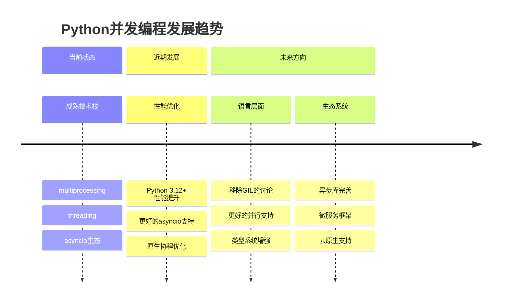

## 16. 结语与未来发展

### 16.1 知识点总结

1. **理论基础**：并发与并行的区别、进程线程协程的特点
2. **多进程编程**：进程创建、通信、池化管理、特殊进程类型
3. **多线程编程**：线程管理、同步原语、GIL影响、死锁预防
4. **协程异步编程**：async/await语法、事件循环、异步I/O
5. **实战应用**：性能优化、调试监控、最佳实践

### 16.2 技术发展趋势

### 16.3 推荐资源

**官方文档**：

- [Python并发编程](https://docs.python.org/zh-cn/3/library/concurrency.html)
- [asyncio文档](https://docs.python.org/zh-cn/3/library/asyncio.html)
- [threading文档](https://docs.python.org/zh-cn/3/library/threading.html)

**优秀库推荐**：

- `aiohttp` - 异步HTTP客户端/服务器
- `aiofiles` - 异步文件操作
- `uvloop` - 高性能异步事件循环
- `concurrent.futures` - 高级并发接口

**性能分析工具**：

- `cProfile` - Python性能分析
- `py-spy` - 生产环境性能监控
- `asyncio-monitor` - 异步程序监控