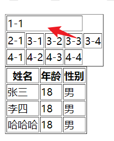
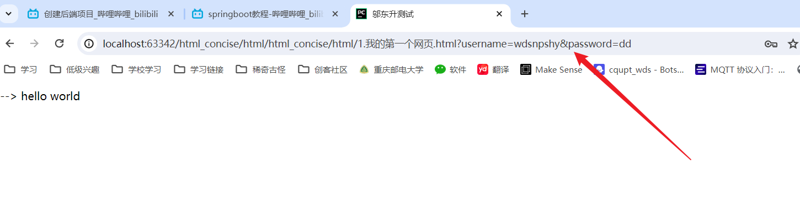

# 第一个网页，

## 1.网站的必要结构


```

<!DOCTYPE html>
<html lang="cn">

<head>
    
    一些基本信息，比如编码格式，关键字，seo优化等
    
</head>

<body>
    网站的主要内容
</body>


</html>
```


## 2.基本标签

* 网页结构标签

```
<h1>一级标签</h1>
<br> 换行标签
<hr> 水平线标签		
<p>段落标签</p>
```

* 颜色字体标签

```
<b>粗体</b>
<i>斜体</i>
<u>下划线</u>
<strong>粗体</strong>    strong标签和b标签的区别：strong标签有语义化，b标签没有语义化
```

* 网站末尾

```
版权所有：&copy;邬东升 
```


## 3. 图像标签

```
<video> 标签用于在 HTML 或 XHTML 文档中嵌入视频。
<video> 标签允许您指定多个视频源，以备用视频源。浏览器将使用第一个可识别的格式。
 标签定义图像，比如图表和照片。			，可以设置很多属性
```

* 相关属性

```
使用controls属性，可以显示播放控件
使用autoplay属性，可以自动播放
使用loop属性，可以循环播放
```


## 4.链接标签

### 1.a标签

* 可以设置图片属性

```
<a>标签：链接标签
    href:必须的属性，指定链接的目标地址
    target:可选的属性，指定链接的打开方式
        _blank:在新窗口中打开
        _self:在当前窗口中打开
        _parent:在父窗口中打开
        _top:在顶层窗口中打开
    name:可选的属性，指定锚点的名称
```


### 2.a标签可以使用，id属性

```
<a id="top"> "顶部" </a>      <!-- id 属性，可以在当前页面中创建一个锚点，id作为锚点的名称 -->	

<a href="#top">回到顶部</a>			<!--跳转到id为top的标签-->
```


### 3.插入联系方式的用方法

```
<p>
<!--qq链接-->
    <a target="_blank" href="http://wpa.qq.com/msgrd?v=3&uin=3412363587&site=qq&menu=yes">
        
    </a>
</p>
```


## 5.列表

### 概览，

* 有序列表的意思是有标号（123）

```
1.列表标签
    有序列表：ol
    无序列表：ul
    自定义列表：dl

```

### ol

```
<ol>
    <li>java</li>
    <li>python</li>
    <li>hhh1</li>
    <li>hhh1</li>
    <li>ddd</li>
</ol>
```

### ul

```
<ul>
    <li>java</li>
    <li>python</li>
    <li>hhh1</li>
    <li>hhh1</li>
    <li>    大大大ddd</li>
</ul>
```

### dl

```
<dd> 是定义列表的内容--可以嵌套有序列表
<dt> 是定义列表的名称
```

```
<dl>
    <dt>code</dt>
    <dd>
        <ul>
        <li>java</li>
        <li>python</li>
        <li>hhh1</li>
        <li>hhh1</li>
        <li>ddd</li>
        </ul>
    </dd>
    <dt>python </dt>
        <dd>python是一门编程语言</dd>
        <dd>python无敌</dd>
        <dd>python 是一门编程语言</dd>
</dl>
```


## 6.表格

```
表格：table
行：tr（table row）
列：td（table data）
表头：th（table head）
```


* 基本结构

```
1.表格的基本结构
2.表格的属性
3.表格的跨行跨列
4.表格的标题
<table> 是table的缩写，表示表格
<tr> 是table row的缩写，表示一行
<td> 是table data的缩写，表示一列
<th> 是table head的缩写，表示表头
border="1" 表示边框的宽度为1px
colspan="2" 表示跨2列
rowspan="2" 表示跨2行
```

* 属性

```
border="1" 表示边框的宽度为1px
colspan="2" 表示跨2列
rowspan="2" 表示跨2行
```

使用实例

```
<td colspan="4">1-1</td>
```



## 7.媒体元素

### 注意

使用媒体元素显示和<a>现实的区别是，后者是链接！！！

```
视频标签
    <video src="../resources/videos/1.mp4"  controls="controls" title="悬浮文字" width="960" height="540"  loop="loop" poster="../resources/images/1.jpg">
    </video>
音频标签
    <audio src="../resources/audio/起风了.mp3" autoplay controls title="起风了2"  loop >
        <p>您的浏览器不支持audio标签</p>   作用是在不支持audio标签的浏览器中显示提示信息
    </audio>
```

* 音频属性

```
controls:显示播放器的控制按钮
autoplay:自动播放
loop:循环播放
poster:视频封面
src:视频地址
title:悬浮文字
```

* 视频属性

```
autoplay:自动播放
loop:循环播放
poster:视频封面
width:宽度
height:高度
src:视频地址
title:悬浮文字
```


## 8.网页结构

```
<!-- 1.网站结构分析 -->
<!-- 简介：网站结构分析是网站建设的第一步，也是最重要的一步。 -->
<!--
头部 header : 通常包含网站的logo、导航、搜索框等
footer : 通常包含网站的版权、备案号、联系方式等
section : 通常包含网站的主要内容
aside : 通常包含网站的次要内容
article : 通常包含网站的独立内容
nav : 通常包含网站的导航
```


## 9.ifram内联框架

```
 总结：iframe内联框架，可以在网页中嵌入其他网页，但是有些网页不允许嵌入，比如百度，所以打不开
```


## 10 表单语法

* 1.基本语法

```
value:提交按钮的值
placeholder:提示信息
name:提交的数据的名称
type:提交的数据的类型
```

实例：

```
<form action="1.我的第一个网页.html" method="get">     <!-- action:提交到哪里去 method:提交方式 -->
        <p>名称:  <input type="text" maxlength="8" size="30 " name="username" required placeholder="请输入用户名">  </p>
        <p>密码： <input type="password" name="password" placeholder="请输入密码">  </p>
        <input type="submit" value="提交">
</form>
```

* 2。mouse属性

直接跳转到id的哪里的选框

```
<p>
    <label for="mouse">点击跳转到框 </label>
    <input type="text" name="mouse" id="mouse">
</p>
```


* 提交结果




