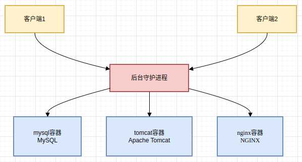
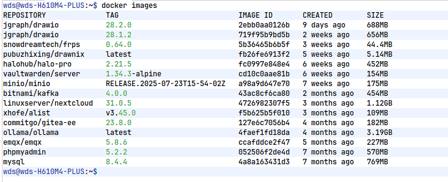
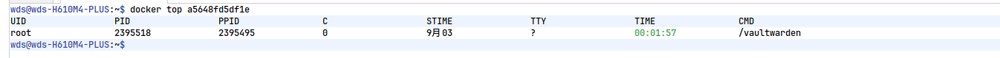
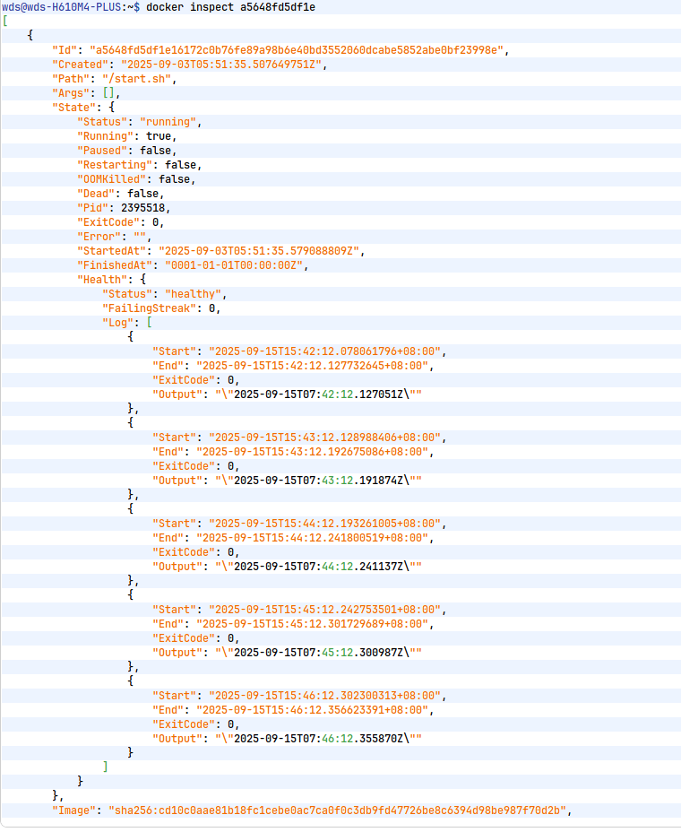

# docker

# 1 docker概述 

## 1.1 什么是Docker容器？

Docker容器是一种轻量级的虚拟化技术，它允许开发者将应用及其依赖文件封装在Docker镜像文件中，然后在不同的物理设备上运行这些镜像，从而实现应用的快速部署和资源的高效利用。

## 1.2 Docker容器和VM的区别

### 启动速度

+ Docker：启动速度非常快，通常在秒级别。这是因为Docker容器直接运行在宿主操作系统上，不需要额外的启动步骤。
+ 虚拟机：启动速度相对较慢，通常需要几分钟。虚拟机需要启动一个完整的操作系统，这包括加载内核、初始化各种服务等。

### 性能损耗

+ Docker：由于Docker容器共享宿主操作系统的内核，因此性能损耗较小。Docker的资源开销（CPU、内存等）比虚拟机低。
+ 虚拟机：虚拟机需要运行一个完整的操作系统，因此性能损耗较大。虚拟机的资源开销较高，因为每个虚拟机都需要自己的操作系统和内核。

### 隔离性

+ Docker：Docker的隔离性较弱，它属于进程级别的隔离。Docker容器共享宿主操作系统的内核，因此可能存在一定的安全隐患。
+ 虚拟机：虚拟机的隔离性较强， 它属于系统级别的隔离。每个虚拟机都有自己的操作系统和内核，因此安全性更高。

### 架构和实现

+ Docker：Docker利用Linux内核的容器化特性（如Namespaces和Cgroups）来实现资源和环境的隔离。Docker引擎可以看作是对这些内核特性的封装。
+ 虚拟机：虚拟机通过Hypervisor（虚拟机管理系统）来实现资源和环境的隔离。Hypervisor虚拟化CPU、内存、I/O设备等，为每个虚拟机提供一个独立的操作系统环境。

### 使用场景

+ Docker：适用于微服务架构、DevOps、持续集成/持续部署(CI/CD)、快速开发和测试等场景。特别适合统一开发环境、实现应用的快速打包、分发和部署。
+ 虚拟机：适用于需要完全隔离、安全性要求高、需要运行不同操作系统的场景。例如企业服务器虚拟化、遗留系统支持、测试不同操作系统等。

### 分发和部署

+ Docker：Docker通过Dockerfile记录容器的构建过程，可以在集群中实现快速分发和部署。Docker镜像的分发更加体系化。
+ 虚拟机：虚拟机通过镜像实现环境交付的一致性，但镜像的分发无法体系化，相对较为繁琐。

## 1.3 docker优势

* 更快速的应用交付和部署 ：传统的应用开发完成后，需要提供一堆安装程序和配置说明文档，安装部署后需根据配置文档进行繁杂 的配置才能正常运行。Docker化之后只需要交付少量容器镜像文件，在正式生产环境加载镜像并运行即 可，应用安装配置在镜像里已经内置好，大大节省部署配置和测试验证时间。 

* 更便捷的升级和扩缩容 ：随着微服务架构和Docker的发展，大量的应用会通过微服务方式架构，应用的开发构建将变成搭乐高积 木一样，每个Docker容器将变成一块“积木”，应用的升级将变得非常容易。当现有的容器不足以支撑业 务处理时，可通过镜像运行新的容器进行快速扩容，使应用系统的扩容从原先的天级变成分钟级甚至秒 级。 

* 更简单的系统运维 应用容器化运行后，生产环境运行的应用可与开发、测试环境的应用高度一致，容器会将应用程序相关 的环境和状态完全封装起来，不会因为底层基础架构和操作系统的不一致性给应用带来影响，产生新的 BUG。当出现程序异常时，也可以通过测试环境的相同容器进行快速定位和修复。

* 更高效的计算资源利用 Docker是内核级虚拟化，其不像传统的虚拟化技术一样需要额外的Hypervisor [管理程序] 支持，所以在 一台物理机上可以运行很多个容器实例，可大大提升物理服务器的CPU和内存的利用率。  

# 2 docker安装

## 2.1 docker的基本组成

### 镜像

是一个用于创建容器的只读模版。可以看做操作系统的一个快照，所以一个镜像可以创建多个容器。

具有层级结构，所以会看到镜像是一层一层的拉取。

### 容器

 Docker 利用容器（Container）独立运行的一个或一组应用。

容器是用镜像创建的运行实例。 它可以被启动、开始、停止、删除。每个容器都是相互隔离的，保证安全的平台。

 可以把容器看做是一个简易版的 Linux 环境（包括root用户权限、进程空间、用户空间和网络空间等） 和运行在其中的应用程序。。

 容器的定义和镜像几乎一模一样，也是一堆层的统一视角，唯一区别在于容器的最上面那一层是可读可写 的。  

### 仓库

 仓库（Repository）是集中存放镜像文件的场所。 

仓库(Repository)和仓库注册服务器（Registry）是有区别的。仓库注册服务器上往往存放着多个仓 库，每个仓库中又包含了多个镜像，每个镜像有不同的标签（tag）。 

仓库分为公开仓库（Public）和私有仓库（Private）两种形式。

 最大的公开仓库是 Docker Hub(https://hub.docker.com/)，存放了数量庞大的镜像供用户下载。 国内的公开仓库包括阿里云 、网易云 等  

## 2.2 安装docker

+ 直接参考官网-----[地址](https://docs.docker.com/engine/install/centos/)

```shell
# Add Docker's official GPG key:
sudo apt-get update
sudo apt-get install ca-certificates curl
sudo install -m 0755 -d /etc/apt/keyrings
sudo curl -fsSL https://download.docker.com/linux/ubuntu/gpg -o /etc/apt/keyrings/docker.asc
sudo chmod a+r /etc/apt/keyrings/docker.asc

# Add the repository to Apt sources:
echo \
  "deb [arch=$(dpkg --print-architecture) signed-by=/etc/apt/keyrings/docker.asc] https://download.docker.com/linux/ubuntu \
  $(. /etc/os-release && echo "$VERSION_CODENAME") stable" | \
  sudo tee /etc/apt/sources.list.d/docker.list > /dev/null
sudo apt-get update


# 安装
sudo apt-get install docker-ce docker-ce-cli containerd.io docker-buildx-plugin docker-compose-plugin

# 测试
sudo docker run hello-world
```


## 2.3 阿里云加速

+ 直接参考官网------[地址](https://cr.console.aliyun.com/cn-hangzhou/instances/mirrors)

* 1panel加速：

```shell
sudo mkdir -p /etc/docker
sudo tee /etc/docker/daemon.json <<-'EOF'
{
  "registry-mirrors": ["https://docker.1panel.live"]
}
EOF
sudo systemctl daemon-reload
sudo systemctl restart docker
```


## 2.4 底层原理



### 客户端

docker客户端是和docker交互的主要方式，可以通过命令行来实现交互，比如docker run xxx

### 守护进程  Docker daemon

Docker 守护进程（通常称为 Docker daemon）是 Docker 架构中的核心组件之一，负责管理和运行 Docker 容器。它是一个后台服务进程，运行在宿主机上，能够监听来自客户端的请求，并执行相应的操作，如创建、启动、停止和删除容器等。

通常适合系统的启动而启动，可以使用如下命令

```shell
sudo systemctl start docker
sudo systemctl stop docker
sudo systemctl restart docker
```

# 3 docker常用命令

## 3.1 帮助命令

```shell
docker version # 显示 Docker 版本信息。
docker info # 显示 Docker 系统信息，包括镜像和容器数。。
docker --help # 帮助
```

## 3.2 镜像命令

### 3.2.1 docker images  

+ 列出本地镜像

```shell
docker images  
```

可选项 -a： 列出本地所有镜像 -q： 只显示镜像id --digests： 显示镜像的摘要信息

**结果**：

**REPOSITORY** 镜像的仓库源 **TAG** 镜像的标签 **IMAGE ID** 镜像的ID **CREATED** 镜像创建时间 **SIZE** 镜像大小



### 3.2.2 docker search 

+ 搜索镜像

```shell
docker search ubuntu
```

可追加的参数：--filter=stars=50 ： 列出收藏数不小于指定值的镜像。

### 3.2.3 docker pull

+ 拉取镜像

```shell
docker pull ubuntu	# 不写标签（tag）默认是拉取最新版本
```

### 3.2.4 docker rmi

+ 删除镜像

```shell
docker rmi -f 镜像id
docker rmi -f 镜像名：id 镜像名：id
docker rmi -f $(docker images -aq)	# 删除全部镜像
```

## 3.3 容器命令

+ **有了镜像才可以创建容器**

### 3.3.1 docker run 

+ 使用镜像运行容器

```shell
docker run -it --name test ubuntu /bin/bash
```

| 参数                  | 描述                                                         |
| --------------------- | ------------------------------------------------------------ |
| `-d`, `--detach`      | 在后台运行容器并打印容器ID                                   |
| `-i`, `--interactive` | 保持STDIN打开，即使没有附加                                  |
| `-t`, `--tty`         | 分配一个伪TTY（通常与`-i`一起使用）                          |
| `-p`, `--publish`     | 发布容器端口到主机，格式为 `<主机端口>:<容器端口>` 或 `udp://<主机端口>:<容器端口>` |
| `-e`, `--env`         | 设置环境变量，例如 `-e VARNAME=value`                        |
| `-v`, `--volume`      | 绑定挂载一个文件或目录，格式为 `<主机路径>:<容器路径>` 或 `<主机路径>:<容器路径>:[rw |
| `--name`              | 为容器指定一个名称                                           |
| `--network`           | 连接容器到指定的网络                                         |


### 3.3.2 docker ps

+ 参看有哪些运行的容器

```shell
docker ps [options]
```

### 3.3.3 进入终端后退出容器

```shell
exit  # 会停止容器
ctrl+p+q #容器不停止退出	
```

### 3.3.4 启动停止容器

```shell
docker start 容器id或容器名称
docker restart 容器id或容器名称
docker stop 容器id或容器名称
docker kill 容器id或容器名称
```

### 3.3.5 删除容器

```shell
docker rm 
docker rm -f $(docker ps -aq) #删除所有容器
docker ps -aq | xargs docker rm #使用管道命令--可以用来启动多个容器
```

### 3.3.6 docker commit 

+ 提交容器为镜像

类似于vm中的快照可以保存容器的状态

```shell
 docker commit 提交容器副本使之成为一个新的镜像！ 
 docker commit -m="提交的描述信息" -a="作者" 容器id 要创建的目标镜像名:[标签名]   
```

## 3.4 其他常用命令

### 3.4.1 docker run -d

+ 后台启动容器

```shell
docker run -d 容器名：tag
```

容器在后台运行时，如果没有前台进程（即主进程PID 1退出），容器会自动停止。这是因为Docker容器的生命周期与其主进程绑定。

### 3.4.2 docker logs

+ 查看日志

```shell
docker logs -tf --tail 10 容器id
```

参数

 -t 显示时间戳 

 -f 打印最新的日志 

 --tail 数字 显示多少条！

### 3.4.3 docker top 

+ 查看容器内进程信息



### 3.4.4 docker inspect 

+ 查看容器的元数据



### 3.4.5 docker exec 和 docker attach

+ 与运行中的容器进行交互命令

```shell
docker exec -it 容器id bashShell		# 打开新的终端
docker attach 容器id								# 不会启动新的终端
```

### 3.4.6 docker cp

+ 拷贝文件

```shell
docker cp [OPTIONS] SRC_PATH CONTAINER:DEST_PATH
docker cp [OPTIONS] CONTAINER:SRC_PATH DEST_PATH
```

+ SRC_PATH：源文件或目录的路径。
+ CONTAINER：目标容器的名称或 ID。
+ DEST_PATH：目标文件或目录的路径。
+ OPTIONS：
  - `--follow-link`, `-L`：如果源文件是符号链接，则复制链接的目标文件而不是链接本身。

## 3.5 可视化

+ 百度搜索，有很多

1. Portainer
2. docker desktop


# 4 容器的数据卷	

## 4.1 什么是数据卷

容器的数据卷（Docker Volumes）是 Docker 提供的一种持久化数据的方法。容器通常是临时的，意味着它们的文件系统在容器删除时会丢失。为了持久化存储，Docker 提供了数据卷，使容器中的数据能够跨容器和主机系统共享或保留。

数据卷 是 Docker 管理的一种特殊目录，可以让数据独立于容器的生命周期进行持久化存储。

### 数据卷的特点：

1. **持久性存储**：
   - 数据卷在容器删除后依然存在，因此可以避免容器停止或删除时丢失数据。它们存储的数据可以在容器间共享或保留。
2. **容器之间共享数据：**
   - 多个容器可以挂载同一个数据卷，从而在容器之间共享数据。这使得容器之间的数据同步变得简单和高效。
3. 独立于容器生命周期：
   - 数据卷的生命周期独立于容器本身。当一个容器删除时，数据卷并不会被删除，除非**显式删除数据卷**。这确保了容器和数据分离，便于容器的重建和维护。
4. 性能优化：
   - 数据卷通常比容器内的存储（比如容器文件系统）具有更高的性能，因为它们通常与宿主机的文件系统直接挂载，且可以避免容器文件系统的写入限制。
5. 容易备份和恢复：
   - 数据卷可以通过 Docker 命令轻松备份、恢复和迁移。你可以将数据卷挂载到另一个容器，或将其内容导出为 tar 文件进行备份。
6. 支持宿主机和容器间的数据共享：
   - 数据卷可以挂载到宿主机的指定目录，也可以直接在 Docker 中创建。通过挂载宿主机目录到容器内的卷中，可以轻松在宿主机和容器之间共享数据。
7. 无需容器管理：
   - 容器创建和销毁时，Docker 会自动管理数据卷的挂载和解绑，用户不需要手动处理这些操作。

  

## 4.2 三种挂载方式

在 Docker 中，数据卷（Volume）用于持久化和共享容器的数据，通常用于在容器生命周期之外保留数据。Docker 提供了三种主要的挂载方式：**匿名挂载卷**、**命名卷**和**绑定挂载**。以下是这三种挂载方式的实际使用讲解：

### 1. 匿名挂载卷

匿名挂载卷不指定卷的名称，Docker 会自动创建一个新卷，并将它挂载到容器中。

### 示例

```bash
docker run -it -v /data ubuntu /bin/bash
```

- `-v /data` 表示将容器中的 `/data` 目录挂载到一个匿名卷。
- Docker 会自动为该匿名卷分配一个随机的卷名称，删除容器的时候添加-v参数就会一起删除。（除非被其他容器使用）。

**查看卷**

```bash
docker volume ls
```

你会看到一个由 Docker 自动创建的匿名卷。

* 查看容器信息来找到数据卷

```shell
docker inspect 容器名称
```

* 查看数据卷信息找到数据卷在宿主机的目录

```shell
docker volume inspect 数据卷名称
```


### 2. 命名卷

命名卷是显式地给卷命名，可以通过卷名在 Docker 中识别和复用这些卷。

#### 示例

```bash
docker volume create test
docker run -it -v test:/data ubuntu /bin/bash
```

- `docker volume create test` 命令创建了一个名为 `test` 的卷。
- `-v test:/data` 表示将命名卷 `test` 挂载到容器的 `/data` 目录。
- 命名卷可以在多个容器之间共享。

**查看命名卷**

```bash
docker volume ls
```

会看到一个名为 `test` 的卷。

### 3. 绑定挂载

绑定挂载将宿主机上的一个目录或文件挂载到容器中，这使得容器可以直接访问宿主机上的文件系统。

#### 示例

```bash
docker run -it  -v /host/data:/container/data ubuntu /bin/bash
```

- `/host/data` 是宿主机上的目录路径。
- `/container/data` 是容器内的目录路径。
- 任何在容器内对挂载目录的修改都会直接反映到宿主机上，两者数据实时同步。

**查看绑定挂载**

绑定挂载没有单独的Docker管理命令，因为它直接映射到宿主机的文件系统。你可以直接查看宿主机目录中的内容，或使用 `docker inspect 容器名` 查看挂载信息。

#### 4.2.4 总结

- **匿名挂载卷**：适用于临时数据存储，容器删除后数据卷依然存在，需要手动删除。

```shell
# 删除容器时同时删除关联的匿名数据卷
docker rm -v 容器ID   
# 或者单独删除数据卷
docker volume rm 数据卷名称
```

- **命名卷**：适用于持久化存储，可以在不同容器之间共享。
- **绑定挂载**：适用于直接与宿主机文件系统交互，通常用于开发环境或需要访问宿主机文件的场景。


## 4.3 常用命令

### 4.3.1 继承父容器的数据卷

```shell
docker run -it --name docker02 --volumes-from docker01 ubuntu
```

- `--volumes-from docker01`：表示容器 `docker02` 会继承容器 `docker01` 中挂载的数据卷。
- 这种方式常用于创建多个容器之间共享数据，尤其是当多个容器需要同时使用同一份数据时。

### 4.3.2 改变文件权限

可以通过在 `-v` 参数后添加 `:ro` 或 `:rw` 来指定容器对挂载目录的读写权限。

- `:ro`（只读）：容器只能读取数据卷中的数据，不能修改。
- `:rw`（读写，默认值）：容器可以读取和写入数据卷中的数据。

#### 示例：

```bash
# 挂载卷，且设置为只读
docker run -it -P --name nginx02 -v nginxconfig:/etc/nginx:ro nginx /bin/bash

# 挂载卷，且设置为读写（这是默认的行为）
docker run -d -P --name nginx02 -v nginxconfig:/etc/nginx:rw nginx
```

- `:ro` 和 `:rw` 用来指定容器对挂载目录的权限，默认情况下是读写（`rw`）。

### 4.3.3 其他常用命令

- **查看数据卷：**

```bash
docker volume ls
```

- **删除数据卷：**

```bash
docker volume rm my_volume
```

- **查看数据卷的详细信息：**

```bash
docker volume inspect my_volume
```

- **挂载数据卷到容器：**

```bash
docker run -v my_volume:/path/in/container my_image
```

## 4.4 使用项目示例：nginx

### 概述

Docker Volumes 是 Docker 中用于持久化存储数据的一种机制。通过使用 Volumes，你可以确保容器中的数据在容器停止或删除后仍然存在。这对于需要持久化存储的应用程序（如数据库、配置文件等）非常有用。

### 示例程序：使用 Docker Volumes 运行 Nginx

在这个示例中，我们将使用 Docker Volumes 来持久化 Nginx 的配置文件和网站数据。

#### 1. 创建 Docker Volume

首先，我们需要创建两个 Docker Volumes，一个用于存储 Nginx 的配置文件，另一个用于存储网站数据。

```plain
docker volume create nginx_config 
docker volume create nginx_data
```

#### 2. 创建 Nginx 配置文件

在本地创建 `nginx.conf` 和 `index.html` 文件，并将它们放置在一个目录中。

创建配置文件

```plain
worker_processes 1;

events {
    worker_connections 1024;
}

http {
    default_type application/octet-stream;

    server {
        listen 8888;
        server_name 0.0.0.0;

        location / {
            root /usr/share/nginx/html/;
            index index.html;
        }
    }
}
```

#### 3. 创建网站数据

```plain
<!DOCTYPE html>
<html>
<head>
    <title>Welcome to Nginx with Docker!</title>
</head>
<body>
    <h1>Hello, Docker Volumes!</h1>
</body>
</html>
```

#### 4. 或者替换为Ds生成

```html
<!DOCTYPE html>
<html lang="zh-CN">
<head>
    <meta charset="UTF-8">
    <meta name="viewport" content="width=device-width, initial-scale=1.0">
    <title>Docker Volume 学习指南</title>
    <style>
        :root {
            --primary: #2496ed;
            --secondary: #1e88e5;
            --dark: #0d47a1;
            --light: #bbdefb;
            --background: #f5f7fa;
        }
        
        body {
            font-family: 'Segoe UI', Tahoma, Geneva, Verdana, sans-serif;
            line-height: 1.6;
            color: #333;
            background-color: var(--background);
            margin: 0;
            padding: 0;
        }
        
        .container {
            max-width: 1200px;
            margin: 0 auto;
            padding: 20px;
        }
        
        header {
            background: linear-gradient(135deg, var(--primary), var(--dark));
            color: white;
            padding: 2rem 0;
            text-align: center;
            border-radius: 0 0 10px 10px;
            box-shadow: 0 4px 12px rgba(0, 0, 0, 0.1);
            margin-bottom: 2rem;
        }
        
        h1 {
            margin: 0;
            font-size: 2.5rem;
        }
        
        .subtitle {
            font-size: 1.2rem;
            opacity: 0.9;
            margin-top: 0.5rem;
        }
        
        .card {
            background: white;
            border-radius: 8px;
            padding: 1.5rem;
            margin-bottom: 1.5rem;
            box-shadow: 0 2px 8px rgba(0, 0, 0, 0.1);
            transition: transform 0.3s ease;
        }
        
        .card:hover {
            transform: translateY(-5px);
        }
        
        h2 {
            color: var(--dark);
            margin-top: 0;
            border-bottom: 2px solid var(--light);
            padding-bottom: 0.5rem;
        }
        
        .code-block {
            background: #f0f4f8;
            padding: 1rem;
            border-radius: 6px;
            font-family: 'Courier New', Courier, monospace;
            overflow-x: auto;
            margin: 1rem 0;
            border-left: 4px solid var(--primary);
        }
        
        .command {
            color: #d6336c;
            font-weight: bold;
        }
        
        .note {
            background: #fff3bf;
            padding: 1rem;
            border-radius: 6px;
            border-left: 4px solid #ffd43b;
            margin: 1rem 0;
        }
        
        .btn {
            display: inline-block;
            background: var(--primary);
            color: white;
            padding: 0.6rem 1.2rem;
            border-radius: 4px;
            text-decoration: none;
            font-weight: bold;
            transition: background 0.3s;
        }
        
        .btn:hover {
            background: var(--dark);
        }
        
        footer {
            text-align: center;
            margin-top: 2rem;
            padding: 1rem;
            color: #666;
            font-size: 0.9rem;
        }
        
        .grid {
            display: grid;
            grid-template-columns: repeat(auto-fit, minmax(300px, 1fr));
            gap: 1.5rem;
            margin: 2rem 0;
        }
    </style>
</head>
<body>
    <header>
        <div class="container">
            <h1>Docker Volume 学习指南</h1>
            <p class="subtitle">掌握容器数据持久化的关键技术</p>
        </div>
    </header>
    
    <div class="container">
        <div class="card">
            <h2>什么是 Docker Volume？</h2>
            <p>Docker Volume 是 Docker 提供的用于持久化存储数据的机制。它允许容器与主机或其他容器共享数据，即使容器被删除，Volume 中的数据仍然保留。</p>
            
            <div class="note">
                <strong>为什么需要 Volume？</strong> 默认情况下，容器内的文件系统是临时的，当容器停止或删除时，所有更改都会丢失。Volume 解决了这个问题。
            </div>
        </div>
        
        <div class="grid">
            <div class="card">
                <h2>创建 Volume</h2>
                <p>使用以下命令创建一个命名的 Volume：</p>
                <div class="code-block">
                    <span class="command">docker volume create</span> my_volume
                </div>
                <p>列出所有 Volume：</p>
                <div class="code-block">
                    <span class="command">docker volume ls</span>
                </div>
            </div>
            
            <div class="card">
                <h2>使用 Volume</h2>
                <p>在运行容器时挂载 Volume：</p>
                <div class="code-block">
                    <span class="command">docker run -d --name my_container \</span><br>
                    <span class="command">-v my_volume:/app/data</span> \<br>
                    my_image
                </div>
                <p>这将把 Volume 挂载到容器的 <code>/app/data</code> 目录。</p>
            </div>
        </div>
        
        <div class="card">
            <h2>Volume 类型</h2>
            <ul>
                <li><strong>命名 Volume</strong> - 由 Docker 管理，是最常用的类型</li>
                <li><strong>绑定挂载</strong> - 直接挂载主机文件系统的目录</li>
                <li><strong>tmpfs 挂载</strong> - 仅存储在内存中，不持久化</li>
            </ul>
            
            <h3>绑定挂载示例</h3>
            <div class="code-block">
                <span class="command">docker run -d --name my_container \</span><br>
                <span class="command">-v /path/on/host:/path/in/container</span> \<br>
                my_image
            </div>
        </div>
        
        <div class="card">
            <h2>实际应用示例</h2>
            <p>使用 Volume 运行 MySQL 数据库：</p>
            <div class="code-block">
                <span class="command">docker run -d --name mysql_db \</span><br>
                <span class="command">-v mysql_data:/var/lib/mysql \</span><br>
                <span class="command">-e MYSQL_ROOT_PASSWORD=my-secret-pw \</span><br>
                mysql:latest
            </div>
            
            <p>备份 Volume 数据：</p>
            <div class="code-block">
                <span class="command">docker run --rm \</span><br>
                <span class="command">-v mysql_data:/volume \</span><br>
                <span class="command">-v $(pwd):/backup \</span><br>
                <span class="command">alpine tar cvf /backup/mysql_backup.tar /volume</span>
            </div>
        </div>
        
        <div class="card">
            <h2>进一步学习</h2>
            <p>要了解更多关于 Docker Volume 的信息，可以查看以下资源：</p>
            <ul>
                <li><a href="https://docs.docker.com/storage/volumes/" target="_blank">官方文档 - Docker Volumes</a></li>
                <li><a href="https://docs.docker.com/storage/bind-mounts/" target="_blank">官方文档 - Bind Mounts</a></li>
                <li><a href="https://docs.docker.com/compose/compose-file/#volumes" target="_blank">Docker Compose 中的 Volume 配置</a></li>
            </ul>
            <a href="#" class="btn">开始实验</a>
        </div>
    </div>
    
    <footer>
        <div class="container">
            <p>© 2023 Docker Volume 学习项目 | 使用 HTML & CSS 构建</p>
        </div>
    </footer>
</body>
</html>
```


#### 5. 运行 Nginx 容器

运行 Nginx 容器，并挂载之前创建的两个 Docker Volumes。

```plain
docker run -d --name my_nginx -p 8888:8888 \
  -v nginx_config:/etc/nginx \
  -v nginx_data:/usr/share/nginx/html \
  nginx	
```

#### 6. 验证

打开浏览器，访问 `http://localhost:8888`，你应该会看到 `Hello, Docker Volumes!` 的页面。


# 5. DockerFile

DockerFile是Docker镜像构建的核心工具，掌握它是成为Docker高手的必经之路。

## 5.1 DockerFile概述

### 5.1.1 什么是DockerFile

`DockerFile`是一个包含构建指令的文本文件，用于自动化创建Docker镜像。它定义了从基础镜像到最终应用镜像的完整构建过程。

**DockerFile的特点：**

- 文本格式，易于版本控制
- 指令式编程，逐步构建
- 支持缓存机制，提高构建效率
- 可重复构建，确保环境一致性

### 5.1.2 Docker镜像构建流程

```
开发应用 → 编写DockerFile → 构建镜像 → 上传仓库 → 下载使用 → 启动运行
```

**具体步骤：**

1. **编写DockerFile文件** - 定义构建指令
2. **docker build 构建镜像** - 基于DockerFile创建镜像
3. **docker run 运行容器** - 基于镜像启动容器

## 5.2 DockerFile指令详解

### 5.2.1 基础指令

#### FROM - 指定基础镜像

```dockerfile
FROM ubuntu:20.04
FROM centos:7
FROM scratch  # 空白镜像
```

- 每个DockerFile必须以FROM开始
- 可以使用多个FROM创建多阶段构建

#### MAINTAINER/LABEL - 维护者信息

```dockerfile
# 推荐写法
LABEL maintainer="wds <wds@example.com>"
LABEL version="1.0"
LABEL description="My custom image"
```

### 5.2.2 环境配置指令

#### ENV - 设置环境变量

```dockerfile
ENV MYPATH /usr/local
ENV JAVA_HOME /usr/lib/jvm/java-8-openjdk
ENV PATH $PATH:$JAVA_HOME/bin
```

#### WORKDIR - 设置工作目录

```dockerfile
WORKDIR /usr/local
WORKDIR $MYPATH  # 可以使用环境变量
```

- 相当于cd命令，但会创建目录
- 后续的RUN、CMD、COPY等指令都在此目录下执行

#### USER - 切换用户

```dockerfile
USER root
USER nginx
USER 1000  # 也可以使用UID
```

### 5.2.3 文件操作指令

#### COPY - 复制文件

```dockerfile
COPY src/ /app/
COPY package.json /app/
COPY --chown=nginx:nginx config.conf /etc/nginx/
```

- 只能复制构建上下文中的文件
- 推荐使用，功能简单明确

#### ADD - 增强的复制

```dockerfile
ADD app.tar.gz /app/  # 自动解压
ADD https://example.com/file.txt /tmp/  # 支持URL
```

- 支持自动解压和URL下载
- 一般情况下推荐使用COPY

### 5.2.4 执行指令

#### RUN - 构建时执行命令

```dockerfile
# Shell格式
RUN yum update -y
RUN apt-get update && apt-get install -y nginx

# Exec格式（推荐）
RUN ["yum", "install", "-y", "vim"]

# 合并命令减少层数（最佳实践）
RUN yum update -y && \
    yum install -y vim net-tools && \
    yum clean all
```

#### CMD - 容器启动命令

```dockerfile
# 只能有一个CMD，多个则最后一个生效
CMD ["nginx", "-g", "daemon off;"]
CMD nginx -g "daemon off;"  # Shell格式
```

- 容器启动时的默认命令
- 可以被docker run命令覆盖

#### ENTRYPOINT - 入口点

```dockerfile
ENTRYPOINT ["nginx"]
CMD ["-g", "daemon off;"]  # 作为ENTRYPOINT的参数
```

- 不会被docker run命令覆盖
- 常与CMD配合使用

### 5.2.5 网络和存储指令

#### EXPOSE - 声明端口

```dockerfile
EXPOSE 80
EXPOSE 443
EXPOSE 8080/tcp  # 默认TCP
EXPOSE 53/udp    # UDP端口
```

- 仅是声明，不会自动映射
- 需要在运行时使用-p参数映射

#### VOLUME - 声明挂载点

```dockerfile
VOLUME ["/data"]
VOLUME ["/var/log", "/var/db"]
```

- 声明匿名卷挂载点
- 运行时数据不会写入容器层

### 5.2.6 其他常用指令

#### ARG - 构建参数

```dockerfile
ARG VERSION=latest
FROM nginx:$VERSION

ARG USER=1000
USER $USER
```

- 仅在构建时有效
- 可以通过--build-arg传递

## 5.3 实战案例

### 5.3.1 编写DockerFile

创建一个增强版CentOS镜像，安装常用工具：

```dockerfile
# 基础镜像
FROM centos:7

# 维护者信息
LABEL maintainer="wds <wds@example.com>" \
      version="1.0" \
      description="Enhanced CentOS with development tools"

# 设置环境变量
ENV MYPATH /usr/local
ENV LANG en_US.UTF-8

# 设置工作目录
WORKDIR $MYPATH

# 安装软件包（合并命令减少层数）
RUN yum update -y && \
    yum install -y \
        vim \
        net-tools \
        wget \
        curl \
        git \
        gcc \
        make && \
    yum clean all && \
    rm -rf /var/cache/yum/*

# 创建普通用户
RUN useradd -m -s /bin/bash developer

# 声明端口
EXPOSE 80 443

# 创建数据目录
VOLUME ["/data"]

# 设置默认命令
CMD ["/bin/bash"]
```

### 5.3.2 构建镜像

```bash
# 基本构建（DockerFile在当前目录）
docker build -t mycentos:1.0 .

# 指定DockerFile路径
docker build -f /path/to/DockerFile -t mycentos:1.0 .

# 传递构建参数
docker build --build-arg VERSION=8 -t mycentos:1.0 .

# 不使用缓存构建
docker build --no-cache -t mycentos:1.0 .
```

**参数说明：**

- `-f` : 指定DockerFile路径
- `-t` : 指定镜像名称和标签
- `.` : 构建上下文路径
- `--build-arg` : 传递构建参数
- `--no-cache` : 不使用构建缓存

### 5.3.3 测试运行

```bash
# 运行容器
docker run -it --name test mycentos:1.0

# 后台运行并映射端口
docker run -d -p 8080:80 --name web mycentos:1.0

# 挂载数据卷
docker run -it -v /host/data:/data --name test mycentos:1.0
```

## 5.4 Docker镜像分层机制

### 5.4.1 分层原理

Docker镜像采用分层存储架构，每个DockerFile指令都会创建一个新的镜像层：

```
容器层 (读写层)
├── Layer N: CMD ["/bin/bash"]
├── Layer 3: COPY app.jar /app/
├── Layer 2: RUN yum install -y vim
├── Layer 1: FROM centos:7
└── 基础层
```

**分层特点：**

- 每层都是只读的
- 层与层之间是增量关系
- 容器运行时添加可写层

### 5.4.2 分层机制的优势

#### 1. 存储空间优化

```bash
# 多个容器共享相同的基础层
Container A: App A + Node.js层 + Ubuntu层
Container B: App B + Node.js层 + Ubuntu层 (共享)
Container C: App C + Node.js层 + Ubuntu层 (共享)
```

#### 2. 构建缓存加速

```dockerfile
FROM node:14          # ← 缓存命中，跳过下载
WORKDIR /app          # ← 缓存命中，跳过
COPY package.json .   # ← 缓存命中，跳过
RUN npm install       # ← 缓存命中，跳过
COPY . .             # ← 代码变更，从此处重新构建
RUN npm build        # ← 重新执行
```

#### 3. 镜像共享复用

- 相同的基础镜像层在不同镜像间共享
- 减少网络传输和存储需求
- 提高镜像分发效率

### 5.4.3 查看镜像分层

**docker history**

```bash
# 查看镜像构建历史
docker history mycentos:1.0

# 输出示例：
# IMAGE          CREATED BY                                      SIZE
# a1b2c3d4e5f6   CMD ["/bin/bash"]                              0B
# f6e5d4c3b2a1   EXPOSE 80 443                                  0B  
# 1a2b3c4d5e6f   RUN yum install -y vim net-tools && yum ...    156MB
# 6f5e4d3c2b1a   WORKDIR /usr/local                             0B
# b1a2c3d4e5f6   ENV MYPATH=/usr/local                          0B

# 查看镜像详细信息
docker inspect mycentos:1.0

# 使用dive工具分析镜像层（需要安装dive）
dive mycentos:1.0
```

### 5.4.4 分层优化最佳实践

#### 1. 合并RUN指令

```dockerfile
# ❌ 不好的做法 - 创建多个层
RUN yum update -y
RUN yum install -y vim
RUN yum install -y net-tools  
RUN yum clean all

# ✅ 推荐做法 - 合并为一层
RUN yum update -y && \
    yum install -y vim net-tools && \
    yum clean all
```

#### 2. 合理安排指令顺序

```dockerfile
# ✅ 将变化频率低的指令放前面
FROM node:14
WORKDIR /app
COPY package.json .    # 依赖文件很少变化
RUN npm install        # 利用缓存
COPY . .              # 代码经常变化，放最后
```

#### 3. 使用.dockerignore

**不被 `COPY` 或 `ADD` 指令包含**

```bash
# .dockerignore文件
node_modules
*.log
.git
README.md
```

## 5.5 DockerFile最佳实践

### 5.5.1 编写规范

1. **使用官方基础镜像**

   ```dockerfile
   FROM node:14-alpine  # 使用官方轻量级镜像
   ```

2. **固定版本标签**

   ```dockerfile
   FROM nginx:1.20-alpine  # 避免使用latest
   ```

3. **最小化镜像大小**

   ```dockerfile
   RUN apk add --no-cache git
   RUN rm -rf /var/cache/apk/*
   ```

4. **合理使用缓存**

   ```dockerfile
   # 将变化少的操作放前面
   COPY requirements.txt .
   RUN pip install -r requirements.txt
   COPY . .  # 代码变化放最后
   ```

### 5.5.2 安全最佳实践

1. **使用非root用户**

   ```dockerfile
   RUN adduser -D appuser
   USER appuser
   ```

2. **最小权限原则**

   ```dockerfile
   COPY --chown=appuser:appuser . /app
   ```

3. **及时清理缓存**

   ```dockerfile
   RUN apt-get update && \
       apt-get install -y package && \
       rm -rf /var/lib/apt/lists/*
   ```

## 5.6 常见问题与解决方案

### 5.6.1 构建失败排查

1. **检查构建上下文**

   ```bash
   # 查看发送到Docker daemon的文件
   docker build --progress=plain -t myapp .
   ```

2. **调试中间层**

   ```bash
   # 基于失败的层启动容器调试
   docker run -it <layer_id> /bin/sh
   ```

### 5.6.2 镜像过大问题

1. **使用多阶段构建**
2. **选择轻量级基础镜像**
3. **及时清理临时文件**
4. **使用.dockerignore过滤文件**

## 5.7 小结

- **DockerFile基础**：理解构建流程和基本语法
- **指令详解**：掌握FROM、RUN、COPY等核心指令
- **分层机制**：理解Docker镜像的存储原理
- **最佳实践**：编写高效、安全的DockerFile

# 6. 仓库管理

## 6.1 官方仓库

### 6.1.1 登录退出

```shell
docker login
docker logout
```

### 6.1.2 基于容器或者file制作镜像

+ 用户名一定要正确

```shell
docker commit -m "搭建好了hadoop集群"  501ecfd0e6bf wds2dxh/hadoop:v1.0
```

### 6.1.3 推送

```shell
docker push wds2dxh/hadoop:v1.0
```

## 6.2 阿里云镜像仓库

[参考阿里云官网](https://cr.console.aliyun.com/cn-hangzhou)

# 7. Docker网络

Docker网络是容器间通信的重要基础。

## 7.1 Docker网络基础

### 7.1.1 docker0网桥原理

**什么是docker0？**

每个安装了Docker的Linux主机都会自动创建一个名为`docker0`的虚拟网桥。这是Docker默认的网桥设备，充当容器间通信的"交换机"。

**技术实现：**

- 使用Linux的veth-pair（虚拟以太网对）技术
- 一端连接到容器内部，另一端连接到docker0网桥
- 默认IP段：172.17.0.0/16

### 7.1.2 容器网络创建过程

当启动一个容器时，Docker会：

1. 在宿主机上创建一对veth虚拟网卡
2. 一端放在容器内部（通常命名为eth0）
3. 另一端连接到docker0网桥
4. 为容器分配一个IP地址

**验证方法：**

```bash
# 查看宿主机网络接口
ip link show

# 启动容器前后对比，可以看到新增的veth接口
docker run -d --name test nginx
ip link show
```

### 7.1.3 容器间通信机制

容器间能够相互ping通的原理：

- docker0充当二层交换机角色
- 所有连接到docker0的容器都在同一网段
- 通过MAC地址学习实现数据包转发

**实践演示：**

```bash
# 启动两个容器
docker run -d --name test1 nginx
docker run -d --name test2 nginx

# 获取容器IP
docker inspect test1 | grep IPAddress
docker inspect test2 | grep IPAddress

# 测试连通性
docker exec test1 ping 容器test2的IP
```

## 7.2 容器连接：--link选项

### 7.2.1 --link的作用

`--link`选项允许容器通过名称而非IP地址进行通信，提供了一种简单的服务发现机制。

**基本用法：**

```bash
# 先启动被链接的容器
docker run -d --name database mysql:5.7

# 启动链接到database的容器
docker run -d --name webapp --link database nginx
```

### 7.2.2 --link工作原理

--link通过修改容器的`/etc/hosts`文件实现名称解析：

```bash
# 查看hosts文件内容
docker exec webapp cat /etc/hosts

# 输出类似：
# 127.0.0.1   localhost
# 172.17.0.2  database 容器ID
```

**验证连通性：**

```bash
# 可以直接使用容器名ping
docker exec webapp ping database
```

### 7.2.3 --link的局限性

⚠️ **重要提醒：**

- --link已被Docker官方标记为**遗留功能**（legacy feature）
- 不推荐在生产环境中使用
- 推荐使用自定义网络替代

## 7.3 自定义网络

### 7.3.1 查看Docker网络

```bash
# 列出所有网络
docker network ls

# 输出示例：
# NETWORK ID     NAME      DRIVER    SCOPE
# xxxxxxxxxxxx   bridge    bridge    local
# xxxxxxxxxxxx   host      host      local  
# xxxxxxxxxxxx   none      null      local
```

### 7.3.2 Docker网络模式详解

Docker支持多种网络模式，每种模式适用于不同场景：

#### Bridge模式（默认）

```bash
docker run --net=bridge nginx
```

- 容器连接到docker0网桥
- 容器有独立的网络命名空间
- 最常用的模式

#### Host模式

```bash
docker run --net=host nginx
```

- 容器直接使用宿主机网络
- 性能最高，但隔离性最差
- 适用于对网络性能要求极高的场景

#### None模式

```bash
docker run --net=none nginx
```

- 容器无网络配置
- 只有loopback接口
- 需要用户手动配置网络

#### Container模式

```bash
docker run --net=container:other_container nginx
```

- 新容器共享指定容器的网络命名空间
- Kubernetes的Pod基于此模式实现

#### 自定义网络模式

```bash
docker run --net=mynetwork nginx
```

- 用户创建的自定义网络
- 支持自动DNS解析
- 提供更好的网络隔离

### 7.3.3 检查网络详细信息

```bash
# 查看特定网络的详细配置
docker network inspect bridge

# 或使用网络ID
docker network inspect 网络ID
```

这个命令会显示网络的子网、网关、连接的容器等详细信息。

### 7.3.4 创建自定义网络

**基本创建：**

```bash
docker network create mynetwork
```

**高级创建（指定参数）：**

```bash
docker network create \
  --driver bridge \
  --subnet 192.168.0.0/16 \
  --gateway 192.168.0.1 \
  mynetwork
```

**参数说明：**

- `--driver`：网络驱动类型
- `--subnet`：子网范围
- `--gateway`：网关地址

### 7.3.5 使用自定义网络

```bash
# 在创建容器时指定网络
docker run -d --name webapp --net mynetwork nginx

# 也可以指定IP地址
docker run -d --name database --net mynetwork --ip 192.168.0.10 mysql:5.7
```

### 7.3.6 自定义网络的优势

使用自定义网络的容器具有以下特性：

1. **自动DNS解析**：容器可以直接通过名称ping通

   ```bash
   docker exec webapp ping database
   ```

2. **更好的隔离性**：不同自定义网络间默认隔离

3. **灵活的网络配置**：可以自定义IP段、网关等

### 7.3.7 将容器连接到多个网络

一个容器可以同时连接到多个网络，实现复杂的网络拓扑：

```bash
# 将现有容器连接到新网络
docker network connect mynetwork existing_container

# 断开网络连接
docker network disconnect mynetwork existing_container
```

**实际效果：**

- 容器将拥有多个IP地址
- 可以与多个网络中的容器通信
- 提供了网络间的桥接能力

### 7.3.8 网络管理最佳实践

1. **生产环境建议**：
   - 为每个应用创建独立的自定义网络
   - 避免使用默认bridge网络
   - 合理规划IP地址段
2. **安全考虑**：
   - 不同应用间使用不同网络实现隔离
   - 必要时使用防火墙规则进一步限制
3. **性能优化**：
   - 对网络性能要求极高的场景考虑host模式
   - 使用合适的网络驱动

## 7.4 小结

本章介绍了Docker网络的核心概念：

- docker0网桥是默认网络的基础
- --link虽然简单但已过时，不推荐使用
- 自定义网络是现代Docker应用的最佳选择
- 不同网络模式适用于不同场景

在下一章中，我们将学习Docker的数据持久化和卷管理。

## 7.5 tips

#### 7.5.1容器间自动写入host

创建自定义网络，容器加入后即可通过名称互相 ping：

```bash
# 1. 创建自定义桥接网络
docker network create mynet

# 2. 启动容器并加入网络（指定名称）
docker run -d --name nginx1 --network mynet nginx
docker run -d --name nginx2 --network mynet nginx

# 3. 在容器内通过名称 ping 通
docker exec nginx1 ping -c 3 nginx2
docker exec nginx2 ping -c 3 nginx1
```

✅ 容器间可直接用名称通信 —— Docker 自动提供 DNS 解析。

⚠️ 宿主机不能直接 ping 容器名，需手动绑定 IP 到 `/etc/hosts`：

```bash
# 获取容器 IP 并写入宿主机 hosts（临时方案）
IP=$(docker inspect -f '{{range .NetworkSettings.Networks}}{{.IPAddress}}{{end}}' nginx1)
echo "$IP nginx1" | sudo tee -a /etc/hosts

# 现在宿主机可 ping
ping nginx1
```

📌 推荐：容器间通信用自定义网络 + 容器名，宿主机访问用端口映射或容器 IP。

---

# 8. Docker Compose

Docker Compose是用于定义和运行多容器Docker应用程序的编排工具。通过一个YAML配置文件，可以轻松管理复杂的多容器应用架构。

## 8.1 Docker Compose概述

### 8.1.1 什么是Docker Compose

Docker Compose解决了单个Docker容器无法满足复杂应用需求的问题。现代应用通常由多个组件组成，比如Web服务器、数据库、缓存服务等，每个组件运行在独立的容器中。

**传统方式的问题：**

- 需要逐个启动多个容器
- 手动配置容器间的网络连接
- 难以管理容器间的依赖关系
- 部署和维护复杂

**Docker Compose的解决方案：**

- 通过一个YAML文件定义整个应用栈
- 自动创建和管理容器间的网络
- 处理服务间的依赖关系
- 提供统一的管理命令

### 8.1.2 核心概念

**服务（Services）**：应用中的一个组件，比如web服务、数据库服务。每个服务可以运行一个或多个容器。

**项目（Project）**：由一组关联的服务组成的完整应用。项目名默认为docker-compose.yml所在目录的名称。

**容器（Container）**：服务的运行实例。一个服务可以有多个容器实例来实现负载均衡。

### 8.1.3 工作流程

```
开发应用 → 编写Dockerfile(可选) → 创建docker-compose.yml → 执行docker-compose up
```

**具体步骤：**

1. **定义环境**：使用Dockerfile定义应用环境（如果需要自定义镜像）
2. **配置服务**：在docker-compose.yml中定义所有服务及其配置
3. **启动应用**：运行`docker-compose up`启动整个应用栈

## 8.2 安装Docker Compose

### 8.2.1 安装方法

```bash
# Linux系统安装
sudo curl -L "https://github.com/docker/compose/releases/download/v2.21.0/docker-compose-$(uname -s)-$(uname -m)" -o /usr/local/bin/docker-compose

# 添加执行权限
sudo chmod +x /usr/local/bin/docker-compose

# 验证安装
docker-compose --version
```

## 8.3 配置文件详解

### 8.3.1 文件结构

docker-compose.yml是Docker Compose的核心配置文件，采用YAML格式：

```yaml
version: '3.8'      # Compose文件版本
services:           # 定义服务
  service1:
    # 服务1配置
  service2:
    # 服务2配置
networks:           # 自定义网络（可选）
volumes:            # 命名数据卷（可选）
```

### 8.3.2 版本声明

版本声明决定了可用的配置选项和功能：

```yaml
version: '3.8'    # 推荐使用，支持最新特性
```

不同版本的主要区别：

- `3.8`：最新特性，支持所有现代Docker功能
- `3.3`：兼容性好，适合旧版Docker环境

### 8.3.3 服务配置

#### 镜像选择

指定服务使用的Docker镜像：

```yaml
services:
  web:
    image: nginx:alpine     # 使用官方镜像
  
  app:
    build: .                # 使用当前目录的Dockerfile构建
    # 或指定详细构建配置
    build:
      context: ./app        # 构建上下文路径
      dockerfile: Dockerfile.dev  # 指定Dockerfile文件
```

#### 端口映射

将容器端口映射到宿主机端口，实现外部访问：

```yaml
services:
  web:
    ports:
      - "8080:80"           # 宿主机端口:容器端口
      - "443:443"           # HTTPS端口映射
```

**工作原理：**

- 外部请求访问宿主机的8080端口
- 请求被转发到容器的80端口
- 实现了容器服务的外部访问

#### 环境变量

为容器设置环境变量，传递配置信息：

```yaml
services:
  db:
    environment:
      MYSQL_ROOT_PASSWORD: rootpassword
      MYSQL_DATABASE: myapp
    # 或从文件加载
    env_file:
      - .env
```

环境变量的作用：

- 传递敏感配置（数据库密码等）
- 控制应用行为（开发/生产模式）
- 实现不同环境的配置分离

#### 数据卷挂载

实现数据持久化和宿主机与容器间的文件共享：

```yaml
services:
  web:
    volumes:
      - "./code:/var/www/html"    # 相对路径绑定挂载
      - "/host/logs:/var/log"     # 绝对路径绑定挂载
      - "data_volume:/app/data"   # 命名卷挂载
```

**挂载类型说明：**

- **绑定挂载**：直接映射宿主机目录，适合开发环境
- **命名卷**：由Docker管理的持久化存储，适合生产环境

#### 服务依赖

定义服务间的启动顺序：

```yaml
services:
  web:
    depends_on:
      - db          # web服务依赖db服务
  db:
    image: mysql:5.7
```

**注意**：`depends_on`只控制启动顺序，不等待服务就绪。应用需要自行处理服务连接重试。

#### 网络配置

自定义网络实现服务间通信：

```yaml
services:
  web:
    networks:
      - frontend
  db:
    networks:
      - backend

networks:
  frontend:
    driver: bridge
  backend:
    driver: bridge
```

**网络作用：**

- 提供服务间的网络隔离
- 同一网络内的服务可以通过服务名互相访问
- 支持复杂的网络拓扑结构

## 8.4 常用命令

Docker Compose提供了丰富的命令来管理多容器应用：

### 8.4.1 启动和停止

```bash
# 启动所有服务
docker-compose up                # 前台运行，显示日志
docker-compose up -d             # 后台运行
docker-compose up --build        # 重新构建镜像后启动

# 停止服务
docker-compose stop              # 停止容器，不删除
docker-compose down              # 停止并删除容器、网络
docker-compose down --volumes    # 同时删除数据卷
```

### 8.4.2 监控和调试

```bash
# 查看服务状态
docker-compose ps               # 显示所有服务运行状态

# 查看日志
docker-compose logs             # 查看所有服务日志
docker-compose logs -f web      # 实时跟踪web服务日志

# 进入容器
docker-compose exec web bash    # 在web容器中执行bash
```

### 8.4.3 其他管理命令

```bash
# 重启服务
docker-compose restart          # 重启所有服务
docker-compose restart web      # 重启指定服务

# 构建镜像
docker-compose build            # 构建所有需要构建的服务
docker-compose build --no-cache # 不使用缓存重新构建
```

## 8.5 实战案例：Flask + Redis应用

### 8.5.1 项目介绍

我们将创建一个访问计数器应用，展示Docker Compose如何管理多服务应用。应用架构：

- **Flask Web服务**：处理HTTP请求，显示访问次数
- **Redis缓存服务**：存储访问计数数据

### 8.5.2 项目结构

```
flask-redis-app/
├── app.py              # Flask应用代码
├── requirements.txt    # Python依赖
├── Dockerfile         # Flask服务镜像构建
└── docker-compose.yml # Compose配置文件
```

### 8.5.3 应用代码

#### app.py - Flask应用

```python
import time
import redis
from flask import Flask

app = Flask(__name__)
# 连接Redis服务，使用服务名作为主机名
cache = redis.Redis(host='redis', port=6379)

def get_hit_count():
    """获取访问次数，包含重试机制处理Redis连接问题"""
    retries = 5
    while True:
        try:
            return cache.incr('hits')
        except redis.exceptions.ConnectionError as exc:
            if retries == 0:
                raise exc
            retries -= 1
            time.sleep(0.5)

@app.route('/')
def hello():
    count = get_hit_count()
    return f'Hello World! I have been seen {count} times.\n'

if __name__ == '__main__':
    app.run(host='0.0.0.0', debug=True)
```

**关键点解析：**

- `host='redis'`：使用Redis服务名连接，Docker Compose自动解析
- 重试机制：处理Redis服务启动延迟问题
- `host='0.0.0.0'`：Flask监听所有接口，允许容器外部访问

#### requirements.txt - Python依赖

```txt
Flask==2.3.3
redis==4.6.0
```

#### Dockerfile - 镜像构建

```dockerfile
FROM python:3.9-alpine
WORKDIR /app
COPY requirements.txt .
RUN pip install -r requirements.txt
COPY app.py .
EXPOSE 5000
CMD ["python", "app.py"]
```

### 8.5.4 Docker Compose配置

#### docker-compose.yml

```yaml
version: '3.8'

services:
  web:
    build: .                    # 使用当前目录Dockerfile构建
    ports:
      - "5000:5000"            # 映射Flask服务端口
    depends_on:
      - redis                  # 依赖Redis服务
    environment:
      - FLASK_ENV=development  # 设置Flask开发模式

  redis:
    image: redis:alpine        # 使用官方Redis Alpine镜像
    ports:
      - "6379:6379"           # 可选：暴露Redis端口用于调试
```

**配置解析：**

- **web服务**：构建自定义镜像，映射端口，设置依赖
- **redis服务**：使用官方镜像，轻量级Alpine版本
- **网络**：两个服务自动在同一网络中，可以通过服务名通信

### 8.5.5 运行应用

#### 启动应用

```bash
# 进入项目目录
cd flask-redis-app

# 构建并启动所有服务
docker-compose up --build
```

**启动过程：**

1. Docker Compose读取配置文件
2. 构建web服务的Docker镜像
3. 拉取redis:alpine镜像
4. 创建网络和容器
5. 按依赖顺序启动服务

#### 测试应用

```bash
# 访问应用
curl http://localhost:5000
# 输出：Hello World! I have been seen 1 times.

# 再次访问，计数增加
curl http://localhost:5000
# 输出：Hello World! I have been seen 2 times.
```

#### 查看运行状态

```bash
# 查看服务状态
docker-compose ps

# 查看实时日志
docker-compose logs -f

# 停止应用
docker-compose down
```

## 8.6 小结

Docker Compose是现代容器化应用部署的重要工具：

- **简化部署**：一个命令启动整个应用栈
- **配置管理**：通过YAML文件实现基础设施即代码
- **服务编排**：自动处理服务依赖和网络通信
- **环境一致性**：确保开发、测试、生产环境的一致性

