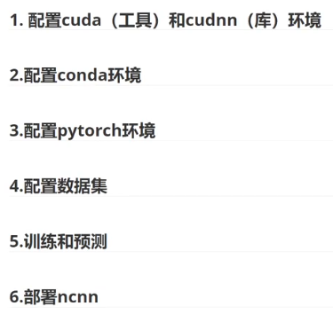

# yolov8训练与部署

# 整体流程：



## [参考视频链接](https://www.bilibili.com/video/BV1pKbXeDEr6?spm_id_from=333.788.videopod.sections&vd_source=040c3df4542b9d3c5dc888d7ab4a8411)

## 0. 安装显卡驱动

直接进入nvidia官网然后下载并且安装

https://www.nvidia.cn/software/nvidia-app/

## 1. 配置cuda和cudnn环境（可以直接跳过）

**现在不需要手动安装 CUDA Toolkit（nvcc、头文件等），torch团队已经预编译好了，只需要安装torch即可会自动拉取对应的包**

### 安装cuda

#### 1.查看显卡驱动最高支持的cuda版本
```plain
nvidia-smi
```


#### 2.下载
+ 官方下载链接(需要注册官网账号)
    - [cuda下载链接](https://developer.nvidia.com/cuda-toolkit-archive)
    - [cudnn下载链接](https://developer.nvidia.com/rdp/cudnn-archive)
+ 百度网盘

```plain
链接：https://pan.baidu.com/s/1PlqHeQYkbxHfygOK_tv0ZQ?pwd=5m7w 
提取码：5m7w 
--来自百度网盘超级会员V4的分享
```


#### 3.双击安装，选择安装缓存的路径
#### 4. 选安装的组件
#### 5.安装位置
#### 6.查看是否安装成功(注意是大写的V)
```plain
nvcc -V
```

### 安装cudnn
解压后三个文件夹的文件分别拷贝到CUDA安装目录对应的（bin、include、lib）文件夹中即可。


### 环境变量
bin

include

lib

libnvvp


## 2.配置conda环境
### 1.miniconda下载
```plain
链接：https://pan.baidu.com/s/131-tN39WV44blsPE3TZ3ug?pwd=iofe 
提取码：iofe 
--来自百度网盘超级会员V4的分享
```


### 2.安装

双击运行然后按照步骤即可


## 3.配置pytorch环境
### 1.创建虚拟环境（torch）
+ 查看是否安装完成

```plain
print("CUDA is available" if torch.cuda.is_available() else "CUDA is not available")
```


### 2.配置yolov8环境

* 直接按照官网步骤即可。**注意换源的问题！**

```shell
pip install ultralytics
```


## 4.配置数据集训练
### 1.数据集结构

```shell
dataset/
├── images/
│   ├── train/
│   │   ├── 00001.jpg
│   │   ├── 00002.jpg
│   │   └── ...
│   ├── val/      # 验证集（有时也叫 valid 或 dev）
│   │   ├── 00003.jpg
│   │   └── ...
│   └── test/     # （可选）测试集
│       ├── 00004.jpg
│       └── ...
├── labels/
│   ├── train/
│   │   ├── 00001.txt
│   │   ├── 00002.txt
│   │   └── ...
│   ├── val/
│   │   ├── 00003.txt
│   │   └── ...
│   └── test/
│       ├── 00004.txt
│       └── ...
└── data.yaml     # 数据集配置文件（最重要！）
```


### 2.yaml文件以及作用

1. 给出训练集以及验证集和标签文件等的路径
2. 给出类别等信息

```yaml
# 定义yolo数据集

# 数据集路径
path: /Users/dsw/workspace/now/Data_Graduation/dataset
train: images/train
val: images/val  
test: images/test  
names:
  0: low   #低速标志
  1: high # 添加一个类别对比
```

## 5.训练和预测

按照视频的即可

```shell
yolo detect train data=data/mydata.yaml model=yolo11n.pt epochs=100 imgsz=640
```


## 6.部署
### 1.pt格式转换为ncnn

* 安装的时候pnnx可能会下载有点问题，科学上网即可！也可以手动下载后安装

```shell
yolo export model=yolo11n.pt format=ncnn # creates '/yolo11n_ncnn_model'
```


### 2.使用ncnn推理

* 直接基于yolo框架推理即可，已经集成！

```shell
yolo predict model='./yolo11n_ncnn_model' source='https://ultralytics.com/images/bus.jpg'
```

